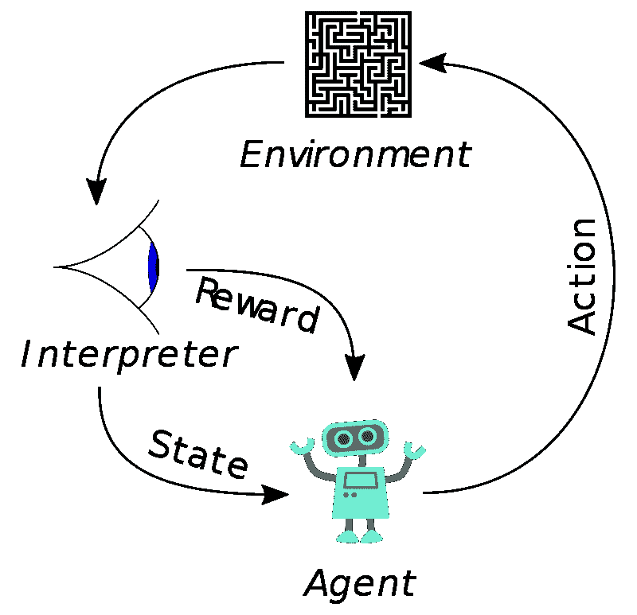

# 强化学习简介-问答

> 原文：<https://medium.com/analytics-vidhya/introduction-of-reinforcement-learning-q-a-a702cea3e428?source=collection_archive---------31----------------------->

> *“*运用得当，正强化:学习无比强大。”

由[詹姆斯·庞德](https://unsplash.com/@jamesponddotco?utm_source=medium&utm_medium=referral)在 [Unsplash](https://unsplash.com?utm_source=medium&utm_medium=referral) 上拍摄的照片

强化学习是一种机器学习技术，其中代理通过最大化为实现既定目标而采取的行动的累积回报，使用试错法从环境中学习。

图片:-维基百科

让我们试着理解上图中的强化学习(RL ),一个代理人会在给定的环境中采取一些行动，结果是，如果代理人采取的行动是正确的，他会得到奖励，如果代理人采取的行动是错误的，他会得到惩罚。这与婴儿如何学习走路是一个简单的类比。首先，他们把错误的脚放在前面，摔倒(惩罚)，然后把右脚放在前面(得到父母喜欢的奖励)，接着，把右脚放在前面，婴儿开始走和跑。这与 RL 问题非常相似，最初它对环境一无所知，但最终它开始采取行动，并在行动过程中获得奖励或惩罚。

**强化学习与监督学习有何不同？**

在监督学习中，有明确定义的标记输出来识别给定的特征，并且机器试图在特征和输出之间创建等式。在 RL 中没有提供这样的标记输出，代理将采取行动，然后将使用奖励或惩罚来了解该行动有多好。

**强化学习和无监督学习有区别吗？**

是的，在无监督学习中，机器试图找到数据点之间的相似性，并且不存在机器想要实现的这种指定目标，不像 RL 机器有指定的目标，它为实现该目标采取行动并获得奖励或惩罚。以婴儿走路为例，婴儿的目标是走路。

**什么是强化学习中的 agent？**

RL 中的代理通过最大化累积奖励和最小化惩罚来从环境中学习。代理从环境中接收观察和奖励，并对环境采取行动。

**强化学习中的环境是什么？**

环境是代理根据给定策略采取行动的地方。就像对婴儿来说，环境应该是游乐场，家..等等，汽车的环境就是汽车可以行驶的道路和高速公路。通常有两种类型的环境。确定性和概率性。

在**确定性环境**中——你的环境不会因为采取行动而改变，它将是相同的。意味着确定性环境的结果示例将像国际象棋游戏移动，tic tok 游戏移动

在**随机(概率)环境** —我们无法确定电流的输出，因为它在采取每个行动后都在不断变化。这是一个真实的生活场景，我们无法确定接下来会发生什么。随机环境的例子——环境变化非常快的自动驾驶汽车。

**什么是强化学习中的探索和利用？**

探索意味着主体将探索所有可能的行动，以获得应该采取的最优行动，从而获得最大的回报。就计算而言，这是非常昂贵的，因为探索所有可能需要大量的计算能力。

剥削意味着代理人将只采取某些行动来获得回报。在这种情况下，代理人不采取必要的行动来探索其他行动，以找到达到目标的最佳行动。

在训练代理时，我们必须在探索和利用之间取得适当的平衡，以便代理也能探索和不利用某些动作。平衡开发和探索是强化学习中的关键挑战之一，在监督和非监督学习的纯形式中根本不会出现这个问题。

**强化学习的算法有哪些？**

1.  MDP(马尔可夫决策过程)
2.  动态规划
3.  蒙特卡洛过程
4.  q 学习
5.  时差
6.  双 Q 学习(DQL)
7.  州行动奖励州行动

**强化学习有哪些应用？**

自主机器人——RL 在机器人领域有着巨大的用途。当机器人在真实环境中接受训练时，机器人会学习并因采取的每一个行动而获得奖励。它为复杂且难以设计的行为设计提供了框架和工具集。

电脑游戏——现在大多数游戏都是在 RL 上开发的，并且在本质上变得具有适应性。机器在玩游戏的同时也在学习，当机器学习时，它提供了不同的挑战

个性化推荐——以前的新闻推荐工作面临着几个挑战，包括新闻动态的快速变化、用户容易厌倦以及点击率不能反映用户的保留率。深度强化学习可以用来解决这个问题。

感谢阅读。做评论，让我知道你是否需要任何详细的博客/任何算法/方法。

祝你过得愉快。