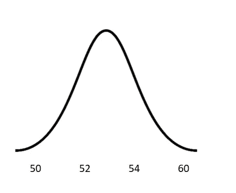
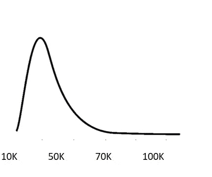
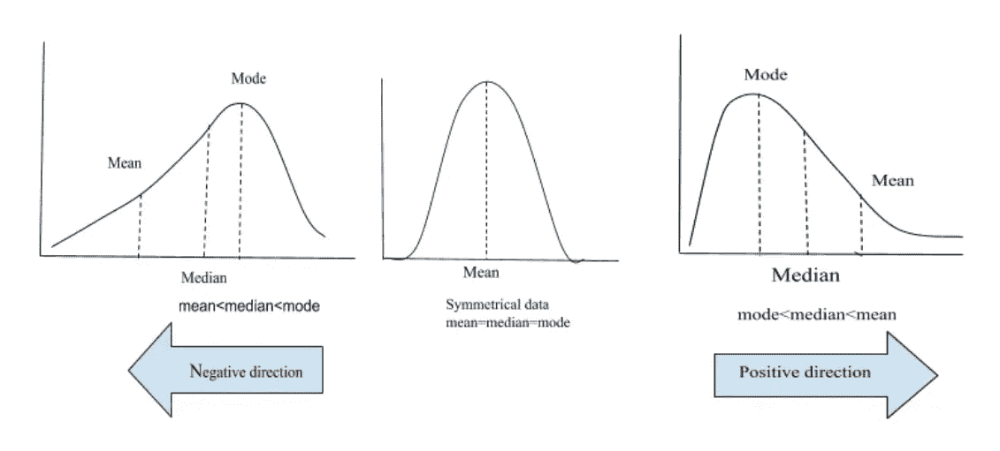

# 统计学导论-第二部分

> 原文：<https://medium.com/analytics-vidhya/introduction-of-statistics-part-2-99aa2c0cade?source=collection_archive---------16----------------------->

科琳·库兹在 [Unsplash](https://unsplash.com?utm_source=medium&utm_medium=referral) 上的照片

在之前的[文章](/@biswasstar/introduction-of-statistics-53b0f293e0e0)中，我们关注了一些基本的统计数据。在这篇文章中，我们将了解各种曲线。我们会用很多很多的例子来学习。据说我们能想象的东西，我们很容易记住。

让我们从几个例子开始:

1."印度成年女性的身高至少大致呈钟形曲线。"。让我们把这个句子读两遍，试着理解这是什么意思。

2.一个男孩的体重在所有成年男性中处于第 90 百分位意味着什么？

3.男性身高的平均值为 60 英寸，标准差为 4 英寸。女性身高的平均值为 55 英寸，标准差为 2 英寸。因此，一个 64 英寸高的男人的标准分数是 1。与自己身高相对应的标准化分数是多少？

让我们跳到一些定义，然后我们可以回到这些句子。

1.群体:群体是指群体中的每一个成员。最好的例子就是人口普查。

2.频率曲线:我们都知道直方图。如果我们把它弄平，把顶部连接起来，就会得到一条频率曲线。

假设印度女性遵循下面的曲线。

正态分布

这种类型的曲线称为正态分布或钟形曲线或高斯曲线。

但是钟形曲线并不总是必要的。如果我们在试图看到工资的地方看到曲线，曲线可能看起来像:

倾斜图

这意味着薪水低的人比薪水高的人多。这种类型的曲线被称为右偏斜曲线。

让我们深入探讨一下术语“偏斜度”

偏斜度—通过曲线解释

上述分布的均值大于众数，因此是右偏的。而具有的图像意味着小于模式，因此向左倾斜。偏斜度表示分布偏离正态分布的方向和相对大小。

下一个重要术语是:**比例**

落在某一范围内的测量总体比例=该范围内的曲线下面积。在前面的例子中，女性的平均身高是 53 英寸。这意味着 50%的数据位于两边。这可以理解为 50%的女性身高超过 53 英寸。

**百分位数和标准化分数**

百分比=低于你的人口百分比。

寻找正常曲线的百分位数需要:

你自己的价值。

数值总体的平均值。

总体的标准偏差。T

那么任何钟形曲线都可以标准化，这样一个表就可以用来寻找百分位数。

标准化分数(z 分数)=(观察值-平均标准偏差)/标准偏差

示例:

智商分数呈正态分布，均值为 50，标准差为 10。

假设你的智商是 66。

标准化分数=(66–50)/10 =+1.6

你的智商比平均值高出 1.6 个标准差。

假设你的智商是 35。

标准化分数=(35–50)/19 =–1.5

*   你的智商比平均值低 1.5 个标准差。

恭喜你，你做到了。

现在，谢谢你们能走到这一步。我们讨论了各种类型的曲线和偏斜度。在下一篇文章中，我们将深入探讨更多的术语，这将有助于我们进入数据科学和数据分析领域。

请浏览之前的[篇](/@biswasstar/introduction-of-statistics-53b0f293e0e0)以防错过。

一如既往，如果有任何问题、意见或评论，请随时与[联系我！](https://www.linkedin.com/in/parmita-biswas/)

参考:

[统计如何进行](https://www.statisticshowto.com/)

[https://alevelmaths.co.uk/statistics](https://alevelmaths.co.uk/statistics/skewness/)

[https://alevelmaths.co.uk/statistics/skewness/](https://alevelmaths.co.uk/statistics/skewness/)