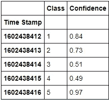
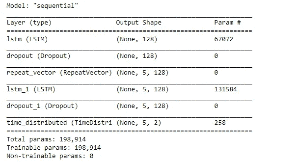
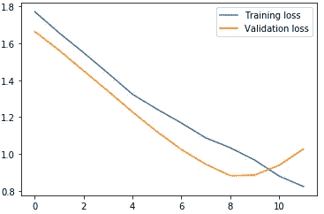

# 二维 LSTM 自动编码器简介

> 原文：<https://medium.com/analytics-vidhya/introduction-to-2-dimensional-lstm-autoencoder-47c238fd827f?source=collection_archive---------7----------------------->

这是我早期知识库的延续，在那里我使用 1D·LSTM 进行自动编码器和异常检测，可以在这里找到。


自动编码器结构

在这里，我将话题扩展到 2D 数据的 LSTM 自动编码器。创建一个单独的职位，因为 LSTM 往往会变得很棘手，当谈到投入。

> @ [铁木尔·比克穆哈梅托夫](https://towardsdatascience.com/@timurbikmukhametov?source=post_page-----133dad96cd00--------------------------------) [这里](https://towardsdatascience.com/how-to-reshape-data-and-do-regression-for-time-series-using-lstm-133dad96cd00)可以找到一个解释输入和输出的惊人博客。

让我们看一些代码来理解 2D LSTM 自动编码器。

为此，我们将使用我为测试创建的简单数据，同样的数据可以在 GitHub [的源代码中找到。](https://github.com/adnanmushtaq1996/2D-LSTM-AUTOENCODER)

我们开始吧！！

**导入依赖关系**

```
**import** **pandas** **as** **pd**
**import** **numpy** **as** **np**

**from** **tensorflow** **import** keras
**from** **tensorflow.python.keras.layers** **import** Input, Dense,RepeatVector, TimeDistributed, Dense, Dropout, LSTM
**from** **tensorflow.python.keras.models** **import** Sequential

**import** **matplotlib.pyplot** **as** **plt**
%matplotlib inline

**import** **sklearn**
**from** **sklearn.preprocessing** **import** StandardScaler
**from** **sklearn.model_selection** **import** train_test_split
```

**读取数据**

```
df = pd.read_csv('../Data/Sample.csv', parse_dates=['Time Stamp'], index_col='Time Stamp')
df.head(n=5) 
```



用于测试的数据集

## 为 LSTM 输入创建数据(一系列数据，即在此创建一系列具有时间步长和元素数量的数据)

```
**def** create_dataset(X, y, time_steps=1):
    Xs, ys = [], []
    **for** i **in** range(len(X) - time_steps):
        v = X.iloc[i:(i + time_steps)].values
        Xs.append(v)        
        ys.append(y.iloc[i + time_steps])
    **return** np.array(Xs), np.array(ys)*# Timesteps will define how many Elements we have*
TIME_STEPS = 5

X_train, y_train = create_dataset(df, df, TIME_STEPS)

print(X_train.shape)
```

X_train 的形状是(20，5，2)，每个输入块具有 5 个样本，每个样本具有 2 个特征。

> 如果你理解了这一步，那么剩下的就容易多了。

```
*#Size of Input Data  is n_samples * timesteps * n_features*
```

## 创建 LSTM 自动编码器模型

```
model = Sequential()
model.add(LSTM(128, input_shape=(X_train.shape[1], X_train.shape[2])))
model.add(Dropout(rate=0.2))
model.add(RepeatVector(X_train.shape[1]))
model.add(LSTM(128, return_sequences=**True**))
model.add(Dropout(rate=0.2))
model.add(TimeDistributed(Dense(X_train.shape[2])))
model.compile(optimizer='adam', loss='mae')
model.summary()
```



模型摘要

**训练模型**

```
history = model.fit(X_train, X_train, epochs=200, batch_size=32, validation_split=0.1)
```

**可视化培训**

```
plt.plot(history.history['loss'], label='Training loss') plt.plot(history.history['val_loss'], label='Validation loss') plt.legend();
```



培训损失图

**测试模型**

现在，最重要的阶段来了，测试我们有多接近用我们的模型重建输入，这个模型很难用数据训练。

```
*#Create a new test data close to what model has seen and check the MSE*
test1 = np.array([[ 1, 0.7],
                [2, 0.86],
                [2.9, 0.85],
                [4.1, 0.64],
                [5,0.89]])

test = np.reshape(test1,newshape=(-1,5,2))
y = model.predict(test)
y = y.reshape(5,2)
print(" THE MSE IS  : " ,sklearn.metrics.mean_squared_error(test1, y))
print("The Recreated Output is : ",y)
```

让我们检查 MSE 和我们的模型重新创建了什么。

```
THE MSE IS  :  0.09770384336959057
The Recreated Output is :  [[1.1208125  0.33779058]
 [2.170816   0.5113479 ]
 [3.0839798  0.5797549 ]
 [3.819326   0.5880815 ]
 [4.376938   0.5675875 ]]
```

## 在这里，模型能够以低误差重建输入

## 现在让我们用测试数据来检查一下，模型不是用这些数据来训练的。

```
*#Create a new test data close to what model has NOT seen and check the MSE*
test2 = np.array([[ 1, 0.74],
                  [6, 0.60],
                  [7, 0.96],
                  [8, 0.42],
                  [5,0.85]])

test = np.reshape(test2,newshape=(-1,5,2))
y = model.predict(test)
y = y.reshape(5,2)
print(" THE MSE IS  : " ,sklearn.metrics.mean_squared_error(test2, y))
print("The Recreated Output is : ",y)
```

让我们检查 MSE 和我们的模型重新创建了什么。

```
THE MSE IS  :  2.5207483415118306
The Recreated Output is :  [[1.6618627  0.4883529 ]
 [3.1379414  0.71685326]
 [4.2798247  0.7910608 ]
 [5.0690384  0.79329824]
 [5.580368   0.7696756 ]]
```

## 在这里，模型无法重新创建输入，因为它没有在这些数据上进行训练，也无法提取其特征。

我们已经学会了如何制作二维 LSTM 自动编码器。我在以前的博客中列出了许多应用程序，例如:

1.  噪音的消除
2.  特征提取(仅使用编码器部分)
3.  异常检测

Github 库:[https://github.com/adnanmushtaq1996/2D-LSTM-AUTOENCODER](https://github.com/adnanmushtaq1996/2D-LSTM-AUTOENCODER)

希望你喜欢阅读:)