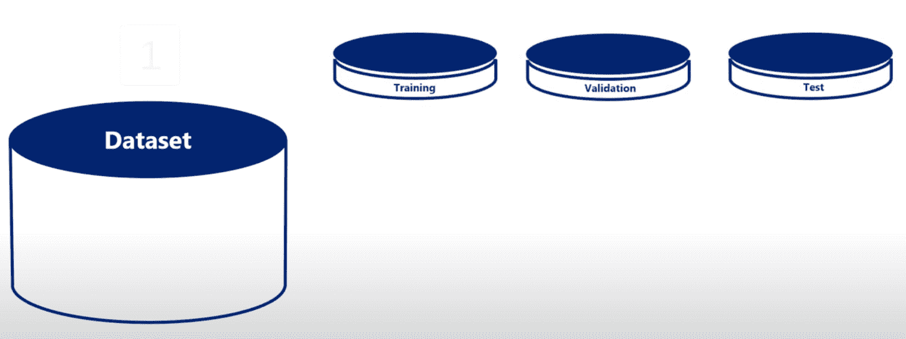
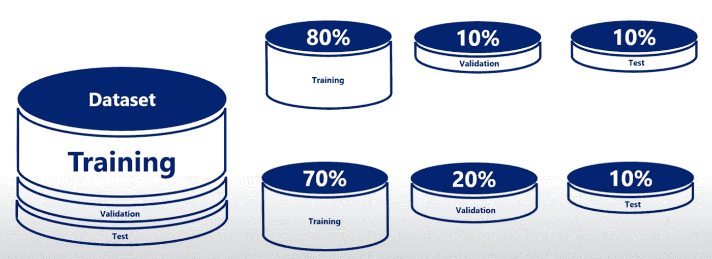
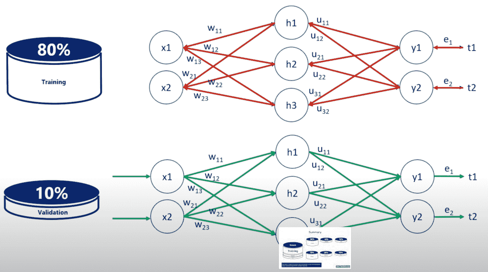
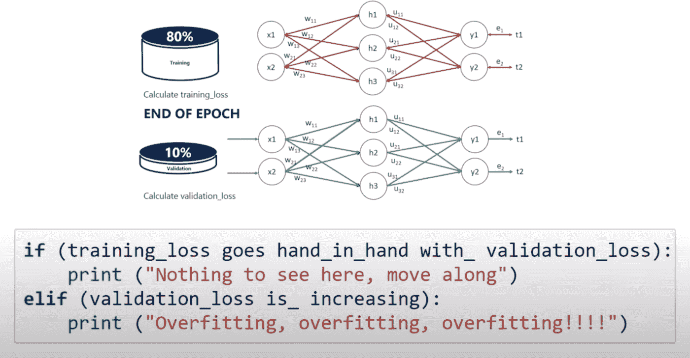

# 人工智能术语介绍

> 原文：<https://medium.com/analytics-vidhya/introduction-to-ai-ml-jargons-426e0538fc17?source=collection_archive---------21----------------------->

大家好，在我目前的公司，我一直致力于让我们的产品更加智能。这项工作主要涉及需要处理客户数据并做出更明智的建议和决策的项目。

我觉得在博客中分享和写下来对我和任何有志于学习人工智能的技术爱好者来说都是很好的锻炼。

我将分享一系列关于这个巨大主题的博客，这是该系列的第一部分。

数据是做出明智决策的关键

## **什么是 AI？**

AI(人工智能)是机器可以拥有智能的想法。由于没有智能的定义，而且人类认为自己是这个星球上最聪明的物种，拥有类似人类行为的机器被称为是智能的。

## **什么是机器学习？**

机器学习是将知识引入机器的技术。将知识诱导给某人通常被称为学习，因此得名。一个 ML 模型是一个被训练的(或者还没有被训练的)模型的别名，它被期望执行一些智能的东西。例如，聊天机器人是 ML 模型，其可以包括用于解释语音并将其转换成文本的神经网络，以及用于过滤转换后的语音查询的关键词的另一统计模型。

## 什么是机器学习模型？

机器学习模型是一个经过训练可以识别特定类型模式的文件。您通过一组数据训练一个模型，为它提供一个算法，它可以使用该算法来推理和学习这些数据。

一旦您训练了模型，您就可以使用它来推理它以前没有见过的数据，并对这些数据进行预测。例如，假设您想要构建一个应用程序，它可以根据用户的面部表情来识别用户的情绪。你可以训练一个模型，方法是给它提供一些面部图像，每张图像都标有某种情绪，然后你可以在一个可以识别任何用户情绪的应用程序中使用这个模型。

## 训练模型逻辑

为了训练这个模型，我们应该首先获取数据集。

我们得到一个数据集，我们把数据集分成 3 部分。

*   培养
*   确认
*   试验

不同类型的数据集

问题是，我们是否平均分配。从业者如何做到这一点？没有这方面的规则，但常见的划分是:

拆分数据集

我们用来训练模型的数据集应该要大得多。我们希望将尽可能多的数据用于模型的训练，同时有足够的样本进行测试和验证。

**我们对每个数据集解释如下:**

**训练集:**这是用来建立我们的预测算法。我们的算法试图根据训练数据集的特点进行自我调整。在这个阶段，我们通常创建多个算法，以便在验证阶段比较它们的性能。

**验证:**该数据集用于比较基于训练集创建的预测算法的性能。我们选择具有最佳性能的算法。

**测试:**现在我们已经选择了我们的首选预测算法，但我们还不知道它在完全看不见的真实世界数据上的表现如何。因此，我们将我们选择的预测算法应用于我们的测试集，以便了解它的性能，这样我们就可以了解我们的算法在未知数据上的性能。

## **培训和验证是如何协同工作的？**

“不时地”我们通过用验证数据集运行模型来验证模型逻辑。

“时不时”是什么意思？通常我们会验证每个时期的数据集。每次我们调整重量和训练损失，我们验证。

下图表示了我们何时应该训练和验证，以及何时应该停止验证。

在我们训练和验证了模型之后，是时候测量它的预测能力了。这是通过在从未见过的数据集上运行模型来实现的。这相当于在现实生活中应用该模型。

我们从测试数据中获得的准确性是我们可以从现实生活中模型的部署中预期的准确性。因此，测试数据集是我们采取的最后一步。

*举例:*

考虑这三个集合的一种方式是，其中两个(训练和验证)来自过去，而测试集合来自“未来”。应该使用来自“过去”的数据(训练/验证数据)来构建和调整模型，但不要测试来自“未来”的数据。

举一个实际的例子，假设我们正在建立一个模型来预测棒球运动员未来的表现。我们将使用 1899-2020 年的数据来创建一个训练和验证集。一旦模型建立并根据该数据进行调整，我们将使用 2019 年的数据(实际上是过去的数据！)作为测试集，从模型的角度来看，它看起来像“未来”的数据，并且决不会影响模型的创建。