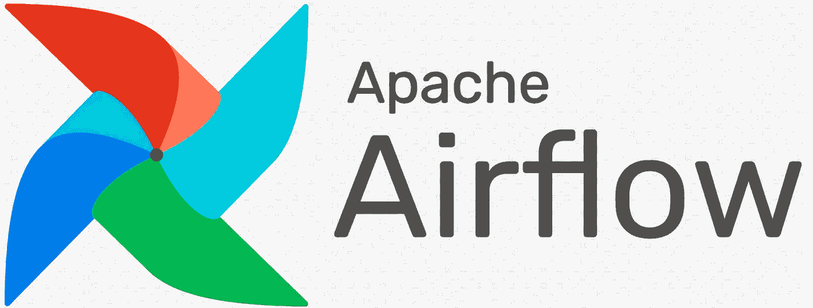
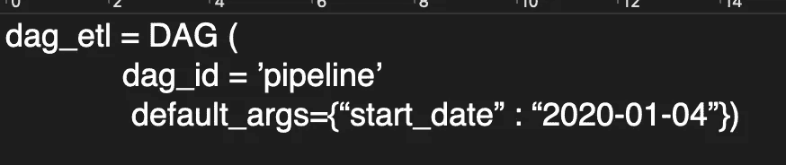
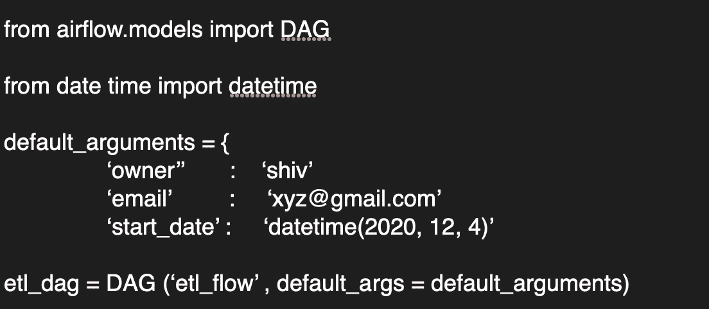
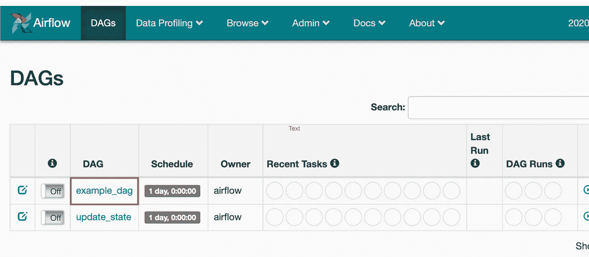
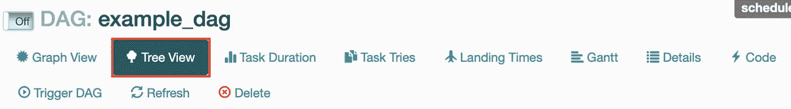
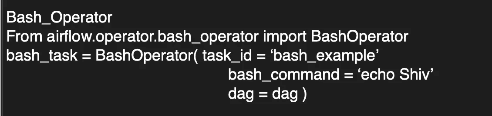
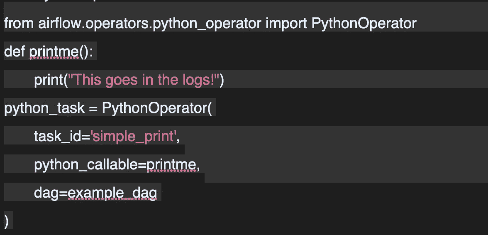
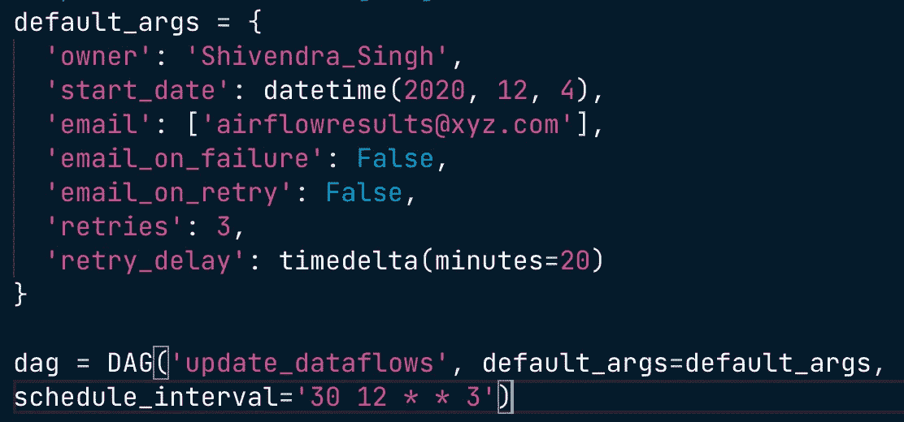
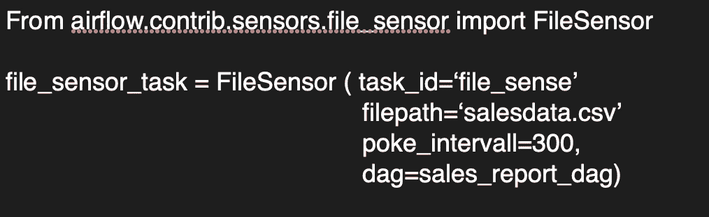

# Python 中的气流简介

> 原文：<https://medium.com/analytics-vidhya/introduction-to-airflow-in-python-3bccc401cc1d?source=collection_archive---------1----------------------->

阿帕奇气流初学者指南

## 什么是工作流

完成给定数据工程任务的一组步骤。这些可以包括任何给定的任务，例如下载文件、复制数据、过滤信息、写入数据库等等。

工作流的复杂程度各不相同。一些工作流可能只有 2 或 3 个步骤，而其他工作流包含数百个组件。

## 什么是气流？

Airflow 是一个编程工作流(常规)的平台，包括工作流的创建、调度和监控。Airflow 将工作流实现为 Dag 或有向非循环图。

可以通过代码、命令行或内置的 web 界面来访问和控制气流。

[https://airflow.apache.org/docs/stable/](https://airflow.apache.org/docs/stable/)

数据工程工作流程可以由 Spotify 的 Luigi、微软的 SSIS 甚至 Bash 脚本来管理。

# 熟练的技艺

DAG 代表有向非循环图。

*   在 Airflow 中，这表示组成工作流的一组任务。
*   它由任务和任务之间的依赖关系组成。
*   创建的 DAG 包含有关 DAG 的各种详细信息，包括名称、开始日期、所有者等。

## DAG 示例代码

使用 pipeline 的 dag_id 和包含 dag 的 start_date 的 default_args 字典创建新的 DAG。

在 python 中它被当作一个变量标识符，其中 **dag_etl** 是变量，在 Airflow shell 命令中，我们必须使用 dag_id。

## 用于创建 DAG 的详细 python 代码

当我们在 python 中创建 DAG 时，我们需要导入各自的库。这里，整个 DAG 是在一个名为 etl_dag 的变量下创建的。

## 在 Airflow 中运行工作流程

我们可以使用不同的方法运行它，最简单的是使用 airflow 运行一个 shell 命令。Airflow run 有三个参数，一个 dag_id、一个 task_id 和一个 start_date。所有这些论点都有特定的含义

airflow -h 命令可以给出我们可以执行的所有可能的命令。

## CLI 与 Python-何时使用

你可能不知道什么时候用什么？

## 硬币指示器 （coin-levelindicator 的缩写）命令行界面（Command Line Interface for batch scripting）

*   启动气流过程，手动运行 Dag，记录气流信息。

## 计算机编程语言

*   创建 DAG 并编辑 DAG 的属性。

# 气流 Web 用户界面

我们可以从 web UI 中实现各种 CLI 功能。每个页面都有不同的选项，很容易理解。

当我们单击 DAG 名称时，我们可以看到该特定 DAG 及其依赖项的更多详细信息。我们还可以看到树视图和图形视图以及 Dag 的代码。

# 气流操作员

操作员是气流中的一种任务。这些任务可以是运行命令、发送电子邮件、运行 Python 脚本等等。

*   代表工作流中的单个任务。
*   独立运行。
*   不同的操作员执行不同的任务。

流行的操作符是 Bash 和 python 操作符。

## bash 运算符

它需要一些参数来运行，比如 task_id、bash_command 和 dag name。我们还需要在运行 BashOperator 之前导入它。

BashOperator 图像

## 气流任务

*   简单地说，任务就是操作符的实例。
*   任务一般被赋给一个变量，在上面的 BashOperator 图片中，bash_task 就是一个变量。
*   在 airflow 中，工具只理解 task_id，而不理解变量名。
*   任务相关性定义了任务完成的给定顺序。
*   这两个操作符帮助我们定义任务顺序，上游操作符>>下游操作符<<

Task1 >>任务 2

# Python 运算符

*   执行 Python 函数/ callable
*   操作类似于 BashOperator，但有更多的选项
*   可以向 Python 代码传入参数

首先，我们需要从库中导入操作符，然后创建一个 python 函数，然后创建 python 操作符的一个实例。printme 下面是函数，python_task 是 python 运算符的实例。

我们还可以向 python 操作符添加参数、位置参数和关键字参数。

airflow.operators 库中有许多可用的操作符。比如帮助我们发送电子邮件的电子邮件操作员。

# 气流调度

当提到气流中的调度时，我们必须谈论 DAG run。这是给定时间点的工作流实例。

*   DAG 可以手动运行，也可以通过 scheduled_interval 运行。
*   Dag 可以有运行、失败或成功状态。

使用 Web UI，我们可以在浏览选项卡中看到更多关于状态的信息。

当我们计划 DAG 时，这些属性很有帮助。

*   开始日期、结束日期、最大尝试次数、预定时间间隔

此处计划了一个具有不同参数的 DAG，DAG 的开始日期是 2020 年 12 月 4 日，并计划使用 cron 约定在每周三中午 12:30 运行。

# 气流传感器

什么是传感器？

*   等待某一条件为真的一种运算符
*   文件的创建。
*   数据库记录的上传
*   来自 web 请求的某些响应

我们可以定义任何条件，多长时间检查一次条件为真传感器被分配到任务。

有各种传感器参数，如**模式、poke_interval 和超时。**有各种各样的传感器可以用来完成任何任务，比如 filesensor、HttpSensor 和 SqlSensor。

文件传感器检查某个位置是否存在文件。

# 气流执行器

*   执行者运行任务
*   我们可以根据需要创建自己的遗嘱执行人
*   SequentialExecutor、LocalExecutor 和 CeleryExecutor。

## 顺序执行器

*   默认气流执行器
*   一次运行一项任务
*   对调试有用
*   不建议用于生产，因为它一次运行一个任务

## 本地执行者

*   在单一系统上运行
*   将任务视为流程，并行度由用户定义
*   可以利用给定主机系统的所有资源。

## 加速器

*   使用芹菜后端作为任务管理器。
*   有点复杂，但功能强大。

我们可以通过查看 airflow.cfg 或简单的 cli 命令 airflow list_dags 来检查正在使用哪个执行器

到目前为止，我们已经讨论了气流的基本原理。其他需要学习的重要内容是**调试和故障排除，使用模板和分支。**