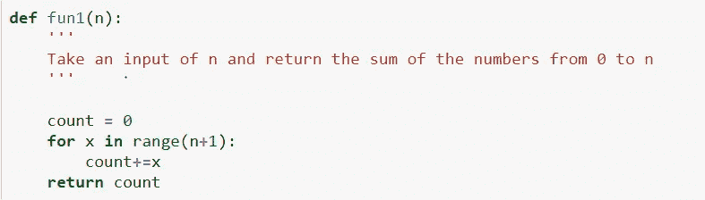
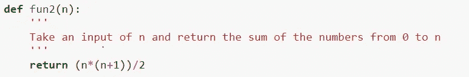
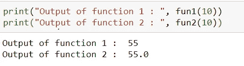
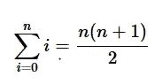
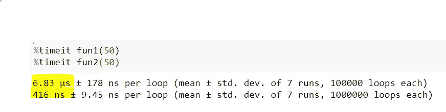
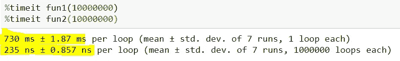

# 算法分析导论

> 原文：<https://medium.com/analytics-vidhya/introduction-to-algorithm-analysis-4c1228744d12?source=collection_archive---------26----------------------->

著名数学家阿基米德被要求确定国王委托的一顶金冠是否真的是纯金的，而不是像一个告密者所说的是部分银的。阿基米德发现了一种在洗澡时进行分析的方法。他注意到从浴缸里溢出的水与他进去的水成比例。意识到这一事实的含义后，他立刻从浴缸里出来，光着身子在城市里跑着，喊着:“找到了，找到了！”因为他发现了一种分析工具(位移)，当与一个简单的秤结合时，可以确定国王的新王冠是好是坏。也就是说，阿基米德可以将皇冠和同等重量的黄金浸入一碗水中，看看它们是否移动了相同的量。然而，这一发现对金匠来说是不幸的，因为当阿基米德进行分析时，皇冠比同等重量的纯金块排开更多的水，这表明皇冠实际上不是纯金的。

阿基米德发现了一种分析王冠是否由纯金制成的方法。在计算机科学中，一个问题可以用很多方法来解决，如下所示的例子，将一个数从 1 加到给定的“n”值(即 n 个值的和)

两个函数具有相同的结果

但是完全不同的算法。您会注意到，第一个函数迭代地将数字相加，而第二个函数利用了 2

那么如何才能客观的比较算法呢？我们可以比较它们在内存中占用的空间，或者我们也可以比较每个函数运行需要多少时间。我们可以使用 jupyter 中内置的 **%timeit** 魔法函数来比较函数的时间。Jupyter 笔记本里的 [**%timeit**](https://ipython.org/ipython-doc/3/interactive/magics.html#magic-timeit) 魔法会重复循环迭代一定次数，取最佳结果。

在这里，您可以看到函数 1 花费了 **6.83 微秒**，而函数 2 花费了 **416 纳秒**比较两个数量级**微秒与纳秒**对于较小的数据值，这不会产生太大的差异，但是如果我们考虑 10，000 数量级的较高值的相同函数，我们可以观察到较大的差异，如下所示

我们可以看到第二个函数的效率要高得多！比第一次跑得快多了。然而，我们不能使用“运行时间”作为客观的衡量标准，因为这将取决于计算机本身的**速度和硬件能力**。所以我们将需要使用另一种方法， **Big-O** ！

如果你有任何反馈或批评，请随时与我分享。如果本演练对您有所帮助，请喜欢👏文章。干杯！🍻