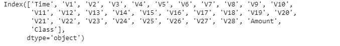
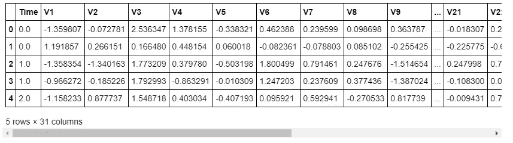
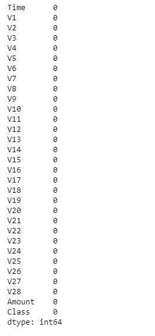
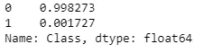
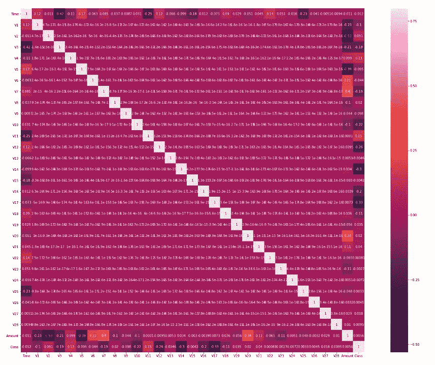
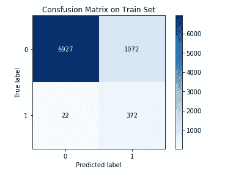
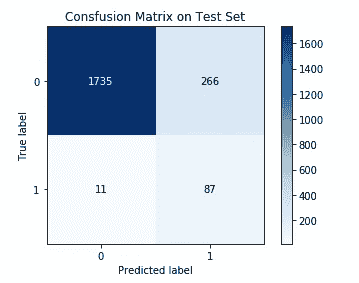
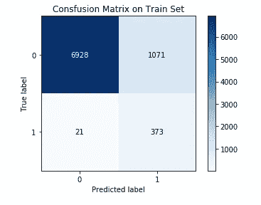
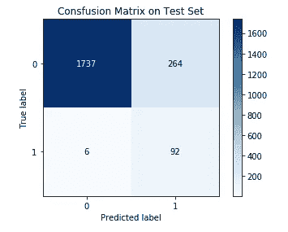

# 使用机器学习的异常检测简介及案例研究

> 原文：<https://medium.com/analytics-vidhya/introduction-to-anomaly-detection-using-machine-learning-with-a-case-study-part-two-f78243f74d2f?source=collection_archive---------1----------------------->

## 第二部分:使用 PyOD 工具包识别欺诈性信用卡交易。


这是我的系列的第二部分，也是最后一部分，重点是使用机器学习进行异常检测。如果这是你第一次，我推荐你阅读我的第一篇文章[这里](/@Davis_David/introduction-to-anomaly-detection-using-machine-learning-with-a-case-study-part-one-3fa2ae08f413)，它将向你介绍异常检测及其在商业世界中的应用。

在本文中，我将带您了解一个关于**信用卡欺诈检测**的案例研究。信用卡公司能够识别欺诈性的信用卡交易是很重要的，这样客户就不会为他们没有购买的商品付费。所以主要任务是通过使用机器学习来识别欺诈性的信用卡交易。我们将使用一个名为 **PyOD** 的 Python 库，它是专门为异常检测而开发的。

# 什么是 PYOD 库

PyOD 是一个全面且可扩展的 **Python 工具包**，用于**检测多元数据中的无关对象**。它有大约 20 个异常检测算法(监督和非监督)。PyOD 开发了一个全面的 API 来支持多种技术，你可以在这里看看 PyOD [的官方文档。](https://pyod.readthedocs.io/)

如果你是一个异常检测专家，或者你想学习更多关于异常检测的知识，那么我建议你尝试使用 PYOD 工具包。

# PyOD 的特征

PyOD 的特色是:

*   跨各种算法的统一 API、详细文档和交互式示例。
*   高级模型，包括神经网络/深度学习和离群值集成。
*   使用 [numba](https://github.com/numba/numba) 和 [joblib](https://github.com/joblib/joblib) ，尽可能通过 JIT 和并行化优化性能。
*   兼容 Python 2 和 3。(对 python 2 的支持截止到 2020 年 1 月)。

## 在 Python 中安装 PyOD

让我们首先在我们的机器上安装 PyOD。

```
pip install pyod            *# normal install*
pip install --pre pyod      *# pre-release version for new features*
```

或者，您可以克隆并运行 setup.py 文件。

```
git clone https://github.com/yzhao062/pyod.git
cd pyod
pip install .
```

*如果您计划在 Pyod 中使用基于神经网络的模型，您必须在您的机器中手动安装 Keras 和其他库。*

# **信用卡欺诈检测案例研究**

我们将使用的数据集包含 2013 年 9 月欧洲持卡人的信用卡交易。该数据集是在 Worldline 和 ULB(布鲁塞尔自由大学)的[机器学习小组](http://mlg.ulb.ac.be)就大数据挖掘和欺诈检测进行研究合作期间收集和分析的。

现在让我们看看如何在这个案例研究中使用 PYOD 库。我们将从导入熊猫、numpy、sklearn、pyod 等重要包开始。

```
*# Import important packages*
**import** **pandas** **as** **pd**
**import** **numpy** **as** **np**
**import** **scipy**
**import** **sklearn**
**import** **matplotlib.pyplot** **as** **plt** 
**import** **seaborn** **as** **sns** 
**from** **sklearn.model_selection** **import** train_test_split 
**from** **sklearn.metrics** **import** classification_report, accuracy_score,confusion_matrix
**from** **sklearn.ensemble** **import** IsolationForest 
**from** **sklearn.neighbors** **import** LocalOutlierFactor 
*# Importing KNN module from PyOD*
**from** **pyod.models.knn** **import** KNN 
**from** **pyod.models.ocsvm** **import** OCSVM 
*# Import the utility function for model evaluation*
**from** **pyod.utils.data** **import** evaluate_print
**from** **pyod.utils.example** **import** visualize
**from** **sklearn.preprocessing** **import** StandardScaler
**from** **cf_matrix** **import** make_confusion_matrix 
%matplotlib inline 
**import** **warnings** 
warnings.filterwarnings('ignore')

*# set seed*
np.random.seed(123) 
```

本案例研究的数据集可在[此处](https://www.kaggle.com/mlg-ulb/creditcardfraud)下载。

让我们加载数据集

```
*# Load the dataset from csv file by using pandas*
data = pd.read_csv("creditcard.csv") 
```

检查数据集中的列。

```
*# show columns* data.columns
```



数据集包含 31 列，只有 3 列有意义，它们是时间、金额和类别(欺诈或非欺诈)。其余 28 列使用 PCA 降维进行转换，以保护用户身份。

```
*# print the shape of the data*
data.shape(284807, 31)
```

如前所述，数据集包含 284807 行和 31 列。

```
*# show the first five rows* data.head()
```



您可以看到所有转换后的列都被命名为从 V1 到 V28。

让我们检查一下数据集中是否有缺失的值。

```
*#check missing data* data.isnull().sum()
```



我们的数据集中没有任何缺失值。

我们的目标列是包含两个类的类，一个是标记为 **1** 的欺诈类，另一个是标记为 **0 的非欺诈类。**

```
*# determine number of fraud cases in our  file*
data.Class.value_counts(normalize=**True**)
```



在这个数据集中，只有 0.173%(共 492 笔)的欺诈交易和 99.82%(共 284315 笔)的有效交易。

我们可以通过使用 seaborn 库中实现的热图来观察数据集中的变量是否相互关联。

```
*#find the correlation betweeen the variables* 

corr = data.corr() 

fig = plt.figure(figsize=(30,20))

sns.heatmap(corr, vmax=.8, square=**True**,annot=**True**)
```



上图显示 **V11 变量**与**类变量**强正相关，而 **V17 变量**与**类变量强负相关。**

因为我们有许多有效交易，所以我们将使用所有 10，000 个有效案例和 492 个欺诈案例来创建我们的模型。

```
*# use sample of the dataset* 

positive = data[data["Class"]== 1]
negative = data[data["Class"]== 0]

print("positive:**{}**".format(len(positive)))
print("negative:**{}**".format(len(negative)))

new_data = pd.concat([positive,negative[:10000]])

*#shuffling our dataset* 
new_data = new_data.sample(frac=1,random_state=42)

new_data.shape
```

正:492
负:284315

(10492,31)

现在我们总共有 10492 行。

我们将通过使用 sklearn 的 [standardScaler](https://onlinecoursetutorials.com/machine-learning/sklearn-preprocessing-standardscaler-function-with-example-in-python/) 方法来标准化数量变量。StandardSclaer 将数据转换为平均值为 0、标准差为 1 的数据，这意味着将数据标准化为正态分布。

```
*#Normalising the amount column.*
new_data['Amount'] = StandardScaler().fit_transform(new_data['Amount'].values.reshape(-1,1))
```

将数据集分成自变量和目标变量(类变量)。

*NB。在本文中，我们不打算使用时间变量。*

```
*# split into independent variables and target variable* X = new_data.drop(['Time','Class'], axis=1) 
y = new_data['Class']  
*# show the shape of x and y * 
print("X shape: **{}**".format(X.shape)) 
print("y shape: **{}**".format(y.shape))X shape: (10492, 29)
y shape: (10492,)
```

将数据集分为训练集和测试集。我们将只使用数据集的 20%作为测试集，其余的将作为训练集。

```
*#split the data into train and test* X_train, X_test, y_train,y_test = train_test_split(X,y, test_size = 0.2, stratify=y, random_state=42 )
```

## **创建模型**

我们将从 PyOD 库中创建两个离群点检测器，它们是 K 近邻检测器和一类 SVM 检测器。

## **1。k-最近邻检测器**

在用于任何观察的 KNN 检测器中，其到其第 k 个最近邻居的距离可以被视为外围分数。

PyOD 支持三个 [kNN](https://www.analyticsvidhya.com/blog/2018/03/introduction-k-neighbours-algorithm-clustering/) 探测器:

*   **最大:**使用第 k 个邻居的距离作为异常值。
*   **Mean:** 使用所有 k 个邻居的平均值作为异常值分数。
*   **中值:**使用到 k 个邻居的距离的中值作为异常值分数。

```
*# create the KNN model*
clf_knn = KNN(contamination=0.172, n_neighbors = 5,n_jobs=-1)

clf_knn.fit(X_train)
```

我们传递给 KNN()的两个参数是

*   **污染:T** 数据中的异常量，对于我们的情况= 0.0172
*   **n_neighbors:** 测量邻近度时要考虑的邻居数量。

在训练我们的 KNN 检测器模型之后，我们可以获得训练数据上的预测标签，然后获得训练数据的异常值分数。分数越高越不正常。这表明数据中的总体异常。这些特性使得 **PyOD** 成为异常检测任务的重要工具。

```
*# Get the prediction labels of the training data* 
y_train_pred = clf_knn.labels_ *# binary labels (0: inliers, 1: outliers)* *# Outlier scores* 
y_train_scores = clf_knn.decision_scores_ 
```

我们可以根据训练数据来评估 **KNN()** 。 **PyOD** 为这个任务提供了一个方便的函数，叫做 **evaluate_print()。**默认指标包括 [ROC](https://en.wikipedia.org/wiki/Receiver_operating_characteristic) 和 Precision @ n。我们将传递类名、y_train 值和 y_train_scores(拟合模型返回的异常值)。)

```
*# Evaluate on the training data* e
valuate_print(‘KNN’, y_train, y_train_scores)
```

KNN ROC: 0.9566，精度@排名 n:0 0.5482。

我们看到 **KNN()** 模型在训练数据上有很好的表现。让我们为训练集绘制混淆矩阵。

```
**import** **scikitplot** **as** **skplt** *# plot the comfusion matrix in the train set* skplt.metrics.plot_confusion_matrix(y_train,y_train_pred, normalize=**False**,title=”Consfusion Matrix on Train Set”) plt.show()
```



在训练集中，372 个欺诈案例被正确预测，只有 22 个案例被错误预测为有效案例。

我们将使用 decision_function 来预测使用拟合检测器(KNN 检测器)的测试集的异常分数，并评估结果。

```
y_test_scores = clf_knn.decision_function(X_test)  *# outlier scores*

*# Evaluate on the training data*
evaluate_print('KNN', y_test,y_test_scores)
```

KNN ROC:0.9393，精度@排名 n:0.5408

我们的 **KNN()** 模型在测试集上继续表现良好。让我们为测试集绘制混淆矩阵。

```
*# plot the comfusion matrix  in the test set*
y_preds = clf_knn.predict(X_test)

skplt.metrics.plot_confusion_matrix(y_test,y_preds, normalize=**False**,
                                    title="Consfusion Matrix on Test Set")
plt.show()
```



在测试集中，87 个欺诈案例被正确预测，只有 11 个案例被错误预测为有效案例。

## 2.一类 SVM 检测器

这是一个无监督的离群点检测算法，是 scikit-learn 单类 SVM 类的包装器，具有更多功能。

让我们创造一流的 SVM 模式。

```
*# create the OCSVM model*
clf_ocsvm = OCSVM(contamination= 0.172)

clf_ocsvm.fit(X_train)
```

在训练我们的 OCSVM 检测器模型之后，我们可以获得训练数据上的预测标签，然后获得训练数据的离群值分数。

```
*# Get the prediction labels of the training data*
y_train_pred = clf_ocsvm.labels_  *# binary labels (0: inliers, 1: outliers)*

clf_name ='OCSVM'

*# Outlier scores*
y_train_scores = clf_ocsvm.decision_scores_ 
*# Evaluate on the training data*
evaluate_print(clf_name, y_train, y_train_scores)
```

OCSVM ROC:0.9651，精度@ rant n:0.7132

在训练集上，OCSVM 模型的性能优于 KNN 模型。让我们为训练集绘制混淆矩阵。

```
*# plot the comfusion matrix  in the train set* 

skplt.metrics.plot_confusion_matrix(y_train,y_train_pred, 
                                    normalize=**False**,
                                    title="Consfusion Matrix on                 
                                    Train Set")
plt.show()
```



在训练集中，373 个欺诈案例被正确预测，只有 21 个案例被错误预测为有效案例。

我们将使用 decision_function 来预测使用拟合检测器(OCSVM 检测器)的测试集的异常分数，并评估结果。

```
y_test_scores = clf_ocsvm.decision_function(X_test)  *# outlier scores*

*# Evaluate on the training data*
evaluate_print(clf_name, y_test,y_test_scores)
```

OCSVM ROC: 0.9571，精度@秩 n:0.6633

我们的 OCSVM 模型在测试集上继续表现良好。让我们为测试集绘制混淆矩阵。

```
*# plot the comfusion matrix in the test set* 
y_preds = clf_ocsvm.predict(X_test) skplt.metrics.plot_confusion_matrix(y_test,y_preds, normalize=**False**, title=”Consfusion Matrix on Test Set”, ) plt.show()
```



在测试集中，92 个欺诈案例被正确预测，只有 6 个案例被错误预测为有效案例。

总的来说，当您比较这两个模型时，我们观察到 OCSVM 模型比 KNN 模型表现得更好。要提高检测欺诈交易的最佳模型(OCSVM)的性能，还有很多工作要做。您也可以尝试使用在 [PyOD 文档](https://pyod.readthedocs.io/en/latest/index.html)中找到的其他检测器算法。

# **结论**

信用卡公司能够识别欺诈性的信用卡交易是很重要的，这样客户就不会为他们没有购买的商品付费。作为企业主，您可以通过识别支付环境中潜在的信用卡欺诈来避免严重的问题和不必要的宣传。

本文的源代码可以在 Github 上找到。

[](https://github.com/Davisy/Credit-Card-Fraud-Detection-using-PYOD-Library) [## davisy/信用卡欺诈检测使用 PYOD 库

### 使用异常检测技术识别欺诈性信用卡交易。…

github.com](https://github.com/Davisy/Credit-Card-Fraud-Detection-using-PYOD-Library) 

如果你学到了新的东西或者喜欢阅读这篇文章，请分享给其他人看。也可以随意发表评论。我也期待听到你使用 PyOD 库的经验。也可以通过推特 [@Davis_McDavid](https://twitter.com/Davis_McDavid) 联系到我

***最后一件事:*** *在下面的链接里多看看类似这样的文章。*

[](/analytics-vidhya/feature-selection-by-using-voting-approach-e0d1c7182a21) [## 使用投票方法的特征选择

### 如何应用多种技术来选择 Xverse 包的特性？

medium.com](/analytics-vidhya/feature-selection-by-using-voting-approach-e0d1c7182a21) [](https://towardsdatascience.com/the-six-key-things-you-need-to-know-about-scikit-plot-119cbd869adb) [## 关于 Scikit-plot 你需要知道的六件关键事情

### 向 scikit-learn 对象添加绘图功能的直观库。

towardsdatascience.com](https://towardsdatascience.com/the-six-key-things-you-need-to-know-about-scikit-plot-119cbd869adb) [](https://towardsdatascience.com/how-to-practice-logging-in-python-with-logzero-82e4f9842a5c) [## 如何用 Logzero 练习 Python 中的日志记录

### 为您的 Python 项目提供强大而有效的日志记录。

towardsdatascience.com](https://towardsdatascience.com/how-to-practice-logging-in-python-with-logzero-82e4f9842a5c)