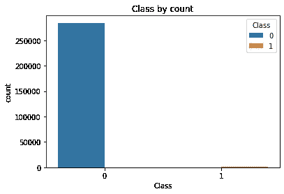
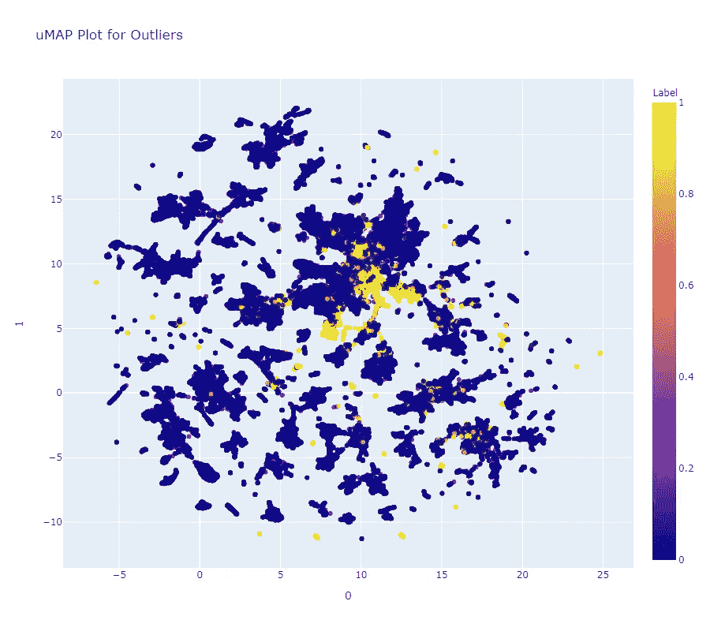
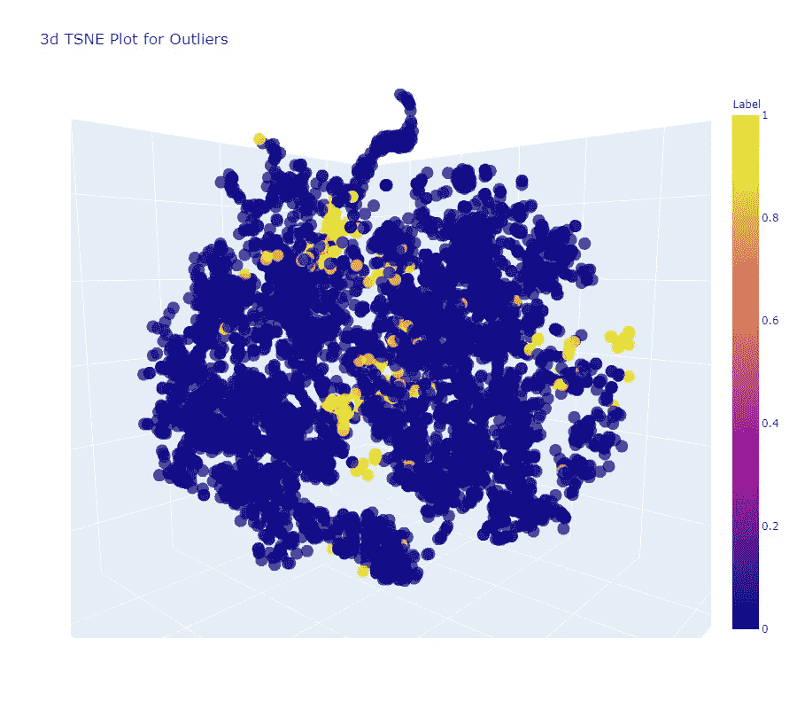

# PyCarat 异常检测简介

> 原文：<https://medium.com/analytics-vidhya/introduction-to-anomaly-detection-using-pycarat-519a13be24c5?source=collection_archive---------14----------------------->


# 什么是异常？

根据定义，[异常](https://en.wikipedia.org/wiki/Anomaly_detection)是偏离标准、正常或预期的东西。

当处理关于二元分类问题的数据集时，我们通常处理平衡数据集。这确保了模型挑选正确的特征来学习。现在，如果属于一个类的数据非常少，而几乎所有的数据点都属于另一个类，会发生什么呢？

在这种情况下，我们认为一个分类是“正常的”，稀疏数据点是“正常”分类点的偏差。

比如你每天两次锁门，上午 11 点去办公室前，晚上 10 点睡觉前。如果锁在凌晨 2 点被打开，这将被视为异常行为。异常检测是指预测这些情况，用于入侵检测、欺诈检测、健康监控等。

*在本文中，我将向您展示如何在数据集上使用 pycaret 进行异常检测。*

# PyCaret 是什么？

[PyCaret 是 Python 中的一个开源、**低代码**机器学习库，旨在减少从假设到洞察的周期时间。它非常适合想要通过在工作流程中使用 PyCaret 来提高其 ML 实验生产率的经验丰富的数据科学家，或者是公民数据科学家和对数据科学很少或没有编码背景的新手。PyCaret 允许您使用您选择的笔记本电脑环境，在几秒钟内从准备数据到部署模型。](https://pycaret.org/guide/)

因此，简而言之，pycaret 让您在 3 行代码内可视化和训练数据集上的模型变得非常容易！

所以让我们开始吧！

## 欺诈检测数据集

我们使用来自 Kaggle competition 的[信用卡数据集进行欺诈检测](https://www.kaggle.com/mlg-ulb/creditcardfraud)，其字段如下:

1.  **Time:** 包含每个事务与数据集中第一个事务之间经过的秒数。
2.  **V1-V28:** 应用 PCA 后获得的特征
3.  **金额:**交易金额
4.  **类:** 0 —正常，1 —欺诈交易。我们不使用它来训练我们的模型，但是稍后将使用它来计算精确度。

该数据集包含欧洲持卡人在 2013 年 9 月的信用卡交易。如下图所示，数据集高度不平衡，欺诈交易仅占 0.1%。使用 pyCaret，我们将尝试创建一个欺诈检测模型。



这是数据集的计数图。

## 1.正在安装 PyCaret

要安装 pycaret，请在命令提示符/google colab 中运行以下命令:

```
pip install pycaret
```

如果您使用 Google Colab，请确保运行以下命令来渲染交互式绘图:

```
from pycaret.utils import enable_colabenable_colab()
```

## **2。设置环境**

设置功能要求数据为 pandas 数据帧，可选字段为 normalize、ignore_features 等。下面是设置命令:

```
exp_ano101 = setup(data, normalize = True, ignore_features = [''])
```

*数据*是熊猫数据帧，我们[使用 read_csv()从 csv 文件读取到数据帧](https://towardsdatascience.com/3-ways-to-load-csv-files-into-colab-7c14fcbdcb92)。因为我们使用的是无监督的异常检测，记得删除*类*列或者只在 *ignore_features* 标志中提及它。

## 3.创建模型

PyCaret 使得导入和使用模型变得很容易。[你可以使用另一组模型，如逻辑回归、主成分分析等。](https://pycaret.org/create-model/)

```
model_created = create_model('iforest')
model_results = assign_model(model_created)
```

在创建和分配模型之后，我们可以使用 model_results.head()来检查结果。将有两列追加到数据集，称为标签和分数。标签是数据点的预测类别。

## 4.在二维和三维空间中绘制数据点

Pycaret 的 [plot_model](https://pycaret.org/plot-model/) 函数在分析不同方面的异常检测模型时派上了用场。此函数接受一个经过训练的模型对象并返回一个绘图。

对于二维图(均匀流形近似和投影(UMAP)):

```
plot_model(iforest, plot = 'umap')
```



对于三维图(T-分布式随机相邻嵌入(t-SNE)):

```
plot_model(iforest)
```



## 4.检查模型的准确性

现在，使用看不见的数据来获得模型的测试精度。使用上面的例子，我们得到了 95%的准确率

# 摘要

本文简要概述了异常检测以及如何在数据集上使用 PyCaret 进行异常检测。

您可以在此处查看该笔记本:[https://github . com/py caret/py caret/blob/master/tutorials/Anomaly % 20 detection % 20 tutorial % 20 level % 20 beginner % 20-% 20 ano 101 . ipynb](https://github.com/pycaret/pycaret/blob/master/tutorials/Anomaly%20Detection%20Tutorial%20Level%20Beginner%20-%20ANO101.ipynb)