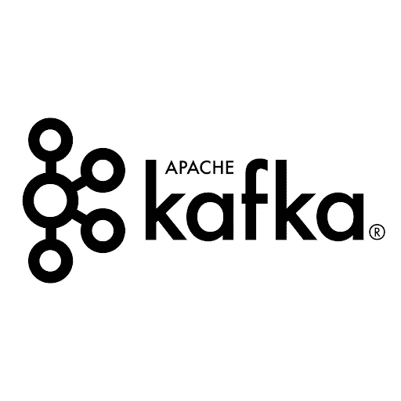
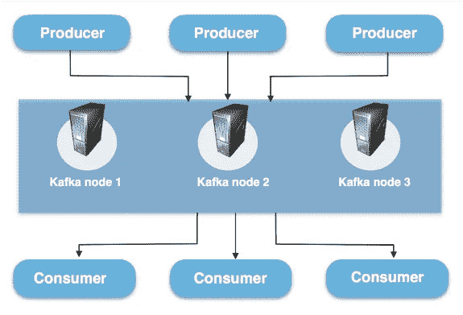
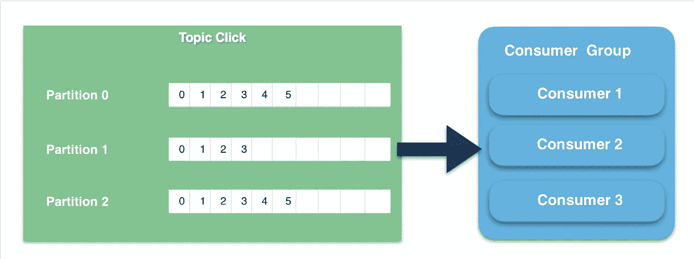
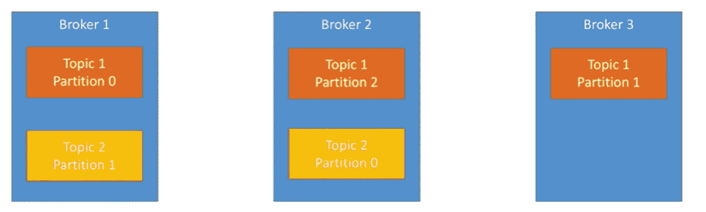
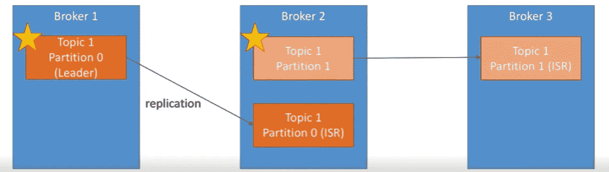
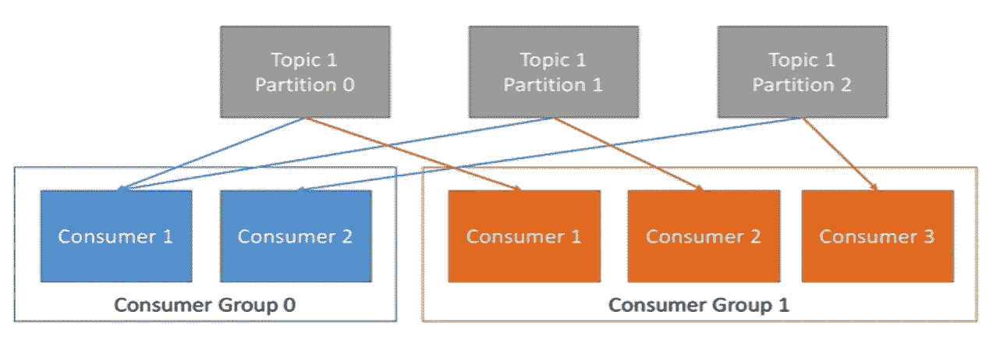
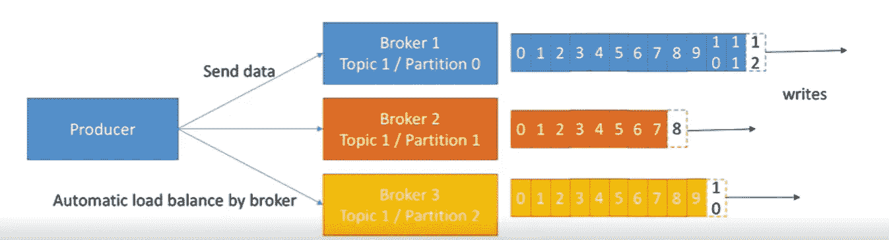

# 阿帕奇卡夫卡简介

> 原文：<https://medium.com/analytics-vidhya/introduction-to-apache-kafka-88ebd24eb962?source=collection_archive---------25----------------------->

阿帕奇卡夫卡

**什么是阿帕奇卡夫卡？**

Kafka 是一个基于发布-订阅的消息传递系统，它在进程、应用程序和服务器之间交换数据。应用程序可以连接到该系统，并将消息传送到**主题**(我们稍后会看到什么是主题)，另一个应用程序可以连接到该系统，并处理来自**主题**的消息。

## **什么是卡夫卡经纪人？**

Kafka 集群由一个或多个服务器组成，也称为 ***Kafka 代理*** ，它们运行 Kafka。每个代理都用其 ID 来标识(Broker.id 属性是群集中每个节点的唯一且永久的名称)。要连接到整个集群，首先需要连接到引导服务器(也称为**引导代理**)。**引导** **服务器**不过是用于建立到 **Kafka 集群**的初始连接的主机/端口对列表。

卡夫卡集群

## **什么是*卡夫卡的主题？***

*主题是存储和发布消息的类别/提要名称。*

*   消息是可以存储任何格式的任何对象的字节数组。
*   所有卡夫卡的信息都被组织成主题。
*   如果你想发送一条信息，你可以发送给一个特定的主题；如果你想阅读一条信息，你可以阅读一个特定的主题。
*   *生产者应用程序向主题写入数据，消费者应用程序从主题读取数据。*

## **卡夫卡主题分区看起来怎么样？**

*   *卡夫卡主题被分成若干分区，分区中包含不可改变顺序的消息。*
*   *分区中的每条消息由其唯一的* ***偏移量来分配和标识。***
*   *主题分区是 Kafka 中的一个并行单位，即两个消费者不能同时使用来自同一个分区的消息。消费者可以同时从多个分区消费。*

卡夫卡隔断

**卡夫卡中的复制品**

*   *在 Kafka 中，复制是在分区级别实现的。*
*   主题分区的冗余单元称为副本。
*   *每个分区通常有一个或多个副本，这意味着分区包含通过集群中的几个 Kafka 代理复制的消息。*

2 个主题的示例(3 个分区和 2 个分区)

卡夫卡的复制品

数据是分布式的，代理 3 没有任何主题 2 数据

## **分区领导者的概念**

*   在任何时候，只有一个代理可以成为给定分区的领导者，并且只有该领导者可以接收和提供分区的数据
*   其他代理将同步数据
*   每个分区只有一个领导者和多个 ISR(同步复制)

领导者的概念

## **消费者**

*   *消费者可以加入一个叫做消费者团体的组织。*
*   *组中的每个消费者被分配一组分区来消费。*
*   *Kafka 保证一条消息只被群体中的一个消费者阅读*
*   ***数据/消息*** *从不推送给消费者，当消费者准备好处理消息时，消费者会要求消息。*
*   由于所有消息都在 Kafka 中排队，消费者永远不会因大量数据而过载或丢失任何数据。
*   消费者在消费者群体中阅读数据
*   组中的每个消费者从独占分区中读取数据
*   您的*消费者*不能多于*分区*(否则一些将是不活动的)

消费者群体

## **制片人**

*   生产者可以选择接收数据写入确认:
*   Acks = 0:生成器不会等待确认(可能会丢失数据)
*   Acks = 1:生产者将等待领导者确认(有限的数据丢失)
*   ack = all:Leader+副本确认(无数据丢失)

生产者

这里有一些你需要记住的重要概念

*   ***制作者:*** *发送消息的应用程序。*
*   ***消费者:*** *接收消息的应用程序。*
*   ***消息:*** *通过 Apache Kafka 从生产者发送给消费者的信息。*
*   ***连接:*** *连接是您的应用程序和 Kafka 代理之间的 TCP 连接。*
*   ***主题:*** *主题是存储和发布消息的类别/提要名称。*
*   ***主题分区:*** *Kafka 主题被划分为多个分区，可以让你跨多个经纪人拆分数据。*
*   ***副本*** *一个分区的副本就是一个分区的“备份”。副本从不读取或写入数据。它们用于防止数据丢失。*
*   ***消费者组:*** *消费者组包括订阅特定主题的一组消费者进程。*
*   ***偏移量:*** *偏移量是一个分区内一条记录的唯一标识符。它表示用户在分区中的位置。*
*   ***节点:*** *节点是 Apache Kafka 集群中的单台计算机。*
*   ***集群:*** *集群是一组节点即一组计算机。*

**补充说明**

*   动物园管理员管理经纪人(保留他们的名单)
*   动物园管理员帮助执行分区的领导者选举。
*   如果有变化，动物园管理员会向卡夫卡发送通知。
*   卡夫卡的作品离不开动物园管理员。