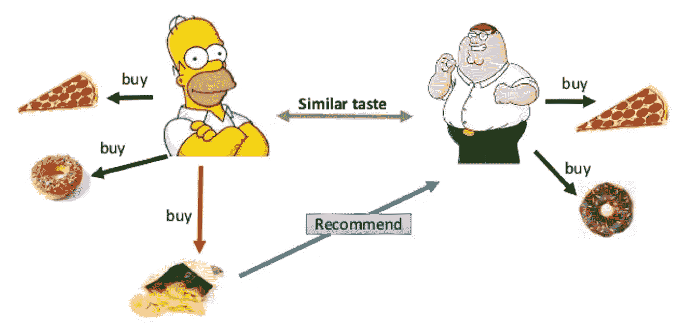
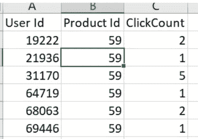
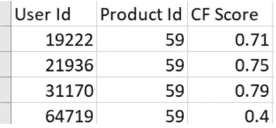

# Apache Spark 简介和 PySpark 中的隐式协作过滤

> 原文：<https://medium.com/analytics-vidhya/introduction-to-apache-spark-and-implicit-collaborative-filtering-in-pyspark-7c8c83eba008?source=collection_archive---------5----------------------->

**阿帕奇火花:**

Apache Spark 是开源的快速分布式计算框架。它提供了编程并行和容错机器集群的 APIs。它最初是在加州大学伯克利分校开发的，后来捐赠给了阿帕奇基金会。

它与 Hadoop 兼容，可以使用 Yarn、Kubernetes、Mesos 或独立模式运行 Hadoop 集群。它可以处理许多著名的分布式数据系统的数据，如卡珊德拉，HDFS，HBase 等。对于批处理(如 map-reduce)和任务(如流和机器学习)，它是一个非常好的平台。它的受欢迎程度在过去几年里迅速攀升，许多组织使用它来完成各种数据处理任务。

**派斯帕克:**

Spark 提供了 Scala、Java、Python 和 r 的高级 API，Python 对 Spark 的包装器叫做 PySpark。PySpark 是执行数据分析任务和构建机器学习应用程序的主要语言之一。Python 语言在数据分析中的广泛应用使得 PySpark 非常直观，任何人都可以轻松使用。

像 Azure Databricks、微软的 HDInsights 等平台。使用高计算能力使 PySpark 非常容易设置和开始实验。在这篇技术评论中，我主要关注什么是隐式协同过滤以及如何在 PySpark 中实现它。我在下面的实验中使用了 Azure Databricks。

**隐式协同过滤:**

协同过滤(CF)是推荐系统使用的最新技术。CF 的动机来自于这样一个想法，即人们经常从与自己品味相似的人那里得到最好的推荐。

由
Mohamed BEN ELLEFI 拍摄的关于[基于个人资料的数据集推荐的照片](https://www.slideshare.net/MohamedBENELLEFI/profilebased-dataset-recommendation-for-rdf-data-linking)

隐式 CF 用于没有显式数据但可以访问大量隐式数据的场景，如从搜索历史中提取用户的兴趣，从观看历史中预测用户是否喜欢该电影(他观看该电影的时间等)。亚马逊和网飞等公司在推荐产品和电影时采用了这种技术。Bing 和 Google 等搜索引擎公司使用它来确定用户兴趣。

显式 CF 使用低秩矩阵分解来近似矩阵中的条目。显式 CF 的一个非常著名的应用是在电影领域。低分(用户不喜欢该项目)和缺失值(意味着用户没有对该项目评分)之间有明显的区别。在优化过程中不需要计算用户-项目矩阵中的空白空间，因此它是计算稀疏的。

另一方面，隐性 CF 更为复杂，因为用户与项目之间的交互次数少可能意味着用户不喜欢该项目或者用户没有听说过该项目。它也是计算密集型的，因为您需要在优化期间计算矩阵中所有条目的值。

PySpark 内置了对隐式 CF 的支持。我们将在这里讨论几个重要的 API

***样本输入:***

下面是示例输入的快照。这是给定用户在搜索引擎中搜索产品的次数的数据集。

***拟合模型:***

> als = ALS(maxIter=30，regParam=0.1，implicitPrefs=True，userCol="userId "，itemCol="productId "，ratingCol="ClickCount ")
> 
> savedModel = als.fit(培训)

处理时间取决于各种因素。使用大约 50 个内核和大约 200 GB 的 RAM(data bricks 上的 DDRv2 实例),对 2000 万用户和 10 万个产品进行培训大约需要 1.5 小时。

***对给定集合进行预测:***

> 预测= savedModel.transform(测试)

**样本输出**

***为用户推荐商品:***

> *#为每个用户生成前 10 个产品推荐*
> 
> user RECs = saved model . recommendedforallusers(10)

***为用户推荐一件物品:***

> *#为每种产品生成前 10 名用户推荐*
> 
> product RECs = saved model . recommendedforallitems(10)

***为子集生成建议:***

> *#为用户子集生成 10 大产品推荐*
> 
> userSubsetRecs = saved model . recommendeforusersubset(user subset，10)
> 
> *#为一组特定产品生成前 10 名用户推荐*
> 
> productSubSetRecs = saved model . recommendedforitemsubset(products subset，10)

使用 Azure 认知服务、Databricks ML Flow 等各种服务，也可以使用构建的模型为实时用户提供服务。并且不在本文讨论范围内。

**参考文献**:

1.  PySpark 官方文档:[https://spark.apache.org/docs/latest/api/python/index.html](https://spark.apache.org/docs/latest/api/python/index.html)
2.  阿帕奇火花:[https://spark.apache.org/faq.html](https://spark.apache.org/faq.html)
3.  阿帕奇火花:[https://en.wikipedia.org/wiki/Apache_Spark](https://en.wikipedia.org/wiki/Apache_Spark)
4.  隐含 CF:【http://yifanhu.net/PUB/cf.pdf 
5.  PySpark CF:[https://spark . Apache . org/docs/latest/ml-collaborative-filtering . html](https://spark.apache.org/docs/latest/ml-collaborative-filtering.html)