# 苹果核心 ML 3 介绍——为 iPhone 构建深度学习模型(附代码)

> 原文：<https://medium.com/analytics-vidhya/introduction-to-apples-core-ml-3-build-deep-learning-models-for-the-iphone-with-code-509b951674c1?source=collection_archive---------9----------------------->

# 介绍

> 想象一下使用最先进的机器学习模型构建惊人应用的能力，而无需了解深入的机器学习。欢迎来到苹果酷睿 ML 3！

你是一个狂热的苹果粉丝吗？你用 iPhone 吗？想知道苹果如何使用机器学习和深度学习来驱动其应用程序和软件吗？

如果你对这些问题中的任何一个回答“是”——你就有得吃了！因为在本文中，我们将使用深度学习和苹果的 Core ML 3 为 iPhone 构建一个应用程序。下面是对该应用程序的快速浏览:

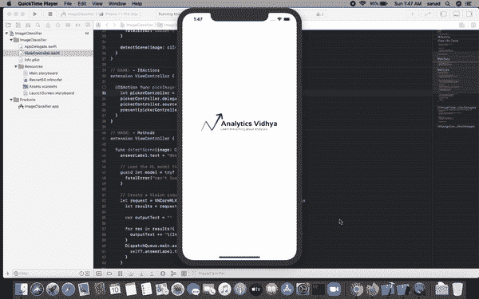

软件开发人员、程序员，甚至数据科学家都喜欢苹果的人工智能生态系统。近年来，他们已经取得了一些惊人的进展，包括 [Core ML](https://www.analyticsvidhya.com/blog/2017/09/build-machine-learning-iphone-apple-coreml/) 和我个人最喜欢的——[Swift 编程语言](https://www.analyticsvidhya.com/blog/2019/10/comprehensive-guide-learn-swift-from-scratch-data-science/?utm_source=blog&utm_medium=introduction-apple-core-ml-3-deep-learning-models-iphone)。

Core ML 3 是一个框架，支持 iPhone 的酷功能，如 FaceID、Animoji 和增强现实。

**在本文中，我们将探索推动苹果应用的整个人工智能生态系统，以及如何使用 Core ML 3 的丰富生态系统，即尖端的预训练、深度学习模型。** ***注:*** *要理解我们要讲的概念，需要有核心 ML 的基础知识。我建议* [*阅读这篇文章*](https://www.analyticsvidhya.com/blog/2017/09/build-machine-learning-iphone-apple-coreml/?utm_source=blog&utm_medium=introduction-apple-core-ml-3-deep-learning-models-iphone) *可以快速上手。*

# 苹果的人工智能生态系统

苹果在构建利用机器学习的工具和框架方面做得很好。构建人工智能应用程序有许多选择，每一种都有自己的优缺点。以下是苹果人工智能生态系统的高级概述:

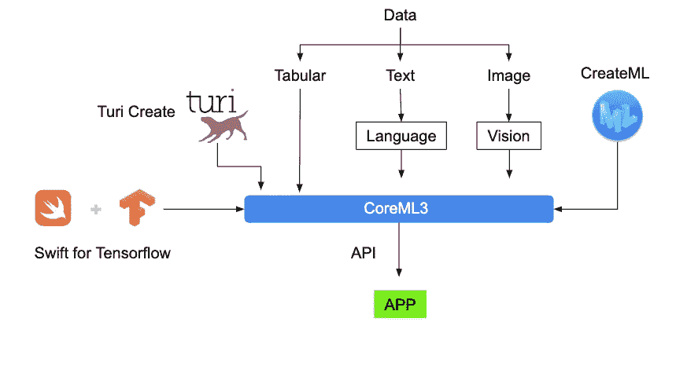

让我们了解一下每个工具或框架。

## 1) Turi 创建

如果您想在应用中添加推荐、物体检测、图像分类、图像相似性或活动分类，这应该是您的首选框架。

你不需要成为机器学习专家来使用这个工具。为什么？因为它已经为每个任务定义了模型。

我喜欢 Turi Create 的一点是，我们可以用 Python 来处理它，就像我们常规的工作流程一样。当我们对我们的模型感到满意时，只需将其导入到 Core ML 中，以便在 iOS、macOS、watchOS 和 tvOS 应用程序中使用！

以下是 Turi 创建的现成支持的一些任务:

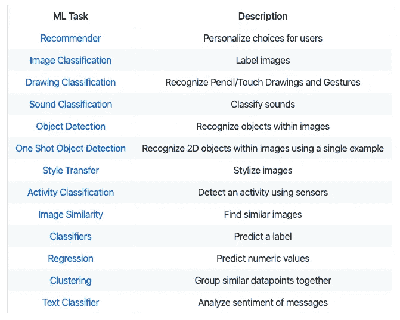

## 2)创建一个

Create ML 让我们不用写太多代码就能建立机器学习模型。

我喜欢这个工具的一点是，你可以拖放你的训练数据，然后选择你想要的模型(语音识别、物体检测等)。)而且它会自动开始训练模型！

下面是一个训练猫和狗图像分类器的例子:

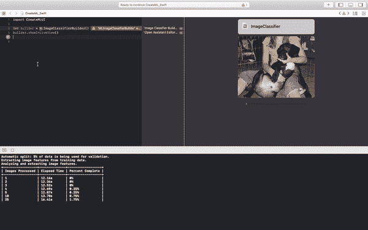

请注意，我只编写了两行代码，并拖放了 training data 文件夹——其余的由 CreateML 处理！

虽然 Turi Create 在 Python 中工作，但我们可以使用 CreateML 在 Mac 上构建。是的，它支持在 GPU 上训练(耶！).

## 3)用于 TensorFlow 的 Swift

Swift for TensorFlow 拥有灵活、高性能的 TensorFlow/PyTorch 类 API，可用于构建复杂的神经网络架构。

这个框架最吸引人的地方是它的代码和 Python 的一样易读。以下是 Swift 和 Python 中相同的模型代码(注意相似之处):

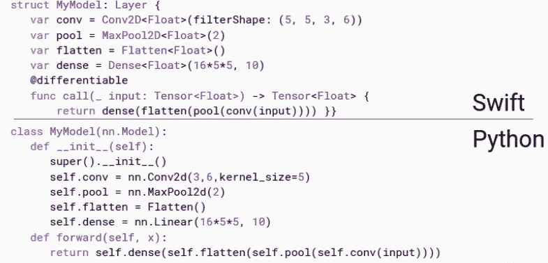

当您需要模型的高性能并希望有效部署时，请使用 Swift for TensorFlow。你可以在本文中了解如何使用 Swift for TensorFlow 构建[深度学习模型。](https://www.analyticsvidhya.com/blog/2019/10/comprehensive-guide-learn-swift-from-scratch-data-science/?utm_source=blog&utm_medium=introduction-apple-core-ml-3-deep-learning-models-iphone)

## 4)语言和愿景框架

这些是苹果公司的 Python 的 spaCy 和 OpenCV 框架，但增加了功能。这些框架让我们能够创建端到端的管道，用于执行图像处理和文本处理等。

如果您想执行图像分析任务，如人脸或地标检测、文本检测、条形码识别、图像配准和一般特征跟踪，那么**视觉适合您**。

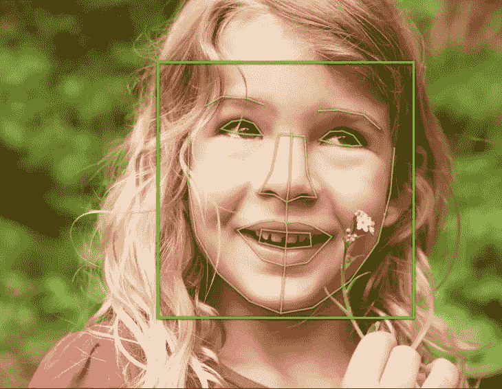

类似地，如果你想执行诸如语言和文字识别、标记化、词汇化、词性标注和命名实体识别之类的任务，那么**语言**将会派上用场。

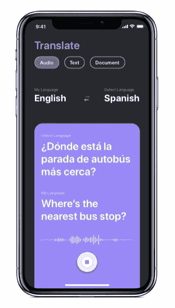

除了这两个，苹果还支持处理语音数据的框架(它们很容易与 CoreML 一起工作)。我将在接下来的文章中介绍这些工具。现在，让我们来看看这个节目的亮点——Core ML 3！

# 进入核心 ML 3

我爱苹果的核心 ML 3 框架。它不仅支持我们上面看到的工具，还支持它自己的一些特性。

首先，CoreML3 允许我们从所有主要的 Python 框架中导入经过训练的机器学习或深度学习模型:

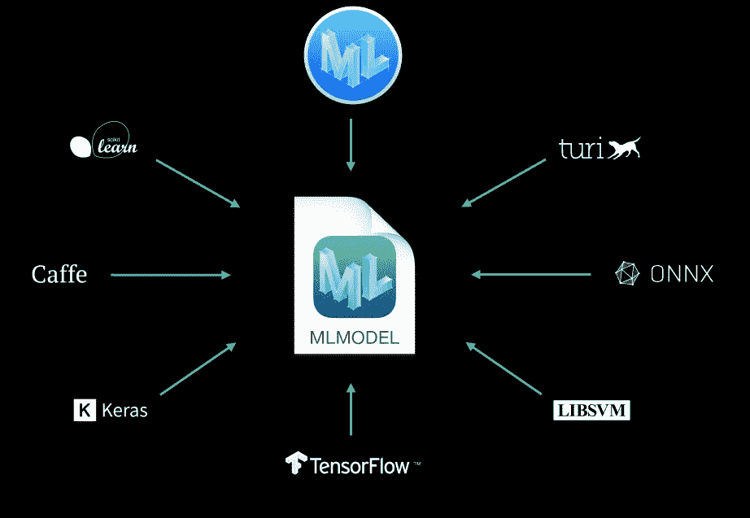

在我上面链接的一篇文章中，我们已经介绍了 Core ML 3 的这个特性。在这里，我们将看到 CoreML3 的另一个有趣的特性——我们如何利用 Core ML 3 现在支持的大量前沿预训练模型！

以下是 Core ML 3 支持的型号列表。请注意，其中一些(如 Squeezenet、DeeplabV3、YOLOv3)太新了，几个月前才刚刚推出:

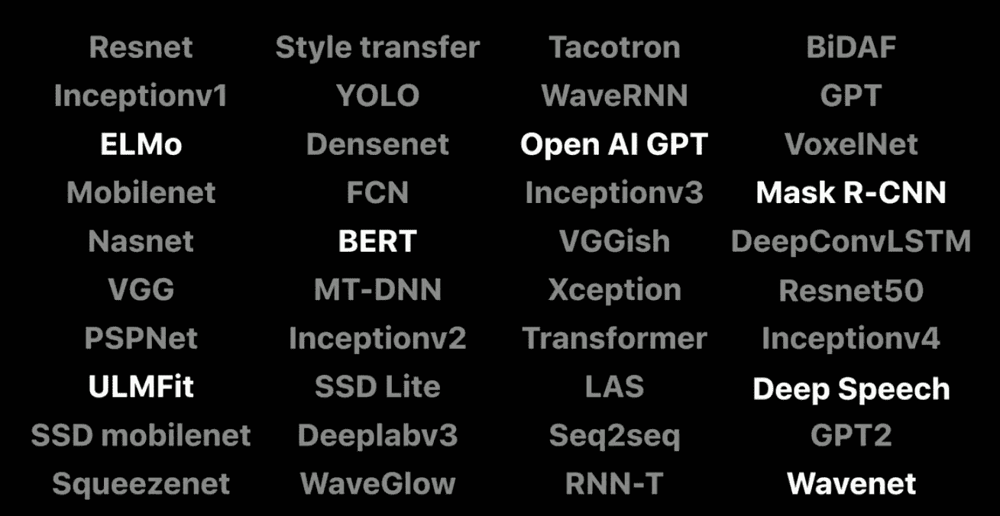

所有这些型号实际上都经过优化，可以在移动设备、平板电脑和电脑上提供最佳性能。这就是苹果的伟大之处。

这意味着即使其中许多是复杂的基于深度学习的模型，我们也不必太担心在我们的应用程序中部署和使用它们时的性能——这多酷啊？

# Core ML 3 —有什么变化？

你看了今年的 WWDC 会议吗？关于 Core ML 3 和苹果设备对该框架的支持，有一些有趣的公告。如果你错过了，这里有一个快速总结。

# 1)设备上的培训

这是 Core ML 3 目前为止最大的亮点。到目前为止，我们只有“在设备上推断”的支持。这基本上意味着我们在其他机器上训练我们的模型，然后利用训练好的模型在设备本身上进行实时预测。这带来了更好的用户体验，因为我们不依赖互联网来获得预测。

> Core ML 3 现在也支持设备上的训练！你可以使用 iPhone 的 CPU、GPU 和神经引擎来训练你的机器学习和深度学习模型。

你可以将核心 ML 3 培训视为一种形式的**转移学习**或**在线**学习，在这种情况下，你只需调整现有的模式。

以 Face ID 为例。当用户的脸随着时间的推移发生变化时(长胡子、化不同的妆、变老等)，它需要保持其模型的更新。).基本的想法是最初有一个通用的模型，给出每个人的平均性能，然后为每个用户定制一个副本。

随着时间的推移，这种模式将变得非常适合特定用户:

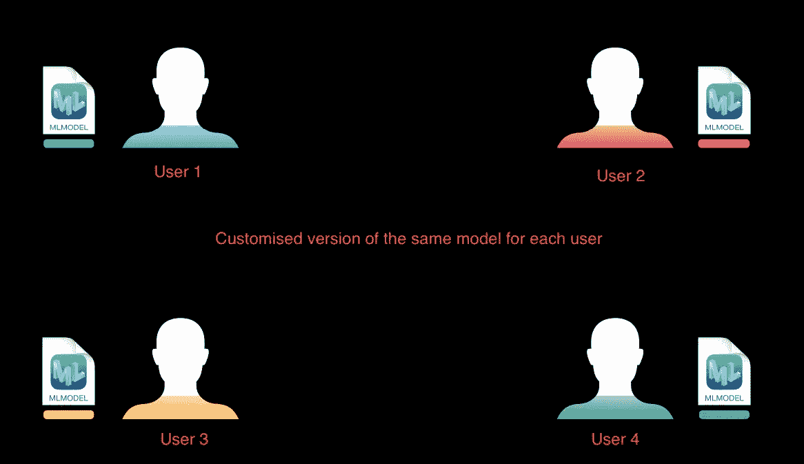

这有多种好处:

1.  培训将在用户的个人设备上进行，这意味着用户的**高数据隐私**
2.  我们**不需要建立庞大的服务器**来方便数百万应用用户的模型训练
3.  因为不涉及互联网，所以**模型将总是可用于**预测！

# 2)在核心 ML 3 中增加了新类型的神经网络层

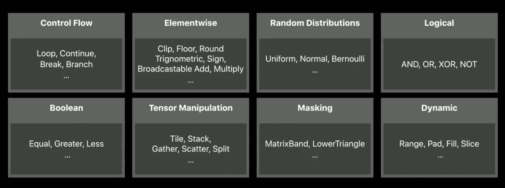

除了拥有不同模型类型的层，Core ML 3 还拥有 100+层用于中间操作，如掩蔽、张量操作、布尔逻辑、控制流等。

> 这些层类型中的一些被用在最先进的神经网络架构中，Core ML 3 已经为我们提供了支持。

这仅仅意味着我们可以轻松地为我们的应用程序立即构建这样的模型。

如果你对整个套餐感兴趣，请随意[观看整个 WWDC 视频](https://developer.apple.com/videos/play/wwdc2019/704/)。出于本文的目的，我们已经介绍了核心 ML 3 的核心基础知识。现在是时候构建一个 iPhone 应用程序了！

# 为 iPhone 构建一个图像分类应用程序

在我们开始构建我们的应用程序之前，我们需要安装一些东西。

## 系统设置

1.  **macOS:** 我用的是 macOS Catalina (10.15.1)
2.  Xcode: 这是用于为苹果设备构建应用的默认软件。您可以从 Mac 上的 App Store 下载它。我用的是 11.2 版本
3.  **项目:**您可以在终端中使用以下命令从 GitHub 下载项目的基础代码:

```
git clone [https://github.com/mohdsanadzakirizvi/CoreML3-Resnet50.git](https://github.com/mohdsanadzakirizvi/CoreML3-Resnet50.git)
```

1.  *对于本文，您需要一台 macOS 机器，否则您将无法实现项目*
2.  *任何为苹果设备开发的应用程序都是用* [*Swift*](https://developer.apple.com/swift/) 编写的
3.  *本教程不需要学习 Swift。但是如果它引起了你的兴趣，你可以在这里* [*学习它*](https://www.analyticsvidhya.com/blog/2019/10/comprehensive-guide-learn-swift-from-scratch-data-science/)

## 构建我们的深度学习模型

下载项目后，您会看到有两个文件夹:

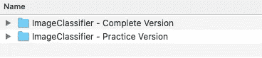

完整版是该应用程序的全功能版本，只需导入 ResNet50 模型即可运行。练习版缺少一些代码，您可以使用它们来阅读本文。

运行以下命令在 Xcode 中打开项目:

```
open ImageClassifier.xcodeproj
```

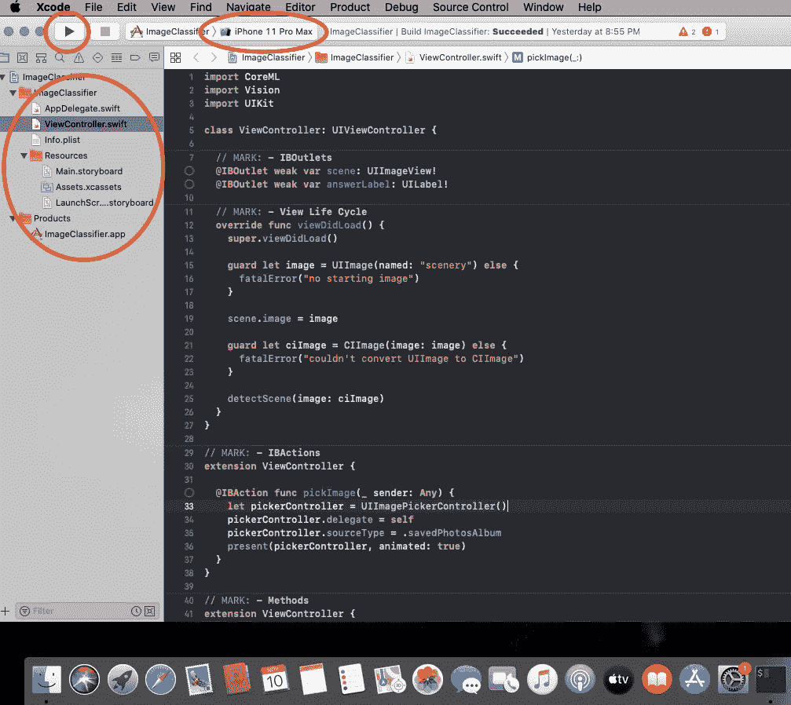

我在 Xcode 窗口中突出显示了三个主要区域:

1.  左上角可见的播放按钮用于**启动模拟器上的应用程序**
2.  如果你看播放按钮下面，有我们项目的文件和文件夹。这被称为**项目导航器。它帮助我们在项目的文件和文件夹之间导航**
3.  播放键旁边写着 iPhone 11 Pro Max。这表示您想要测试模拟器的目标设备

让我们首先运行我们的应用程序，看看会发生什么。点击左上角的播放按钮，将运行模拟器。

你看到了什么？

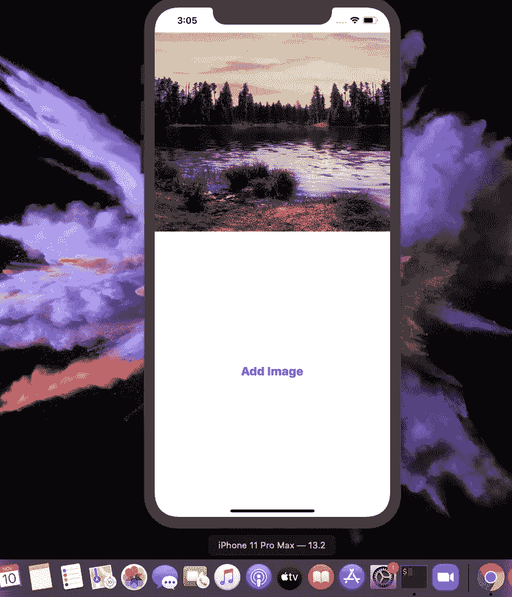

就目前而言，我们的应用程序做得不多。它只显示一个图像和一个选择其他图像的按钮——让我们做得更好！

如果打开练习版，您会发现以下文件夹结构:

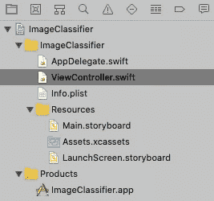

在项目导航器窗格中，选择 **ViewController.swift** 。这个文件包含了控制我们应用程序功能的大部分代码。以下是您将看到的内容:

现在你已经熟悉了 Xcode 和项目代码文件，让我们进入下一个阶段。

## 将预训练模型添加到我们的应用中

前往官方 Core ML 3 网站直接下载预先训练的模型:

```
[https://developer.apple.com/machine-learning/models/](https://developer.apple.com/machine-learning/models/)
```

在图像部分，您会发现 ResNet50 型号:

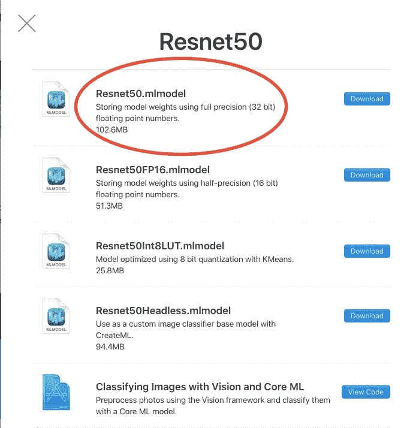

你可以下载任何你想要的版本。尺寸越大，模型就越精确。同样，尺寸越小，模型的速度越快。

*   将您的 **Resnet50.mlmodel** 文件拖到项目导航器窗格的 Xcode 窗口中
*   将弹出一个带有一些选项的窗口。保留默认选项，点击**【完成】**
*   当我们将这样的文件拖到 Xcode 中时，它会自动在项目中创建对该文件的引用。这样，我们可以在代码中轻松访问该文件

以下是整个过程供参考:

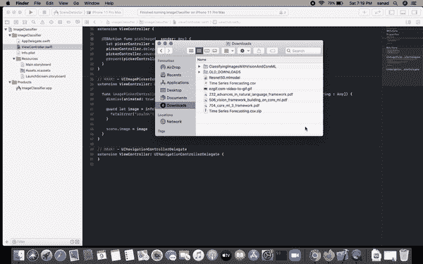

## 做出第一个预测

为了进行我们的第一个预测，我们需要加载我们刚刚下载的 ResNet50 模型。然后，拍摄一张图像，将其转换为模型期望的格式，并进行预测。

在 *ViewController.swift* 文件中的 IBActions(第 33 行)下编写以下代码:

上面的代码基本上接受一个新的图像，根据 ResNet50 期望的格式对其进行预处理，并将其传递到网络中进行预测。

最重要的代码行是:

```
// Load the ML model through its generated class guard let model = try? VNCoreMLModel(for:**Resnet50().model**) else { fatalError("can't load Places ML model") }
```

我们在这里设置模型名称。**如果你想使用像伯特或 YOLO 这样的框架，你只需要修改模型名称，你的应用程序的其余部分就会顺利工作。**

现在，我们需要调用这个函数 **imageClassify()** 来获得对图像的预测。将下面这段代码添加到 **viewDidLoad()(第 19 行)**的末尾:

现在，如果你运行应用程序，你会看到它已经开始对应用程序启动时显示的风景图片进行预测:

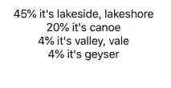

在 **imagePickerController()(第 87 行)**中复制相同的代码，然后应用程序将能够对您选择的任何图像做出相同的预测。

这是该应用程序的最终版本:


恭喜——你刚刚为 iPhone 构建了你的第一个人工智能应用程序！

# 分析 Vidhya 对核心 ML 3 的看法

苹果无疑已经利用所有最新的图像、语音和文本人工智能研究，轻松创建令人印象深刻的应用程序。您可以在没有太多这些模型知识的情况下立即开始，并在途中学习和探索。

我喜欢这个事实，即行业正在认真对待人工智能，他们希望让它非常容易被更广泛的受众所接受。

我鼓励你进一步探索和尝试像 BERT 这样的最新模型，并创建更多有趣的应用程序。如果有的话，你可以在我们这里制作的同一个应用程序上尝试 SqueezeNet 和 MobileNet，看看不同的模型在相同的图像上表现如何。

本文使用的所有代码[都可以在 Github](https://github.com/mohdsanadzakirizvi/CoreML3-Resnet50) 上获得。您可以在下面的评论区留下您的问题、建议和反馈。

*原载于 2019 年 11 月 14 日*[*【https://www.analyticsvidhya.com】*](https://www.analyticsvidhya.com/blog/2019/11/introduction-apple-core-ml-3-deep-learning-models-iphone/)*。*