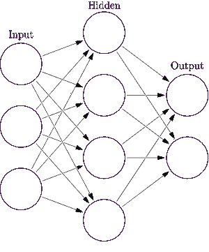
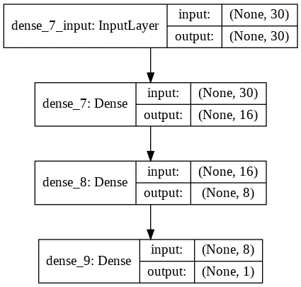
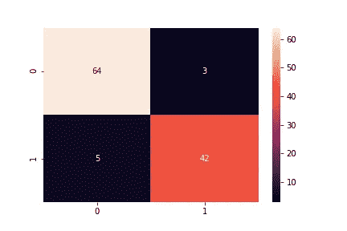

# 介绍人工神经网络并完整解释模型结构

> 原文：<https://medium.com/analytics-vidhya/introduction-to-artificial-neural-network-with-complete-explanation-with-model-architecture-a2939d019f54?source=collection_archive---------22----------------------->

深度学习是一种人工智能功能，它模仿人脑在处理数据和创建用于决策的模式方面的工作。深度学习是人工智能(AI)中机器学习的一个子集，它具有能够从非结构化或无标签的数据中进行无监督学习的网络。

深度学习是机器科学中令人兴奋和强大的分支之一。在深入研究实现之前，让我们先了解一下 ANN 的基本理论知识。

人工神经网络(ANN)是深度学习中最早的和最基本的神经网络。网络由连接组成，每个连接提供一个神经元的输出作为另一个神经元的输入。每个连接被分配一个代表其相对重要性的权重。给定的神经元可以有多个输入和输出连接。

培训过程包括以下步骤:

1.  **前向传播:**
    取输入，乘以权重(只需用随机数作为权重)
    让 Y = will = w1i 1+w2i 2+w3 i3
    将结果通过一个 sigmoid 公式计算出神经元的输出。Sigmoid 函数用于归一化 0 和 1 之间的结果:
    1/(1 + e-y)
2.  **反向传播**
    计算误差，即实际输出和预期输出之间的差值。根据误差，通过将误差乘以输入并再次乘以 sigmoid 曲线的梯度来调整权重:
    权重+=误差输入输出(1-输出)，这里输出(1-输出)是 Sigmoid 曲线的导数。

一个完整过程的重复称为历元。

实施 ANN

步骤 1:定义一个顺序模型。

第二步:添加具有乙状结肠激活功能的致密层。这是我们需要的唯一一层。

步骤 3:用优化器和损失函数编译模型。

步骤 4:使模型适合数据集。

第五步:分析结果:绘制损失/准确性曲线，绘制决策边界，查看分类报告，了解混淆矩阵。

流程的基本布局

1.通过 pandas 导入图书馆和读取数据。

> 进口熊猫作为 pd
> 
> 将 matplotlib 作为 plt 导入
> 
> 将 numpy 作为 np 导入
> 
> data=pd.read_csv(data.csv)
> 
> data.head()

2.将数据分为因变量和自变量。

> X = data.iloc[:，2:]。价值观念
> 
> y = data.iloc[:，1]。价值观念

3.因变量的标签编码。

> 从 sklearn .预处理导入 LabelEncoder
> 
> labelencoder_X_1 = LabelEncoder()
> 
> y = label encoder _ X _ 1 . fit _ transform(y)

4.将数据集分成训练集和测试集。

> 从 sklearn.model_selection 导入训练 _ 测试 _ 拆分
> 
> X_train，X_test，y_train，y_test = train_test_split(X，y，test_size = 0.2，random_state = 0)

5.通过训练和测试数据的标准化或规范化进行特征缩放。

> 来自 sklearn .预处理导入标准缩放器
> 
> sc =标准缩放器()
> 
> X _ train = sc . fit _ transform(X _ train)
> 
> X_test = sc.transform(X_test)

6.导入 Keras 并从模型和层导入顺序、密集、

安辍学。

> 导入 keras
> 
> 从 keras.models 导入序列
> 
> 从 keras.layers 导入密集
> 
> 从 keras.layers 导入退出

7.为创建隐藏层

> 分类器=顺序()
> 
> classifier . add(Dense(output _ dim = 16，init='uniform '，activation='relu '，input_dim=30))
> 
> #添加第二个隐藏层和来自第一个隐藏层的输入。
> 
> classifier . add(Dense(output _ dim = 8，init='uniform '，activation='relu '))
> 
> #为 prob 添加输出层和 sigmoid 函数。0 或 1 的
> 
> classifier . add(Dense(output _ dim = 1，init='uniform '，activation='sigmoid '))

8.用于绘制数据图层并将模型图层保存在 pnf 扩展中。

> 从 keras.utils.vis_utils 导入绘图 _ 模型
> 
> plot_model(分类器，to_file='model_plot.png '，show_shapes=True，show_layer_names=True)

模型 _ 绘图

9.为二元分类添加带有 binary_crossentropy 的优化器

> classifier . compile(optimizer = " Adam "，loss='binary_crossentropy '，metrics=['accuracy'])

10.用批量大小为 100(行)的训练数据和大小为 10 的时期进行拟合。

> classifier.fit(X_train，y_train，batch_size=100，nb_epoch=10)

11.预测测试集结果。

> y_pred =分类器.预测(X _ 测试)
> 
> y_pred = (y_pred > 0.5)

12.制作原始数据和预测数据的混淆矩阵

糖尿病。

> 来自 sklearn.metrics 导入混淆 _ 矩阵
> 
> cm =混淆矩阵(y 测试，y 预测)

13.通过 seaborn 图书馆绘制混乱矩阵。

> 将 seaborn 作为 sns 导入
> 
> sns.heatmap(cm，annot=True)
> 
> plt.savefig('混淆矩阵. png ')

混淆矩阵

11.h5py 包是 [HDF5](http://hdfgroup.org/) 二进制数据格式的 Pythonic 接口。它让您可以存储大量的数字数据，并轻松地从 NumPy 操作这些数据。保存人工神经网络模型。

> #将模型序列化到 JSON
> model _ JSON = model . to _ JSON()
> 用 open("model.json "，" w ")作为 JSON _ file:
> JSON _ file . write(model _ JSON)
> #将权重序列化到 HD F5
> model . save _ weights(" model . H5 ")

如果你喜欢读这篇文章，并对类似的项目有共同的兴趣，那么我们可以扩大我们的网络，可以为更多的实时项目工作。

更多详情请联系我的 [**Linkedin 账户**](https://www.linkedin.com/in/karan-choudhary-9102b81a0/) ***！***

**谢谢！！！！**