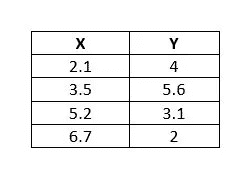
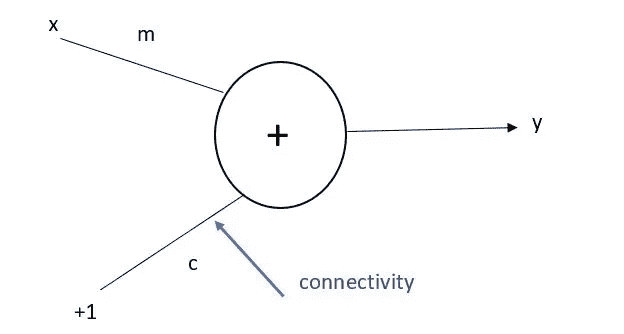
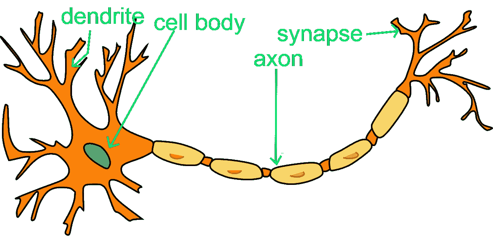
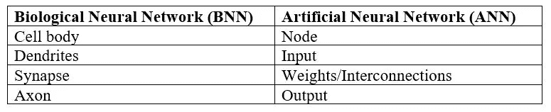
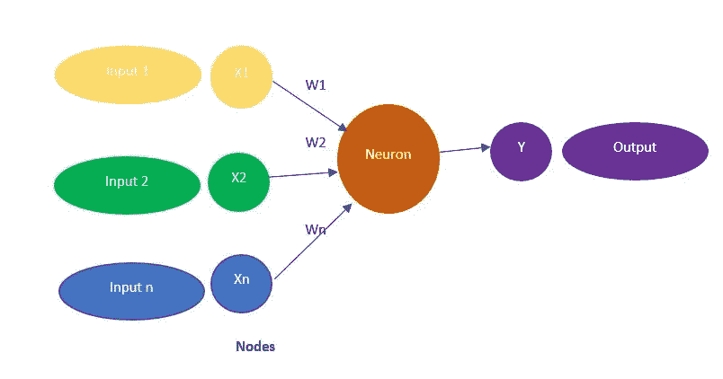
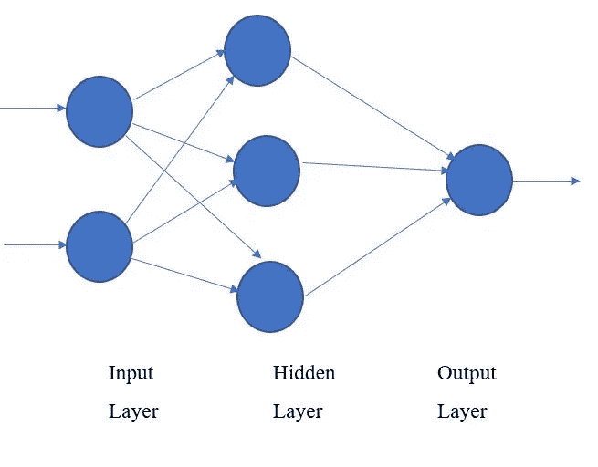
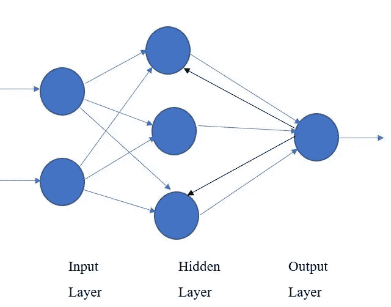

# 人工神经网络介绍

> 原文：<https://medium.com/analytics-vidhya/introduction-to-artificial-neural-networks-ann-3109578d61ab?source=collection_archive---------19----------------------->

## 对任何人的简单解释


照片由[杰米街](https://unsplash.com/@jamie452?utm_source=medium&utm_medium=referral)在 [Unsplash](https://unsplash.com?utm_source=medium&utm_medium=referral)

大家好，

我今天给你写信是为了让你对安有一个简单的了解。人工神经网络属于人工智能(AI)的主要领域，我们之前在这里讨论过。ANN 被归类在机器学习(ML)之下，今天 ANN 是 ML 的冠军。如果你对这个分类有疑问，点击[这里](/datadriveninvestor/two-broad-areas-of-artificial-intelligence-84037150bae)浏览这篇文章。

> ANN 的灵感来自大脑是如何由大量神经元和连接组成的。神经元作为处理器工作，连接作为记忆工作。安在 40 年代就出现了，甚至比艾还早。所有的深度学习，神经网络都是基于 ANN 的。

# 什么是人工神经网络？

人工神经网络是基于生物神经网络的结构和功能的计算模型。人类大脑以一种计算机不能的方式解释现实世界的环境。神经网络最早是在 20 世纪 50 年代为解决这个问题而开发的。这些神经网络基本上用于预测或预报目的。人工神经网络试图模拟构成人脑的神经元网络，以便计算机能够以类似人类的方式学习和决策。

# 人工神经网络的特点

通过思考大脑的特征，你很容易理解人工神经网络的特征。

*   可以进行数据训练
*   能理解嘈杂的数据
*   图像识别
*   可以概括

# 神经网络的基本概念

假设给了我们一个数据集。数据集是一组输入属性和输出值的集合。例如，身高、体重、年龄、地区、A/L 流、Z 分数、性别可被视为 X 输入，而 GPA 可被视为输出值(Y)。让我们看看下表，它显示了一个包含一个属性(X)和一个 Y 值的小型数据集。



简单数据集

假设我们已经知道了 X 和 Y 的关系，是 y = mx + c，这也叫模型。模型可以是现实世界过程的数学表示。我们想用一个数据集来计算学习过程中 m 和 c 的值。如果我们知道给定值 X 的 m 和 c，我们就能计算出 y 的值。这叫做预测。可以执行以下过程来估计 m 和 c 的值。

让我们随机选择 m 和 c 的值。

```
m = 0.5, c = 1.2Applying x1 for y = mx + c
                  = 0.5*2.1 + 3.2
                  = 1.05 + 1.2
               y^ = 2.25y = 4, y^ = 2.25

Let's take error as e1 here.e1 = y - y^
   = 4 - 2.25
   = 1.75
```

现在，我们应该根据 e1 来调整 m 和 c。因为是正的，很高。让我们取另一个 m 和 c 的值。

```
m = 0.8, c = 2.3Applying x2 for y = mx + c
                  = 0.8*3.5 + 2.3
                  = 2.8 + 2.3
               y^ = 5.1y = 5.6, y^ = 5.1

Let's take error as e2 here.e1 = y - y^
   = 5.6 - 5.1 
   = 0.5
```

我们应该使用数据集更新 m 和 c 值，直到我们得到非常低的误差值。当误差最小化时，我们可以说我们已经找到了 m 和 c 的值，这些值可以用来预测给定 x 的 y 值。

此外，如果我们观察这一学习过程，我们会不断调整 m 和 c 的值。因此，模型的整体性能正在提高。因此，我们可以说，该模型是通过数据集学习的。

经过训练的模型可用于预测未来值。未来值是我们目前还没有看到的值。经过训练的模型也可以解释为一个网络。下图显示了一个网络，并且连接值已使用数据集不断更新。



知识模型

# 神经网络的生物学背景

根据生物学，学习发生在人脑中。大脑的主要成分是神经元。神经元是信息信使。他们使用电脉冲和化学信号在大脑的不同区域之间以及大脑和神经系统的其他部分之间传递信息。神经元有三个基本部分，一个细胞体和两个称为轴突和树突的延伸部分。



神经元的主要组成部分(BNN)

神经元通过树突获取信息或信号，并在细胞体进行处理，然后通过轴突将信号传递给其他神经元。在轴突处，信号以神经递质的形式释放，该神经递质将被接收神经元的树突捕获。神经递质的释放和捕获发生在突触处。根据生物学，学习是通过改变神经元水平的突触强度来进行的。如果释放的神经递质几乎完全被接收神经元捕获，我们称之为神经元结合紧密，突触强度高。如果释放的神经递质被其他神经元轻微捕获，它们被称为松散结合和弱突触。根据生物学，学习是更新突触强度，作为学习发展知识模型的过程。在人工神经网络中，节点之间的连接被更新以发展类似于生物学的知识模型。



BNN vs 安



安

# 网络类型

神经网络有两种类型。

1.  **前馈网络(FFN)**

在 FFN 中，信号从输入层传输到输出层。这些网络用于分类。



FFN

**2。反馈网络(FBN)/循环网络**

我们可以找到从输出层到前一层或从隐藏层到前一隐藏层的反馈连接。FBN 通常用于建模时间序列数据，其中下一步的输出取决于当前步的输出。



FBN

# 人工神经网络中的机器学习/学习类型

人工神经网络的基本概念是如何教会机器学习。因此，有几种学习策略，主要有三个分支。

**监督学习(SL)**

我们使用标记数据进行学习。SL 也被称为跟随老师学习。被标记的数据的标签被认为是老师的。如果产生的或生成的输出与预期的输出(标记为 1)之间存在差异，则这是一个错误。反向传播算法是 SL 的一个例子。

**无监督学习(UL)**

如果我们有未标记的数据，我们就不能执行 SL。在这种情况下，我们必须支持 UL。当我们有未标记的数据时，我们只进行数据分组或聚类，通过均值和分布来观察它们的结构特征。没有外在的老师或标签来指导学习过程。自组织映射就是这种学习的一个例子。

**强化学习(RL)**

在 RL 学习过程的每一步都没有老师给出想要的答案。这种学习是通过与环境的不断互动来进行的，以便最大限度地提高得分。

> 学习方法可以分为另外两类。它们是主动学习和被动学习。第一语言属于主动学习，第二语言和 UL 属于被动学习。知识模型在环境中运行，同时学习是主动学习。被动学习与此相反。

# 人工神经网络(ANN)的优势

*   **并行处理能力—** 人工神经网络具有可以同时执行多项任务的数值
*   **在整个网络上存储数据—** 传统编程中使用的数据存储在整个网络上，而不是数据库中。一个地方的几个数据片段的消失不会妨碍网络工作。
*   **处理不完整知识的能力—** 经过人工神经网络训练后，即使数据不充分，信息也可能产生输出。这里的性能损失取决于丢失数据的重要性。
*   **具有记忆分布—** 为了使人工神经网络能够适应，重要的是确定示例，并通过向网络演示这些示例，根据期望的输出来鼓励网络。网络的继承与选择的实例成正比，如果事件不能从各个方面出现在网络中，就会产生错误的输出。
*   **具有容错性—** 勒索 ANN 的一个或多个单元并不禁止其产生输出，这个特性使得网络具有容错性。

# 人工神经网络的缺点

*   **确保正确的网络结构—** 对于确定人工神经网络的结构，没有特定的指导方针。合适的网络结构是通过经验、试验和错误来实现的。
*   **网络的未识别行为—** 这是 ANN 最重要的问题。当人工神经网络产生一个测试解决方案时，它不提供关于为什么和如何的洞察力。它会降低对网络的信任。
*   **硬件依赖性—** 根据其结构，人工神经网络需要具有并行处理能力的处理器。因此，设备的实现是依赖的。
*   **向网络显示问题的难度—** 人工神经网络可以处理数字数据。在引入人工神经网络之前，问题必须转换成数值。这里要解决的表示机制将直接影响网络的性能。它依赖于用户的能力。
*   **网络的持续时间是未知的—** 网络被简化为特定的误差值，而这个值并没有给出最佳结果。

# 神经网络的应用

*   **预测目的**

酒店业——预测客房需求

医院行业——检查某些疾病的阶段

农业温室植物病害分类，预测水培花园中植物的生长速度

银行业—预测购买模式(持卡行为)，预测自动取款机上的取款金额

交通行业—预测交通拥堵

*   **航空航天**自动驾驶飞机、飞机故障检测、飞机模拟器
*   **医疗**—癌细胞分析、脑电图和心电图分析、假体设计、移植时间优化
*   **语音**—语音识别、语音分类、文本到语音转换
*   **软件**—面部识别中的模式识别，光学字符识别

以上基本信息会让你对 ANN 有一个大概的了解。人工神经网络中的所有概念都不能用一篇文章来概括。还有更多东西要学。这只是一个兴奋剂，以收集和寻求更多的知识相关的这一领域。如果你喜欢这篇文章，如果你能在朋友之间分享，我会非常感激。谢谢大家！

继续读…！！！

参考

[1][https://www.javatpoint.com/artificial-neural-network](https://www.javatpoint.com/artificial-neural-network)

[2][https://www . tutorialspoint . com/artificial _ intelligence/artificial _ intelligence _ neural _ networks . htm](https://www.tutorialspoint.com/artificial_intelligence/artificial_intelligence_neural_networks.htm)