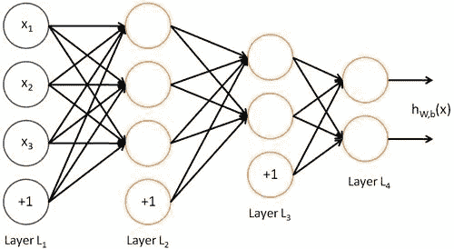

# 人工神经网络介绍

> 原文：<https://medium.com/analytics-vidhya/introduction-to-artificial-neural-networks-ann-5cf3b324204c?source=collection_archive---------10----------------------->

# 第一部分-安

这篇文章用通俗的语言讲述人工神经网络(ANN ),以获得一个高层次的概述，然后是一个端到端管道演示的简单实现，在第 2 部分中提供。我们不会关注或探索人工神经网络功能背后的数学原理。

## 什么是人工神经网络？

人类大脑以一种计算机不能的方式解释现实世界的背景和情况。人工神经网络是一种模拟人脑工作的方法，这样计算机就能够像人脑一样学习并做出决策。

ANN 是一种用于分类、回归和聚类问题的机器学习算法。它是深度神经网络的构建模块。它主要用于学习复杂的非线性假设，当数据集太大时，我们会有太多的特征。

ANN 使用不同层次的数学处理。它有几个组织在几层中的单元。一个单独的单位称为神经元。输入层中的输入单元从外部世界接收各种信息作为输入。从这里，数据进入隐藏单元，将数据转换成输出单元可以使用的形式。

下图中有 1 个输入层和 4 个输入单元，2 个隐藏层，第一个隐藏层有 4 个神经元，第二个隐藏层有 3 个神经元，最后一个输出层有 2 个输出单元。

图 1-神经网络的表示

最初，一个神经元将它所连接的前一层的每个神经元的值相加。在下图中，神经元有 3 个输入。这 3 个值将乘以权重并相加(w1，w2，w3)。权重是决定两个神经元之间强度的值。这些是在学习过程中会改变的价值观。那么偏置值将与先前的总和相加。在所有这些求和之后，神经元对该值应用激活函数。

图 2-神经元中执行的操作

这基本上就是一个神经元所做的。从连接的神经元接收值，将其乘以各自的权重，将它们相加，并应用激活函数。然后它把它发送给其他神经元。一层中的每个神经元都完成后，它会传递到下一层。最后，获得的最后一个值应该能够预测期望的输出。起初，神经网络的预测是随机的。但是，随着每个时期的过去，并根据输出应该达到的值训练模型，预测将越来越接近正确的值。

单个神经元的上述工作应该在整个网络中进行，并且通过称为前向传递/传播的过程来进行。使用它，我们从输入单元的激活开始，然后向前传播到隐藏层，计算隐藏层的激活，然后向前传播，这样我们就可以计算输出层的激活。

然后，为了确定最佳权重/参数，进行了称为反向传播的过程。在这种情况下，权重被优化，以便神经网络可以学习如何正确地将随机输入映射到输出。

下图描绘了机器学习过程的端到端管道。

# 第 2 部分-人工神经网络演示

# 数据集

## 描述

该数据集是根据对台湾违约付款客户的研究而准备的。此数据集包含从 2005 年 4 月到 2005 年 9 月台湾信用卡客户的违约付款、人口统计因素、信用数据、付款历史和账单等信息。

上述问题的数据集是从[数据集](http://archive.ics.uci.edu/ml/datasets/default+of+credit+card+clients)中获得的

**来自源站点的数据集特征**

## 特征/属性

这项研究包括一个二元变量违约付款(是= 1，否= 0)，作为响应变量。
该研究使用以下 23 个特征作为解释变量

特征/属性的细节如下:

**特性和描述**

# 履行

## 输入数据

最初，数据是从 excel 文件导入的。为此，我们使用了熊猫图书馆

数据导入

## 目标标签计数

接下来，对样品中的每个目标标签进行计数。

目标标签的计数

这个图像显示数据是不平衡的。数据集中有 3:1 的比例。数据集偏向于负类。

## 应用随机欠采样

因为这是一个不平衡的数据集。通常应用于不平衡数据集的技术之一是欠采样。它的工作原理是从大多数样本中移除样本

随意采样

上图显示了两个类之间的数据分布被欠采样所等同。

## 分割标签和要素

接下来，应将数据集分割成标注和要素。标注是目标类，而要素是用于预测它们的属性。

标签和要素的分割

## 将数据集分为训练集和测试集

为了避免过度拟合，我们的数据集应该分成训练集和测试集。训练数据将用于训练我们的神经网络，测试数据将用于评估训练好的模型

训练集和测试集的拆分

将测试规模指定为 20%,其余 80%用于培训

## 对要素应用规范化

在应用学习算法之前，应该将特征缩放到公共范围。以便可以统一评估这些特征。所用数据集的值在不同的范围内。进行特征缩放以标准化训练数据和测试数据。

标准标量归一化

## 主成分选择

数据集中的大量特征是影响学习算法的性能和训练时间的因素之一。为了克服这一点，主成分分析(PCA)被用来在训练数据和测试数据中选择主成分。PCA 是一种降维技术，用于选择对输出中的最大方差负责的最佳特征。

主要成分

上图显示了保持 95%方差的主要成分。在 24 个特征中，只有 15 个被 PCA 选择

## 导入分类器并训练数据集

ANN 用于训练训练数据集。我们需要指定层数和每层中的神经元数。

人工神经网络分类器的使用

除此之外，还可以定义激活函数、时期数、α、学习率。如果没有，将给出一个默认值。训练后，测试集用于预测结果。

# 性能赋值

计算以下性能指标来描述学习算法对测试数据的性能。

## 分类报告

分类报告用于显示由多个指标组成的报告。以下是衡量标准。

人工神经网络分类报告

## *精度

这给出了不应被标记为阳性的阴性样本的类别分数。

## *回忆

这给出了被分类器正确识别的样本的类别分数。

## * F1-分数

与其他类别相比，这给出了用于对属于该类别的样本进行分类的类别的准确度

## *支持

这给出了一个类的数据集的样本数

## AUC-ROC 曲线

AUC-ROC 曲线是一种性能测量指标。ROC 是概率曲线，AUC 给出了可分离性的度量程度。AUC 越高，模型预测越好，模型在违约和非违约情况之间的区分越好。人工神经网络的 AUC 值为 77.87%

ANN AUC-ROC 曲线

## 混淆矩阵

混淆矩阵是描述算法在一组已知实际标签的测试数据上的性能的表格。总结了正确和错误预测的数量

人工神经网络混淆矩阵

## 结论

现在你应该对其中一种叫做人工神经网络的机器学习算法有了基本的了解。神经网络是人工智能和深度学习的重要方面，用于解决计算机视觉相关问题。我确信你将会听到和学到更多关于这方面的东西，但是上面的文章已经给了你一个关于 ANN 的开始。

上述应用程序的完整实现可以在我的 [GitHub 库](https://github.com/Hareendran7/Artifical-Neural-Network---Demo)中查看。

关于进一步的细节，请参考以下内容，

 [## 什么是人工神经网络——对任何人的简单解释

### 人工神经网络(ANN)受人脑的启发，用于模拟相互关联的过程…

www.forbes.com](https://www.forbes.com/sites/bernardmarr/2018/09/24/what-are-artificial-neural-networks-a-simple-explanation-for-absolutely-anyone/#5a23d6431245)  [## sci kit-学习

### 编辑描述

scikit-learn.org](https://scikit-learn.org)