# Hyperopt 自动超参数优化简介

> 原文：<https://medium.com/analytics-vidhya/introduction-to-automatic-hyperparameter-optimization-with-hyperopt-e0b9c84d1059?source=collection_archive---------1----------------------->

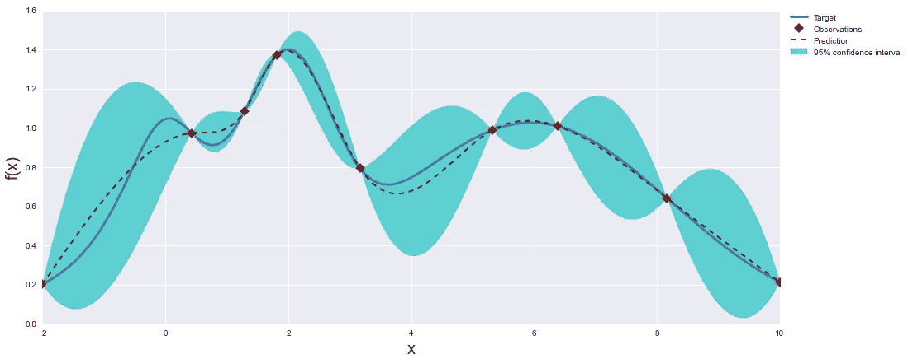

图片来源:[https://github.com/fmfn/BayesianOptimization](https://github.com/fmfn/BayesianOptimization)

## 机器学习模型的参数和超参数是什么？

每个机器学习模型都有一组参数&在训练过程中设置的超参数。参数是直接从训练数据中学习的值，例如线性/逻辑回归模型中的系数、基于树的模型中的分割变量和分割值、神经网络中的权重等。参数值由机器学习算法估计，无需任何人工参与。

超参数是确定机器学习模型复杂性的值。超参数的最佳选择确保该模型在拾取训练数据中的噪声时既不太灵活(过拟合)，也不太僵硬(可能丢失训练数据中的重要信号)(欠拟合)。与参数不同，超参数不能直接从训练数据中学习，需要由机器学习从业者来设置。随机森林/梯度增强模型中的预测器数量、神经网络中的学习速率、要使用的数量或正则化等是超参数的几个例子。超参数通常通过为不同的超参数值集迭代训练模型，并在保留的验证集或使用交叉验证上评估模型的性能来设置。

**超参数调谐方法**

以下是超参数调整的常用方法。在所有这些方法中，将选择在验证集上提供最佳性能的超参数值:

*   手动调整:机器学习实践者根据他的领域知识设置超参数值。他可能会尝试不同的价值观，然后选择最好的。
*   网格搜索:模型在由从业者设置的预定义的超参数值网格上进行调整。评估由网格定义的超参数值的所有可能组合，以选择最佳集合。
*   随机搜索:机器学习实践者为每个超参数提供要评估的值的概率分布。从这些分布中抽取指定数量的样本，并对每个样本评估模型的性能。
*   贝叶斯优化:贝叶斯优化跟踪先前评估的结果，以选择要评估的下一组超参数值。我们将在下面的章节中详细讨论贝叶斯优化。

## 贝叶斯优化

贝叶斯优化(也称为基于序列模型的优化(SMBO))使用过去评估的结果来形成目标函数的概率模型&使用该模型来选择下一组超参数值。概率模型称为“代理模型”，用 p(y|x)表示；y 是模型的性能度量，x 是超参数值。这里，目标函数是将超参数值映射到模型在验证集(或使用交叉验证)上选择的性能指标(如 RMSE、准确度、ROC AUC 等)的函数。与实际的目标函数相比，代理模型更容易优化。替代模型方法可用于在时间或金钱方面评估实际目标函数过于昂贵的情况(贝叶斯优化技术最初是为石油勘探应用开发的)。贝叶斯优化的基本步骤是:

1.  使用过去评估的结果建立目标函数的代理模型。
2.  找到在代理模型上表现最好的超参数。
3.  使用步骤 2 中选择的超参数值评估实际目标函数(即训练模型和评估性能指标)。
4.  通过添加步骤 3 中获得的新结果来更新代理模型。
5.  重复 2 到 4，直到达到停止标准，如最大迭代次数或时间。
6.  从所有试验中选择性能最佳的超参数。

贝叶斯优化方法的许多变体(hyperopt 是其中之一)可用于机器学习模型的超参数优化。这些方法的不同之处在于它们构建的代理模型的类型以及它们在上述算法的步骤 2 中使用的优化标准。Hyperopt 使用 Tree Parzen 估计器(TPE)作为代理模型，使用期望改进(EI)作为优化代理模型的标准。

**树形结构 Parzen 估计量(TPE):** 不直接建模 p(y|x)，TPE 建模 p(x|y)和 p(y)。TPE 使用两种密度定义 p(x|y ):

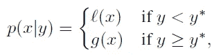

其中 l(x)是通过使用来自过去评估的观测值 xᵢ形成的密度，使得相应的损失(即，模型的性能度量)小于某个阈值 y*，g(x)是通过使用剩余观测值形成的密度。这里，我们假设我们想要最小化模型的性能度量(例如 RMSE 损失)。如果我们希望使用一个需要最大化的指标(如准确性、f1 得分、ROC AUC 等)，我们只需取该指标的负值，并尝试将其最小化。TPE 算法使用 y*作为观察值的某个分位数γ，因此 p(y < y*) = γ.

**期望改善(EI):** 期望改善是在 f(x)的某个模型 M 下 f(x)将超过(负)某个阈值 y*的期望。

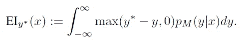

在 TPE 算法下，可以证明最大化 EI 相当于选择最小化 g(x)/l(x)的 x 值。即，我们希望点在 l(x)下具有高值，而在 g(x)下具有低值。在每次迭代中，该算法从 l(x)中抽取几个样本，根据 g(x)/l(x)对它们进行评估，并返回具有最高 EI 的候选项。

## 远视

如上所述，Hyperopt 使用 Tree-Parzen 估计器来构建代理模型，并将预期改进作为优化标准。此外，hyperopt 要求机器学习从业者定义以下内容:

1.  定义将超参数值映射到模型所选性能指标的目标函数。
2.  定义一个配置空间。配置空间描述了域(即超参数的概率分布。)在其上允许远视搜索。这使得机器学习实践者能够对他的领域专业知识进行编码，以帮助超视识别最佳超参数值。hyperopt 库中有许多选项可用于描述概率分布。
3.  选择搜索算法。Hyperopt 目前支持 TPE 算法和随机搜索。
4.  指定一个 trials 对象来存储中间结果。这是可选的。

hyperopt.hp 模块定义了几个超参数分布，可用于指定配置空间。可用选项包括:

*   hp.choice(label，options):返回其中一个选项。选项可以是列表、元组，甚至是嵌套表达式。嵌套表达式格式允许我们指定条件参数，如果我们需要在不同类型的机器学习模型之间进行优化，这将非常方便。示例:在 boosting 或随机森林之间，或者在不同架构的神经网络模型之间。我们将看到一个说明该选项的代码示例。
*   hp.pchoice(label，p_options):类似于 hp.choice()，但是为每个选项指定了概率。
*   hp.uniform(标签，低，高):低和高(包括两端)之间的均匀分布。
*   hp.quniform(label，low，high，q):q * round 给出的分布(uniform(low，high)/q)。适用于取离散值的超参数。
*   HP . loqui form(label，low，high):由 exp(uniform(low，high))给出的分布。超参数将被限制在区间[eˡᵒʷ，eʰⁱᵍʰ]
*   hp.normal(label，mu，sigma):一个正态分布变量。优化时，此超参数不受约束。
*   hp.qnormal(label，mu，sigma，q):q * round 给出的分布(uniform(mu，sigma)/q)。这个变量也是无约束的。
*   hp.lognormal(label，mu，sigma):由 exp(normal(mu，sigma))给出的分布。这个变量被限定为正数。
*   hp.qlognormal(label，mu，sigma，q):q * round(exp(normal(mu，sigma))/q)给出的分布。这个变量被限定为正数。
*   hp.randint(label，upper):返回一个在[0，upper]范围内的随机整数。这种分布假设邻近整数值之间的损失函数没有相关性(例如，对于随机种子值)。

## 远视在行动

让我们使用来自 UCI 机器学习知识库的银行营销数据来演示 hyperopt 的工作。该数据与一家葡萄牙银行机构的直接营销活动相关。营销活动以电话为基础。目标变量是客户是否从银行订购了定期存款。许多与客户、营销活动、以前与客户的联系以及社会经济指标相关的变量都可以作为解释变量。UCI 站点有四个数据集，我们将使用文件“bank-additional-full.csv”。你可以在这里阅读更多关于数据集[的内容。我们将使用 Google colab 来运行我们的代码。代码文件上传到](https://archive.ics.uci.edu/ml/datasets/Bank+Marketing)[这里](https://github.com/Rakeshsuku/Medium-Blog)。

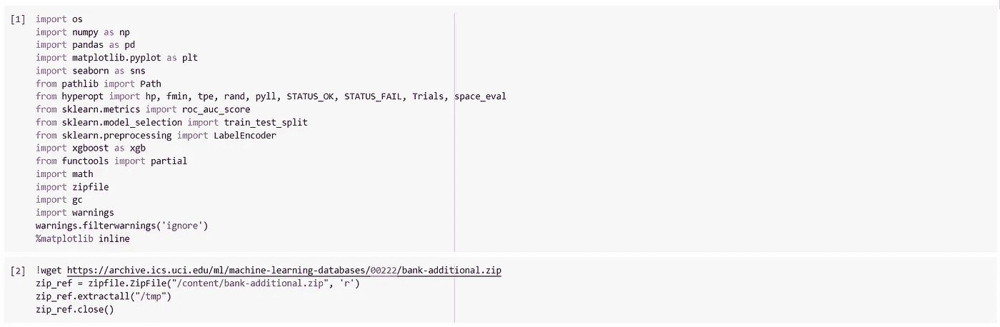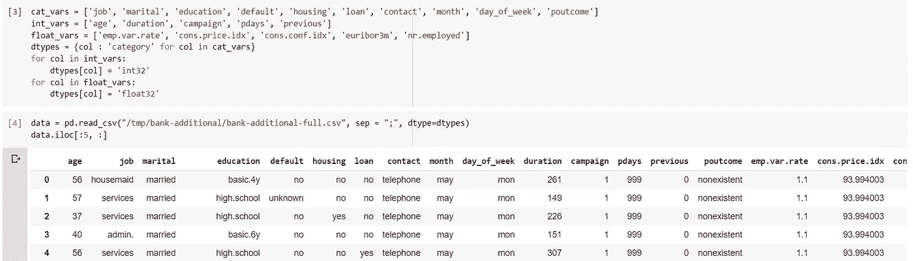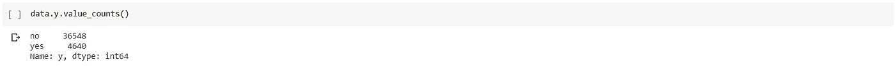

我们看到数据集是不平衡的，在数据集中的 41188 个客户中，只有 4640 个客户订阅了定期存款。根据 UCI 网站上的数据集信息，记录与客户通话持续时间的“持续时间”变量与目标高度相关。由于银行在发出呼叫之前无法获得该信息，因此我们将丢弃该变量。还要注意，“pdays”中的值“999”实际上是一个缺失的值指示符，表示银行以前没有联系过该客户。让我们删除“duration”变量，并将我们的目标复制到一个新变量 y。我们还将创建一个二进制变量来表示“银行以前没有联系过”，并将“pdays”中的“999”替换为 nan。

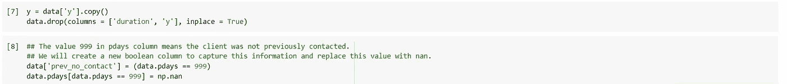

接下来，我们将数据分成训练集和测试集，并对分类变量执行标签编码。

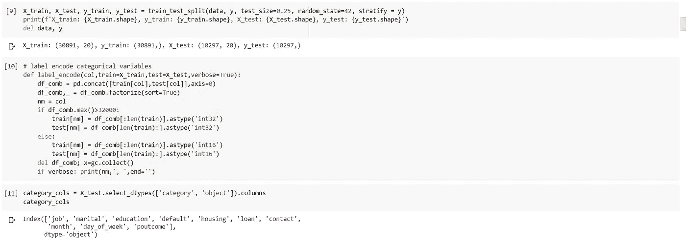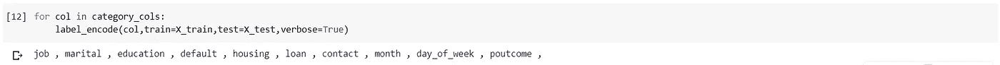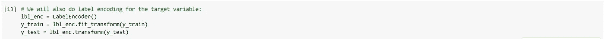

让我们将 XGBoost 模型作为基线模型。我们将使用 ROC AUC 作为评估标准，因为我们有一个不平衡的分类问题。请注意，我们在这里没有使用早期停止。

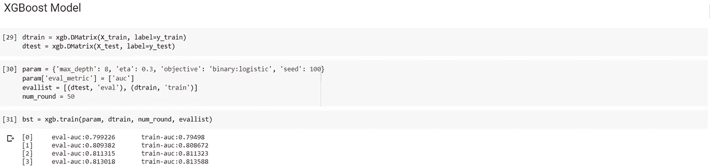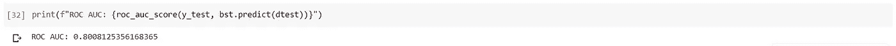

接下来，我们将使用 hyperopt 来优化该模型的超参数。首先，我们将定义一个函数，该函数为给定的一组超参数值计算测试集的 ROC AUC。注意，我们返回一个字典作为这个函数的输出。Hyperopt 最小化输出字典中的“损失”值，因此我们返回-1 * ROC AUC 作为损失。

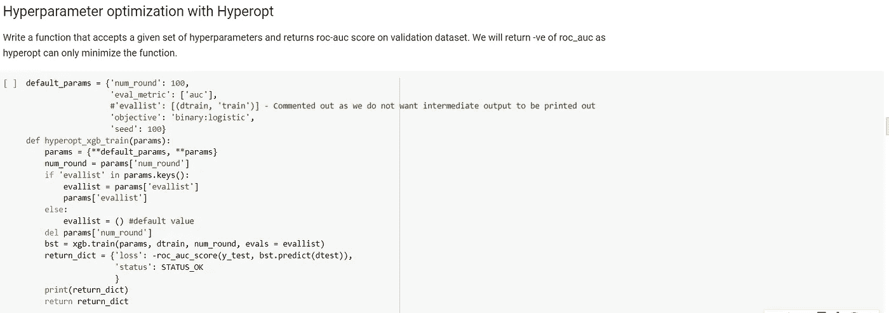

default_params 是我们不希望优化的超参数。如果我们将参数“params”中的相同超参数传递给 hyperopt_xgb_train()函数，default_params 中的值将被忽略。请注意，我们这里不是针对“num_round”进行调优；当我们拟合最终模型时，我们宁愿使用提前停止。让我们用之前使用的超参数值来测试这个函数。

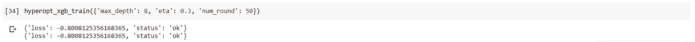

接下来，我们将定义两个函数，这两个函数将帮助我们可视化所调整的超参数的配置空间(即概率分布)。我们将设想以下两种情况:

*   我们根据我们的领域知识(plot_params_space())定义并提供给 hyperopt 作为输入的概率分布。
*   hyperopt 根据之前的评估历史实际消耗的超参数值的分布。(plot _ params _ tried())。该函数还返回所有试验结果的数据帧。

这将有助于我们清楚地了解远视的工作原理。请注意，下面定义的绘图功能不适用于嵌套配置空间。

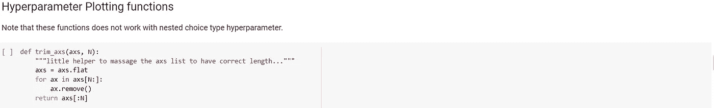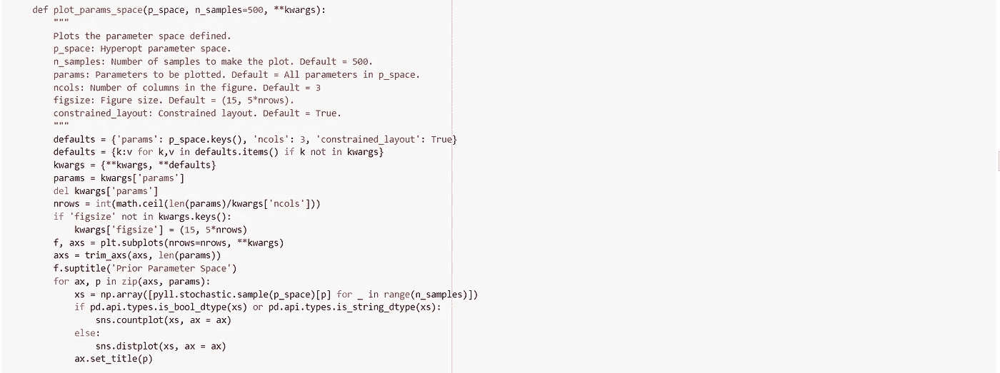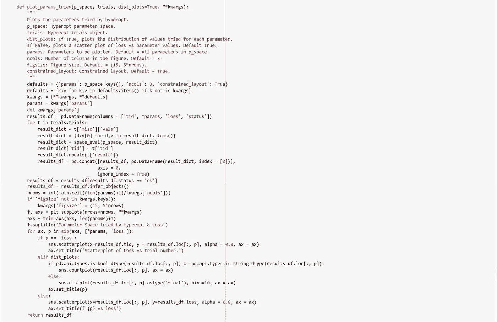

让我们定义 xgb 模型的配置空间，并将其可视化。

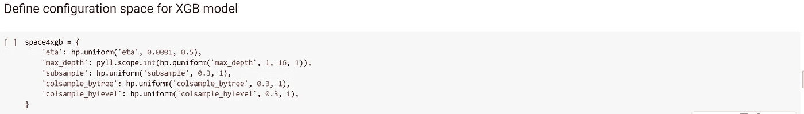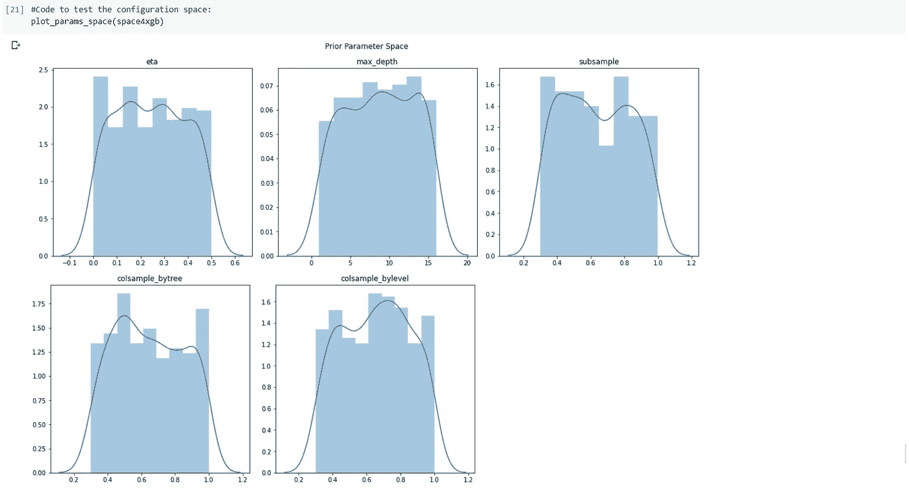

注意使用 pyll.scope.int()函数将 max_depth 值转换为整数类型。hyperopt.pyll.scope 模块允许我们在定义超参数的概率空间时使用自定义函数。更多例子请参见 hyperopt 论文。

我们将定义一个 trials 对象来存储 hyperopt 进行的所有评估的结果。我们还将使用这个对象来绘制评估的结果。如果没有提供 trials 对象，下面的 fmin()函数将只返回最佳的超参数值。

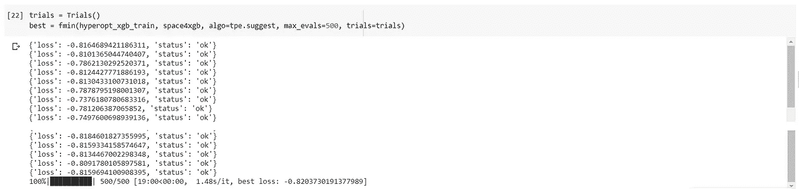

fmin()函数是执行超参数优化的主力。fmin 的第一个参数是目标函数，第二个参数是配置空间。fmin()的其他参数有:

*   algo:指定要使用的优化算法。可用选项有‘tpe . suggest’(用 TPE 算法实现贝叶斯优化)；和' rand.suggest '(实现随机搜索)。
*   max_evals:要执行的评估次数。
*   trials: Trials()对象保存由 hyperopt 执行的所有评估的结果。的。trials 对象的 Trials 属性是一个列表，其中包含 fmin 所做的每个评估的元素。

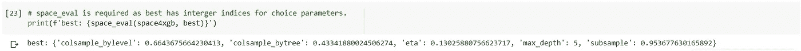

对于上述超参数值，我们得到了大约 0.82 的最佳 auc roc 分数。请注意使用 hyperopt 的 space_eval()函数从 best 获取超参数值。space_eval()是必需的，因为 best 将拥有由 hp.choice()定义的任何超参数的整数索引。让我们画出由 hyperopt 完成的评估结果。

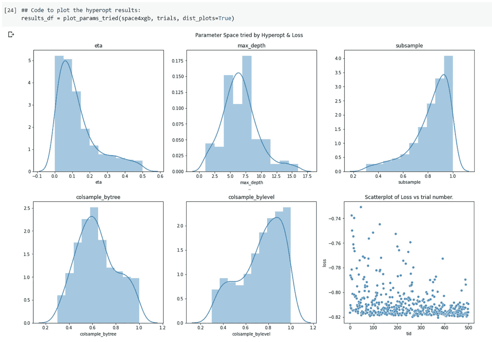

我们可以看到，由 hyperopt 评估的值的分布与我们定义的分布非常不同。让我们也绘制超参数值对损失(ROC AUC 的 ve)的散点图。

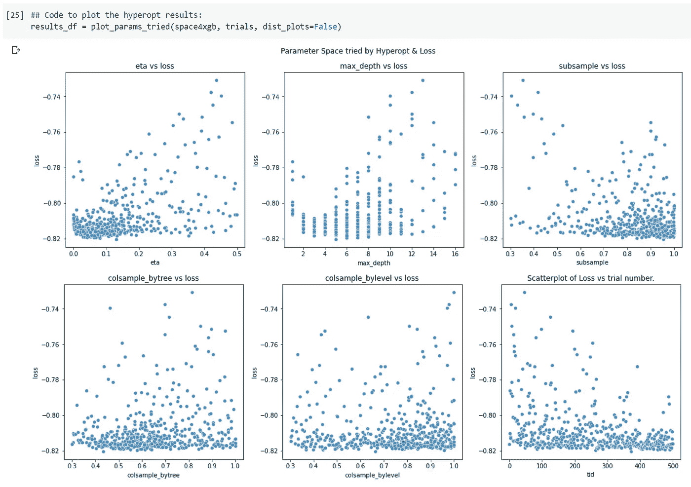

产生最佳结果的超参数值为:

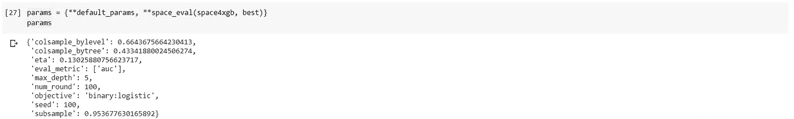

对于最终的模型，我们将把 num_round 增加到 1000，并启用 50 轮提前停止。

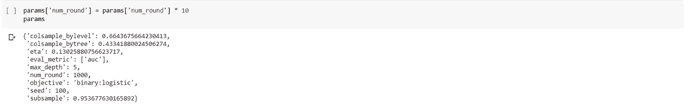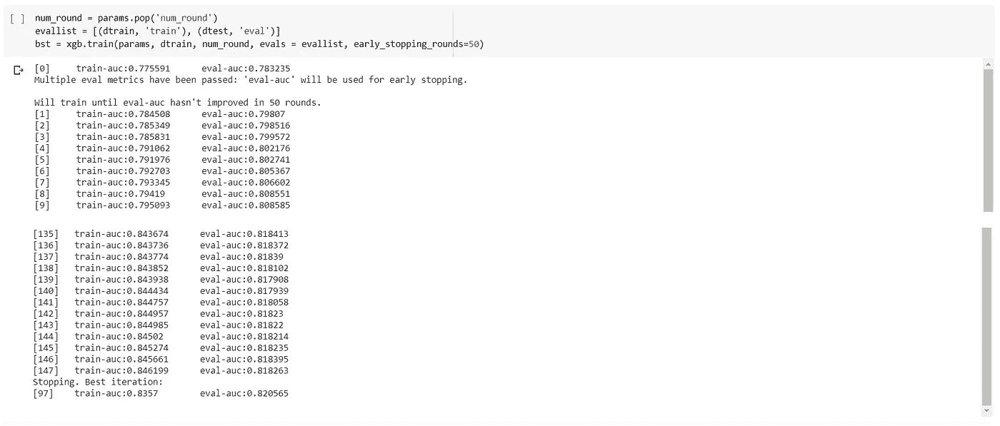

请注意，xgboost.train()将返回上一次迭代(这里是 147 次迭代)的模型，而不是最佳模型。我们可以得到如下的最佳迭代:

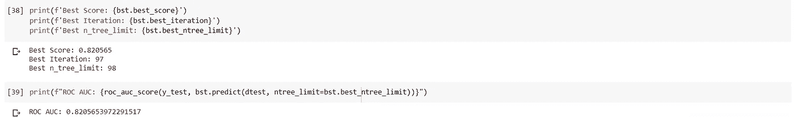

## 嵌套配置空间

接下来，我们将使用嵌套配置空间来同时调优 xgboost 模型和随机森林模型&选择性能最佳的模型。我们还将绘制几个样本，看看我们从这个嵌套的配置空间中得到什么。

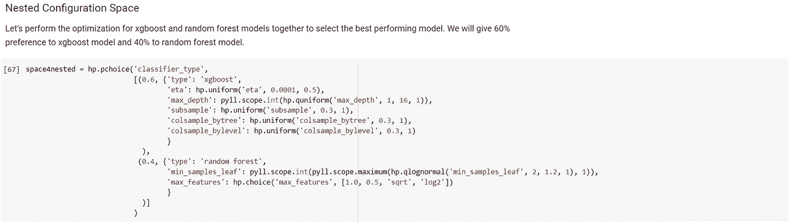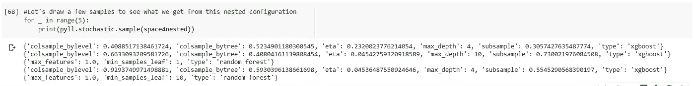

接下来，我们将为这个嵌套的配置空间创建一个目标函数。我们将用随机森林模型的中值替换 pdays 列中缺少的值。

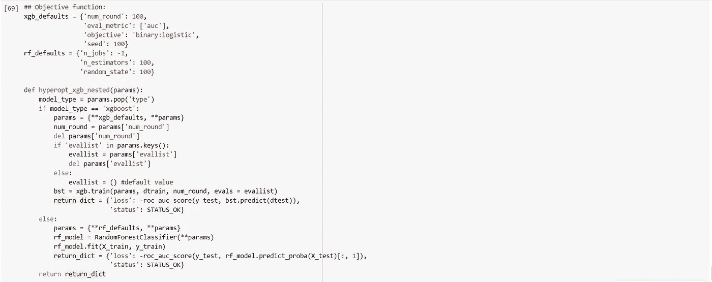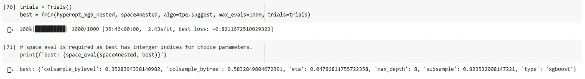

在这里找到上传[的代码文件。](https://github.com/Rakeshsuku/Medium-Blog)

## 参考

1.  伯格斯特拉，詹姆斯和巴登内，r .和凯格尔，巴拉兹和本吉奥，Y..(2011).超参数优化算法。
2.  Hyperopt:用于优化机器学习算法的超参数的 Python 库
3.  [威尔·科尔森对机器学习的贝叶斯超参数优化的概念性解释](https://towardsdatascience.com/a-conceptual-explanation-of-bayesian-model-based-hyperparameter-optimization-for-machine-learning-b8172278050f)
4.  [Kris Wright 的超视参数调谐](https://districtdatalabs.silvrback.com/parameter-tuning-with-hyperopt)