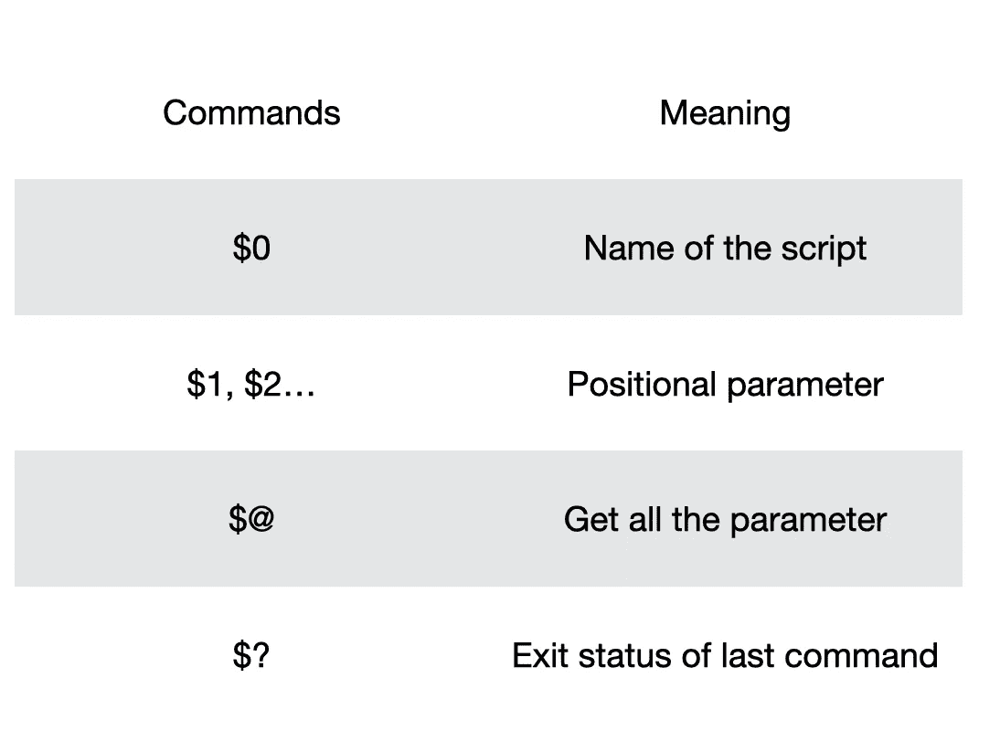

# Bash 脚本简介— 3

> 原文：<https://medium.com/analytics-vidhya/introduction-to-bash-script-3-1b2dcf26eebd?source=collection_archive---------35----------------------->

在 bash 脚本中引入退出代码、特殊参数和函数。


# 内容

1.  **退出代码**
2.  **特殊论证**
3.  **功能**
4.  **总结**

# **退出代码**

**退出代码**用于显示 Unix 系统中的进程状态。例如，如果**退出代码**为 0，则表示流程执行成功。否则，会有一些错误。事实上，退出代码**的范围是从 0 到 255** ，它对所有代码都有不同的含义。但是我们可以把它们分成两类——成功和失败。

同样，使用退出代码可以**立即终止进程**，例如:

```
#!/bin/bashecho "Hello"
exit(0) # Exit here
echo "World" # Won't be executed
```

注意到“世界”不会被打印在屏幕上，因为它前面有 exit 语句。

我们可以自己设置退出密码。这里有一个例子:

```
#!/bin/bashTEST=1if [[ ${TEST} -eq 1 ]] 
then
  echo "Success"
  exit 0
elif [[ ${TEST} -eq 2 ]]
then
  echo "Fail"
  exit 1
else
  echo "Fail fail!"
  exit 2
fi
```

在下一个主题中，我们将讨论如何在屏幕上打印出**退出状态**。

# 特殊参数

特殊的自变量可以帮助我们获得一些信息，比如参数、退出状态或最后的命令。下面是特殊参数的表格:



*   **$0，$1，$ 2……**

仍然有很多特殊的论点，我们知道先试着了解这些。让我们关注第一个和第二个命令。如果我们想得到用户提示的参数，我们可以使用$1，$2…

```
#!/bin/bash# Print out the name of the file
echo "${0} is executed."# Print out the arguments we catch
echo "The first argument is ${1}."
echo "The second argument is ${2}."
```

假设我们只想捕捉两个参数:

```
./test.sh Hello World./test.sh is executed.
The first argument is Hello.
The second argument is World.
```

从第一行，我们可以观察到”。/"已经包含到＄0 中。事实上，$0 从用户输入的路径中获取名称。

```
~/Desktop/test.sh/Users/justin/Desktop/test.sh is executed.
The first argument is Hello.
The second argument is World.
```

如果我们只想得到文件名，我们可以使用`baseline`命令。

```
echo "$(basename ${0}) is executed" # Get the file name only
```

现在，我们可以试试

```
~/Desktop/test.shtest.sh is executed.
The first argument is .
The second argument is .
```

*   **$@**

现在我们继续讨论 **$@。**如果我们想从用户那里获得参数，而不知道它们的数量，我们可以使用$@来获得所有参数。

```
#!/bin/bashALL=$@for para in $@
do
  echo "${para}"
done
```

现在输入参数:

```
./test.sh 1 2 3 4 5 6 7 8 9 10 111
2
3
4
5
6
7
8
9
10
11
```

*   **$？**

如果我们想检查一些命令是否正常运行，但不是语法错误，我们可以使用`if`和`$?`来检查。让我们看看`$?`是如何工作的:

```
#!/bin/bashtrue # exit status is 0
echo $? # echoes 0
false # exit status is 1
echo $? # echoes 1
```

这是输出

```
./test.sh0
1
```

让我们把`if`和`$?`结合起来:

```
#!/bin/bashtrueif [[ $? -eq 1 ]]
 then
   echo "Fail!"
   exit 1
fiecho "Success!"
```

以下是输出:

```
./test.shSuccess!
```

如果我们将**变为真**变为**假，**我们将得到:

```
./test.shFail!
```

我们已经比较熟悉特殊的参数了！虽然有更多的特殊论点，但这些是我们首先要知道的基本东西。

# 功能

函数是重用代码的好方法。假设我们想在一个序列中找到一个最大值，最好是写一个函数，而不是每次遇到都写。简单来说，写函数可以帮助我们实现干(不要重复自己)原则！这是我们做的模板:

```
function [funciton_name] {
  commands...
}
```

如果我们想调用这个函数，我们应该这样使用:

```
[function_name] args1, args2, ...
```

注意函数名后面没有括号！让我们首先不带任何参数地尝试这个函数:

```
#!/bin/bashfunction HelloWorld {
  echo "Hello World"
}HelloWorld
```

输出:

```
./test.shHello World
```

*   **路过的争论**

现在，如果我们想把参数传递给函数，我们该如何捕捉它们呢？还记得我们如何使用特殊的参数从用户那里获取参数吗？函数也是这样工作的！例如:

```
#!/bin/bashfunction HelloWorld {
  echo "Hello ${1}"
}HelloWorld Justin
```

输出:

```
./test.shHello Justin
```

因此我们可以用同样的方法来实现多个参数！

*   **返回值**

在大多数编程语言中，函数会有返回值。然而，bash 不支持这些东西，尽管它仍然有使用的**返回语法。此处的返回是返回**状态码**与退出相同，但用于该功能。例如:**

```
#!/bin/bash
function HelloWorld {
  VALUE=${1} # Set the value from input if [[ VALUE -eq 1 ]]
  then
    return 5 # Return status code not the value
  fi return 0 # Return status code not the value
}HelloWorld 1if [[ ${?} -eq 5 ]] # Use ${?} to get the recent status code
then
  echo "Get 1"
else
  echo "Others"
fi
```

输出:

```
./test.shGet 1
```

让我们来看看细节:

1.  从输入中获取值(在程序中为 1)
2.  检查值是否为 1，并将状态代码设置为 5，否则为 0
3.  使用 **${？}** 查看**最近的状态码**，如果状态码设置为 5，则输出“Get 1”

现在，我们可以知道返回是如何工作的了！

*   **范围**

作用域是可以看到变量的地方。默认情况下是全局的，这意味着脚本的每个部分都可以共享相同的变量。然而，如果其他部分无意中修改了变量，这可能是危险的。为了将变量改为局部变量，我们可以在变量名称前加上**局部**修饰符:

```
local [Name]=[Value]
```

让我们看看没有本地的例子:

```
#!/bin/bash
function HelloWorld {
  TEST="HELLO" # Global
}echo "${TEST}" # TEST doesn't be created before execute functionHelloWorld # TEST be created nowecho "${TEST}"
```

输出:

```
./test.sh HELLO
```

注意**测试**直到函数调用才被创建。

```
#!/bin/bash
function HelloWorld {
  local TEST="HELLO" # Global
}echo "${TEST}" # TEST doesn't be created before execute functionHelloWorld # TEST be created but locallyecho "${TEST}" # Couldn't find TEST
```

输出:

```
./test.sh 
```

事实上，如果我们将函数中的变量设置为局部变量，那么函数和全局变量就可以同名。

```
#!/bin/bash
 function HelloWorld {
   local TEST="HELLO" # Global
 }TEST="WORLD"echo "${TEST}" # Get the TEST from global sectionHelloWorld # local TEST be created but wouldn't affect global TESTecho "${TEST}" # Still get the global TEST
```

输出:

```
./test.shWORLD
WORLD
```

就像我之前提到的，使用`local`确实可以帮助我们在调试时避免大量的错误！

# 摘要

今天，我们已经学习了如何使用退出代码来警告用户或测试输出，以及获取位置参数的特殊参数。此外，我们使用函数来存储我们可能反复获得的任务。最后但同样重要的是，我们将范围集中在局部和全局，以及如何避免误用它们。如有问题，欢迎留言评论。感谢阅读！