# 时间序列分析的基本统计方法介绍

> 原文：<https://medium.com/analytics-vidhya/introduction-to-basic-statistical-approach-for-time-series-analysis-a6e24b2d93b9?source=collection_archive---------6----------------------->

# 为什么要进行时间序列分析？

我们经常看到的许多事情往往遵循一种惯例。而且，这个套路往往取决于时间，随时间而变。例如，某一天看电影的人数。你认为这取决于时间吗？

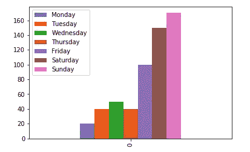

在当地电影院看电影的人数

好吧，让我们看看从周一到周五工作的人，这是人口的主要部分，我们可以假设从周一早上到周五中午，较少的人会去剧院和电影院看电影。而且，我们会在周末看到很多人。我们能够记下这些，因为我们有一些关于人们工作趋势的信息。

同样的模式每周都会重复。我们刚刚做的是一个基于我们已有知识的时间序列分析。同样，我们将在本博客的其余部分使用一些惊人的统计方法。

# 我们在哪里看到时间序列？

时间序列数据的分析非常重要，因为 data analyst 经常会遇到这类数据。它可能是股票市场预测，电子商务网站的销售数量或预测趋势。

所有这类数据都随时间而变化，为了进行正确的预测和更好的分析，了解它们与时间的相关性是很重要的。今天，我们将看看一些基本的方法，这些方法使用简单但惊人的统计思想来预测时间序列数据。

出于此分析目的，我们将使用由 Kaggle 引入的 [M5 预测准确度](https://www.kaggle.com/c/m5-forecasting-accuracy/data)数据作为竞赛。要了解更多关于这些数据的探索性数据分析部分，请阅读本主题的[上一篇文章](/@choudhary3296mansi/how-to-guide-on-exploratory-data-analysis-for-time-series-data-34250ff1d04f)。

 [## 时间序列数据探索性数据分析指南

### 为什么要进行探索性数据分析？

medium.com](/analytics-vidhya/how-to-guide-on-exploratory-data-analysis-for-time-series-data-34250ff1d04f) 

# 方法 1:移动平均法:

对时间序列数据进行预测的最简单方法之一是移动平均法。假设您有过去 30 天*的“ ***产品 _a”的销售数据。****

*现在你想对未来 30 天做一个预测。因此，一个简单的方法是计算过去 30 天的平均销售额，并将该值赋予 ***day_31*** 。现在，对于 ***day_32*** 你需要找到从 ***day_2*** 到 ***day_31*** 的平均销售额，对于 ***day_33*** 从 ***day_3*** 到 ***day_32*** 的平均销售额，以此类推。*

*这是一个简单而天真的方法，而且非常有效。让我们试着将同样的方法应用于 M5 预测精度数据。*

*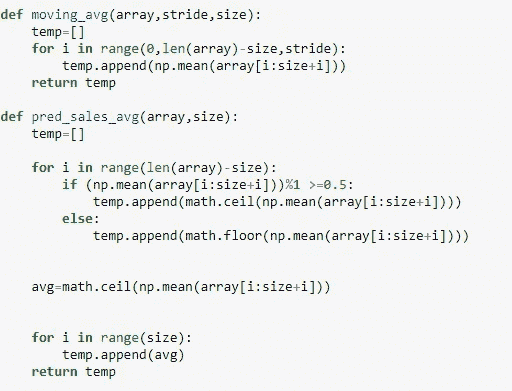*

*应用移动平均的代码段*

*也可以使用 Python 中的[滚动函数](https://pandas.pydata.org/pandas-docs/stable/reference/api/pandas.DataFrame.rolling.html)。上面的代码片段会让你对我们正在计算的东西有一个基本的了解。现在，在我们计算之后，我们总是需要知道，这个方法是如何工作的。*

*为此，我随机选择了一些产品。我现在将移动平均线技术应用到这些产品上，看看它们的表现如何。这里我使用的窗口大小为 20。您可以尝试不同的窗口大小，看看您的模型表现如何。*

*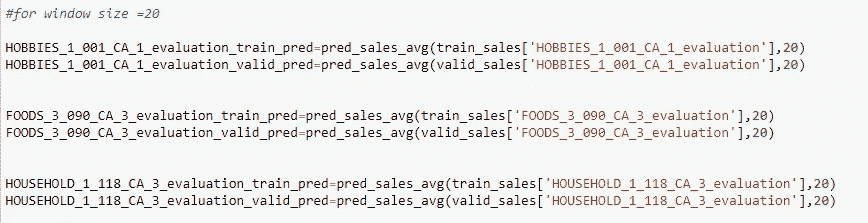*

*应用窗口大小为 20 的移动平均的代码段*

*当我们绘制实际的 v/s 预测结果时，我们得到的是:*

*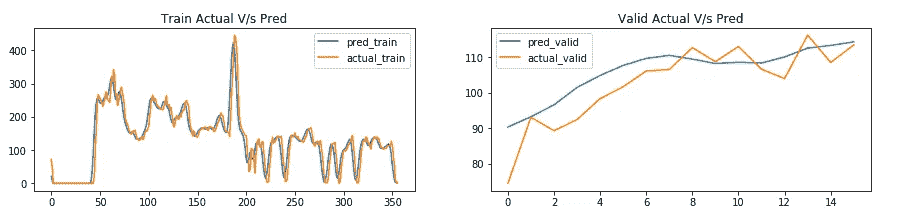*

***食品实际 V/s 预测结果 _ 3 _ 090 _ CA _ 3 _ 评价***

*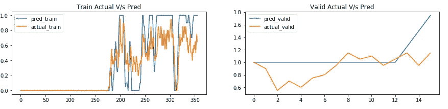*

***兴趣爱好实际 V/s 预测结果 _ 1 _ 001 _ CA _ 1 _ 评价***

*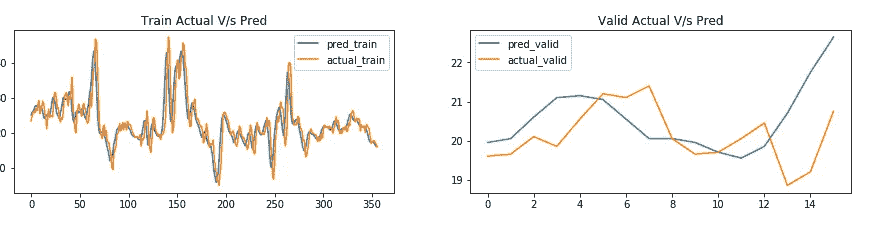*

***家庭实际 V/s 预测结果 _ 1 _ 118 _ CA _ 3 _ 评估***

# *观察结果:*

1.  *对于***FOODS _ 3 _ 090 _ CA _ 3 _ evaluation***我们看到我们的实际值和预测值有相当程度的重叠。在这种情况下，移动平均线技术相当好用。*
2.  *对于 ***爱好 _ 1 _ 001 _ CA _ 1 _ 评价*** 预测值偏离实际值。此外，移动平均线无法捕捉波动模式。*
3.  ****户 _ 1 _ 118 _ CA _ 3 _ 评价*** 预测值与实际值有偏差，但不是很大。或多或少他们预测和实际值的曲线图。*
4.  *因此，在某些情况下，移动平均线技术能够发现模式，但在某些情况下却不能。但是可以肯定地说，这是任何容易实现和快速的方法。我们可以以此为基准，看看其他方法的表现如何。*

# *方法二:霍尔特·温特线性法:*

*这是另一种流行的方法，基于在数据中寻找季节性趋势的概念。在这个方法中，我们定义了两个参数***α***和***β***。基于这些参数，我们计算两个值，它们的总和给出了最终结果。*

*在这里，我们计算两个变量 ***Lt*** 和 ***Bt*** ，这两个变量捕捉了我们数据中的季节性。这两个变量共同给出了我们的预测值。其公式如下:*

*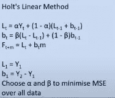*

***霍尔特·温特的平均公式***

*要更详细地了解它的实现，请查看这个惊人的 [youtube 视频。它帮助我获得了 Holt Winter 方法的直觉，我希望它也能帮助你。](https://www.youtube.com/watch?v=zBD9AlD4AbY&t=274s)*

*现在，让我们看看如何将它应用于您的数据:*

*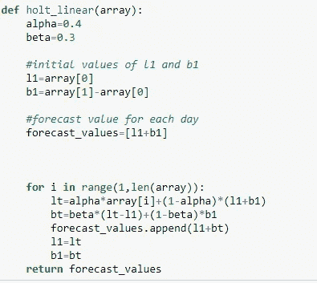*

*霍尔特·温特方法的代码片段*

*你可以使用不同的 ***alpha*** 和 ***beta*** 值，选择一个给你最好度量的值。将它应用到我们的数据集后，我们得到了以下结果:*

*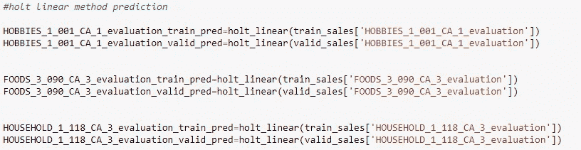*

*将 Holt Winter 的方法应用于少数随机选择的产品的代码片段*

*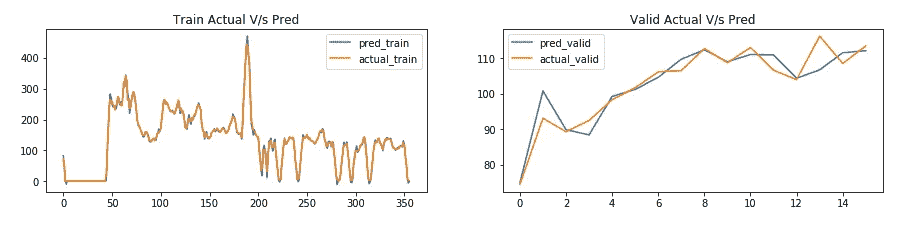*

***食品实际 V/s 预测结果 _ 3 _ 090 _ CA _ 3 _ 评价***

*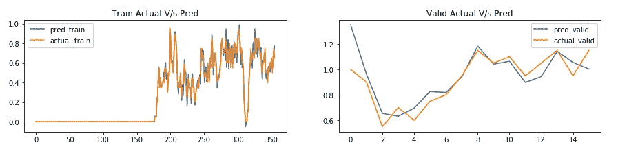*

***兴趣爱好实际 V/s 预测结果 _ 1 _ 001 _ CA _ 1 _ 评价***

*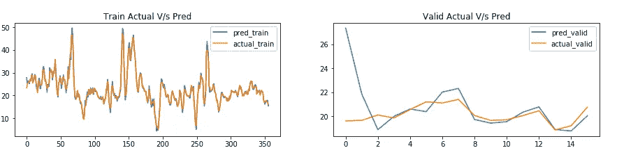*

***家庭实际 V/s 预测结果 _ 1 _ 118 _ CA _ 3 _ 评估***

# *观察结果:*

1.  *对于***FOODS _ 3 _ 090 _ CA _ 3 _ evaluation***我们看到，与移动平均相比，我们的实际值和预测值重叠得更多。*
2.  *对于 ***爱好 _ 1 _ 001 _ CA _ 1 _ 评价*** 预测值不偏离实际值。与移动平均技术不同，我们可以看到一个更好的结果。*
3.  *对于 ***户 _ 1 _ 118 _ CA _ 3 _ 评估*** 预测值几乎与实际值重叠。虽然，开头有点偏差。*
4.  *因此，与移动平均线相比，Holt Winter 的方法表现良好。在这里，我们可以通过调整 ***alpha*** 和 ***beta*** 的值来进一步提高性能。*

# ***方法三:指数平滑***

*从上面两种方法中，我们看到移动平均线窗口的表现并不是很好。其中一个主要原因是，在计算移动平均值时，我们给了所有值相同的权重。*

*因此，我们的预测很容易受到异常值的影响。这可以通过使用[指数平滑](https://en.wikipedia.org/wiki/Exponential_smoothing)来防止。这里的想法是在计算平均值时为不同的值提供不同的权重。*

*这使得我们的数据容易出现异常值。此外，它有助于数据捕捉趋势，从而提供更好的结果。*

*在这种情况下，我们只定义一个参数 ***alpha*** 。alpha 的值可能因数据而异。指数平滑的公式如下:*

*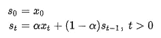*

*正如您可以看到的，随着时间的推移，我们对最近查看的值增加了更多的权重，而对之前查看的值减少了权重。因此，这能够捕捉我们数据中隐藏的趋势和方法。*

*现在，让我们看看如何将它应用到我们的模型中:*

*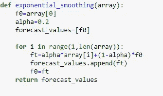*

*指数平滑的代码片段*

*现在，让我们将此方法应用于数据集中的几个产品，看看我们的模型表现如何:*

*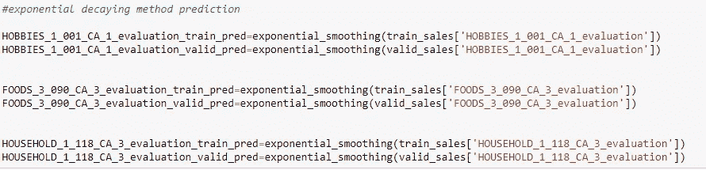*

*对数据集应用指数平滑的代码段*

*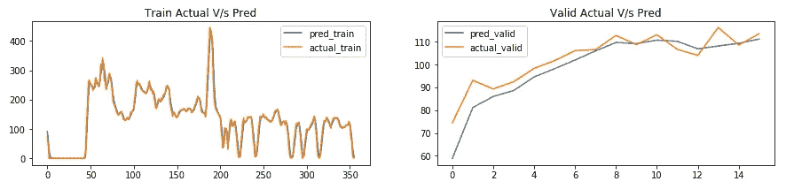*

***食品实际 V/s 预测结果 _ 3 _ 090 _ CA _ 3 _ 评估***

*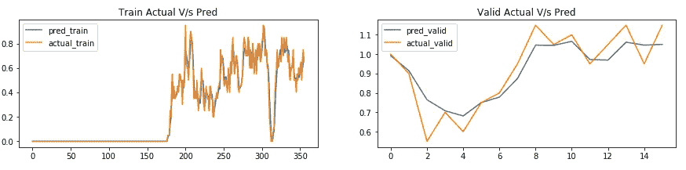*

***兴趣爱好实际 V/s 预测结果 _ 1 _ 001 _ CA _ 1 _ 评价***

*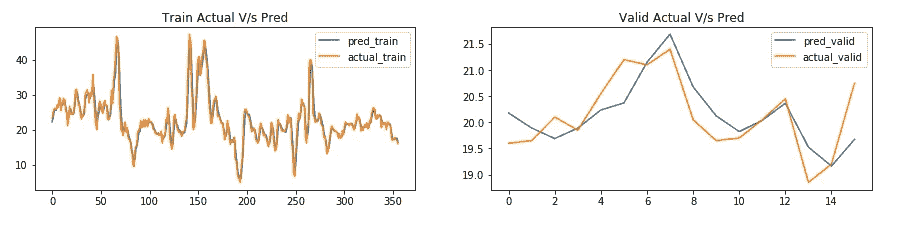*

***家庭实际 V/s 预测结果 _ 1 _ 118 _ CA _ 3 _ 评估***

# *观察结果:*

1.  *对于***FOODS _ 3 _ 090 _ CA _ 3 _ evaluation***我们看到我们的实际值和预测值几乎遵循相同的模式。*
2.  *对于 ***爱好 _ 1 _ 001 _ CA _ 1 _ 评价*** 预测值不偏离实际值。此外，你会注意到结果证明比霍尔特温特的方法更好。*
3.  *对于 ***住户 _ 1 _ 118 _ CA _ 3 _ 评估*** 预测值与实际值几乎重叠。此外，Holt Winter 的方法和移动平均线技术中出现巨大偏差的开始模式似乎已经消失。*
4.  *因此，与移动平均线和霍尔特·温特的方法相比，指数平滑法似乎表现得非常好。这里，我们可以通过调整 ***alpha*** 的值来进一步提高性能。*

# *结论:*

*我们刚刚看了三种简单的预测统计方法。最棒的部分是我们没有使用内置库，而是从头开始做的。这让我们对它的表现有了一个概念。要获得完整的代码，请查看我的 [github 库](https://github.com/mansi2596/Kaggle-M5-Forecast-Accuracy-Data)。*

# ***参考文献:***

1.  *[https://www . Applied ai course . com/course/11/Applied-Machine-learning-course](https://www.appliedaicourse.com/course/11/Applied-Machine-learning-course)*
2.  *[https://www . ka ggle . com/tarunparaju/M5-competition-EDA-models/output](https://www.kaggle.com/tarunpaparaju/m5-competition-eda-models/output)*
3.  *[https://mobi dev . biz/blog/machine-learning-methods-demand-prediction-retail](https://mobidev.biz/blog/machine-learning-methods-demand-forecasting-retail)*
4.  *[https://www . mygreatlearning . com/blog/how-machine-learning-is-use-in-sales-forecasting](https://www.mygreatlearning.com/blog/how-machine-learning-is-used-in-sales-forecasting/)/*
5.  *[https://medium . com/@ chun duri 11/deep-learning-part-1-fast-ai-rossman-notebook-7787 bfbc 309 f](/@chunduri11/deep-learning-part-1-fast-ai-rossman-notebook-7787bfbc309f)*
6.  *[https://www . ka ggle . com/anshuls 235/time-series-forecasting-EDA-Fe-modeling](https://www.kaggle.com/anshuls235/time-series-forecasting-eda-fe-modelling)*
7.  *[https://eng.uber.com/neural-networks/](https://eng.uber.com/neural-networks/)*
8.  *[https://www . ka ggle . com/Mayer 79/M5-forecast-keras-with-category-embedding-v2](https://www.kaggle.com/mayer79/m5-forecast-keras-with-categorical-embeddings-v2)*