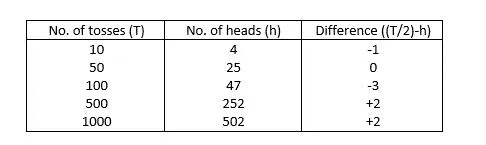
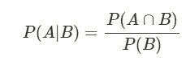
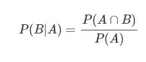
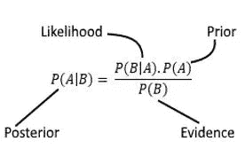
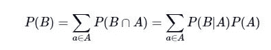
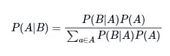

# 数据科学和分析的贝叶斯统计简介(第 1 部分)

> 原文：<https://medium.com/analytics-vidhya/introduction-to-bayesian-statistics-for-data-science-and-analytics-part-1-93e38d67fab5?source=collection_archive---------2----------------------->

多年来，随着数据的指数级增长，数据科学领域变得越来越重要。基础数学概念和统计学的坚实基础对于掌握数据科学和分析至关重要。贝叶斯统计是所有数据科学和分析专业人士的必备知识，因为数据科学深深植根于贝叶斯方法。

在本文中，我们将探讨:

1)什么是贝叶斯统计？

2)贝叶斯统计与频率主义(经典)统计

3)贝叶斯定理

下一篇文章(第 2 部分)将讨论贝叶斯推理以及贝叶斯统计在数据科学和分析中的各种应用。

**1。什么是贝叶斯统计？**

贝叶斯统计是一种数学方法，涉及应用概率(主要是条件概率)来解决统计问题。

这种方法包括对事件最初的“先验”信念(或概率),当通过数据收集出现新的证据时，信念会更新。这导致形成贝叶斯推理基础的“后验”信念。通常，人们倾向于忽略事件的先验概率，而总是考虑后验概率。

在我们真正深入研究贝叶斯统计之前，让我们简单地讨论一下频率统计，更流行的统计版本，以及这两种统计哲学之间的区别。

**2。贝叶斯统计与频率主义(经典)统计**

首先，我们必须认识到这两种可选方法之间只有一线之隔。

**a)什么是频率主义者(经典)统计学？**

这是统计学中应用最广泛的推断方法。

根据 Frequentist 方法，一个事件的概率是该特定事件在实验的长期运行中出现的频率(即，它涉及在相同条件下的重复试验)。

让我们考虑抛硬币的例子，以确定它是否公平。(理论上，该实验应该重复无限次，但实际上它只能重复大量(有限)次)。

下表显示了正面和反面的频率

我们可以断定这是一枚公平的硬币，因为得到正面的概率是 0.5。

从这一观察可以明显看出，实验的结果取决于实验重复的次数。这是频率主义方法的一个主要缺点。

**b)频率主义者和贝叶斯方法的区别**

我们已经看到，频率主义者对概率的定义是基于同一实验重复多次时事件发生的长期频率。这与贝叶斯定义相反，根据贝叶斯定义，概率是通过对特定结果的可能性的信念来衡量的。

在某些情况下，一种方法比另一种更有意义。常客统计适用于诸如抛硬币、掷骰子、从一副牌中选一张牌等事件。随机的和可重复的，而贝叶斯方法允许分配概率给既不是随机的也不是可重复的事件。例如，根据贝叶斯方法，给像乔·拜登赢得 2020 年美国总统大选这样的事件分配一个概率是可以接受的。但是，如果遵循频繁主义的方法，这将没有多大意义，因为我们不能进行重复的试验(候选人只在这次选举中竞争一次)，除非我们进行虚拟试验。

贝叶斯方法的一个主要优点是，它在应用贝叶斯规则计算概率时考虑了先验知识。

我们大多数人都熟悉概率中的贝叶斯定理。让我们更深入地研究这个概念。

**3。贝叶斯定理**

**a)条件概率**

很好地掌握条件概率的概念对于理解贝叶斯定理是必不可少的。

条件概率是一个事件 A 的概率，假定另一个事件 B 已经发生。这由 P(A|B)表示，可以定义为:

其中 P(B) ≠ 0

例如:在一个纸牌游戏中，假设一个玩家需要抽一张黑牌，这张黑牌是一张王，这样他才能赢。假设莉莉抽到了一张黑牌。她赢得这场比赛的概率有多大？

解决方案:

P (A ∩ B) = P(获得黑牌为王)= 2/52

P(B) = P(挑黑牌)= 1/2

因此，P(A|B) = 4/52。

**b)什么是贝叶斯定理？**

让我们考虑以下等式:

和

从这两个方程，我们可以得出结论:

这是贝叶斯定理。

这里，

先验(事件 A 发生的概率)是指我们所持有的先入为主的信念。

可能性(假设事件 A 为真，事件 B 为真的概率)指的是假设我们的先验为真，观察到我们所做的事情的概率。

后验(在事件 B 已经发生的情况下，A 发生的概率)指的是基于已经观察到的情况的更新后的先验。

我们实际上可以写作

这可以代入贝叶斯定理，得到另一个版本，在贝叶斯推理中应用很多:

**举例:**贝叶斯分析经常使用的一种情况是你邮件服务器中的垃圾邮件过滤器。邮件会被仔细检查是否出现关键字，这些关键字使邮件很可能是垃圾邮件。想象一下，垃圾邮件的证据是邮件的主题消息包含句子“检查一下”。我们定义事件:

S 表示该邮件是垃圾邮件。

C 表示主题行包含句子“检查一下”。

当 40%的电子邮件是垃圾邮件，1%的垃圾邮件在主题行中有“检查这个”,而 0 .4%的非垃圾邮件在主题行中有这句话时，计算条件概率 P(S|C)。

**解法:**利用贝叶斯公式，

*P(S|C) = P(C|S)。P(S) / P(C)*

现在我们有 P(S) = 0.4，P(C|S) = 0.01。

*P(C) = P(C|S)。P(S) + P(C|S ')。p(S ')*= 0.01 x 0.4+0.004 x 0.6 = 0.0064 其中 S '代表事件，表示该消息不是垃圾邮件。

因此，P(S | C)= 0.01 x 0.4/0.0064 = 5/8 = 0.625

*我很快会带着下一篇文章(第 2 部分)回来，讨论贝叶斯推理以及贝叶斯统计在数据科学和分析中的各种应用。*