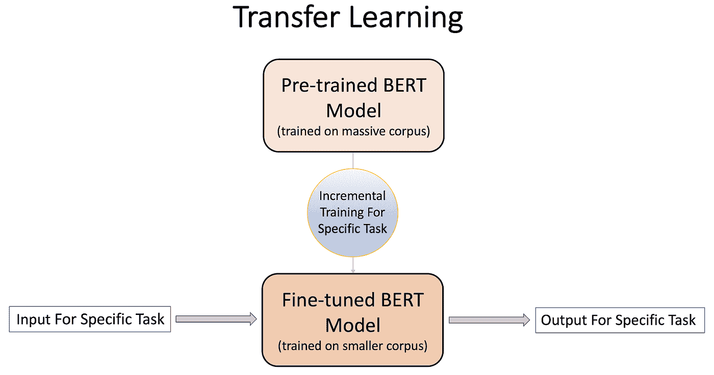

# 使用 BERT 回答问题

> 原文：<https://medium.com/analytics-vidhya/introduction-to-bert-f9aa4075cf4f?source=collection_archive---------8----------------------->

## 开始将 BERT 语言模型应用于您自己的业务问题的实用指南。

**BERT** ，*来自 Transformer 的双向编码器表示，*是 Google 推出的最先进的语言模型，可用于尖端的自然语言处理(NLP)任务。

阅读完本文后，您将对 BERT 有一个基本的了解，并将能够在您自己的业务应用程序中使用它。如果你熟悉 Python，对机器学习有个大概的了解，会很有帮助。

我将在本文中介绍的 BERT 模型有:

*   二元或多类分类
*   回归模型
*   问答应用程序

**伯特简介**

BERT 是在整个维基百科(约 25 亿字)以及一本书的语料库(约 8 亿字)上接受训练的。为了利用 BERT，您不必重复这个计算密集型过程。

BERT 以一种前所未有的语言模型的方式将迁移学习方法引入自然语言处理领域。

**迁移学习**

迁移学习是一个过程，其中为一般任务开发的机器学习模型可以被重用为特定业务问题的起点。

假设你想教一个叫阿曼达的人如何参加 SAT 考试，她不会说英语。第一步是尽可能彻底地教阿曼达英语。然后，你可以针对 SAT 更具体地教她。

在机器学习模型的背景下，这种想法被称为迁移学习。迁移学习的第一部分是前期训练(类似于第一次教阿曼达英语)。预培训完成后，你可以专注于一项具体的任务(比如教阿曼达如何参加 SAT 考试)。这是一个称为微调的过程，即改变模型，使其适合您的特定业务问题。

**伯特预培训**

这是关于 BERT 培训前流程的快速介绍。出于实用目的，您可以使用预先训练的 BERT 模型，而不需要执行此步骤。

BERT 接受两个文本块作为输入。在上面的简化示例中，我将这两个输入称为句子 1 和句子 2。在针对 BERT 的预训练中，在大约一半的训练示例中，句子 2 故意不跟随句子 1。

第一句以一个特殊符号[CLS]开始，两句都以另一个特殊符号[SEP]结束。BERT 词汇表中的每个单词都有一个标记。如果一个单词不在词汇表中，BERT 会把这个单词分成多个记号。在给伯特输入句子之前，15%的标记被屏蔽。

预训练过程是迁移学习的第一步，就像按照 BERT 模型教授英语，以便它可以用于各种需要英语知识的任务。这是通过给 BERT 的两个练习任务来完成的:

1.  预测屏蔽(隐藏)令牌。为了说明，单词“favorite”和“To”在上图中被屏蔽了。作为预训练的一部分，BERT 将尝试预测这些屏蔽的令牌。这类似于我们给正在学习英语的学生布置的“填空”任务。当学生试着填入所缺的单词时，他会学习这门语言。这被称为掩蔽语言模型(MLM)。
2.  BERT 还试图预测句子 2 在逻辑上是否跟在句子 1 后面，以便更深入地理解句子依存关系。在上面的例子中，句子 2 是句子 1 的逻辑延续，所以预测是正确的。输出端的特殊标记[CLS]用于此任务。

BERT 预训练模型有许多变体。最常见的是 BERT Large 和 BERT Base:

**伯特微调**

微调是迁移学习的下一部分。对于特定的任务，如文本分类或问答，您可以在小得多的数据集上执行增量训练。这将调整预训练模型的参数。

## **用例**

为了展示 BERT 的实际用途，我在下面提供了两个例子。GitHub 和 Google Colab 中都提供了代码和文档。您可以使用这两个选项中的任何一个来跟随并亲自尝试一下！

1.  **文本分类或回归**

这是 tweets 二进制分类的样本代码。这里我们有两种类型的推文，与灾难相关的推文(target = 1)和正常推文(target = 0)。我们微调了 BERT 基本模型，将推文分为这两类。

GitHub:[https://github.com/sanigam/BERT_Medium](https://github.com/sanigam/BERT_Medium)

Google Colab:[https://Colab . research . Google . com/drive/1 arh 9 dnugvukjrtnorkivrgrkitjg 051 c？usp =分享](https://colab.research.google.com/drive/1ARH9dnugVuKjRTNorKIVrgRKitjg051c?usp=sharing)

通过使用函数 *bert_model_creation()* 中的适当参数值，该代码可用于多类分类或回归。代码提供了参数值的详细信息。如果您愿意，可以在此函数中添加额外的密集层。

**2。用于问答的 BERT**

这个是 BERT 的另一个有趣的用例，在这里您向 BERT 模型中输入一段话和一个问题。它可以根据文章中给出的信息找到问题的答案。在这段代码中，我使用的是 BERT 大模型，该模型已经在斯坦福问答数据集(SQuAD)上进行了微调。你将看到如何使用这个微调的模型从给定的段落中得到答案。

GitHub:[https://github.com/sanigam/BERT_QA_Medium](https://github.com/sanigam/BERT_QA_Medium)

Google Colab:[https://Colab . research . Google . com/drive/1 zpevygqjw 3 o 2 olg 1k zulnybxzmv 1 gpkk？usp =共享](https://colab.research.google.com/drive/1ZpeVygQJW3O2Olg1kZuLnybxZMV1GpKK?usp=sharing)

此使用案例的示例:

*“约翰是一个 10 岁的男孩。他是罗伯特·史密斯的儿子。伊丽莎白·戴维斯是罗伯特的妻子。她在加州大学伯克利分校教书。索菲娅·史密斯是伊丽莎白的女儿。她就读于加州大学戴维斯分校"*

问题— *“约翰的妹妹上哪所大学？”*

当这两个输入被传入时，模型返回正确的答案*“UC Davis”*

这个例子证明了 BERT 可以理解语言结构，处理跨句子的依赖关系。它可以应用简单的逻辑来回答问题(例如，找出约翰的妹妹是谁)。请注意，你的文章可以比上面的例子长得多，但是问题和文章的总长度不能超过 512 个单词。如果你的文章超过这个长度，代码会自动截断多余的部分。

除了上面显示的例子之外，代码还提供了一些例子，总共有 3 篇文章和 22 个问题。其中一段是我的伯特文章的一个版本。你会看到伯特问答能够回答任何能从文章中得到答案的问题。您可以为自己的问答应用程序定制代码。

希望这为您在自己的实际应用中使用 BERT 提供了一个良好的开端。如果您有任何问题或反馈，请随时告诉我！