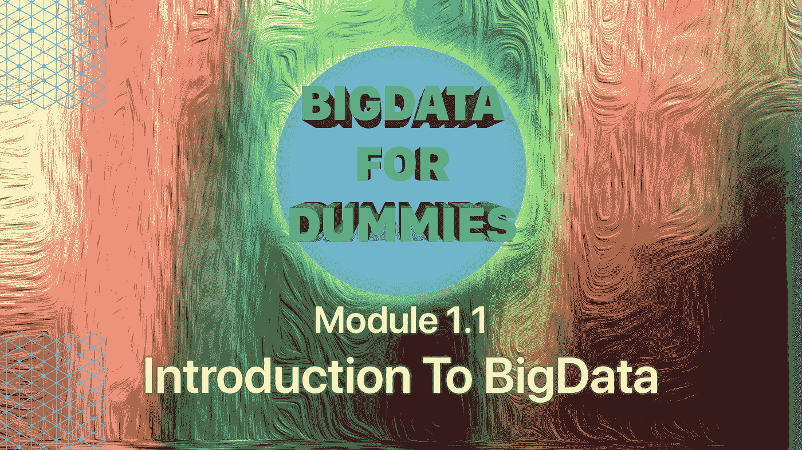

# 面向虚拟对象的“大数据入门”[模块 1.1]

> 原文：<https://medium.com/analytics-vidhya/introduction-to-bigdata-for-dummies-module-1-1-9e3eea6e65f?source=collection_archive---------29----------------------->

数据是这个星球上最有价值的资源，有没有想过了解价值数 Pb 的数据是如何处理的？有没有想过创建自己的应用程序来学习和管理电脑上的数据？我们走吧。

嘿伙计们，我是拉胡尔。我是一名技术爱好者，计算机科学毕业生，对软件开发充满热情。我也用我的 YouTube 用户名“TheFlopGuy”。

**如果你来这里纯粹是为了求知，给自己留点时间，直接跳到主题** [**这里**](#d65f) **！**

> *如果您对较少的信息和较少的阅读感到满意，请在此处观看本模块的视频！【即将推出】*

如果你还在读这篇文章，让我让它…对你来说不无聊。我相信软件开发类似于发展世界各地人类之间的关系。现在把人类这个词换成计算机。如果我说，学习任何平台无关的语言比如 Java，Python 等。你可以与数十亿台设备进行通信？很棒吧？

现在，如果你是一个软件初学者，刚刚开始接触大数据，想要深入了解它。完美着陆。你已经到达了你应该到达的地方，那是我的令人敬畏的赛格威进入…

**欢迎来到 BigData for Dummies！**

无意冒犯，因为我自己也曾是个傻瓜。相信我，像假人一样学习是找到所有问题根源的完美方法。你真正理解一切，没有例外。厌倦了吗？好吧，让我们变得更有趣。

本课程是一门基础入门课程，旨在让您了解大数据世界的一些基本概念。

以下是每个模块的模式:

1.  **由模块号唯一标识。[例如:模块 1.1]**
2.  **每个模块都有一个博客和一个视频(彼此半独立)**
3.  **一个迷你自我评估测试(没有“注册”废话)**
4.  如果它是一个实用的模块，还有一个 GitHub 存储库，里面有我所有的代码和帮助文件，链接在 YouTube 视频描述中，还有博客的底部。
5.  **更多帮助，可以随时联系我@theflopguy，无处不在。**

本课程结束时，你将有足够的能力完成一个项目，一个创业公司会给它的数据科学家。

好吧，让我们学点东西。在所有这些模块中，我将涵盖大数据中涉及的大多数主要技术。

> **什么是技术？**

*任何与* BigData *或* BigData *处理相关联的软件称为其技术。*

我们将在本课程中介绍的一些主要技术包括:

1.  **Hadoop**
2.  **蜂巢**
3.  **火花**
4.  **Scala**

除此之外，我还将介绍一些有价值的技术，可以帮助您发送邮件、设置预定的工作等。

> **发送邮件？我知道怎么做。**

*当然，你按常规方式做。如果我告诉你，你可以直接从计算机的命令行界面发送邮件，会怎么样？或者更确切地说，如果我告诉你，你可以在你的机器上完成一个过程后给你自己发一封邮件。假设你在一个聚会上，你收到一封邮件说，“嘿，老板，你的应用程序已经开始处理数据了”？自主加工是我们正在寻找的。*

## **在我们开始之前简单介绍一下我自己**

*我知道没错，只是不能守口如瓶*

我来自这个国家印度，你肯定听说过。我希望如此。印度南部，不像听起来那么奇特，但是，嗯，有一点。我毕业于印度最好的私立理工学院之一(看起来不像是因为我毕业于这个破学校)。现在我想尽我所能分享我的知识。我是一个狂热的视频制作者，我喜欢编辑视频，照片，不仅仅是编辑，我还喜欢编程。我从*算* 13 岁开始编码。是的。2010 年。我的第一门语言是 Java 和 HTML。在我的教育过程中，我学习了 Python、C、PHP 和 C++。利用这些知识，我能够在 android studio 中创建应用程序，创建简单的 Python 应用程序来跨服务器发送消息，并稍微涉足机器学习和人工智能。然后我自学了大数据，从 Hadoop、Hive、Spark、Scala 开始。和其他花絮。我已经能够完成大数据项目的完整工作演示。稍后会详细介绍。

好了，无聊到这里，我们开始上课吧。引言。呃，讨厌主题的介绍部分。这就像一个完美的汉堡的包装纸。

# 什么是 BigData？

在我们开始之前，我们必须了解真正的术语“数据”什么是数据？嗯，可以是任何东西。照片、视频、电子邮件、语音留言、信息，任何东西。我们还必须记住，单词“数据”实际上是一个复数术语，它的单数形式是 Datum。听起来很有趣。想象一下说“我还需要 25 个数据”无论如何，这个句子可能是语法错误的。继续前进。

什么是 BigData，嗯，**是相对的**。

一个常见的误解是，BigData 是任何正常计算系统都无法处理的大量数据。嗯，没错，一般来说。你看，大数据是没有标准分类的。这是相对的。我的意思是，大数据不能被定义为“任何大于 10tb 的数据集合都是大数据”。你不是这么定义大数据的。

BigData 基本上是一个用来对一组无法处理的数据进行分类的术语。这有什么不同吗？好吧。想象一下这个场景。

一个 5 岁的孩子可能记得按时间顺序一次完成 2 或 3 项任务。但是一个成年人可能记得一次做 15 件事情。我只能勉强应付 5 个。所以，在这种情况下，一个孩子一次不能记住 3 个以上的任务。因此，对于那个孩子来说，5 个任务可以被归类为大数据，而对于一个一次可以处理 15 个任务的成年人来说。这个数字会超过 15。

回到计算机术语上来。如果一台 2GB 内存的电脑无法处理带有 30 个标签的谷歌浏览器和 adobe Photoshop 编辑 4K 图像，那么这台电脑的数据量可以被归类为大数据。而对于具有 8G RAM 和更好的处理器的计算机，相同数量的数据可以被认为是正常数据。

话虽如此。为什么使用术语“大数据”,我可以说这只是一种很酷的说法,“这超出了我的处理能力”。想象一下脸书说“我们有很多我们无法处理的数据。我们需要新的技术来处理这些数据”，然后想象一下，接着说“我们有大数据工程师来处理大数据以提高效率”，这两者的字面意思是一样的。但是，听起来很不一样。

# 传统数据处理 Vs 大数据？

## 数据架构

传统的数据管理技术使用我们称之为集中式数据库架构。基本上这意味着，有一台计算机，处理大量的数据。即使是简单的复制-粘贴过程也需要几分钟才能完成粘贴一个 100gb 的文件。想象一下那台计算机正在复制粘贴数万亿字节的文件。需要几天时间，对吗？对于像我这样没有时间价值的普通人来说，这听起来不错。但对于一家价值十亿美元的公司来说，这只是浪费时间。此外，想象一下计算机将消耗的能量，这只会增加所有的成本。

大问题是吧？那只是冰山一角。

**结构化和非结构化数据**

我们都熟悉这种数据，对吗？我希望如此。我们有语音记录、视频、信息等等。所有这些可以分为两大类。结构化和非结构化。什么是结构化数据？也许你可以猜猜看。结构化数据是具有固定格式或字段的数据。这是互联网无聊地描述它。有趣的是，结构化数据可以这样理解。

想象一个具有完美描述的模式的表。模式基本上是定义表的蓝图。

我可以编写一个应用程序，从给定的表中检索所有的名字。我可以将它存储在一个名为 names.txt 的文件中

我可以确信，该文本文件中的所有数据都只有名称。然而。想象一下，创建一个应用程序来读取文本文件。任何文本文件。不仅仅是你创造的。每个文本文件中可以有不同的数据。短文，故事，空白文件，数字。

如果我应用同样的逻辑，说，“让我们从文本文件中检索所有的第一个单词，并存储它。我不确定我只会得到名字。因为第一个单词中可能有数字，所以也可能有空值。

因此，文本文件是非结构化的。没有一个固定的格式，我可以通过它阅读。类似地
非结构化数据列表是

*   电子邮件:由于其元数据，电子邮件有一些内部结构，我们有时称之为半结构化。但是，它的消息字段是非结构化的，传统的分析工具无法读取。
*   社交媒体:数据来自脸书、推特、LinkedIn。
*   网站:YouTube，Instagram，照片分享网站。
*   手机数据:短信，位置。
*   媒体:MP3、数码照片、音频和视频文件。

传统方法只能提供对所有数据的简要了解，如“这是一张图片”或“这是一个文本文件”，但通过使用更有效的大数据处理，我们可以得到类似“这是一张狗舔冰淇淋的图片”或“这是一个包含单词‘Hello’15 次的文本文件”

## 缩放比例

缩放指的是执行计算所需的资源和服务器的需求。大数据基于横向扩展架构，在这种架构下，分布式计算方法可用于多台服务器。因此，计算负载由单个基于应用程序的系统分担。然而，在传统数据库中实现可扩展性是非常困难的，因为传统数据库运行在单个服务器上，并且需要昂贵的服务器来扩展

## 传统数据的成本更高

传统的数据库系统需要复杂而昂贵的硬件和软件来管理大量的数据。此外，将数据从一个系统转移到另一个系统需要更多的硬件和软件资源，这大大增加了成本。而在大数据的情况下，由于大量数据被隔离在各个系统之间，数据量会减少。因此，大数据的使用非常简单，利用商用硬件和开源软件来处理数据

# 大数据的特点？

只是给你的一个小序言。最初，BigData 的特点是使用了三个 V。量、速、变。然而，技术的提高导致了两个额外的 V 的增加。
因此，BigData 的 5 V 如下

## 卷

量是指每天生成的数据量。想想千兆字节、兆兆字节和千兆字节。传统系统无法存储如此庞大的数据量，更不用说处理它了。大约在 2012 年，公司处理的数据量激增，这一数据量大约每 12 个月翻一番，当然，这是大致的数字。

## 速度

速度是指创建新数据的速率。数据正以前所未有的速度涌入，必须及时处理才能从数据中获取最大价值。如果反应速度不够快，无法从数据中获益，就会出现问题。另一个相关问题是数据流往往与周期性峰值高度不一致。让我们试着简单理解一下。想象一个场景，一家公司的服务器中存储了 1tb 的有价值数据。这个池中的每一兆字节数据都比另一兆字节数据更有价值。如果出现安全漏洞，比如 10mb 数据被盗/篡改。对于计算违规位置和丢失/被操纵数据的系统，它需要具有快速响应能力，否则，数据将永远消失。

## 多样化

多样性是指从各种来源生成的各种类型的数据。例如，一个公司可以从许多不同的来源获得数据，但是这些来源的重要性取决于业务的性质。例如，一家公司可以处理视频、图片和音频，所有这些数据必须具有同等的可访问性以提高效率。

## 诚实

第四个 V 是真实性。准确性是指数据的质量。确保正在处理的数据准确无误、不遗漏任何细节非常重要。除了准确性之外，最好始终意识到这样一个事实，即正在处理的数据有一些重要的东西可以提供给企业。

## 价值

最后，第五个 V 是价值。价值是指系统将海量数据转化为业务的能力。也就是说，把一个 1tb 的装满猫照片的文件夹变成一个 10，000 美元的帝国。有可能。世界太疯狂了。

## 你准备好接受评估了吗？

[**点击这里开始竞猜**](https://docs.google.com/forms/d/e/1FAIpQLScZA25zZYCTv5negBJNg7AcMYSdiAMQRG0u3_CdBL9Q28y1CQ/viewform?usp=sf_link)

讲述完这些基本主题后，我们将结束本模块。如果你有什么不清楚的，看我的视频。如果这也没有帮助，去看看我在这个博客上保留的参考资料。如果他们还是不帮忙，请随时联系我。您可能已经知道，大数据不是一个简单的话题，其特征和定义超出了书籍的范畴，不可能在一篇博客中涵盖所有内容。但是，让我们开始吧？

如果你喜欢这个，鼓掌鼓掌，这将激励我继续这个系列。如果您有任何补充或建议，请评论并帮助我和您的读者朋友。

下一个媒体故事再见。

下一个模块已经出来了！
点击此处继续您的课程！
[模块 1.2 Hadoop 简介](/@theflopguy/introduction-to-hadoop-for-dummies-module-1-2-cdb782a776cd)

再见。

## 参考资料:

1.  [什么是 BigData？](https://www.youtube.com/watch?v=eVSfJhssXUA)
2.  [结构化 Vs 非结构化](https://www.datamation.com/big-data/structured-vs-unstructured-data.html)