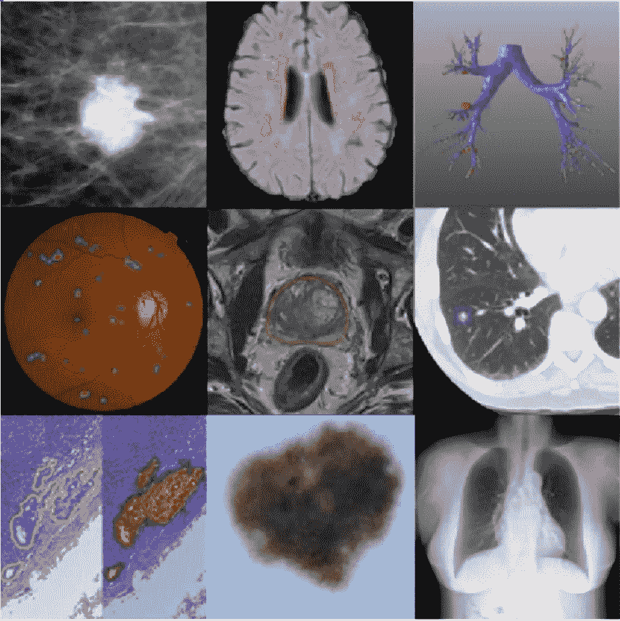

# 使用深度学习的生物医学成像介绍

> 原文：<https://medium.com/analytics-vidhya/introduction-to-biomedical-imaging-using-deep-learning-79693540a0a5?source=collection_archive---------7----------------------->

## 组块学习

来源:必应搜索

*这篇博客文章是对使用深度学习的生物医学成像的快速介绍，在这里我们将讨论人工智能(AI)将如何塑造我们的未来，并将在健康产业中带来巨大的影响和应用。深度学习有可能通过为人类专家执行分类和许多其他困难的任务，以及通过快速查看大量图像，来彻底改变疾病诊断和管理。*

注: [*中的*第二部分**](/analytics-vidhya/malaria-detection-in-blood-sample-images-using-deep-learning-b28c736c827c) *将用一个数据集深入代码并详细分析。*

***生物医学影像:***

生物医学图像是在不同尺度上对人体的测量。
(即微观、宏观等。).它们有各种各样的成像形式(例如 CT 扫描仪、超声波机等。)并测量人体的物理属性(例如，辐射密度、对 X 射线的不透明度)。这些图像由领域专家(例如放射科医师)为临床任务(例如诊断)进行解释，并且对医生的决策有很大的影响。

***深度学习可以应用的医疗子领域:***

神经、视网膜、肺、数字病理学、乳腺、心脏、腹部、肌肉骨骼。

***影像数据来源:***

*   美国:超声波
*   MR/MRI:磁共振成像
*   PET:正电子发射断层扫描
*   MG:乳房 x 线摄影
*   CT:计算机断层摄影
*   苏木精和伊红组织学图像
*   RGB:光学图像。

***医学影像的应用*** :

*   注释
*   分类
*   检测/定位
*   分割
*   登记
*   回归
*   图像重建和后处理

***数据集开始:***

*   [*视觉概念提取挑战放射学(内脏)*](http://www.visceral.eu/) *。*

几个解剖结构(如肾、肺、膀胱等)的人工注释放射数据。)从几种不同的成像模式(例如 CT 和 MR)中。它们还提供了一个云计算实例，任何人都可以使用它来开发和评估模型，并进行基准测试。

*   [*癌症影像存档。*](https://www.cancerimagingarchive.net/)

跨越各种癌症类型(例如，癌症、肺癌、骨髓瘤)和各种成像模式的癌症成像数据集。

*   **生物医学图像分析大挑战。**

*通过标准化评估标准，收集生物医学成像挑战，以便更好地比较新的和现有的解决方案。*

*   *[*美国肺影像数据库联盟影像收藏(LIDC-IDRI)*](https://wiki.cancerimagingarchive.net/display/Public/LIDC-IDRI)*

*一个诊断和肺癌筛查胸部 CT 扫描与标注病变的集合。*

*   *[*糖尿病视网膜病变*](https://www.kaggle.com/c/diabetic-retinopathy-detection)*

*糖尿病性视网膜病变是发达国家工作年龄人口失明的主要原因。据估计，超过 9300 万人受到影响。高分辨率视网膜图像，由临床医生按照 0-4 的严重程度进行注释，用于检测糖尿病视网膜病变。这个数据集是一个完整的 Kaggle 竞赛的一部分，它通常是公开可用数据集的一个很好的来源。*

*   *[*多发性硬化病变分割挑战赛 2008*](http://www.ia.unc.edu/MSseg/download.html)*

*一组用于检测多发性硬化病变的脑部 MRI 扫描。*

*   *[*多模态脑肿瘤分割挑战*](http://braintumorsegmentation.org/)*

*脑瘤磁共振扫描的大数据集。自 2012 年以来，他们每年都在扩展这个数据集和挑战。*

*继续读！！！*