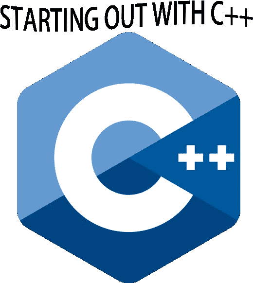

# 程序员 C++入门

> 原文：<https://medium.com/analytics-vidhya/introduction-to-c-d0e6f9efb628?source=collection_archive---------28----------------------->

# 你好世界

下面是 C++的 hello world 程序:

# 构建一个 C++程序

构建 C++程序有三个步骤:

1.  代码通过处理元信息的*预处理器*运行
2.  代码是*编译*而成的。cpp 文件被翻译成。o 目标文件
3.  单个目标文件*链接*在一起成为一个应用程序。

# 主要功能

主函数是程序开始执行的地方。它有两种风格:有参数和无参数。使用参数时，它看起来如下:

其中,`argc`给出程序的命令行参数的数量，而`argv`数组包含这些参数。实际参数从索引 1 开始。

# 输入输出流

`cout`是标准输出流，`cerr`是标准误差流。`<<`操作符允许向流中添加数据。`std::cin`输入流
获得来自用户的输入。这里有一个例子:

# 名称空间

名称空间用于解决不同代码之间的命名冲突问题。例如，第三方库可能具有与您定义的名称冲突的符号。您可以将代码放在单独的命名空间中，以避免命名冲突。

使用范围解析操作符`::`来指定名称空间，比如`myspecialcode::foo();`。一个`using`声明可以用来引用一个名称空间中的一个项目。比如`using std::cout`。

# 文字

文字用于在 C++代码中书写数字或字符串。例子如下

*   十进制 123
*   八进制 0123
*   十六进制 0x137
*   二进制 0b1010001
*   浮动 3.14f
*   双 3.14
*   字符“A”
*   零/空终止的字符数组“字符串数组”

# 变量

变量在使用前必须声明为。它们可以在同一个语句中声明和定义。C++中一些常见的变量类型如下:

*   int，无符号 int(通常为 4 个字节)
*   短(通常为 2 字节)
*   长型(通常为 4 个字节)
*   long long(通常为 8 个字节)
*   浮点型(通常为 4 字节)
*   double(通常为 8 个字节)
*   字符(1 字节)
*   布尔型(真/假)

没有原始的字符串类型。然而，标准库提供了可以使用的`std::string`类型，并提供了优于 C 风格字符数组的安全性。

## C 风格和 C++风格转换

C++风格的转换:

有时变量可以自动强制转换或者强制转换。示例:short 可以强制为 long，因为 long 表示至少具有相同精度的数据类型。

# 枚举类型

枚举类型可用于表示枚举值列表。尽管 underyling 值存储为整数，但如果试图进行算术运算，编译器会给出警告。
举例:

使用枚举:

# 结构

结构允许您将一条或多条信息捆绑成一种新的类型。一个例子是存储一个人的信息。结构表示可能如下所示:

使用`.`操作符可以访问结构的各个部分。这里有一个例子:

# 条件语句

## if/else 语句

如果`if`语句中的条件为真，则执行下面的代码行或代码块。否则，继续执行`else`案例(如果存在的话),或者执行下面的代码。

## switch 语句

Switch 语句是级联 if/else 语句的替代方法。但是，被切换的表达式必须是整数类型、枚举类型或强枚举类型，并且能够与常数进行比较。示例:

Switch 语句具有 *fallthrough* 行为，因此必须小心谨慎，并在特定条件的逻辑结束时插入`break`语句。

# 三元运算符

有一个三元运算符，它实际上是简单 if/else 语句的简写形式:

# 功能

函数是将大量代码分解成逻辑部分的第一种抽象。在 C++中，函数需要有函数*原型*或函数*声明*，需要编译器在看到函数*定义*之前看到。原型通常位于头文件中，尽管它也可以位于 cpp 文件中。

人们可以从函数中返回一个值给调用者。如果没有返回值，指定`void`。

示例:

该功能由*调用*或*调用*如下:

## 函数返回型演绎

从 C++14 开始，可以让编译器自动推断函数的返回类型。示例:

## 函数名

功能的当前名称可通过本地预定义的`__func__`变量获得。这对于日志记录非常有用。

# c 风格数组

数组包含一系列相同类型的值，每个值都可以通过整数索引来访问。索引从 0 开始，到数组长度减 1 结束。
指定的大小必须是文字常量、常数或常量表达式(`constexpr`)。示例:

*零点初始化*可以按如下方式完成:

*初始化列表*可以指定如下:

## 数组的大小

可以使用 C++17 `std::size()`函数(需要`#include<array>`)。对于旧的编译器，可以使用`sizeof`操作符:

C++也允许多维数组。通常数组不会超过 2 或 3 维。

建议避免 C 风格的数组，支持标准库`std::array`或`std::vector`。

## 矢量

Vector 是一个可以动态增长或收缩的数组。vector 接受一个模板参数，该参数是存储在 vector 中的值的数据类型:

示例:

# 环

循环有四种类型:`while`循环、`for`循环、`do/while`循环和*基于范围的* `for`循环。
while 循环示例:

基于 for 循环的范围示例如下。基于范围的 for 循环遍历集合中每个元素的一个*副本*。为了避免复制，使用一个引用变量，如后面所讨论的。

# 初始化列表

这些在`<initializer_list>`头文件中定义，使用户能够编写函数来接受可变数量的参数。示例:

函数可以被调用为:

# 用线串

`string`类型位于`std`名称空间中。`string`可以像字符数组一样使用:

# 参考资料:

m .格雷瓜尔(2018)。*专业 C++* 。印第安纳州，约翰·威利的儿子们。

 [## C++教程第一部分

### 这是 C++的 hello world 程序:构建一个 C++程序有三个步骤:代码通过…

codingadventures1.blogspot.com](https://codingadventures1.blogspot.com/2020/01/c-tour-part-i.html)