# CNN 简介及通过 CT 扫描预测冠状病毒

> 原文：<https://medium.com/analytics-vidhya/introduction-to-cnn-and-corona-virus-prediction-through-ct-scan-c9d6dbd67d26?source=collection_archive---------21----------------------->

卷积神经网络(CNN)是一种具有一个或多个卷积层的神经网络，主要用于图像处理、分类、分割以及其他自相关数据。

术语卷积是指两个函数的数学组合产生第三个函数。它融合了两组信息。

在 CNN 的情况下，使用滤波器或内核对输入数据执行卷积，然后产生特征图。该内核将附近的像素集合在一起，这对于提取图像数据中的位置关系很重要。

卷积本质上是在输入上滑动滤波器。思考卷积的一个有用的方法是引用这句话:“卷积可以被认为是”观察一个函数的周围环境来更好/准确地预测它的结果。"

在开始实施卷积神经网络之前。我们提出了卷积神经网络的基本和理论部分。

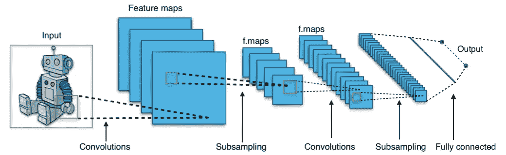

卷积神经网络工作流

**Conv2D** —是一种二维卷积，它采用带有形状的图像，并使用内核来创建特征图。

**批次标准化** —通过每个小批次中的均值和方差参考来标准化每个批次。这有助于更快地训练和收敛。简而言之，可能会给出更好的结果。

**MaxPooling 2d**—Conv2D 输出的 32 个特征图直通 max pooling 的大小。

*   然后，max-pooling 的输出再次通过 Conv2D 传递特征映射，然后通过 size 传递 MaxPooling。
*   最后，通过 Conv2D 特征映射和 max pooling，还会发生一个特征学习过程。

**展平:** -将特征学习输出的 3d 维度展开/展平到列向量，以形成完全连接的神经网络部分

**密集** —用神经元创建完全连接的神经网络。

**退出** —从每个更新周期中随机排除的神经元。

**密集** —这个完全连接的层应该有和我们拥有的类数量一样多的神经元，在这种情况下，我们有类，所以我们使用神经元

在开始实现之前，让我们熟悉一下数据集。在这方面，我们正在通过 CT 扫描预测冠状病毒。我们有通过卷积神经网络感染和未感染冠状病毒的人的数据集。我们将在图像上实现神经网络，并预测一个人是否患有冠状病毒。这是训练和测试数据的文件夹结构。

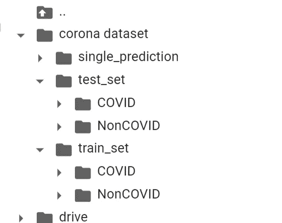

图像的文件夹结构

让我们开始实现卷积神经网络。我们正在 goggle colab 中工作，为此我们在 google drive 上上传了数据集。为文件夹中的图片创建一个 rar / zip 文件。然后进入驱动器->文件上传->选择 zip/rar 文件->点击上传。

第一步

我们必须安装我们的驱动器，以便访问当前目录中的数据。

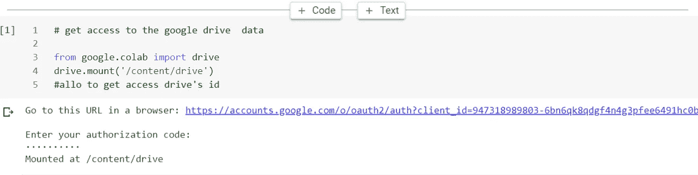

第二步

现在我们必须从驱动器中解压缩 zip/rar 文件。

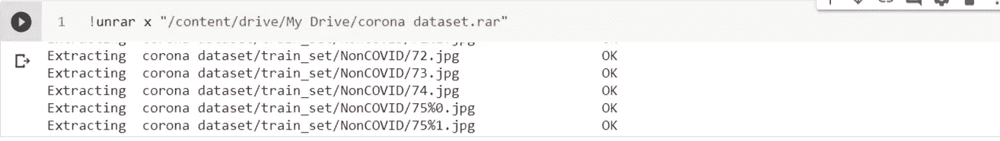

第三步

安装和导入 keras 库和带有 keras 库图层的模型。

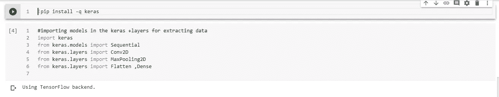

第四步

现在是模型初始化的一部分，并在神经网络中添加层，如 Conv2D、轮询层、用于避免过拟合的 dropout、用于完全连接到输出预测的 dense。

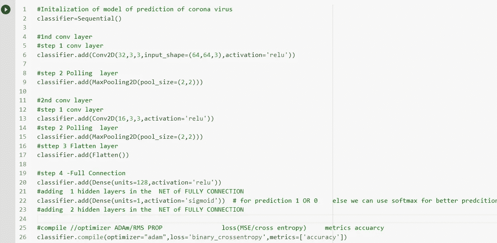

第五步

现在来的训练部分和测试部分的准确性和 val_score 与图像生成器。

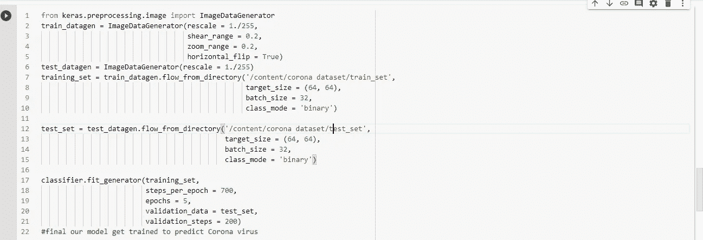

精确的模型输出

第六步

现在是 CT 扫描单一预测一个人是否患有冠状病毒的时候了。我们将从单个预测文件夹中取出一幅图像并对其进行预测。

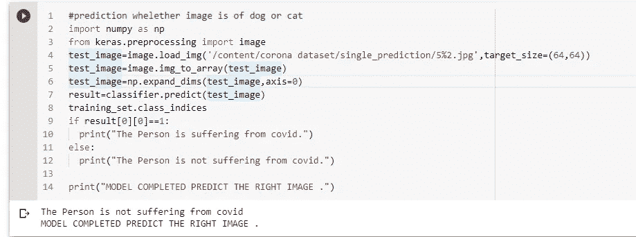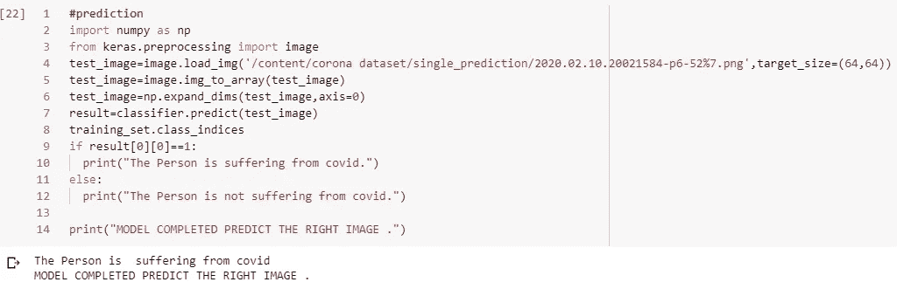

正确的预测

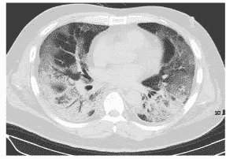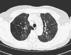

来自 single_prediction 文件夹的图像

CT 扫描的卷积神经网络的完整实现是在我的 Google Colab 笔记本上完成的。

要获取代码，请单击此处-->

[**通过 CT 扫描预测冠状病毒**](https://colab.research.google.com/drive/1eHyLJci8O0-VeD3Iv1rRWqKFQzYqldDg) 。

如果你喜欢阅读这些类似的文章，并对类似的项目有共同的兴趣，那么我们可以扩大我们的网络，可以为更多的实时项目工作。

更多详情请联系我的 [**Linkedin 账号**](https://www.linkedin.com/in/karan-choudhary-9102b81a0/) ***！***

**谢谢！！！！**