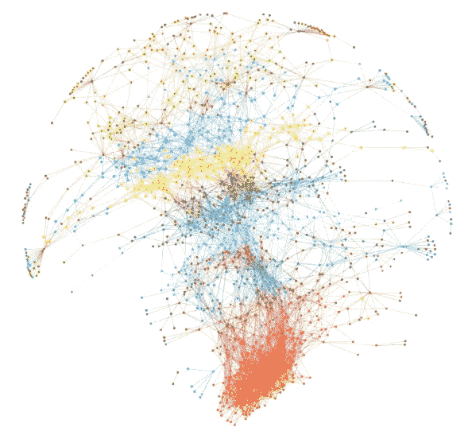

# 复杂网络分析导论

> 原文：<https://medium.com/analytics-vidhya/introduction-to-complex-network-analysis-15b50947a794?source=collection_archive---------5----------------------->

[网络分析](https://www.google.com/url?sa=i&url=https%3A%2F%2Fwww.johndcook.com%2Fblog%2Fcomplex-networks%2F&psig=AOvVaw0fSfMKrqwJARbX2liCgb_P&ust=1582649784979000&source=images&cd=vfe&ved=0CAIQjRxqFwoTCIiwo4XU6ucCFQAAAAAdAAAAABAD)

复杂网络分析研究如何识别、描述、可视化和分析复杂网络。分析网络最突出的方法是使用 Python 库 NetworkX，它为构建和绘制复杂的神经网络提供了一种突出的方法。

CNA 研究和应用爆炸的突出原因是由于两个因素——一个是廉价和…