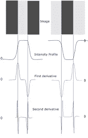

# 计算机视觉导论

> 原文：<https://medium.com/analytics-vidhya/introduction-to-computer-vision-5e104ed62ef1?source=collection_archive---------18----------------------->

> "看就是通过观察知道什么在哪里."

## **什么是计算机视觉？**

嗯，名字本身就定义了。这是计算机获得视觉的能力。当我说“视觉”时，我并不是说眼睛会从系统中冒出来困扰我们，或者只是给计算机提供一个摄像头。

视觉是从输入图像或视频中截取细节和特征的能力。但是，既然计算机只处理 1 和 0，它是如何感知这些特征的呢？计算机视觉领域回答了所有这些问题，并且已经存在了 70 年！

我们的主要目标是回答任何可以由人类回答的关于图像的问题。这也被称为人工智能中以艾伦·图灵命名的‘图灵测试’。

在过去的几十年里，计算机视觉已经成为人工智能兴起的一个不可或缺的部分。在这一领域有许多应用，主要应用可分为:

**1。对象检测:**它回答了一个基本问题，“什么和在哪里？”。
展示的是什么图像/视频，以及图像/视频中物体的“在哪里”或位置。它包括像'*光学字符识别'、'物体跟踪'、'活动识别* **'** 等应用。

该模型检测各种对象及其位置。

**2。物体属性和属性:**我们检测到物体后，下一步做什么？我们提取他们的特征和细节怎么样？这使得模型更加强大，因为它不仅能检测物体，还能感知信息。它有一些非常重要的应用，如*、【医学成像】、【人脸检测与验证】、【图像检索】*等。

该模型检测物体及其颜色。

**3。米制视觉:**如果我们想要获得甚至人类都无法猜测的细节，我们就调谐米制视觉，它包括许多高级应用，如'*摄影测量'*(从照片进行测量的科学**)，'** *基于图像的 3D 建模'*等等。

摄影测量的输入是照片，输出通常是地图、绘图、测量值或某个真实世界对象或场景的 3D 模型。

## 什么是光学图像？

光学图像被定义为物理对象的 2D 表示，通过光在一些光学系统中的传播获得，描绘了对象的轮廓和特征，或者仅仅是由照相机捕获的图像或视频。

数字彩色图像是 3D 阵列，其中每个阵列具有代表范围[0，255]内的色彩密度的像素值。这些阵列是预定义颜色的过滤器，因此所有的彩色图像由三种颜色“红”、“绿”和“蓝”组成。这种表示法被称为“RGB ”,根据“三原色理论”,将这些原色组合起来，就可以获得所有不同的颜色。数字“灰度”图像是由“黑色”和“白色”组成的 2D 阵列。

三色滤光器(左)组合起来产生光学图像(右)。

## 图像中出现的各种缺陷

我们的图像可能在许多方面有缺陷，并且在提取有用的特征和属性时会损害系统。一些常见的缺陷有:
**对比度低:**图像融合了明暗区域，创建出更加平坦的照片。
**错误的颜色:**图像用与现实不同的颜色描绘物体。 **噪点:**亮度或色彩信息的随机变化。 **模糊:**由于物体或相机的突然移动而发生。 **不均匀闪电:**光线不规则地放置在图像上。

为了克服这些问题，我们应用图像处理。
**图像处理**是对一幅图像进行某种操作的方法，目的是得到一幅增强的图像或者从中提取一些有用的信息。这是一种**信号处理**，其中输入是图像，输出可以是图像或与该图像相关的特性/特征。
由此可见，**计算机视觉**的重要组成部分。

## 为什么是图像处理？

1.  人类感知的图像改善。它提高了主观图像质量。
2.  机器感知的图像改进。它简化了后续的图像分析和识别。
3.  出于技术目的的图像转换，例如改变图像分辨率或纵横比以便在设备上显示。
4.  从酷炫的视觉效果中获得艺术印象。

从计算机视觉领域开始，我们应该尝试提取图像的最基本特征，即边缘。边缘检测可能非常有用，因为大多数语义和形状信息可以编码在边缘中。

# 边缘检测

**目标**:识别图像中的突然变化或不连续，称为边缘。它们比像素更紧凑，携带的信息更多。

**强度函数:****给出一个通道在每个位置或像素的**强度**，像素越暗，强度值越小。**

****边缘:**边缘因此可以被定义为图像强度函数中快速变化的地方。我们可以使用图像梯度进一步定位边缘。**

****

****图像梯度:**梯度是强度函数的一阶微分，它指向强度增加最快的方向。
它被表示为:**

****

**强度函数在两个轴上的偏导数。**

****

**渐变方向**

****

**梯度幅度**

****

**图像中的噪声在边缘检测中可能是不利的。它在图像强度的一阶导数中引起不希望的尖峰，这可能使真正的边缘消失。因此，通过图像平均来平滑图像强度曲线以降低噪声变得非常重要。**

****

**噪音淡化了边缘**

**梯度幅度估计不是完整的边缘检测。我们需要精度，即沿厚脊的梯度强度较大，因此只传播重要的边缘。此外，边缘点之间应该有连通性。**

**这可以通过“ **canny 边缘检测器**来完成，它使用“**卷积**来代替梯度幅度检测，但思想是相同的。我们可以用有限差分来近似偏导数。**

## **盘旋**

**这被认为是图像处理中最重要的数学运算。我们卷积一个内核或遮罩，它是输入图像的一个小矩阵，反过来会产生令人惊讶的结果，如锐化、模糊、浮雕甚至边缘检测。不同的内核用于不同的任务。卷积的数学公式如下:**

********

**‘I’是输入矩阵，‘K’是内核，I*K 是输出。**

**让我们把它应用在图像通道上，想象它的效果。**

****

**我们可以看到，利用给定的核，我们得到了输入图像的边缘。**

****

**更多的内核特性**

**卷积在'**中有非常重要的作用 canny 边缘检测器**和 **'Sobel 核'**用于得到用 Kx 和 Ky 表示的边缘。**

****

**索贝尔过滤器**

**Canny 边缘检测器在本文[中实现。一定要看看 python 的实现。](/@adistar121999/canny-edge-detector-7b8037fa0764?sk=11133eb22c80ce6fd6e384afd0d124ad)**

**感谢您的阅读！**

**快乐学习！**