# Python 中的计算机视觉和 OpenCV 简介

> 原文：<https://medium.com/analytics-vidhya/introduction-to-computer-vision-opencv-in-python-fb722e805e8b?source=collection_archive---------1----------------------->

照片由 [niko photos](https://unsplash.com/@niko_photos?utm_source=medium&utm_medium=referral) 在 [Unsplash](https://unsplash.com?utm_source=medium&utm_medium=referral) 上拍摄

*大家好，*

计算机视觉是计算机科学中最激动人心的领域之一。几十年来，在这一领域进行了大量的研究。由于云技术和强大的 GPU 和 TPU，图像处理变得更快、更高效。汽车、机器人和无人机开始理解我们在图片和视频中看到的东西。在未来几年内，机器和人类之间的界面“计算机视觉”将变得更加重要。

*计算机视觉被认为是人工智能时代最热门的领域。对于新手来说，这可能会很紧张，因为大多数人在向计算机视觉过渡时都会面临一些挑战*

*   *在没有 GPU & TPUs 的情况下，计算机视觉模型是可训练的吗？*
*   *图像预处理——图像数据集的清洗？*
*   *为什么我们对计算机视觉使用深度学习而不是机器学习？*
*   在建立我们的计算机视觉模型之前，我们应该收集更多的图像吗？

你说得对，我也面临着这些挑战，所以想出了这个指南来帮助你在计算机视觉领域走出困境。

> 抓紧了！

> **什么是计算机视觉？**

*根据维基百科*

> **计算机视觉**是一个[跨学科的科学领域](https://en.wikipedia.org/wiki/Interdisciplinarity)，研究如何让计算机从[数字图像](https://en.wikipedia.org/wiki/Digital_image)或[视频](https://en.wikipedia.org/wiki/Video)中获得高层次的理解。从[工程](https://en.wikipedia.org/wiki/Engineering)的角度来看，它寻求将[人类视觉系统](https://en.wikipedia.org/wiki/Human_visual_system)能够完成的任务自动化。

简而言之，计算机视觉是一个深度学习领域，它允许机器像人类一样识别和处理图像。就解析图像而言，人类表现得非常好，但就机器而言，检测对象涉及多个复杂的步骤，包括特征提取(边缘检测、形状等)、特征分类等。

> **OpenCV——计算机视觉的发展**

*按* [按 *OpenCV*](https://opencv.org/) *:*

> “OpenCV 是在 BSD 许可下发布的，因此学术和商业用途都是免费的。它有 C++，C，Python 和 Java 接口，支持 Windows，Linux，Mac OS，iOS 和 Android。OpenCV 是为计算效率而设计的，非常注重实时应用。该库用优化的 C/C++编写，可以利用多核处理。借助 OpenCL，它可以利用底层异构计算平台的硬件加速。”

OpenCV 包含 2500 多种算法的实现！它可以免费用于商业和学术目的。这个库有多种语言的接口，包括 Python、Java 和 C++。

> **设置 OpenCV**

这里要注意的一点是，在互联网上你可以找到很多在你的 ubuntu 或 windows 机器上安装 Opencv 的教程。只要跟随这个 [*链接*](http://www.pyimagesearch.com/2016/10/24/ubuntu-16-04-how-to-install-opencv/) 就可以了，它在动态设置一切方面对我帮助很大。

> 现在跳到有趣的部分！

> **读取、写入和显示图像**

图像可以表示为多维数组。这是因为机器可以用数字来表示一切，在 python 中，numpy 可以用来表示它，而在 C 编程语言中，它可以用 format Mat 来表示。

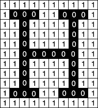

对于图像，通常使用一个通用词，称为像素或像素值。在彩色图像的情况下，我们有三个彩色通道。因此，对于单像素值，彩色图像将具有多个值。根据分辨率和色深的不同，这些阵列的大小会有所不同。颜色值从 0 到 255。例如，这些颜色通道通常表示为红绿蓝(RGB)。

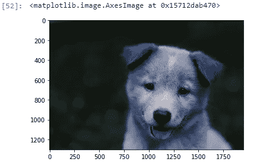

在 Opencv 中读取图像很简单，这里需要注意的是，默认情况下， *imread* 函数读取 BGR(蓝-绿-红)格式的图像。我们可以使用 *imread* 函数中的额外标志读取不同格式的图像:

*   **cv2。IMREAD_COLOR:** *加载彩色图像的默认标志。*
*   **cv2。im read _ gray:***加载灰度格式的图像。*

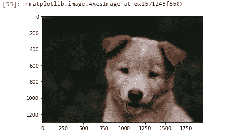

openCV 已经正确地将图像加载为 numpy 数组，但是每个像素的颜色都被排序为 BGR。Matplotlib 的绘图需要 RGB 图像，因此，为了正确显示图像，有必要交换这些通道。这个操作可以通过使用 OpenCV 转换函数 cv2.cvtColor()或者直接使用 numpy 数组来完成。

> **调整图像大小**

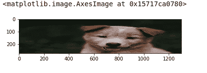

一般来说，大多数计算机视觉模型都处理固定的输入形状。当我们执行网络废弃来废弃图像数据集时，真正的痛苦出现了。调整大小对训练深度学习模型真的很有帮助。然而，不同的插值和下采样函数也属于 OpenCV 的范畴，具有以下参数

*   **INTER_LINEAR**
*   **INTER_AREA**
*   **INTER_CUBIC**
*   **INTER_LANCZOS4**

> **图像旋转/翻转**

数据增强允许我们生成更多样本来训练我们的深度学习模型。数据扩充通过应用图像操作，如旋转、缩放、平移等，使用可用的数据样本来产生新的样本。

这也有助于我们的模型变得健壮和通用。在数据扩充技术中，旋转或翻转起着重要的作用。它通过保持标签不变，以指定的角度旋转图像。

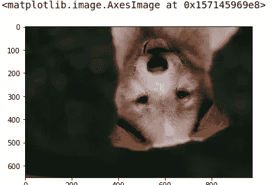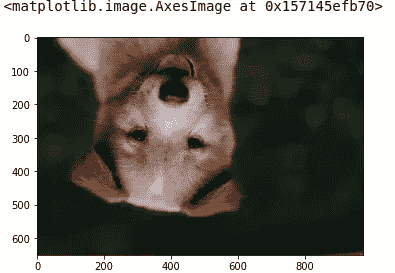

> **混合图像**

借助 OpenCV 的魔力，我们可以借助 cv2.addWeighted()方法添加或混合两幅图像。addWeighted()函数返回包含结果图像像素值的 numpy 数组。

混合无非是两个图像矩阵的相加。因此，如果我们想添加两个图像，这意味着非常简单，我们必须添加各自的两个矩阵。对于聚合两个矩阵，两个图像的大小应该相同。

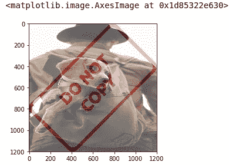

> **创建感兴趣区域 ROI**

在 OpenCV 中，我们可以创建 ROI。ROI 背后的基本思想是，它将图像中每个对象的位置映射到最终输出图像中的新位置。ROI 也为模型增加了平移不变性。通过改变对象位置，模型可以更好地学习模式，从而提高模型的泛化能力。感兴趣区域可广泛用于图像预处理阶段。

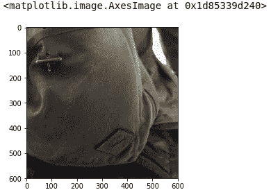

> **图像阈值处理**

阈值处理是一种将像素值移动到阈值的技术。阈值处理基本上是将每个像素值与阈值进行比较。如果像素值小于阈值，则将其设置为 0，否则，将其设置为最大值，即 255。它还有助于将对象从其背景中分割出来。它围绕阈值以下或阈值以上的两个值旋转。

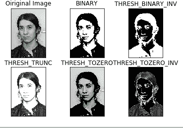

这里要注意的是，这种阈值技术是在灰度图像上完成的。

不考虑简单的阈值处理，我们有自适应阈值处理。它谈到阈值是为较小的区域计算的，因此，不同的区域将有不同的阈值。更多信息请参考此 [*链接*](https://stackoverflow.com/questions/28763419/adaptive-threshold-parameters-confusion) 。

> **模糊和平滑**

最流行和最常用的技术之一，用于减少图像中的噪声。它从图像和常用的图像处理操作中去除高频内容，如边缘，以降低图像噪声。该过程从输入图像中移除诸如边缘的高频内容。

通常，模糊是通过用具有低通的滤波器核卷积输入图像而获得的。基本上有两种模糊-

*   **平均模糊**
*   **高斯模糊**
*   **中间模糊**

在平均模糊中，图像用盒式滤波器进行卷积。图像的中心元素被核心区域中所有像素的平均值所代替。

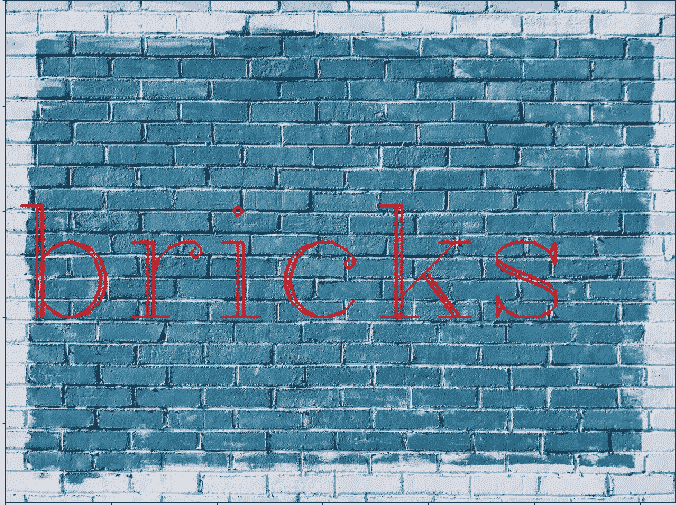

此外，在高斯模糊图像是用高斯滤波器卷积。这个滤波器只不过是一个低通滤波器，从图像中移除高频数据。

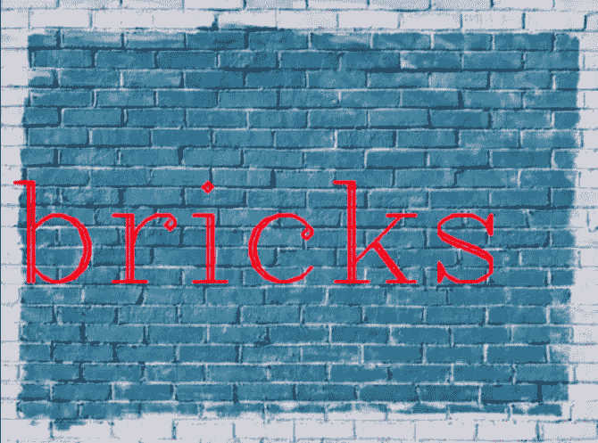

> **边缘检测**

图像中的边缘是亮度变化剧烈的点，并且具有一些不连续性，例如

*   **深度不连续**
*   **方向不连续**

边缘检测对于提取不同图像识别应用(如对象分类)的图像特征已经变得非常有用。

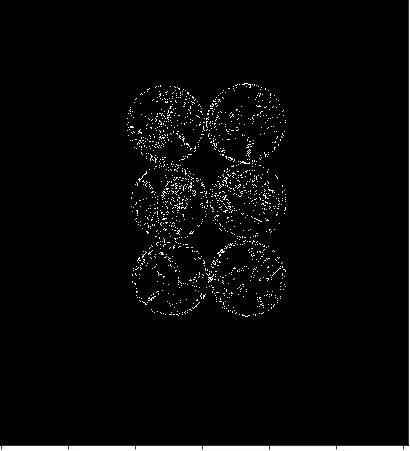

> **图像轮廓**

轮廓是表示图像中对象边界的点或线段的闭合曲线。轮廓本质上是图像中物体的形状。

轮廓有时被称为点或线段的集合，它们总体上表示图像中对象的形状。

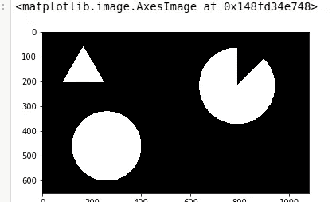

> **人脸检测**

OpenCV 通过使用基于 haar 级联的对象检测算法在检测人脸方面非常棒。Haar cascades 基本上是经过训练的机器学习分类器模型，它计算不同的特征，如线条、轮廓、边缘等。

这些经过训练的检测人脸、眼睛等的 ML 模型在 GitHub 上的 OpenCV repos 上是开源的。此外，我们还可以为任何对象训练自己的 haar 级联。

*看看这个* [*链接*](https://www.analyticsvidhya.com/blog/2018/08/a-simple-introduction-to-facial-recognition-with-python-codes/) *从零开始使用 OpenCV 进行人脸检测的漂亮解说。*

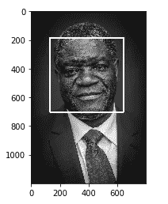

> **结束注释**

因此，对于计算机视觉任务来说，Guys OpenCV 确实是一个非常棒的 powerpack 库。我强烈建议您在自己的机器上运行上面的示例代码，因为学习任何东西的最好方法就是自己应用它。

此外，在 OpenCV 上还有许多其他方法和技术可用于图像处理。我鼓励您查看他们的 [*GitHub 库*](https://github.com/opencv) *和他们的* [*官方文档*](https://opencv.org/) *以了解他们的实现。*

> **参考文献**

*   [https://docs.opencv.org/master/d9/df8/tutorial_root.html](https://docs.opencv.org/master/d9/df8/tutorial_root.html)
*   [https://github.com/opencv](https://github.com/opencv)
*   [https://www.pyimagesearch.com/start-here/#ocr](https://www.pyimagesearch.com/start-here/#ocr)
*   [https://dzone . com/articles/opencv-python-tutorial-computer-vision-using-openc](https://dzone.com/articles/opencv-python-tutorial-computer-vision-using-openc)
*   [https://www . analyticsvidhya . com/blog/2019/03/opencv-functions-computer-vision-python/](https://www.analyticsvidhya.com/blog/2019/03/opencv-functions-computer-vision-python/)
*   [https://www.tutorialspoint.com/opencv/index.htm](https://www.tutorialspoint.com/opencv/index.htm)

如果你喜欢这个帖子，请关注我。如果你注意到思维方式、公式、动画或代码有任何错误，请告诉我。

*干杯！*