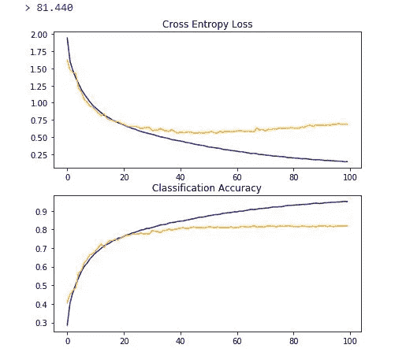
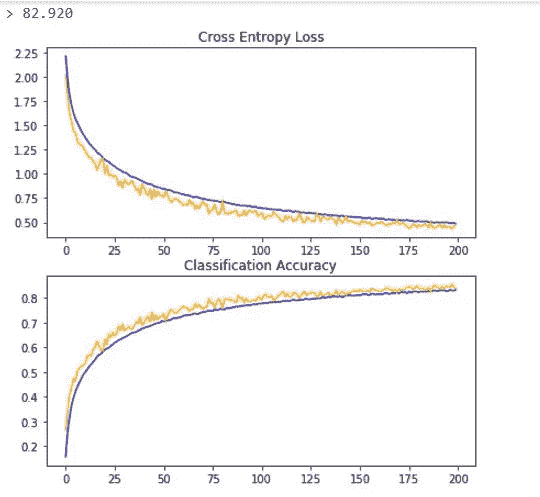

# 在 CIFAR-10 数据集上使用基线 VGG 块的计算机视觉简介

> 原文：<https://medium.com/analytics-vidhya/introduction-to-computer-vision-with-baseline-vgg-blocks-on-the-cifar-10-dataset-731d19439922?source=collection_archive---------5----------------------->


照片由[耶鲁安穴獭](https://unsplash.com/@jeroendenotter?utm_source=medium&utm_medium=referral)在 [Unsplash](https://unsplash.com?utm_source=medium&utm_medium=referral)

根据[维基百科](https://en.wikipedia.org/wiki/Computer_vision)，
的说法，计算机视觉是一个跨学科的科学领域，研究如何让计算机从数字图像或视频中获得高层次的理解。

多年来，计算机视觉已经取得了很大的进步，当一家名为 AlexNet 的 CNN 在 [ImageNet](http://www.image-net.org/challenges/LSVRC/) 挑战赛中实现了标记图片的艺术表现时，它取得了重大的飞跃。

现在像 Tensorflow 和 PyTorch 这样的深度学习框架越来越流行，只需要几行代码就可以相对容易的实现各种深度学习算法。

在这里，我将使用不同数量的 VGG 块以及一些众所周知的正则化技术来分类来自 CIFAR-10 数据集的对象并比较结果。

CIFAR-10 是计算机视觉和深度学习中使用的标准数据集。该数据集主要用于计算机视觉研究。该数据集由 60，000 张 32*32 像素的彩色照片组成，这些照片来自 10 类物体，如飞机、汽车、鸟类等。类别标签及其相关的标准整数值如下所示:

*   0:飞机
*   1:汽车
*   2:鸟
*   3:猫
*   4:鹿
*   5:狗
*   6:青蛙
*   7:马
*   8:船
*   9:卡车

数据集中的图像非常小，比典型的照片小得多。CIFAR-10 是一个很好理解的数据集，广泛用于计算机视觉算法的基准测试。问题被有效地“解决”。达到 80%的分类准确率是比较容易的。然而，通过使用深度学习卷积神经网络，我们可以在测试数据集上获得 90%以上的分类精度。


CIFAR-10 数据集

下面的示例从 Keras API 加载 CIFAR-10 数据集，并绘制一个示例。

```
#load the CIFAR-10 dataset and plot a sample image from tensorflow import keras 
from keras.datasets import cifar10 
import matplotlib.pyplot as plt #load dataset 
(trainX, trainY), (testX, testY) = cifar10.load_data()#classes array for the 10 different classes of images in the dataset
classes = ['airplane','automobile','bird','cat','deer','dog','frog','horse','ship','truck']#summarize the loaded dataset 
print('Train: X = %s, y = %s' %(trainX.shape, trainY.shape))
print('Test: X = %s, y = %s' %(testX.shape, testY.shape))#plot a sample image plt.figure()
plt.imshow(trainX[0])
plt.grid(False)
plt.xlabel(classes[trainY[0].item()])
plt.show()
```

我们可以看到，训练集中有 50000 个样本，测试集中有 10000 个样本。稍后，我们将测试集分成两个不同的子集，验证集和测试集，我们将在训练期间和之后连续使用它们来验证我们的模型。

```
Train: X = (50000, 32, 32, 3), y = (50000, 1)
Test: X = (10000, 32, 32, 3), y = (10000, 1)
```

还从训练集中绘制了样本图像。


很明显，与正常图像相比，该图像非常小并且分辨率低，因此人眼很难看清图像中包含的内容。低分辨率很可能是顶级算法在数据集上能够实现的有限性能的原因。

加载数据集后，我们可以进入数据预处理步骤。

我们知道在 CIFAR-10 数据集中有 10 个类，并且这些类被表示为唯一的整数。因此，我们可以对每个样本的类元素使用一个热编码，将整数转换成 10 个元素的二进制向量，其中 1 表示类值的索引。我们可以使用 Keras 为一个热编码提供的 to _ categorical 实用函数。

```
#one hot encode the target 
trainY = keras.utils.to_categorical(trainY)
testY = keras.utils.to_categorical(testY)
```

load_dataset()函数实现了这些步骤，并可用于加载数据和对类元素进行热编码。

```
def load_dataset():
    #load dataset
    (trainX, trainY),(testX, testY) = cifar10.load_data()
    #one hot encode the target 
    trainY = keras.utils.to_categorical(trainY)
    testY = keras.utils.to_categorical(testY)
    return trainX, trainY, testX, testY
```

我们知道数据集中图像的像素值是 0 到 255 之间的无符号整数。我们需要将像素值标准化，例如将它们重新调整到范围[0，1]。这包括将像素值除以最大值。

```
train_norm = train_norm / 255.0
test_norm = test_norm / 255.0
valid_norm = valid_norm / 255.0
```

normalize()函数实现了这一点:

```
def normalize(train, test,valid): 
    #change the values from unsigned int to float
    train = train.astype('float32')
    test = test.astype('float32')
    valid = valid.astype('float32') #Normalize the pixel values by dividing by 255
    train_norm = train / 255.0
    test_norm = test/ 255.0
    valid_norm = valid / 255.0

    return train_norm, test_norm, valid_norm
```

我们还需要定义一个验证集，用于在训练期间验证我们的模型。validation_split()函数实现了这一点:

```
def validation_split(testX, testY, valid_X, valid_Y, v_split):
    index_of_validation = int(v_split * len(testX))
    valid_X.extend(testX[-index_of_validation:])
    valid_Y.extend(testY[-index_of_validation:])
    trainX = trainX[:-index_of_validation]
    trainY = trainY[:-index_of_validation]
    return testX, testY, np.asarray(valid_X), np.asarray(valid_Y)
```

训练集和验证集将在训练期间使用，而测试集将在模型完成训练后用于评估模型。将数据拆分为单独的训练集、测试集和验证集是一种很好的做法，这样可以在对验证集进行训练期间以及在对模型以前从未见过的测试集进行训练之后对模型进行评估。

**定义神经网络模型**

在对图像进行预处理之后，我们需要一种方法来定义我们的神经网络模型。在这里，我们将尝试不同版本的 VGG 模型，以测试其在 CIFAR-10 数据集上的准确性。可以调用 define_model()函数来获取 CNN 模型。

```
#define the CNN model 
def define_model():
    #............
    #............
    return model
```

# **评估模型**

在定义了模型之后，我们需要对模型进行拟合和评估。我们将使用训练集来训练模型，使用验证集来计算训练过程中的损失和准确性。稍后，将在单独的测试集上训练后评估该模型。

```
# fit model 
history = model.fit(trainX,trainY, epochs = 50, batch_size = 64,    validation_data = (testX, testY), verbose = 1)
```

一旦模型合适，我们就可以直接在验证集上评估它。

```
# evaluate model
_, acc = model.evaluate(validX, validY, verbose=0)
```

**显示结果**

一旦模型被评估，我们就可以展示结果。

有两个关键方面需要提出:训练期间模型学习行为的诊断和模型性能的评估。

首先，诊断包括创建一个线图，显示训练和测试集在训练期间的模型性能。这些图对于了解模型是过度拟合、欠拟合还是非常适合数据集很有价值。

我们将创建一个有两个支线剧情的单一图形，一个是损失，一个是准确性。蓝线表示模型在训练数据集上的表现，橙线表示模型在坚持测试数据集上的表现。给定收集的训练历史，下面的*summary _ diagnostics()*函数创建并显示该图。情节被保存到文件，特别是与脚本同名的文件，扩展名为“ *png* ”。

```
# plot diagnostic learning curves
def summarize_diagnostics(history):
    # plot loss
    plt.subplot(211)
    plt.title('Cross Entropy Loss')
    plt.plot(history.history['loss'], color='blue', label='train')
    plt.plot(history.history['val_loss'], color='orange',  label='test') # plot accuracy
    plt.subplot(212)
    plt.title('Classification Accuracy')
    plt.plot(history.history['accuracy'], color='blue', label='train')
    plt.plot(history.history['val_accuracy'], color='orange', label='test')
    plt.show() # save plot to file
    filename = sys.argv[0].split('/')[-1]
    plt.savefig(filename + '_plot.png')
    plt.close()
```

我们还可以将模型的分类精度打印为:

```
print(‘> %.3f’ % (acc * 100.0))
```

我们现在需要一个函数来驱动培训和测试过程。下面定义的 test_model()函数执行此操作，并可用于启动给定模型的评估:

```
# run all the defined functions for evaluating a model
def test_model():
 # load dataset
 train_X, train_Y, testX, testY = load_dataset()
 #get validation set 
 valid_X = []
 valid_Y = []
 trainX, trainY, validX, validY = validation_split(train_X, train_Y, valid_X, valid_Y,v_split=0.1)

 # normalize the data
 trainX, testX,validX = normalize(trainX, testX,validX)
 # define model
 model = define_model()
 # fit model
 history = model.fit(trainX, trainY, epochs=50, batch_size=64, validation_data=(validX, validY), verbose=1)
 # evaluate model
 _, acc = model.evaluate(testX, testY, verbose=0)
 print(‘> %.3f’ % (acc * 100.0))
 # learning curves
 summarize_diagnostics(history)
```

一旦我们调用 test_model()函数，模型将被训练和评估。

但是，我们还没有定义一个合适的 CNN 模型，所以这个脚本还不能运行。

# **如何开发基线模型**

基线模型将建立一个最低的模型性能，我们所有的其他模型都可以与之进行比较。

我们将使用不同版本的 VGG 模型。该架构包括堆叠带有小型 3*3 滤波器的卷积层，然后是最大池层。这些层一起形成一个块，并且这些块可以重复，其中每个块中的滤波器数量随着网络的深度而增加，例如对于模型的前四个块为 32、64、128、256。在卷积图层上使用相同的填充，以确保输出要素的高度和宽度与输入相匹配。

我们可以在 CIFAR-10 问题中探索这种体系结构，并将一个模型与这种具有 1、2、3 和 4 个数据块的体系结构进行比较..

每一层将使用 ReLU 激活函数和“he_uniform”权重初始化，这通常是最佳实践。例如，两个街区的 VGG 式建筑可以在 Keras 中定义如下:

```
#example of a 2 block VGG architecture model = Sequential()
model.add(Conv2D(32,(3,3), activation = 'relu', kernel_initializer = 'he_uniform', padding = 'same', input_shape = (32,32,3)))
model.add(Conv2D(32,(3,3), activation = 'relu', kernel_initializer =  'he_uniform', padding = 'same'))
model.add(MaxPooling2D((2,2)))
model.add(Conv2D(64,(3,3), activation = 'relu', kernel_initializer = 'he_uniform', padding = 'same'))
model.add(Conv2D(64,(3,3), activation = 'relu', kernel_initializer = 'he_uniform', padding = 'same'))
model.add(MaxPooling2D((2,2)))
.....
```

这定义了模型的特征检测器部分。这将通过模型的分类器部分来耦合，该分类器部分解释特征并预测给定照片属于哪个类别。

```
#example output part of the model 
model.add(Flatten())
model.add(Dense(128, activation = 'relu', kernel_initializer =  'he_uniform'))
model.add(Dense(10, activation = 'softmax'))
```

该模型将使用随机梯度下降进行优化。我们将使用 0.001 的学习率和 0.9 的动量。该模型将优化多类分类所需的分类交叉熵损失函数，并将监控分类准确性。

```
#compile model 
opt = SGD(lr = 0.001, momentum = 0.9)
model.compile(optimizer = opt, loss = ‘categorical_crossentropy’, metrics = [‘accuracy’])
return model
```

我们现在有足够的元素来定义我们的 VGG 风格的基线模型。我们将有 1、2 和 3 个 VGG 模块的不同模型架构，这要求我们定义不同版本的 define_model 函数，这些函数都在下面提供。

我们将依次看看每个 define_model()函数以及对结果测试的评估。

# VGG 街区 1 号

一个 VGG 块的 define_model()函数如下所示:

运行模型会打印出测试数据集的分类准确度。


在这种情况下，我们可以看到该模型实现了大约 67%的分类准确率。


在这里，我们可以清楚地看到模型在训练数据集上是过拟合的。第一个图绘制了训练集相对于测试集的交叉熵损失，显示了训练集的损失持续减少，而测试集中的损失先减少，然后继续增加。第二张图描绘了训练集相对于测试集的分类准确度，也遵循类似的趋势。

# **2 VGG 街区**

两个 VGG 块的 define_model()函数如下所示:

运行该模型打印出分类准确度，其略好于我们的 1-VGG 块，接近 71.5%，并且还在训练数据集和测试数据集上绘制交叉熵损失和分类准确度。


与 1-VGG 区块一样，模型在训练数据集上过度拟合。测试数据集上的交叉熵损失正在减少，直到大约 15 个时期，然后开始增加，而训练集上的损失持续减少。分类准确度图也遵循类似的趋势。

# 3 个 VGG 街区

3 个 VGG 块的 define_model()函数如下所示:

同样，模型也在改进，但不是很大。在验证集上的分类精度刚刚超过 74%,而交叉熵损失和分类精度图显示了与 1 和 2 个 VGG 块相似的趋势。


# 4 个 VGG 街区

当我们实施 4 VGG 区块模型时，与 3 VGG 区块模型相比，模型精度没有显著变化。然而，与 3 VGG 块模型相比，该模型明显过度拟合，如训练和测试数据集上交叉熵损失的差异所示。因此，我们将使用 3 VGG 区块模型作为我们的基线模型。


现在，让我们使用不同的正则化技术来尽可能地改进模型。

# 辍学正规化

*据* [*维基百科*](https://en.wikipedia.org/wiki/Dropout_(neural_networks))*——
术语“辍学”指的是在神经网络中放弃单元(隐藏的和可见的)。*

在每个训练阶段，个体节点或者以概率 *1-p* 退出网络，或者以概率 *p* 保留，从而留下简化的网络；被删除节点的输入和输出边也被删除。

这里，我们将在每个 VGG 块后使用固定的丢弃概率 0.2，这意味着 20%的节点将被忽略，只有 80%的节点将被保留。

可以通过向神经网络添加新的脱落层来将脱落添加到模型中，其中移除节点的概率作为参数传递。

对于 3 个 VGG 模块以及 0.2 的压差，define_model()函数如下所示:

当该模型被训练 100 个时期时，我们实现了大约 81.5%的分类准确度，这显著高于我们的基线 3 块 VGG 模型。检查交叉熵和分类准确度图，我们可以看到模型在以后的时期开始重新拟合训练数据集。验证集上的分类精度几乎恒定在 80%左右，而训练集上的精度持续下降。



当我们在连续的 VGG 块上分别使用变化的丢弃概率 0.2、0.3、0.4，并且在密集层上使用 0.5 的丢弃时，在测试集上的分类准确度增加到大约 83.5%。也减少了模型对训练集的过度拟合。


# 数据扩充

图像数据扩充是一种可用于通过在数据集中创建图像的修改版本来人为扩展训练数据集的大小的技术。

为了进一步改进我们的模型，我们可以对现有模型使用数据扩充，该模型包含具有不同压差的 3 个 VGG 区块。

可以使用 ImageDataGenerator 类在 Keras 中实现数据扩充。

```
#create data generator
datagen = ImageDataGenerator(width_shift_range = 0.1, height_shift_range = 0.1, horizontal_flip = True)#iterator
train = datagen.flow(trainX, trainY, batch_size = 64)
```

在定义了单个 epoch 中的批次数之后，我们可以将迭代器传递给 model.fit_generator()函数。

```
steps = int(trainX.shape[0] / 64)
#fit model
history = model.fit_generator(train, steps_per_epoch = steps, epochs = 200, validation_data=(validX, validY), verbose=1)
```



在训练了多达 200 个时期后，我们可以看到测试数据集上的精度略微下降到 83%，但该模型概括得很好，如两个图上的训练精度和验证精度之间的差异非常小所示。即使直到 200 个历元，交叉熵损失也在不断减少。进一步训练模型，可能达到 400-500 个历元，肯定会改进模型。

# 批量标准化

接下来，我们添加批量标准化，希望能够稳定网络并缩短训练时间。添加批处理规范化后的 define_model()函数如下所示:

当我们对模型进行 400 个时期的训练时，我们在测试数据集上获得了 88%的分类准确率。此外，交叉熵损失图和随后的分类准确度图显示，该模型概括得相当好。


下面提供了具有所有正则化的神经网络模型的最终实现:

最终实现了 3 个 VGG 块以及不同的正则化技术

# 结论

我们探索了各种不同的方法来扩展用于图像分类的 VGG 块。最终模型学习良好，甚至在 400 个时期之后，交叉熵损失似乎在减少。我们还可以通过改变不同的超参数来进一步优化我们的模型，例如学习率、时期数等。通过将优化器更改为 Adam、RMSprop 或 Adagrad 之类的东西，我们可能会得到更好的模型。CIFAR-10 是一个已解决的问题，我们可以在网上找到该数据集的许多不同实现。这只是对卷积神经网络和一些优化技术的介绍，我们可以实施这些技术来提高模型的准确性。