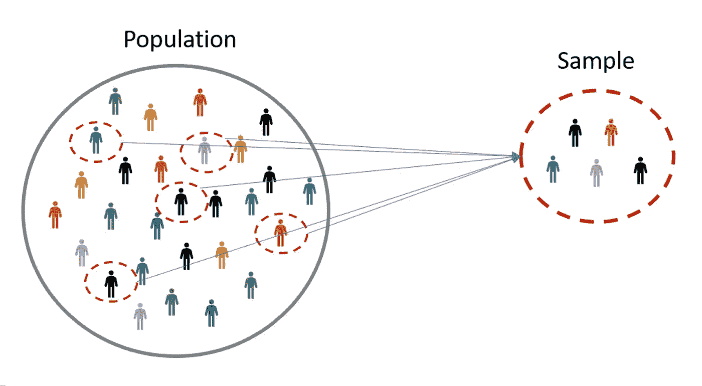
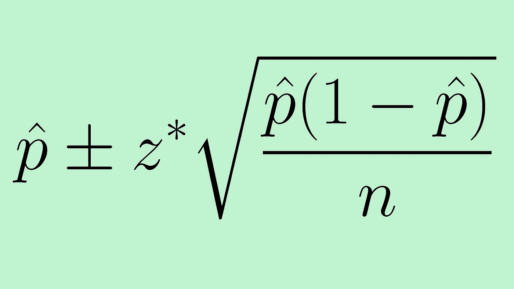

# 置信区间介绍(第一部分:总体比例)

> 原文：<https://medium.com/analytics-vidhya/introduction-to-confidence-interval-part-1-population-proportion-cc9f10c2c9b6?source=collection_archive---------10----------------------->

什么是置信区间？我们经常听说它，但我认为我们许多人(包括我)一开始在理解这个概念以及如何解读它方面有困难。这是可以理解的，因为我们往往不知道这个概念而只是用公式来计算置信区间，甚至不知道背后所做的概念和假设。

说到这一点，本文将不会深入到数学和推导公式是如何来的，而是我将与置信区间背后的直觉。如果我的概念或定义错了，请随意评论。

我们先从**人口**和**样本**概念说起。

**人口**指的是一整群人、物体、事件、医院访问或测量。**样本**由从**总体**中抽取的一个或多个观察值组成。下图说明了**群体**和**样本**之间的关系。

[https://www.omniconvert.com/what-is/sample-size/](https://www.omniconvert.com/what-is/sample-size/)

有一些从总体中抽取样本的方法，但这超出了本文的范围。最基本的概念是，样本必须是随机的，并能代表总体。

我们经常听到的其他术语是**参数**和**统计。参数**是关于**人群**的描述，可以是均值、中位数、方差等。**统计**(请注意这与**统计**不同)是关于**样本的描述，**也可以是均值、中位数、方差等。

那么，下一步是什么？？

现实世界中统计的主要问题是，我们经常无法访问或收集人口的所有数据(由于成本、时间或根本不可能)，因此我们从人口中抽取一些样本，对其进行分析，并“希望”我们的分析也适用于整个人口(这就是所谓的**推断统计，**我们从样本中抽取数据并对人口进行概括)。当然，我们不只是希望，有一个程序可以遵循，以确保我们得到的结果也适用于人群。

例如，假设在总统选举中，我们希望预测两个候选人(候选人 A 或 B)中的哪一个将赢得选举。如果这个国家有 2.7 亿人口，那么让所有人都有选择几乎是不可能的(即使我们能做到，也许选举过程已经结束了:)。

所以我们采取了大约 100 万人的样本(这应该是可能的吧？)并且看看选择候选人 A 的人的比例是多少。如果 100 万人中的 60 %选择 A，我们能说 270 万人中的 60 %也会选择候选人 A 吗？也许我们的直觉会说“是的，如果他们在那 100 万人中获得代表性样本，这个数字可能会在 60 %左右”

这就是**置信区间**发挥作用的地方。我们只是对样本数据进行估计，当然样本会有一些误差，不能捕捉整个人口。**置信区间**给我们一个范围，在这个范围内，我们非常确信真实的总体参数将落在这个范围内。

例如，经过计算，我们得到在 95%的置信区间内，选择候选人 A 的比例在[57%，63%](这只是说明性的数字)。这意味着有 95%的可能性，选择候选人 A 的人的真实比例在这个范围内。

那么下一个问题，我们如何得到那些实数呢？

为了简单起见，我们假设:

*n* :样本量

*p* :样本中选择候选人 A 的比例

在计算**总体参数**的置信区间之前，必须满足一些**假设**:

1.  参数的抽样分布(在这种情况下是比例，但也可以是另一个参数，如平均值。我们会在另一篇文章中看到)是**正态分布**。对于比例估计，经验法则是:如果 ***np* ≥ 10 且 *n(1-p)* ≥ 10，则分布为正态。**
2.  样本随机抽取**。**
3.  样本是独立的。这意味着一个事件的发生对下一个事件没有影响。经验法则是，如果 ***n 少于人口*** 的 10%，这个条件就满足了。

人口比例的**置信区间的基本公式为**

# p̂ (σ/√n)

其中σ是总体的标准差。

这是最理想的情况。但是通常我们不知道我们总体的标准差。那我们该怎么办？

统计学家发现，**样本**的标准差是**总体标准差的最佳估计量。**因此，如果我们不知道**总体、**总体的标准偏差，我们将使用**样本、**的标准偏差对其进行估计，我们将使用以下公式:

https://www . thoughtco . com/confidence-interval-for-a-population-proportion-4045770

其中√p̂(1-p̂)是**样本**(常表示为 **Sd** )的标准差。

“”后面的一项就是我们所说的**误差幅度**。它显示包含人口比例的区间范围。误差幅度越小当然越好，因为我们对自己的结果更有把握。那么，如何让误差幅度变小呢？

从公式上看，误差幅度会随着*n*值的增加而变小，这很有意义吧？样本越多，我们对结果就越有信心。

z* 是我们要替换的值，取决于我们选择的置信区间。我们可以从 Z 表中得到这个值。

回到我们上面关于总统选举的例子，我们知道:

p̂ : 0.6

**n = 100 万**

如果我们想用 95%的置信区间进行计算，从 Z 表来看，Z 值将是 1.96。

因此，我们的人口比例示例的置信区间为:

0.6 1.96 √0.6(0.4)/1，000，000 = **0.6 0.00096019997**

看起来我们很有信心，从整个人口中选择候选人 A 的比例将非常接近 60%！

考生 A 的好消息哈哈！

在**第二部分**中，我将介绍总体均值的置信区间。
快乐阅读！期待您在评论区的意见！