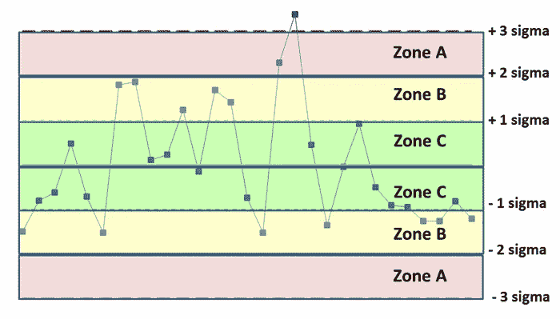

# 控制图介绍。

> 原文：<https://medium.com/analytics-vidhya/introduction-to-control-charts-987e19c74ad0?source=collection_archive---------9----------------------->

*   控制图是用来研究过程如何随时间变化的图表
*   数据按时间顺序绘制
*   控制图总是有一条中线代表平均值，一条上线代表控制上限，一条下线代表控制下限
*   然后，该图被划分为多个区域，每个区域位于平均值的 1 σ、2 σ和 3 σ处。

