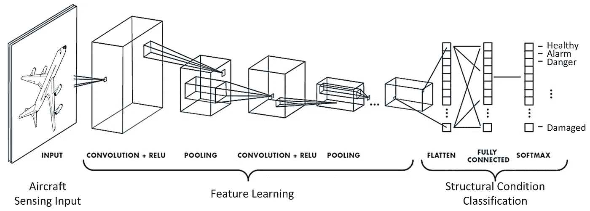

# 卷积神经网络简介

> 原文：<https://medium.com/analytics-vidhya/introduction-to-convolutional-neural-network-6942c189a723?source=collection_archive---------8----------------------->

## 本文介绍了卷积神经网络，也称为 CNN，这是一种几乎普遍用于计算机视觉应用的深度学习模型。

[https://www . mdpi . com/sensors/sensors-19-04933/article _ deploy/html/images/sensors-19-04933-g001 . png](https://www.mdpi.com/sensors/sensors-19-04933/article_deploy/html/images/sensors-19-04933-g001.png)

一个 **卷积神经网络** (CNN)是一种特殊的神经网络，可以显著减少…