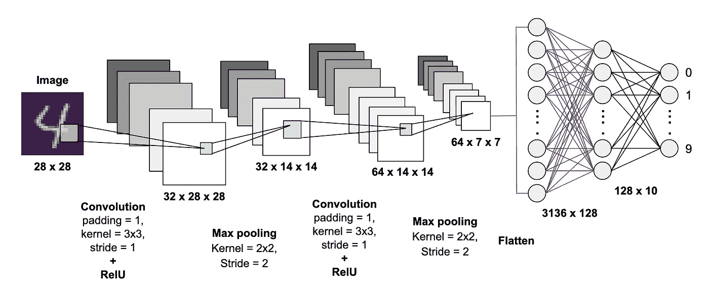

# 卷积神经网络简介

> 原文：<https://medium.com/analytics-vidhya/introduction-to-convolutional-neural-networks-c50f41e3bc66?source=collection_archive---------16----------------------->

用于 MNIST 手写数字分类的卷积神经网络

神经网络从生物神经元中获得灵感，生物神经元是生物神经系统的基本单位。对生物神经元建模的第一次尝试是感知器，它是用于二元分类的线性模型。它由具有相关权重的输入层组成，这些权重相加后发送给具有确定阈值的阶跃函数，通常是值为 0.5 的 Heaviside 阶跃函数。神经元的净输入是连接上的权重乘以连接上传入的激活。添加了一个偏置项来考虑每层中的偏置。神经元的最终输出是围绕净输入值的激活函数值。[1]

卷积网络是一种适用于二维
阵列数据的架构，并从其生物学对应物[2]中获得灵感，其中该架构涉及具有相同权重向量的单元的处理和空间阵列中局部感受域的排列。他们的层次结构包括交替的子采样层，类似于初级视觉皮层中的简单和复杂细胞[3]。CNN 在任意维度的空间/时间分布阵列之间执行映射，并且通常由以下约束来表征[1]:

1.  **平移不变性:**空间平移对神经权重没有影响
2.  **局部连接:**位于空间局部区域的神经节点具有连接
3.  **空间分辨率逐渐降低:**当特征数量逐渐增加时

一个经典的 CNN 包含交替的卷积层和池层。卷积层的任务是提取图像中位于特定区域的图案。这是通过计算任意卷积滤波器和图像的每个区域的内积来获得特征图来实现的，该特征图通过非线性函数来产生激活，该激活在汇集层中被进一步处理。最常用的汇集函数是 average 和 max-pooling，它们分别选择特定汇集区域中元素的算术平均值和最大值。交替的卷积和汇集层在每一步提取不同的特征。接下来是非线性函数，可以选择 tanh、logistic、softmax 或 relu。最后一层是全连接层，在识别任务中输出单元类[3]。

[1]谭耀辉和陈春生，2019。基于短语的分层 LSTM 网络图像字幕生成器。神经计算，333 页，第 86-100 页。

[2]帕特森，j .，2017。深度学习。第一版。由…编辑 O'Reilly 媒体公司。

[3]博登，m .，2002 年。递归神经网络和反向传播指南。达拉斯项目。