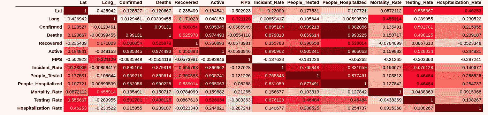
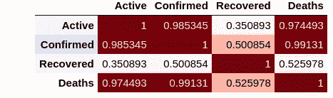
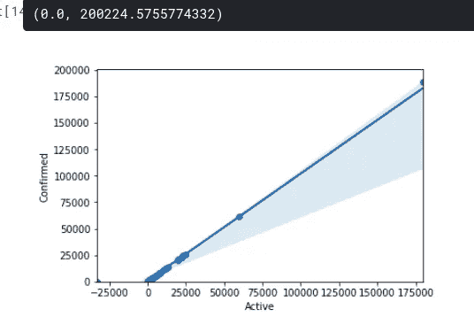
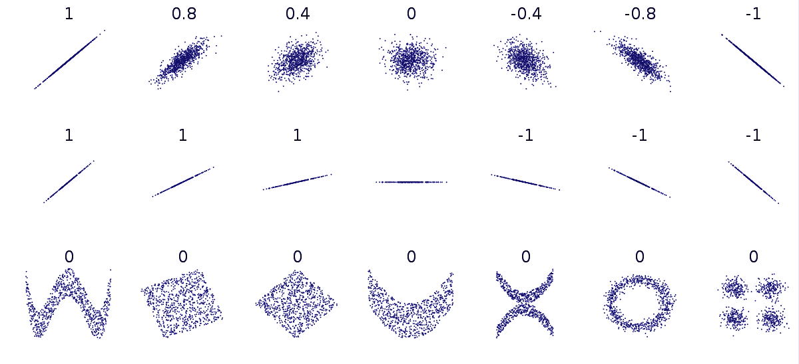
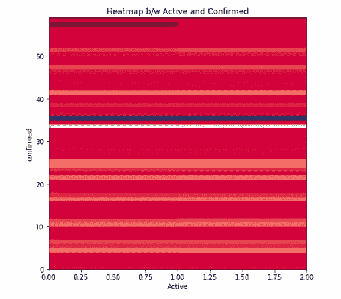

# 数据分析中的相关性介绍

> 原文：<https://medium.com/analytics-vidhya/introduction-to-correlation-in-data-analysis-f6edc25c657c?source=collection_archive---------14----------------------->

“让我们对数据进行一些分析和可视化”

# 有什么关联？

> 它是一种统计技术，用来衡量不同的变量在多大程度上是独立的。换句话说，随着时间的推移观察变量的行为，如果一个变量发生变化，另一个变量会受到怎样的影响。

> 让我们举个例子来理解它的图形

我们正在进行分析的数据集是新冠肺炎，它是由[JHU·CSSE](https://github.com/CSSEGISandData/COVID-19)给出的。

> 我们可以使用方法计算 int64 或 float64 类型变量之间的相关性，并绘制所有变量的相关性热图:

```
df.corr().style.background_gradient(cmap='Reds')
```



> 现在，让我们找出以下各列之间的关联:
> **、确诊、死亡、痊愈、**和标图热图之间的关联。

```
df[["Active", "Confirmed", "Recovered", "Deaths"]].corr().style.background_gradient(cmap='Reds')
```



> 现在，我们将使用散点图来显示这两个变量，并添加一条称为回归线的线性线，它指示这两个变量之间的关系。

```
sns.regplot(x=”Active”, y=”Confirmed”, data=df_covid)
plt.ylim(0,)
```



> 因此，正如你所看到的，通过数据点的直线非常陡峭，这表明两个变量之间存在正线性关系。
> 假设如果直线下降，那么这两个变量之间存在负线性关系。

# 相关统计

> 测量连续数值变量之间相关性强度的一种方法是使用一种叫做**皮尔逊相关的方法。**
> 
> **皮尔逊相关:**是衡量连续数值变量之间相关强度的方法。
> 它给出了两个变量分别是:
> 1。相关系数
> 2。p 值

## **我们来讨论一下，得出一些结论:**

**相关系数:**给出变量之间的关系。
如果值、

> 接近 1 →大正关系
> 接近-1 →大负关系
> 接近 0 →无关系(if，x=y)

P 值:我们对计算出的相关性有多确定。
如果值、

> P 值<0.001 → Strong certainty in the result.
> P 值< 0.05 →结果的中等确定性。
> P 值< 0.1 →结果确定性弱。
> P 值> 0.1 →结果不确定。

**强相关性:**

> **→** 相关系数接近 1 或-1
> →P 值小于 0.001



下图显示了不同相关值的数据。

```
**from** scipy **import** statspearson_coef, p_value **=** stats.pearsonr(df['Active'], df['Confirmed'])print("The Pearson Correlation Coefficient is", pearson_coef, " with a P-value of P =", p_value)
```


```
df_2 = df_covid[["Active", "Confirmed"]]
f, ax = plt.subplots(figsize=(7,7))
plt.xlabel("Active")
plt.ylabel("confirmed")
plt.title("Heatmap b/w Active and Confirmed")
plt.pcolor(df_2, cmap = 'RdBu')
plt.show()
```



# 结论

> 在本文中，我们已经完成了数据分析中相关性的基本介绍。我希望你从中学到了一些东西。更多更新敬请关注。如果你有疑问，那么评论区就是你的了。我会尽我所能回答你的问题。如果你喜欢这篇文章，并从中学到了一些东西，那么请鼓掌。
> 
> 谢谢。

# 参考

[](https://github.com/kpiyush04/covid-19-Data-Analysis-beginner-level) [## kpiyush 04/新冠肺炎-数据分析-初级

### 数据分析初级。有助于 kpiyush 04/新冠肺炎-数据分析-初级水平的发展，创造一个…

github.com](https://github.com/kpiyush04/covid-19-Data-Analysis-beginner-level)