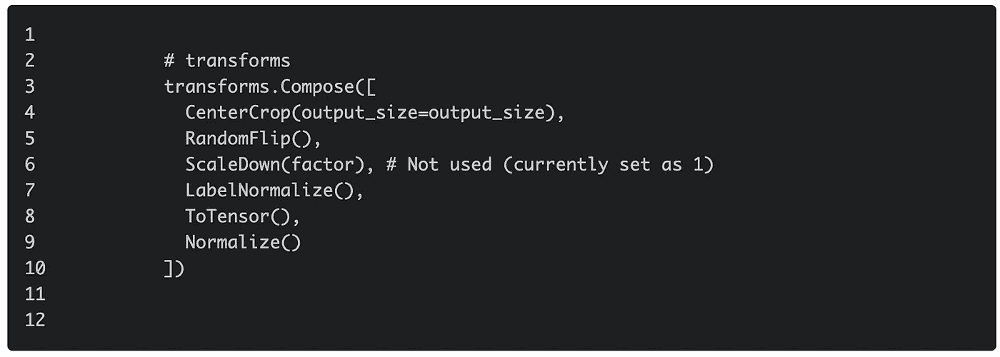

# 人群密度估计简介

> 原文：<https://medium.com/analytics-vidhya/introduction-to-crowd-density-estimation-bc60223f363b?source=collection_archive---------4----------------------->

转载自[原帖](https://www.katnoria.com/crowd-density/)

在这篇文章中，我们将建立一个基于简单网络架构的对象计数模型。尽管我们在这里使用了群体数据集，但类似的解决方案也可以应用于更有用的应用，例如计数细胞、作物、水果、树木、牛，甚至是野生濒危物种。

在给定的图像中，有不同的方法来计数对象。可以利用基于 R-CNN 的模型进行对象检测，如下例所示

这很好，但是当你有更多像图 1 这样的人时，你该怎么办呢？同样的假设成立吗？我们可以访问 R-CNN 及其变体所使用格式的带标签的数据集吗？

图 1，来源:上海理工大学数据集

在这篇文章中，我们将使用预先训练好的 ConvNet 作为主干，并使用回归头来计算人群，从而构建尝试解决这一问题的模型。

网络架构非常简单，我认为这可以称为人群密度估计任务的“Hello World”(如果您知道更简单的方法，请原谅我的无知)。

高水位流量

如果我们叠加输出，即图像上的密度图，我们可以看到每个人的头部被突出显示。这些突出显示的点是我们希望我们的模型学会估计的。为了得到总数，我们将这些点加在一起。

来自上海理工大学数据集的样本图像和密度图

# 资料组

我们使用在这篇[论文](https://www.katnoria.com/crowd-density/Single-Image%20Crowd%20Counting%20via%20Multi-Column%20Convolutional%20Neural%20Network)中介绍的人群计数数据集。该数据集被称为“上海科技馆人群计数数据集”，它具有任意人群密度的图像以及目标标签。我们在数据集的 A 部分训练我们的模型。然而，为了方便起见，我们没有使用数据集提供的密度图，而是使用由 [C3 框架](https://github.com/gjy3035/C-3-Framework)生成的经过处理的图。C3 框架是一个极好的资源，它涵盖了多种网络架构及其在不同数据集上的性能。我鼓励你看看报纸和他们的回购协议。

训练集直方图

下面我们展示了数据集中的一些样本图像。我们还在每张图片下方显示了相关的密度图。注释数据集一定是一项艰巨的任务。

数据集示例

# 预处理

在整个实施过程中，我们遵循 C3 框架使用的指导方针和技术。C3 框架在 PyTorch 中使用了以下扩展/转换:

中央裁剪(至 224) →随机翻转→按比例缩小→标签规格化(100) →总传感器→规格化

Pytorch 中的图像转换

# 模型

在本帖中，我们将使用 VGG16 作为模型的主干。一旦我们准备好了完整的培训和评估基础架构，我们就可以轻松地添加更强大的模型，并将其性能与基线模型进行比较。

# 基线模型

作为我们的基线，我们将使用预训练的 VGG16 网络，然后是 2 个 Conv 层和上采样层，以匹配目标密度图(m x n)。回想一下，我们通过一个缩放因子来缩小输入图像和目标，所以最终的图层需要考虑到这一点。

GitHub 上的代码: [models.py](https://github.com/katnoria/crowd-density/blob/master/src/models.py#L9)

## 估价

我们将首先检查模型能够在多大程度上过度拟合训练数据。我们通过比较实际和预测的人群数量来可视化它的性能。每个选项卡显示给定输入尺寸的图像预测。模型越好，离对角线越近的点越多。正如您在下面的图中看到的，对于群组≤ 1000 的图像，该模型做得相对更好。然而，随着人群数量的增加，它的性能开始受到影响。这是为什么呢？我留给你去发现(提示:和输入大小有关系😉)

参见[原文](https://www.katnoria.com/crowd-density/)查看三个不同标签的剧情

现在让我们回顾一下我们的模型得到的图像以及它遇到困难的图像。这里，我们显示了来自训练集和测试集的图像。

我注意到两件事:1)预测更好的图像只包含人 2)图像中头部的方向。另一个重要的见解是，随着输入图像大小的增加，模型的性能开始变得更好。查看 224x224 和 448x448 选项卡中的图来确认这一点。

来自测试集的样本似乎也证实了带有许多不同对象的图像(例如树和人)给模型带来了困难。最后一幅图像对人眼来说也是困难的。

# 带解码器的 VGG16

我们现在转向另一个简单但更强大的模型，它也使用预先训练的 VGG16 作为主干。我们使用 CONV 和 CONVTRANSPOSE 层，C3 的论文将这些层称为解码器。

GitHub 上的代码: [models.py](https://github.com/katnoria/crowd-density/blob/master/src/models.py#L49)

我们用与基线模型相同的超参数训练这个模型 400 个时期。

参见[原文](https://www.katnoria.com/crowd-density/)查看不同标签中的情节

根据 C3 框架，这两个模型将具有相当的性能，但带有解码器的 VGG16 将生成更精确的密度图。我们可以在下面的表格和示例中看到这一点。我们的数字与 C3 框架报告的数字相差甚远，我认为这主要是因为他们使用了更高的输入量来训练他们的模型。

最后，我们将两个模型生成的密度图叠加在给定的图像上。我们看到 VGG16 基线在实际计数的✅in 项上是点，但是 VGG16 +解码器生成更紧密的密度图。

模型预测法

您可以尝试增加输入大小，并自己摆弄模型。如果你能得到足够好的模型，你也许可以帮助回答谁的集会上有更多的人的问题🤣。代码可在我的 [GitHub Repo](https://github.com/katnoria/crowd-density) 上获得。如果你没有注意到，如果你悬停在封面图像上，你会看到由 VGG16 解码器生成的密度图。

> 对于不同型号的更彻底的评估，查看我的补充职位[这里](https://www.katnoria.com/crowd-density-eval/)。

来源:https://www.katnoria.com/crowd-density-eval/

# 下一步怎么样

您可以尝试调整超参数，找到正确的学习速率和/或模型架构，以获得更好的性能。如果我想让它有用的话，下面是我下一步要尝试的事情:

1.  添加正规化
2.  使用强大的主干，如 Resnet 变体
3.  使用 C3 框架中的其他模型
4.  假设我们只有 300 个样本(就 DL 而言非常低)，您可以尝试 U-Net，它在细胞分割等任务上表现很好
5.  在空间上将图像划分为称为闭集的子区域，在闭集上训练模型，如论文“从开集到闭集:通过空间分治计数对象”所建议的。作者声称，这种方法泛化能力很好，可以在几个人群计数数据集上实现最先进的性能
6.  使用“基于编码器-解码器的卷积神经网络，具有用于人群计数的多尺度感知模块”一文中强调的基于编码器-解码器的方法。他们声称他们的模型可以在密集和稀疏的人群中表现良好。

## 参考和链接

1.  C3 框架:我从这篇论文和他们的代码[ [论文](https://arxiv.org/abs/1907.02724) | [GITHUB](https://github.com/gjy3035/C-3-Framework) ]中学到了很多
2.  基于 CNN 的单一图像人群计数和密度估计的最新进展调查[ [链接](https://arxiv.org/abs/1707.01202)
3.  U-Net:用于生物医学图像分割的卷积网络
4.  从开集到闭集:通过空间分而治之[ [链接](http://arxiv.org/abs/1908.06473)计数对象
5.  基于编码器-解码器的卷积神经网络，具有用于人群计数的多尺度感知模块[ [链接](https://arxiv.org/abs/2003.05586)