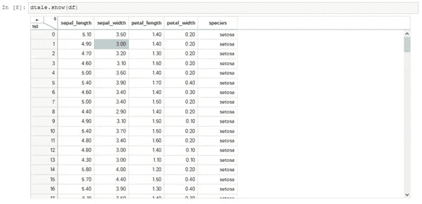
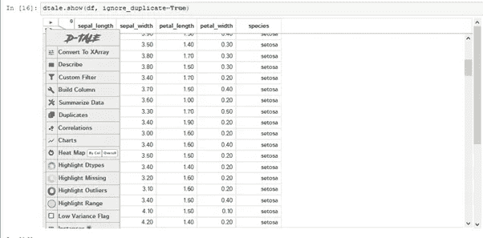
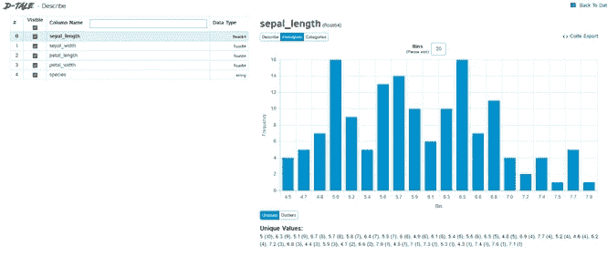
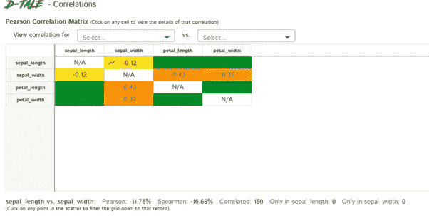
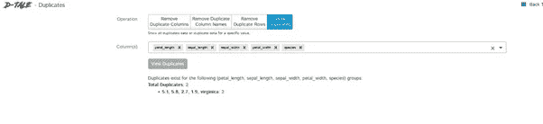
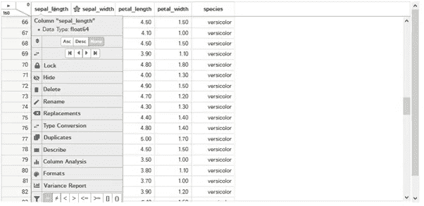
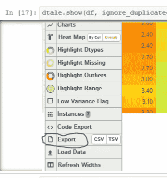

# D-Tale 图书馆简介

> 原文：<https://medium.com/analytics-vidhya/introduction-to-d-tale-library-fabb369c5d91?source=collection_archive---------18----------------------->

D-Tale 是可视化熊猫数据结构的 python 库。D-Tale 是基于 Flask 和 React 的交互式图形用户界面工具。D-Tale 是可视化和分析 pandas 数据结构的最简单的方法之一。

D-tale 库的安装:

Pip 安装数据表

#康达环境

康达安装有限公司

正在导入 dtale 库。使用 seaborn 库加载数据集。在这里，我使用虹膜数据集。

dtale.show(df)将在 d-Tale 窗口中显示数据帧。

左上角箭头弹出如图菜单。这个菜单有多个功能，如数据集的总结，找出异常值和找出重复。

该图显示了具有特征“sepal_length”的数据集描述。左侧是特征列表，右侧是特征值直方图。

**关联:**热图用于显示数据集的关联矩阵。

**重复:**在数据集中查找重复的实例。

**单个特征分析:**点击如图所示的特征名称，对单个特征进行操作。

**导出修改后的数据集:**以 CSV 或 TSV 格式导出修改后的数据集。

总之，我们已经看到了如何使用 D-tale 库以图形交互方式对 pandas 数据帧进行 EDA 分析。