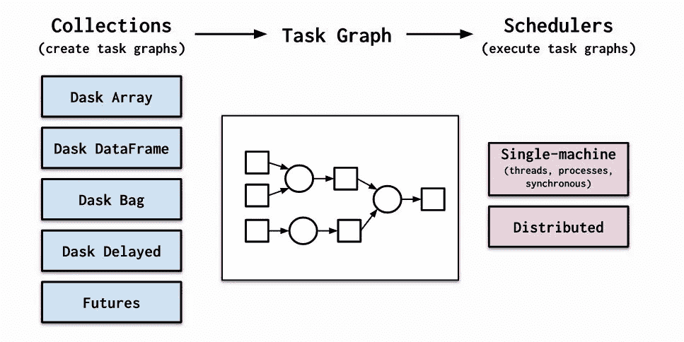
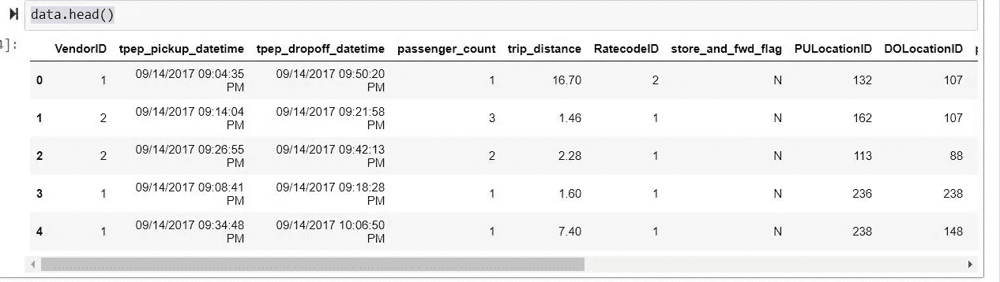
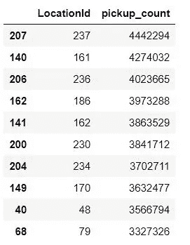
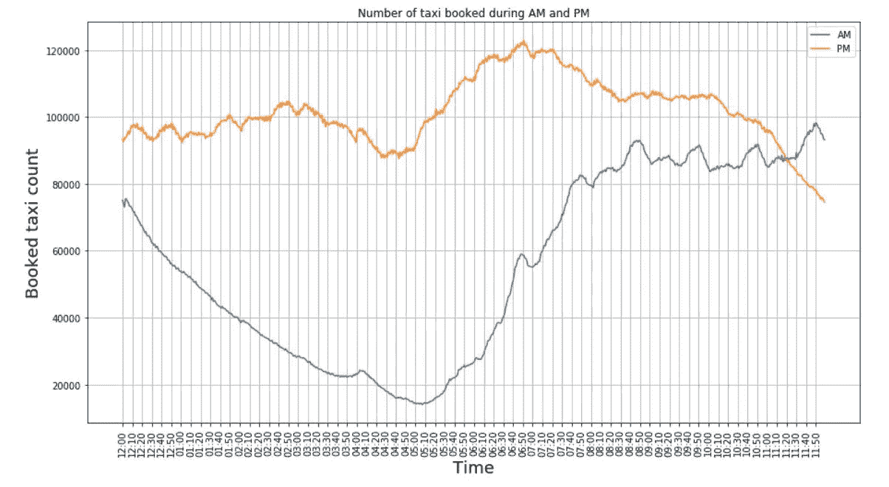
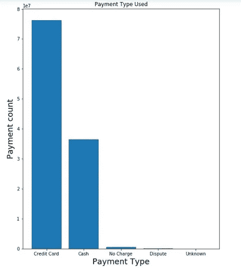
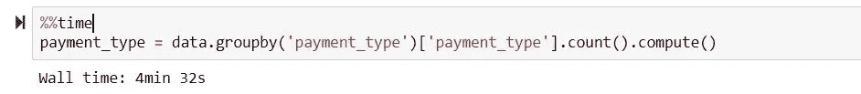
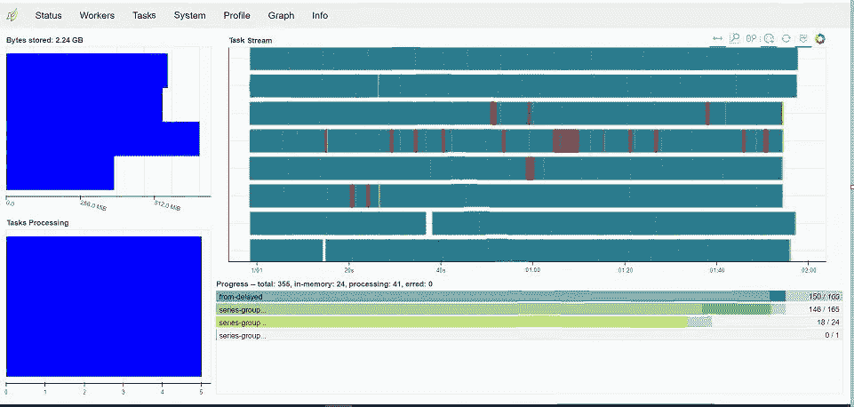

# Dask 简介:处理大量数据的库

> 原文：<https://medium.com/analytics-vidhya/introduction-to-dask-a-library-to-play-with-a-large-volume-of-data-37ed0472d198?source=collection_archive---------14----------------------->

*Dask 是 Python 中一个灵活的并行计算库。它在大于内存的数据集上提供多核执行。*

# **概述**

在这篇文章中，我将解释 dask 如何在你的本地机器上计算一个非常大的数据集。Dask 首先将程序分成许多中等大小的任务或计算单元。这些任务被表示为图中的节点，节点之间的边表示该任务依赖于另一个任务产生的数据。Dask 然后调用任务调度程序以利用并行性的方式执行该图，允许多个独立的任务可以同时运行。

在这篇文章中，我使用了 [*2017 黄色出租车出行数据*](https://data.cityofnewyork.us/Transportation/2017-Yellow-Taxi-Trip-Data/biws-g3hs) 进行分析，其大小为 9.8GB，具有 113，496，874 行和 17 列。让我们看看如何使用 dask 处理如此庞大的数据

# **创建调度程序**

默认的 [Dask 调度器](https://docs.dask.org/en/latest/scheduling.html)通过使用线程或进程在单个机器上提供并行性。这是 Dask 使用的默认选择，因为它不需要设置。Dask 提供了四种调度程序:

1.  **线程**:在同一进程中使用多个线程。这是`dask.array`、`dask.dataframe`和`dask.delayed`的默认调度程序
2.  **进程**:将数据发送给不同的进程进行处理。这是`dask.bag`的默认调度程序，有时对`dask.dataframe`很有用
3.  **单线程:**在单线程中执行计算。该选项不提供并行性，但在调试或分析时很有用。
4.  **分布式:**一个分布式调度器，用于在同一台机器或多台机器的多个工作机上执行图形。它还提供了一个诊断仪表板，可以提供关于性能和进度的宝贵见解

我在本地机器上使用了分布式调度程序进行分析。

> 从 dask.distributed 导入客户端
> client = Client()

导航到[http://localhost:8787/status](http://localhost:8787/status)查看诊断仪表板

# **数据分析**

首先，使用 dask dataframe 加载 csv 数据

> 导入 dask.dataframe 为 DD
> data = DD . read _ CSV(" 2017 _ Yellow _ Taxi _ Trip _ data . CSV ")
> data . head()

让我们尝试使用这个大型数据集来回答几个问题

1.  **哪些地区的接送人数最多？**

为了找出最多的接送位置，我根据接送位置 id 和接送位置 id 对数据集进行了分组，然后统计了这些 id 在数据集中的出现次数。Dask 的`.compute()`方法用于将 dask 集合转换为具体值。

> pick up _ loc = data . group by(' PULocationID ')[' PULocationID ']。计数()。compute()
> 拾音= pd。data frame({ ' location id ':pick up _ loc . index，' pick up _ count ':pick up _ loc . values })
> pick up . sort _ values([' pick up _ count ']，ascending=False，in place = True)
> pick up . head(10)

热门提货地点及其数量

可以使用列名`DOLocationID`对卸货地点重复相同的代码，以获得最上面的卸货地点

**2。绘制出租车接站数随时间的分布图**

我们可以使用`tpep_pickup_datetime`列来绘制出租车载客率随时间的分布图。我已经根据该列对数据集进行了分组，并计算了 groupby 对象中每次的计数。

从图中，我们可以看到最大接站发生在下午 6:50 左右，最小接站发生在上午 5:05 左右。

**3。哪种支付方式最常用于出租车**

我们可以使用列`payment_type`来获得所使用的每种支付方式的计数。

从柱状图中，我们可以看到信用卡是最常见的支付方式。

# 统计数据

让我们看看 dask 在如此大的数据集上计算 groupby 操作需要多少时间

计算 groupby 和 aggregation 方法仅用了 4 分 32 秒。让我们来看看为什么在如此庞大的数据集上计算所需的时间要少得多。我通过访问[http://localhost:8787/status](http://localhost:8787/status)截取了诊断仪表板的截图(如下所示)。我们可以看到操作是在工人之间进行的。所以操作是并行发生的。

**代码链接:**[https://github.com/pradeep1920/Data-Analysis-through-Dask](https://github.com/pradeep1920/Data-Analysis-through-Dask)

# 资源/进一步阅读

1.  [https://docs.dask.org/en/latest/](https://docs.dask.org/en/latest/)
2.  [https://Data . city of new York . us/Transportation/2017-Yellow-Taxi-Trip-Data/biws-g3hs](https://data.cityofnewyork.us/Transportation/2017-Yellow-Taxi-Trip-Data/biws-g3hs)
3.  [https://towards data science . com/speeding-up-your-algorithms-part-4-dask-7c6ed 79994 ef](https://towardsdatascience.com/speeding-up-your-algorithms-part-4-dask-7c6ed79994ef)
4.  https://chih-ling-hsu.github.io/2018/05/14/NYC