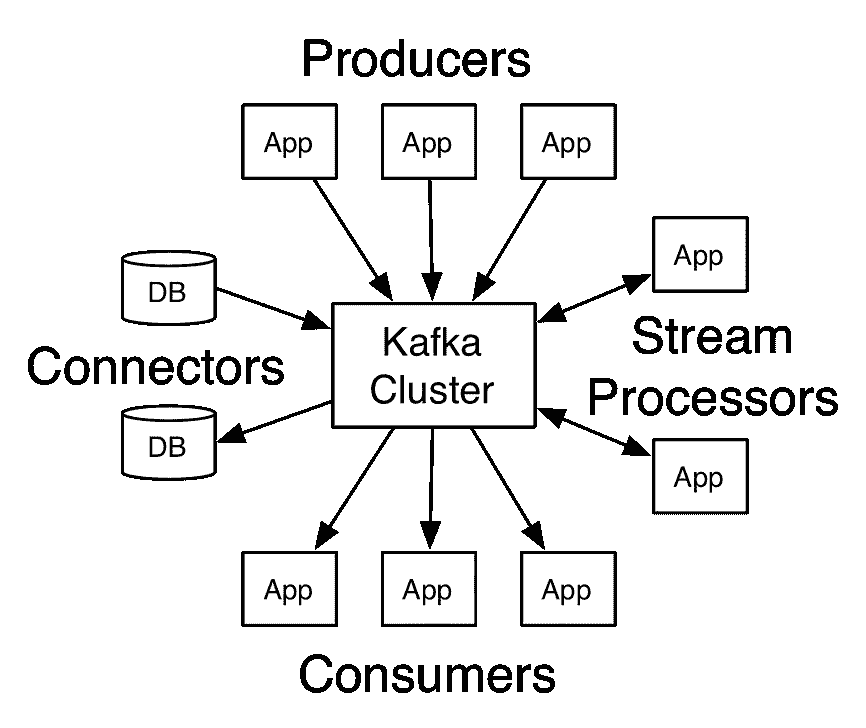
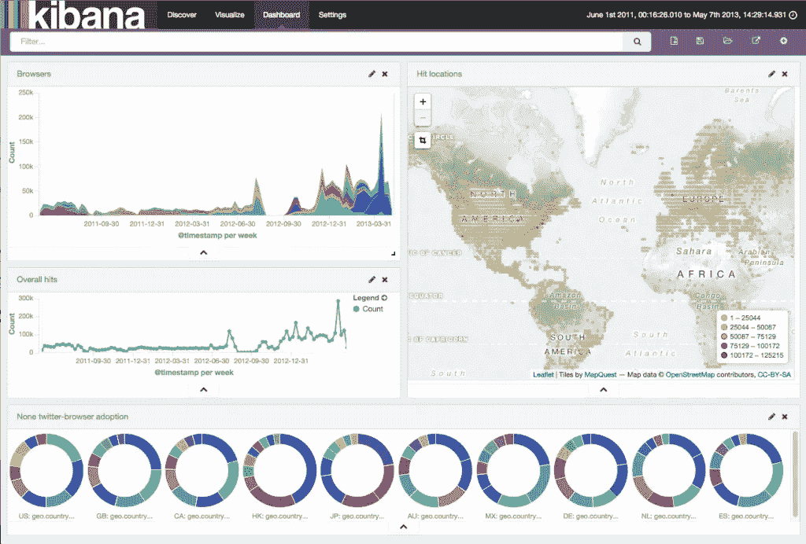

# 数据工程导论

> 原文：<https://medium.com/analytics-vidhya/introduction-to-data-engineering-f287453e0920?source=collection_archive---------14----------------------->

数据工程可以定义为数据处理、分析、可视化等方面的所有工程工作。在深入探讨之前，我们先来谈谈为什么数据工程很重要，它的范围是什么。

数据是公司最重要的资产，因为它是优化公司业务的唯一基础。如果所有团队都可以轻松访问所有数据，就可以用新的令人兴奋的方式利用这些数据。每个人都知道网飞的推荐和个性化引擎，这是一个如何利用客户数据优化业务的完美例子。我们几乎不需要重申数据的重要性；只要想想 Splunk、Elastic、Hortonworks、Cloudera、Teradata 等大数据公司的数量就知道了。

数据科学是数据驱动的决策过程。数据科学的前提是数据工程。数据科学家以统计方式处理数据，以解决各种问题，包括但不限于推荐/个性化、电子邮件定位、市场效率优化。比方说，一家快递公司正在开展广告宣传和促销活动，以促成人们的首次购买。那么衡量他们消费效率的最重要的标准就是第一次购买的成本。在这种情况下，这些指标应该通过一个包含多个维度的图表来可视化，包括位置、目标用户的属性和时间。通常，数据科学家更关注统计建模和数据分析，而数据工程师则致力于提供数据、提取信息并存储数据。

那么，数据工程是如何工作的呢？以交付活动为例，我们需要跟踪我们在哪些媒体上发布了广告并向用户展示了广告，我们在这些媒体上花了多少钱。这个事件信息应该通过管道传输到数据后端，并保存在某个地方。数据管道和存储系统在这里大放异彩。为了建立分析模型，应该对这些原始数据进行处理和重构，以便进行高效的计算。这里需要一个提取-转换-加载(ETL)框架来将数据处理成特定的格式。建立分析模型后，我们需要重申活动目标战略。当用户信息在广告匹配系统中被检索时，该简档信息被更新的目标系统匹配。我们需要一个索引和检索引擎来获取用户配置文件，并与目标模型相匹配。最后，如果我们想要测量活动策略的性能，我们需要用可视化技术画出一个趋势，显示它的性能是变好了还是变坏了。

# 数据管道

让我们简单谈谈每个数据工程组件。首先，数据管道是切入点；它将数据从“A”传送到“B”。“A”可以从业务前端开始，如移动应用程序或网站以及任何中间数据存储。“B”应该是持久存储，使数据持久。数据管道有两种通信模型——“推”和“拉”模型。在“推”模式下，数据从发送方发送到接收方。接收器可以根据配置顺序转发数据，但不会暴露任何提供随机数据访问的接口。阿帕奇水槽，Fluentd，网飞苏洛都遵循这一模式。“拉”模型的工作方式类似，但是它公开 API 来随机使用数据。Apache Kafka 和 Amazon Web Service (AWS)的简单队列服务(SQS)都有 API 来使用带有偏移量或可见性超时的消息。

数据管道领域最受欢迎的项目是[阿帕奇卡夫卡](http://kafka.apache.org)。它由三部分组成——生产者、代理和消费者。生产者在特定的主题下向代理发送消息。代理将它们存储在本地文件系统中。一个主题可以有多个分区，负载可以分布在多台机器上。代理公开一个 API 来获取基于主题、分区和偏移量的数据。偏移量可以被视为简单的消息 ID，从 0 开始单调递增。当消费者向代理发送请求时，代理用一个数据块来响应请求。这些图片来自卡夫卡网站。

Kafka 是一个简单的分布式消息队列，可以作为端点上反压力的缓冲区。说我们要把数据存储到 Elasticsearch 进行分析；然而，弹性搜索的摄取率却在某种程度上降低了。然后，如果消息传入速率快于 Elasticsearch 接收吞吐量，则数据生产者端应该将消息保留在内存中或丢弃它们，以免耗尽内存。只要磁盘空间足够，Kafka 可以保存消息一段时间。此外，Kafka 的性能是各种分布式消息队列中最好的，因为它具有无争用的体系结构。如前所述，Kafka 消息可以基于主题、分区和偏移量进行消费，而无需消费者之间的任何协调。这就是为什么 Kafka 可以支持所有消费者看到所有消息的广播消息。除了广播之外，如果主题有多个分区，来自这些分区的消费可以被分配给多个工作者。例如，如果我们在一个主题中有四个分区，那么工作线程的数量可以是一个、两个甚至四个。对于一个工作者，它将消耗来自四个分区的所有消息，而对于四个工作者，每个工作者将消耗来自单个分区的消息。

通过数据管道，信息将被保存在存储空间，包括 NoSQL 数据库、Elasticsearch 等聚合引擎，以及 HDFS 或 S3 自动气象站等冷文件存储。为了在文件中存储数据，应该仔细考虑文件格式。为了表达结构化数据，通常使用带有 json 字符串的文本文件。然而，为了获得更好的性能，像 parquet 或 ORC 这样的分栏文件格式会更有用。如果我们能够充分利用聚合引擎的能力，我们就不需要在文件系统中存储数据。然而不幸的是，聚合引擎不能做所有的事情。所以为了以后更灵活的分析，所有数据都应该保存在冷文件存储中。

# 数据索引

现在让我们把注意力转向索引和检索。对于具有倒排索引功能的传统信息检索，最受欢迎的选择是弹性搜索。倒排索引是从关键字到文档的映射。如果我们有一堆文档，每个文档可以映射为特定文档 id 下的一组关键字。如果我们“颠倒”这种关系，我们可以构建索引，因为从关键字到文档的映射就像可以在教科书的末尾找到索引一样。Elasticsearch 可以支持流事件的实时索引、各种布尔查询和聚合特性。它有一个伟大的生态系统，如 Logstash(数据管道)和 Kibana(可视化分析用户界面),并有开源社区的支持。下面的图片是从[这里](https://www.elastic.co/blog/kibana-4-literally)截取的。

Elasticsearch 摄取和聚合性能并不完美。由于其索引体系结构——在内存中构建一个不可变的索引，将其刷新到磁盘，然后合并它们——该过程严重依赖于磁盘 IO。此外，Elasticsearch 不支持预先聚合的指标。例如，它需要对数据进行全面扫描，以获得最小值、最大值和平均值等指标。

# 度量聚合引擎

解决这些问题的一个很好的方法是 [Druid(“高性能、面向列的分布式数据存储”)](http://druid.io/)。可以用时间粒度和一系列已定义的指标来配置 Druid。例如，如果我们的数据是显示特定 REST APIs 的响应时间的事件流，那么我们可以配置 Druid 以微小的粒度和平均的响应时间度量来接收数据。然后，Druid 汇总每分钟的平均响应时间，因此不需要扫描单个记录进行进一步的后汇总。

然而，没有灵丹妙药。尽管在某些情况下，德鲁伊可以比 Elasticsearch 表现得更好，但 Elasticsearch 比德鲁伊有一些优势。由于 Elasticsearch 是一个基于文档模型的搜索引擎，索引本身是幂等的，以实体为中心的索引可以有效地实现各种指标。但是 Druid 存储每一行都没有任何文档 id，它的摄取不是等幂的。此外，由于它有许多移动部件，包括严重依赖 Zookeeper 进行分发协调，它的维护和操作不像 Elasticsearch 所需的那样简单。

正如我到目前为止所描述的，数据工程技术主要是由开源社区贡献的。由于每个开源项目都有自己的优点和缺点，所以应该根据遗留环境和工程师的偏好仔细选择。在下一篇博文中，我将讨论流处理。