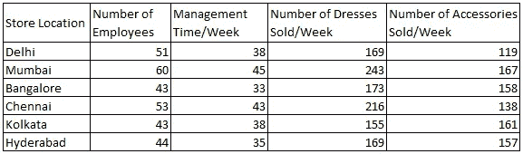
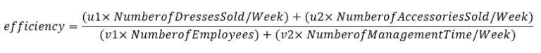
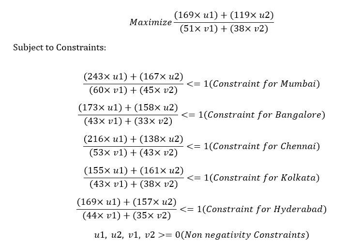
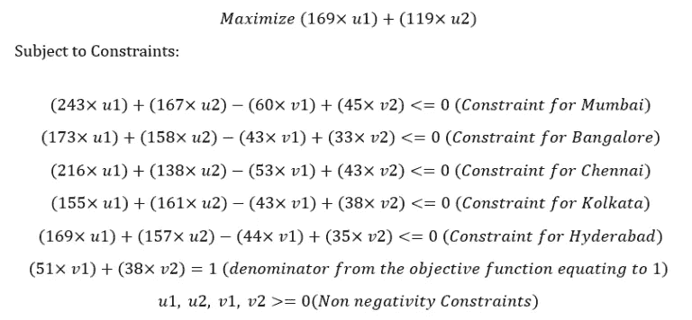
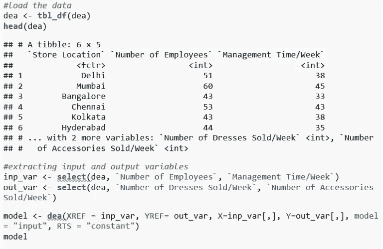
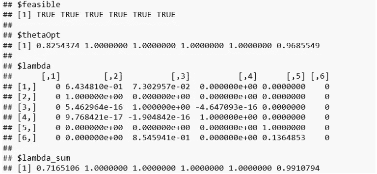
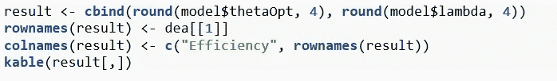
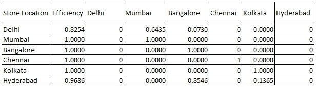
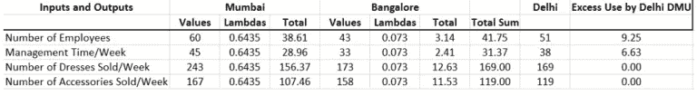

# R 中的数据包络分析简介

> 原文：<https://medium.com/analytics-vidhya/introduction-to-data-envelopment-analysis-in-r-773745549d6a?source=collection_archive---------1----------------------->

图片来源:Shutterstock

作为一名帮助企业做出数据驱动的决策的数据科学家，我一直很好奇，想知道有人如何对组织的可比单位进行绩效分析，并向企业提出建议，如何提高效率较低单位的绩效。在做了这个课题的研究后，我开始了解一种叫做数据包络分析的运筹学技术。

数据包络分析是一种绩效测量技术，用于比较组织中类似单位的绩效。我们正在进行性能分析的单元被称为**决策单元** (DMU)。例如，我们可以比较在德里 NCR 地区经营的所有麦当劳分店，找出哪家分店做得好，哪家不好，然后向不好的分店推荐一些措施，使其表现更好。DEA 在各行各业都有广泛的应用，包括医院、银行、大学等。这种技术通过采用一组输入和输出变量(通常是组织最重要的业务度量)来计算所有 DMU 的效率，然后设置一个基准。这种技术最重要的优点是它可以处理多个输入和输出变量，这些变量通常是不可比较的。DEA 技术在运筹学中非常流行，它使用线性规划的概念来制定和解决手头的问题。

## 让我们举一个例子

现在我们知道了 DEA 是什么，让我们解决一个问题来理解 DEA 背后的概念。假设你是 ABC Stores 的老板，ABC Stores 是一家生活方式零售连锁店，在德里、孟买、班加罗尔、钦奈、加尔各答和海得拉巴有六家分店(这里称之为 DMUs)。您希望找出哪些插座是高效的，哪些是低效的，然后对最高效的插座进行基准测试，为低效的插座提出改进建议。只是为了让我们的生活更容易考虑一个 2 输入 2 输出的问题。作为**输入**的员工数量和管理时间/周，以及作为**输出**的每周售出的服装数量和配件数量

下表显示了上述输入和输出因子的值:

图 1:数据集

现在，每个 DMU 的效率可以计算如下

其中 *u1、u2、v1 和 v2* 分别是输出、输入因子的权重。但是如何计算这些权重呢？为了找出这些权重，我们需要为每个 DMU 解决线性规划问题(如果我们有 n 个 DMU，那么我们需要解决 n 个线性规划问题)

## 线性规划公式

因为我们有六个决策单元，所以我们需要解决六个不同的线性规划问题。我将向您展示如何为一个 DMU 制定 LP，让我们以 DMU1(德里)为例。

目标函数:

由于我们的目标函数是分数，它仍然不是一个线性规划问题。所以我们将使我们的分母等于 1，并将其视为一个约束。修改后的 LP 问题将看起来像

目标函数:

这是 DMU1(德里)的最终 LP 公式。类似地，我们也需要为决策单元制定 LP

## 数据包络分析在 R 中的实现

R 里面有很多包，比如 lpSolve，Benchmarking，FEAR to do DEA Analysis。在这个例子中，我使用的是 **rDEA** 包

请注意，我在下面的代码中使用了相同的数据集(dea ),如图 1 所示。

## 结果和解释

从上表可以清楚地看出，除了德里和海德拉巴网点，其余网点都是高效的。那么，我们应该向德里和海德拉巴(效率低下的城市)推荐什么样的改进措施，才能让它们的表现与效率较高的城市不相上下？这可以通过使用**影子价格**(上表中的λ值，它们是与限制每个单元的效率不大于 1 的约束相关的变量)来实现。对于效率低下的德里和海得拉巴的 DMU，基准 DMU 是孟买、班加罗尔、钦奈和加尔各答，德里的相应影子价格分别为 0.6435、0.0730、0 和 0。因此，对德里的建议如下

德里 DMU 超额使用了 9.25 个单位的员工，而且他们比高效的 DMU 多提供了 6.63 个小时的管理时间。因此，他们应该减少相应数量的员工数量和每周管理时间。类似的比较可以在海得拉巴 DMU 进行。

## 最终注释

DEA 是一种非常强大的性能测量技术，在整个行业中广泛使用。尝试这种技术，找出任何引起你兴趣的单位的效率。你甚至可以找到本赛季 IPL 球队的表现分析，并为下赛季的改进提出建议。