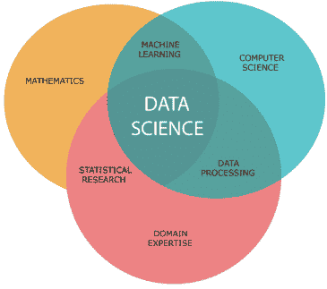
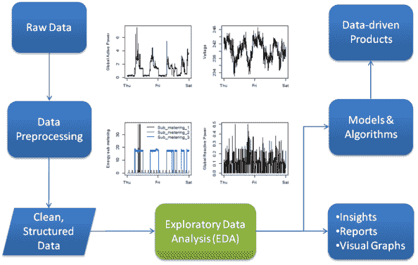
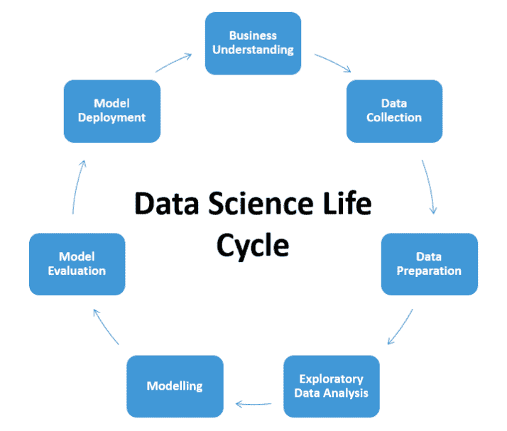

# 数据科学导论

> 原文：<https://medium.com/analytics-vidhya/introduction-to-data-science-28deb32878e7?source=collection_archive---------8----------------------->

## 什么是数据科学？

数据科学是使用数学、编程和领域知识从数据中提取有意义的见解的研究领域。数据科学家将机器学习算法应用于数字、文本、图像、视频等数据，以产生执行需要人类智能的任务的人工系统。使用这些系统，我们从数据中提取见解，并使用它们在各种情况下做出更好的决策。

我们生活在一个充满数据的世界。从交通摄像头到大公司，每天每分钟都会产生大量数据。只需点击一下《脸书邮报》,就可以保存大量关于那次点击的信息。

你有没有想过亚马逊、易贝是如何向你推荐商品的，或者 Gmail 是如何过滤你的垃圾邮件和非垃圾邮件的？如果你想研究这个领域，现在是时候开始更多地了解这些东西了。

## 那么他们是怎么做到的呢？

数据科学就是用数据来解决这类问题。问题可能在于决策，比如识别哪些电子邮件是垃圾邮件，哪些不是。或者是看哪部电影之类的产品推荐？或者预测结果，比如谁将成为下一任美国总统？这也是你获得 YouTube 视频推荐的方式。你看了一个视频，YouTube 会自动在他们的数据库里放一条你看过这个视频的记录。下次当你访问 YouTube 时，你将会看到你之前看过的相同类型的视频。这让你很开心，因为你的最爱会出现在头版。所以 YouTube 决定展示你喜欢的特定类型的视频有助于他们创造用户体验或吸引你更多地进入 YouTube。

**因此，数据科学家的核心工作是理解数据，从中提取有用的信息，并应用这些信息解决问题。**

数据科学是人工智能的未来。因此，了解什么是数据科学以及它如何为您的业务增加价值非常重要。

## 谁是数据科学家？

–**数据科学家:21 世纪最性感的工作**

数据科学家是那些凭借自己在某个科学学科的强大专业知识来破解隐藏问题的人。他们拥有数学、统计学和计算机科学等领域的知识。他们大量使用计算机算法来寻找解决方案并得出对组织的成长和发展至关重要的结论。与结构化和非结构化形式的原始数据相比，数据科学家以更有用的形式呈现数据。

因此，用最简单的话来说，你可以从某个地方获取数据，如果是在一个组织中，很可能是从他们自己的数据仓库中，然后对数据应用一些数学和编程，这样他们就可以找到组织内问题的答案。这些答案可能以图表、仪表盘、演示等形式出现。

## 数据科学项目的生命周期

1.  **定义问题陈述**

理解我们想要解决的问题是数据科学项目的起点。它是对你要解决的问题的简要描述。
**示例**
1)我想增加收入
2)我想在我的网站上向顾客推荐产品。我想预测股票价格

2.**数据收集和准备**

我们需要收集相关的数据来帮助解决我们的问题。
**根据我们试图解决的问题，我们将收集新数据，否则，我们将使用开源数据。**

当我们遇到一个独特的问题，而且以前没有做过相关的研究，我们将不得不收集新的数据。
**例如，**
我们希望了解各公司员工在自助餐厅的平均时间。没有关于这些的公开数据。但是你可以通过各种方法收集数据，如调查、采访员工，以及监控员工在自助餐厅花费的时间。这种方法很费时间。

另一种方法是使用现成的或由他人收集的数据。这些数据可以在互联网、新闻报道、政府人口普查、杂志等等中找到。这种方法耗时较少。
互联网上收集数据的著名地点之一是[**kaggle.com**](http://kaggle.com/)**在那里你将能够找到成千上万的数据集**。****

**因此，在我们获得数据后，在我们开始分析数据(这是下一步)之前，我们必须清理这些数据。在这里，我们将对数据进行各种操作，例如从数据集中消除缺失值，以便执行更好的统计分析。**

****3。探索性数据分析****

**这是最令人兴奋和最重要的一步，因为它有助于我们熟悉数据并获得有用的见解。如果我们跳过这一步，那么我们最终可能会使用不准确的模型，并在我们的模型中选择无关紧要的变量。(这里的**模型**基本上是一个数学算法，将用于解决我们的问题)。**

**在这一步中，我们将使用描述性统计概念(如中心值度量和可变性度量)来理解数据。此外，图形和绘图等可视化方法在这一阶段非常重要，因为它有助于我们更好地理解数据。**

**4.**建立模型****

**建模意味着制定每个步骤，并收集实现解决方案所需的技术。**

**在这里，我们将使用概率和推理统计来建立数据中变量之间的关系，以解决我们的问题。所以在这一步，你的数学技能将受到考验。但是大多数时候，这些涉及到实现结果的计算都是打包好的，并且已经写好供我们作为软件库使用。(**软件库**是放在一起的编程文件的集合。该库由其中的一个或多个算法组成)。但是，掌握数学技巧有助于我们选择正确的算法，并在这些算法上明智地使用参数。**

**5.**数据通信****

**这是我们向利益相关者展示分析结果的最后一步。我们向他们解释我们是如何得出一个具体的结论和我们的重要发现的。大多数情况下，我们需要向非技术观众展示我们的发现，例如营销团队或业务主管。我们需要以简单易懂的方式传达结果。因此，这里我们将使用图表和演示来传达我们的结果。然后，这些利益相关者将使用我们的见解在组织内广泛地制定业务决策。**

**这就是数据科学的基本介绍。希望在下一篇文章中，我们将讨论什么是人工智能(AI)，什么是机器学习(ML)，以及数据科学与 AI 和 ML 的区别。
之后，我们将从一些数学开始开启数据科学之旅。**

**感谢你阅读这篇文章，希望你喜欢(我会写得更好)。**