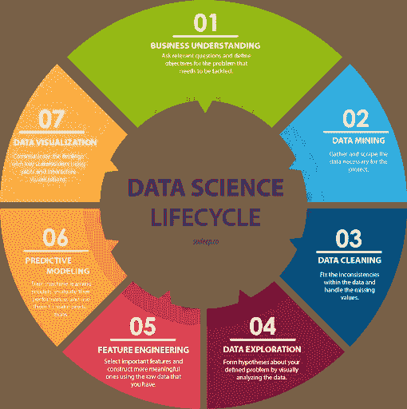

# 数据科学导论

> 原文：<https://medium.com/analytics-vidhya/introduction-to-data-science-38f5e95b11a9?source=collection_archive---------17----------------------->

《数据科学家:有史以来最性感的工作》。"追求数据科学:追求职业生涯的顶级领域之一."

我相信你一定听说过很多关于数据科学这个术语，并且想知道什么是数据科学。今天，我们将讨论什么是数据科学，我们为什么需要它，它在现实生活中有哪些用例。

***数据科学*** *是利用* ***科学*** *的方法、流程、算法和系统，从结构化和非结构化的* ***数据*** *中提取知识和洞察的交叉学科领域。*

## 但是我们为什么需要它呢？

如果我们回到 15 年前，数据通常很少，而且是结构化的格式。以前用 Excel 之类的简单分析工具分析这样的数据很容易。但是现在，随着客户数量与日俱增，我们拥有大量非结构化格式的数据，存储这些数据变得非常困难。大数据通过使用 Hadoop 等工具解决了数据的存储问题。简单的 BI 工具无法处理和分析这种硬数据和非结构化数据。数据科学使使用机器学习和深度学习算法分析海量数据成为可能，并从 it 中提取有意义的见解，帮助各种行业管理和理解数据。

# 数据科学项目包括哪些内容？

[来源](http://sudeep.co/data-science/Understanding-the-Data-Science-Lifecycle/)

## 第一步:业务理解

这一步是任何项目的开始。在这一步，通过提问来理解项目的需求和目标。需求被记录下来，通过询问各种问题来理解项目的目标。

## 步骤 2:数据挖掘

这一步包括收集开始项目的数据。该公司要么提供其客户数据，要么使用 Scrapy、BeautifulSoup 等抓取工具从各个网站抓取数据。

## 步骤 3:数据清理

下一步是清理数据。它包括处理数据中的不一致和丢失的值。我们可以删除缺少值的行。如果缺失值的数量很大，并且删除行将导致大量数据丢失，我们可以用列的平均值或中值替换缺失值。

## 步骤 4:数据探索

在这一步，我们通过直观地分析数据，对我们的问题形成一个假设。我们使用 Tableau、PowerBI 等分析工具。了解各种功能之间的数据和关系，以及这些功能如何相互影响。

## 第五步:特征工程

在这一步中，我们使用数据集中对结果影响最大的所有重要特征，并从原始数据中生成新的特征，以便获得更好的结果。为了更好的分析和更好的结果，我们可以组合两个特征或者移除一些特征。

## 步骤 6:预测建模

这一步包括在数据集的增强版本上训练我们的机器学习模型，并通过查看它可以给出多准确的结果来评估模型的性能，然后使用它来进行预测。

## 步骤 7:数据可视化

在生命周期的最后一步，使用各种绘图和交互式可视化将结果传达给利益相关者。绘制这些图是为了便于向最终用户解释项目的发现。

# 数据科学的使用案例

[来源](https://data-flair.training/blogs/data-science-applications/)

## 卫生保健

如今，数据科学被广泛应用于医疗保健领域。它正被用于各种医疗保健领域，如研究和分析肺部照片，并确定病人是否患有肺炎。这导致了更准确的结果，因为深度学习算法从以前的例子中学习，可以研究人类不可能的复杂模式。这些算法还被广泛用于检测一个人是否在更早的阶段患有癌症，并提供个性化的治疗。

数据科学用于医疗保健的其他领域:

*   医学成像
*   基因组
*   药物发现
*   监测病人的健康状况

## 推荐系统

[来源](https://thedatascientist.com/right-way-recommender-system-startup/)

购物网站、社交媒体平台和媒体服务提供商公司，如网飞和亚马逊 Prime，正在使用推荐系统为客户提供个性化的平台访问。像亚马逊和 Flipkart 这样的购物网站试图了解你的喜好和厌恶，并根据你的喜好推荐商品，或者如果你和其他用户有相同的喜好，它会尝试推荐其他用户的选择。网飞和亚马逊 Prime 根据你喜欢的类型推荐电影，或者如果你和其他用户有相同的兴趣，推荐其他用户的选择。

## 欺诈和风险检测

欺诈是一项价值数十亿美元的业务，每天都在发生，而且每年都在增加。欺诈每天都在发生，包括信用卡交易、手机、纳税申报等。为了防止欺诈，可以使用基于规则寻找欺诈的专家系统。模式识别可用于研究过去发生的所有欺诈的模式和行为，并在未来寻找这些模式以防止欺诈。神经网络也可以用于欺诈检测，因为它们可以研究复杂的非线性模式，并可以提供有价值的见解。

## 定向广告

你有没有遇到过这样的情况，你开始在社交媒体网站和你访问的网站上看到所有关于你几分钟前搜索的内容的广告？这就是所谓的目标广告。所有与你的搜索相关的广告开始出现在你以后访问的网站上。这种策略有助于他们的业务，因为用户发现查看这些网站并购买该公司的产品比搜索互联网上的每个网站更容易。用户的懒惰变成了他们的商业理念，这样，这些公司就赚了几十亿！！！

## 运输

数据科学正被广泛用于制造自动驾驶汽车。在上面的视频中，我们看到司机只是坐着放松，而汽车在没有司机帮助的情况下自己到达了地点。数据科学增强了驾驶体验，因为当汽车自动带他到目的地时，司机可以坐下来。无人驾驶汽车可以自己转弯。乘客的安全也得到了提高，因为它会持续监控道路上任何即将到来的危险，并采取措施通过降低车速来防止任何事故，或者在有深切口时小心转弯。

# 数据科学的先决条件

图片来源:[https://www.corpnce.com/data-science-courses-bangalore/](https://www.corpnce.com/data-science-courses-bangalore/)

上图提到了成为数据科学家所需的技能。需要数学和统计学来理解算法中的数据和复杂变量。计算机编程技能很重要，因为理解算法并在需要时调整算法中的变量很重要。你应该知道所有的机器学习算法，并了解在特定情况下应该使用哪种机器学习算法。您还需要有领域知识来正确理解业务问题。此外，要成为一名数据科学家，你需要具备良好的沟通技巧，因为数据科学家需要善于讲故事。

感谢您阅读我的下一篇博客，如果有任何建议，请随时发表评论！

请随时在 LinkedIn 上与我联系【https://www.linkedin.com/in/nupur-kapur-nk/ 