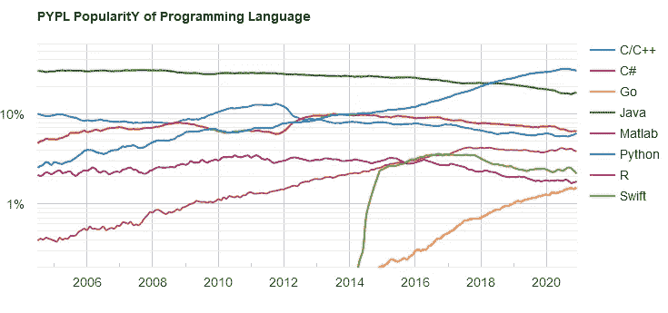

# Python 中的数据结构简介

> 原文：<https://medium.com/analytics-vidhya/introduction-to-data-structures-in-python-a235d5c5b3a4?source=collection_archive---------12----------------------->

## *Python 编程中的关键概念*


由[克里斯多夫·高尔](https://unsplash.com/@cgower?utm_source=medium&utm_medium=referral)在 [Unsplash](https://unsplash.com?utm_source=medium&utm_medium=referral) 上拍摄的照片

Python 是最流行的编程语言之一，具有广泛的应用。它的直接和易于使用的语法使它成为初学者和专家的首选编程语言。据说 Python 是 Stack Overflow 上访问量最大的标签之一，也是增长最快的标签之一。



Python 相对于其他语言的流行趋势。[来源](https://pypl.github.io/PYPL.html)。

在学习应用领域的核心组件和包之前，必须理解 Python 中的以下数据结构:

*   目录
*   一组
*   词典
*   元组

**什么是数据结构？**

数据结构是一种存储、组织和处理数据的格式。它们是构建强大算法的基础结构。

**Python 中的*列表*中的**

> 列表是包含多个项目的数据结构，用逗号分隔，并用方括号括起来。列表中的项目可以是不同的数据类型，包括另一个列表。它可以在创建后修改(可变)。列表中的元素被索引，0 是第一个索引。

我听到了。理论够了，我们来编码吧。

```
# Creating a list with varying elements including another list
dlist = [10,'element',[100,200,'inlist']]
print(dlist)
>>> [10, 'element', [100, 200, 'inlist']]# Accessing elements in a list
dlist[1]
>>> 'element'dlist[0:2]
>>> [10, 'element']dlist[-1]
>>> [100, 200, 'inlist']# Accessing elements inside the embedded list
dlist[-1][2]
>>> 'inlist'# Iterating over a string
list('element')
>>> ['e', 'l', 'e', 'm', 'e', 'n', 't']
```

就像我之前提到的，在 Python 中 index 是从 0 开始的。但是当我提到[0:2]时，你一定想知道为什么列表中的第三个元素没有被打印出来。这是因为当访问像[0，range]这样的列表时，只返回(range-1)索引之前的元素。如上所示，可以使用多个方括号来访问嵌入式列表中的元素。

列表提供以下功能:

1.  附加
2.  插入
3.  流行音乐
4.  去除
5.  分类
6.  扩展

```
# Adding a new element to the list
dlist.append('new_append')
>>> [10, 'element', [100, 200, 'inlist'], 'new_append']# Inserting a new element using index
dlist.insert(1,'position_one')
>>> [10, 'position_one', 'element', [100, 200, 'inlist'], 'new_append']# Removing value from the list
dlist.remove('element')
>>> [10, 'position_one', [100, 200, 'inlist'], 'new_append']# Pop out the last element in the list
dlist.pop()
>>> 'new_append'
print(dlist)
>>> [10, 'position_one', [100, 200, 'inlist']]# Pop element using index
dlist.pop(1)
>>> 'position_one'
print(dlist)
>>> [10, [100, 200, 'inlist']]# New list created & sorted with inbuilt function
nlist = [50,20,70,40]
nlist.sort()
print(nlist)
>>> [20, 40, 50, 70]
nlist.sort(reverse=True)
print(nlist)
>>> [70, 50, 40, 20]# Extending a list with elements from another list
dlist.extend(nlist)
print(dlist)
>>> [10, [100, 200, 'inlist'], 70, 50, 40, 20]# Lists can also be concatenated
clist = nlist + dlist
print(clist)
>>> [70, 50, 40, 20, 10, [100, 200, 'inlist']]
```

*   默认情况下，列表的排序函数具有参数(reverse=False)，这意味着如果调用排序函数，列表将按升序返回
*   如果(reverse=True)，列表将按降序返回
*   extend 函数从作为参数传递的列表中获取所有元素，并将它们追加到调用列表中
*   append 函数不会以同样的方式工作。将列表作为参数传递给函数会将其作为列表元素附加到调用列表中，如下所示

```
dlist.append(nlist)
print(dlist)
>>> [10, [100, 200, 'inlist'], 70, 50, 40, 20, [70, 50, 40, 20]]
```

*   列表理解在以清晰简洁的方式帮助代码方面扮演了一个有趣的角色
*   列表理解比循环更有效

查看下面的例子，了解如何操作。

```
# Using for loops with list
a = [1,2,3,4,5]
b = []
for i in a:
    if i%2!=0:
        b.append(i*2)
    else:
        b.append(i)
print(b)
>>> [2, 2, 6, 4, 10]# Using list comprehension
a = [1,2,3,4,5]
b = [var*2 if var%2!=0 else var for var in a ]
print(b)
>>> [2, 2, 6, 4, 10]
```

***在 Python 中设置***

> 集合是无序的，不能包含重复值。无法使用索引访问集合项目。集合中的项目用大括号{}括起来。

```
# Creating a set
var = {'alphabet','item','element'}
print(var)
>>> {'alphabet', 'element', 'item'}# Iterating over a string
set('element')
>>> {'e', 'l', 'm', 'n', 't'}vel = {'item','term','ball'}# Intersection of sets
vel.intersection(var)
>>> {'item'}# Difference of sets
var.difference(vel)
>>> {'alphabet', 'element'}# Union of sets
var.union(vel)
>>> {'alphabet', 'term', 'item', 'ball', 'element'}# Removing element from a set
var.remove('item')
var
>>> {'alphabet', 'element'}
```

*   集合的交集返回两个集合中都存在的元素
*   集合差返回存在于调用集合中，但不存在于作为参数传递的集合中的元素
*   集合的并集返回所有放在一起的不同元素
*   当我们需要列表中的不同元素时，Set 函数也可以派上用场
*   “issubset”函数帮助检查调用集合的所有元素是否都出现在作为参数传递的集合中

```
# selecting distinct elements from a list
lst = ['a','a','b','c','d','e','d']
set(lst)
>>> {'a', 'b', 'c', 'd', 'e'}# subset check
a = {1,2,3,4,5}
b = {2,3}
b.issubset(a)
>>> True
```

***Python 中的字典***

> 字典是无序的集合，用花括号{}括起来，存储为键值对。

*   可以使用键而不是索引来访问字典中的元素
*   如果我们有一个对多个值使用相同键的字典，存储的值将是用最后一个键映射的值

```
# Creating a dictionary
d = {'country':'India','currency':'rupees','capital':'Delhi'}# Accessing element from dictionary
d['currency']
>>> 'rupees'# Same key with multiple values
d = {'country':'India','capital':'Delhi','currency':'dollar', 'currency':'rupees'}
d
>>> {'country': 'India', 'capital': 'Delhi', 'currency': 'rupees'}# Modifying values in a dictionary
d['capital'] = 'New Delhi'
d
>>> {'country': 'India', 'capital': 'New Delhi', 'currency': 'rupees'}# Adding new element to the dictionary
d['culture'] = 'Diverse'
d
>>> {'country': 'India','capital': 'New Delhi','currency': 'rupees',
 'culture': 'Diverse'}
```

*   字典在快速访问元素时非常有用，它们使用散列法
*   它不会像列表一样遍历所有的条目来查找值。而是使用键直接访问项目值

```
ldict = {'country':'India','capital':'Delhi',
'MCs':['Chennai','Delhi','Kolkata','Mumbai']}# Accessing keys, values of a dictionary
ldict.keys()
>>> dict_keys(['country', 'capital', 'MCs'])ldict.values()
>>> dict_values(['India', 'Delhi', ['Chennai', 'Delhi', 'Kolkata', 'Mumbai']])# Accessing respective key-value of each element
ldict.items()
>>> dict_items([('country', 'India'), ('capital', 'Delhi'), ('MCs', ['Chennai', 'Delhi', 'Kolkata', 'Mumbai'])])# Accessing value using get function
ldict.get('country')
>>> 'India'# Accessing one of the above in the form of a list
list(ldict.keys())
>>> ['country', 'capital', 'MCs']
```

*   词典快捷、易用、灵活
*   可以使用 update 函数扩展一个字典，以容纳来自另一个字典的键值对

```
# Updating a dictionary
nd = {'first':'one','second':'two'}
ldict.update(nd)
ldict
>>> {'country': 'India',
 'capital': 'Delhi',
 'MCs': ['Chennai', 'Delhi', 'Kolkata', 'Mumbai'],
 'first': 'one',
 'second': 'two'}# Removing an element from the dictionary
del ldict['second']
ldict
>>> {'country': 'India','capital': 'Delhi','MCs': ['Chennai', 'Delhi', 'Kolkata', 'Mumbai'],'first': 'one'}
```

**Python 中的*元组*中的**

> 元组是另一种类似于列表的数据结构，但是它们是不可变的。它们是有序的，并且可以使用索引来访问值。这些值用逗号分隔，并用括号括起来。

*   一旦创建了元组，就不能添加、删除或修改任何元素
*   元组可以有重复的值，因为它们是索引的

```
# Creating a tuple
tup = (1,2,4,2,5)
tup
>>> (1, 3, 4, 3, 5)# Count of occurrence of value
tup.count(3)
>>> 2# Index of a value
tup.index(5)
>>> 4# Max and min values from a tuple
min(tup)
>>> 1
max(tup)
>>> 5# Concatenating tuples
tt = (5, 6, 7, [10, 30])
tup+tt
>>> (1, 3, 4, 3, 5, 5, 6, 7, [10, 30])# Membership
6 in tt
>>> True
```

尽管元组是不可变的，但是如果可变对象存在于元组中，则该对象的值可以被修改。与列表类似，使用值的索引可以对元组进行切片操作。

```
# List within a tuple
tt = (5,6,7,[10,20])
tt
>>> (5,6,7,[10,20])# Slicing values in a tuple
tt[1:3]
(6, 7)# Modifying the value inside the list
tt[3][1] = 30
tt
>>> (5, 6, 7, [10, 30])
```

*   元组迭代比遍历列表更快
*   当向函数传递多个参数或在响应中获取多个值并分配给相应的属性/字段时，元组打包和解包是最有用的操作

```
# Unpacking the values from a tuple
x,*y,z = (1,2,3,4,5,6,7,8)
x
>>> 1
y
>>> [2, 3, 4, 5, 6, 7]
z
>>> 8# Packing & Unpacking
t = (’data’, 'analysis’, 'munging’, 'science’)
w,x,y,z = t
w,x,y,z
>>> (’data’, 'analysis’, 'munging’, 'science’)
```

***汇总***

我们在本文中涉及的概念:

*   数据结构意味着什么
*   Python 中内置的数据结构
*   数据结构提供的功能

虽然这只是对数据结构有多有效的概述，但我已经认识到理解这些概念对于用 Python 编程是至关重要的。要了解更多信息，请参考 Python 数据结构[文档](https://docs.python.org/3/tutorial/datastructures.html)。

***包装完毕***

感谢到目前为止的所有人，我希望这篇文章对你有所帮助。请在评论中分享您的反馈/疑问。现在，是时候开始您的 Python 之旅了。开始运用你今天学到的知识。祝你好运！

这是我的第一篇文章，我想在转到数据科学之前先介绍 Python 编程中的关键概念。如果你觉得这篇文章很有趣，并且对数据科学/机器学习充满热情，点击 [*关注*](/@mahadeveaswar) *并随时在*[*LinkedIn*](https://www.linkedin.com/in/mahadev-easwar/)*上添加我。*