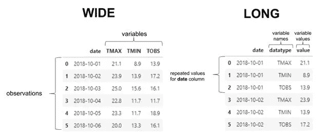
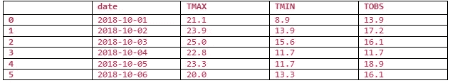
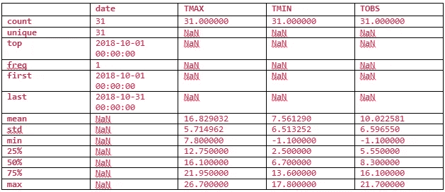
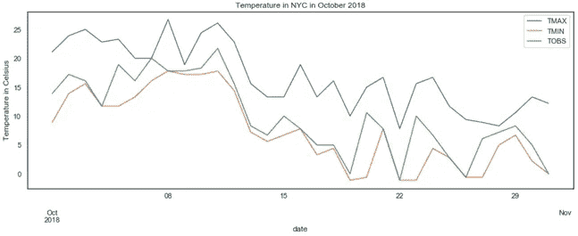
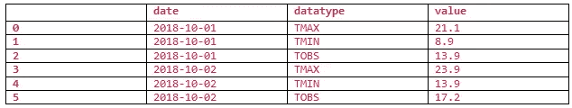
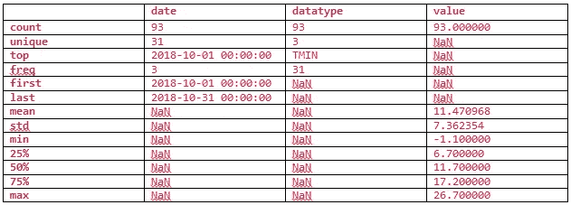
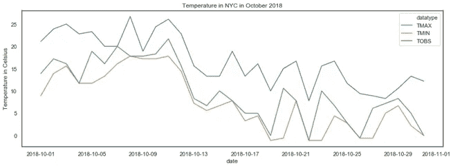
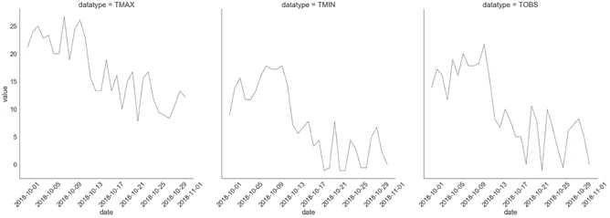

# 数据争论简介

> 原文：<https://medium.com/analytics-vidhya/introduction-to-data-wrangling-88c1b5e747cb?source=collection_archive---------2----------------------->


米卡·鲍梅斯特在 [Unsplash](https://unsplash.com?utm_source=medium&utm_medium=referral) 上的照片

当我们执行**数据争论**时，我们将输入数据从原始状态转换成一种格式，在这种格式下我们可以对其进行有意义的分析。数据操作是指这一过程的另一种方式。没有固定的操作列表或顺序；唯一的目标是，数据后争论对我们来说比我们开始时更有用。

在实践中，数据争论过程涉及三个常见任务:

*   数据清理
*   数据转换
*   数据丰富

本文节选自帕克特出版社出版的斯蒂芬妮·莫林所著的《熊猫数据分析》一书。这本书涵盖了数据分析师和科学家如何收集和分析数据的基本理解，机器学习(ML)算法来识别模式等等。在本文中，我们将学习数据争论的基础及其过程。

# 数据清理

对我们的数据框架进行第一轮数据清理通常会给我们提供开始研究数据所需的最少数据。需要掌握的一些基本数据清理任务包括:

重新命名

排序和重新排序

数据类型转换

重复数据删除

解决缺失或无效数据的问题

过滤到所需的数据子集

数据清理是数据争论的最佳起点，因为将数据存储为正确的数据类型和易于引用的名称将为探索和争论机会开辟许多途径，例如汇总统计、排序和过滤。

# 数据转换

通常，在一些初始的数据清理之后，我们将到达数据转换阶段，但是完全有可能我们的数据集在其当前形状下是不可用的，并且我们必须在尝试进行任何数据清理之前重新构造它。在**数据转换**中，我们专注于改变数据的结构，以便于我们的下游分析；这通常包括更改哪些数据沿着行，哪些数据沿着列。

我们将发现的大多数数据要么是宽格式**要么是长格式**；每种格式都有其优点，知道我们需要哪种格式来进行分析是很重要的。通常，人们会以宽格式记录和呈现数据，但也有一些可视化要求数据采用长格式:****

****

**宽格式是分析和数据库设计的首选，而长格式被认为是糟糕的设计，因为每一列都应该是自己的数据类型，并且具有单一的含义。然而，在向关系数据库的表中添加新字段(或删除旧字段)的情况下，数据库的维护人员可能会决定使用长格式，而不是每次都要修改所有的表。这允许他们为数据库用户提供固定的模式，同时能够根据需要更新数据库中包含的数据。构建 API 时，如果需要灵活性，可以选择长格式。也许 API 会提供一种通用的响应格式(日期、字段名称和字段值),可以支持数据库中的各种表。这可能还与使响应更容易形成有关，这取决于数据如何存储在 API 使用的数据库中。因为我们会发现这两种格式的数据，所以了解如何使用这两种格式并从一种格式转换到另一种格式很重要。**

```
import matplotlib.pyplot as plt
import pandas as pd

 wide_df = pd.read_csv(‘data/wide_data.csv’, parse_dates=[‘date’])
 long_df = pd.read_csv(‘data/long_data.csv’, usecols=[‘date’, ‘datatype’, ‘value’], parse_dates=[‘date’])
[[‘date’, ‘datatype’, ‘value’]] # sort columns
```

# **宽数据格式**

**对于宽格式数据，我们用它们自己的列来表示变量的度量，每一行表示这些变量的一个观察值。这使得我们可以很容易地跨观测值比较变量，获得汇总统计数据，执行操作，并呈现我们的数据；但是，有些可视化不支持这种数据格式，因为它们可能依赖长格式来拆分、调整和/或着色绘图内容。**

**让我们来看看 wide_df 中宽格式数据的前六个观察值:**

**`wide_df.head(6)`**

**每列包含特定类别温度数据的前六个观测值(以摄氏度为单位)，即最高温度(TMAX)、最低温度(TMIN)和观测时的温度(TOBS)，频率为每日:**

****

**当处理宽格式数据时，我们可以通过使用 describe()方法轻松地获取该数据的汇总统计信息(保存为 wide_df 变量):**

**`wide_df.describe(include=’all’)`**

**我们几乎不需要做任何努力，就可以获得日期、最高温度、最低温度和观测时温度的汇总统计数据:**

****

**正如我们之前所讨论的，上表中的汇总数据很容易获得，并且信息丰富。这种格式也可以很容易地用熊猫来绘制，只要我们准确地告诉它我们想要绘制的内容:**

```
wide_df.plot(kind='line', y=[‘TMAX’, ‘TMIN’, 'TOBS'], x='date', title='Temperature in NYC in October 2018', figsize=(15, 5)).set_ylabel(‘Temperature in Celsius’)plt.show()
```

**Pandas 将每日最高温度、最低温度和观察时的温度绘制成单线图:**

****

****现在不要担心理解可视化代码；这里只是为了说明每种数据格式如何使某些任务变得更容易或更困难..****

# **长数据格式**

**我们可以查看 long_df 中长格式数据的前六行，以了解宽格式和长格式数据之间的差异:**

**`long_df.head(6)`**

**对于变量的每个观察值，长格式数据都有一行；这意味着，如果我们每天测量三个变量，我们每天记录三行观察值。长格式设置可以通过将变量列名转换为数据是变量名称的列，并将它们的值放在单独的值列中来实现:**

****

**请注意，在前面的表中，每个日期有三个条目，datatype 列告诉我们 value 列中的数据是该行的什么。如果我们试图获得汇总统计数据，就像我们对宽格式(long_df，长格式数据)所做的那样，我们得不到有用的信息——知道所有最小值、最大值和其他温度观测值的平均值没有帮助:**

**`long_df.describe(include=’all’)`**

**value 列向我们显示汇总统计数据，但这是汇总每日最高温度、最低温度和观察时的温度。最大值将是每日最高温度的最大值，最小值将是每日最低温度的最小值。这意味着这些汇总数据是无用的:**

****

**这种格式不太容易理解，当然也不应该是我们呈现数据的方式；然而，它使创建可视化变得容易，我们的绘图库可以根据变量的名称给线着色，根据某个变量的值确定点的大小，并为刻面执行分割。**

```
import seaborn as sns
sns.set(rc={‘figure.figsize’:(15, 5)}, style=’white’)
ax = sns.lineplot(data=long_df, hue=’datatype’, y=’value’, x=’date’)ax.set_ylabel(‘Temperature in Celsius’)
ax.set_title(‘Temperature in NYC in October 2018’)
plt.show()
```

**Seaborn 能够根据数据类型列进行子集划分，为我们提供每日最高温度、最低温度和观察时的温度的单独线条:**

****

**Seaborn 让我们指定用于 hue 的列，它根据温度类型给线条着色。然而，我们并不局限于此；有了长数据，我们可以很容易地将我们的图分成小平面:**

```
sns.set(rc={‘figure.figsize’:(20, 10)}, style=’white’, font_scale=2)
g = sns.FacetGrid(long_df, col=”datatype”, height=10)
g = g.map(plt.plot, “date”, “value”)
g.set_titles(size=25)
g.set_xticklabels(rotation=45)
plt.show()
```

**Seaborn 能够使用长格式数据为每个不同的数据类型创建子图:**

****

**虽然有可能使用支线剧情创造一个类似于上一部的*熊猫*和 *matplotlib* 的剧情，但是更复杂的层面组合将会使使用 *seaborn* 变得更加容易。**

# **数据丰富**

**当我们希望丰富数据时，我们可以将新数据与原始数据合并(通过添加新的行或列),或者使用原始数据创建新数据。以下是使用原始数据增强我们的数据的方法:**

****添加新列**:对现有列的数据使用函数来创建新值**

****宁滨**:将具有许多不同值的连续数据或离散数据转换成范围桶，这使得列是离散的，同时允许我们控制列中可能值的数量**

****汇总**:汇总数据并汇总**

****重采样**:以特定间隔聚合时间序列数据**

**总之，在本文中，我们学习了数据争论及其过程的基础知识。要了解更多数据争论的细节，请查阅帕克特出版社出版的《T2 与熊猫的动手数据分析》一书。**