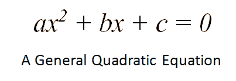
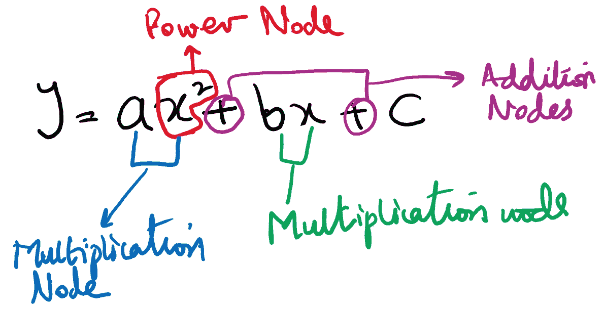
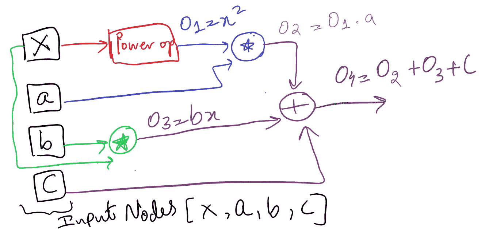
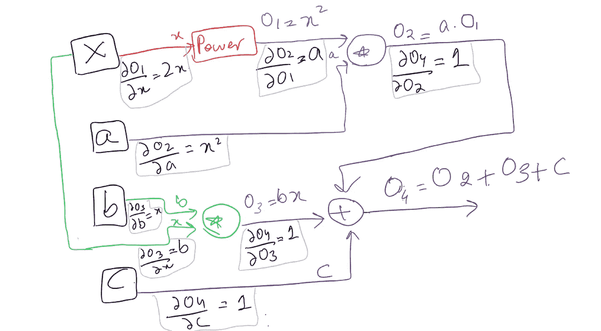
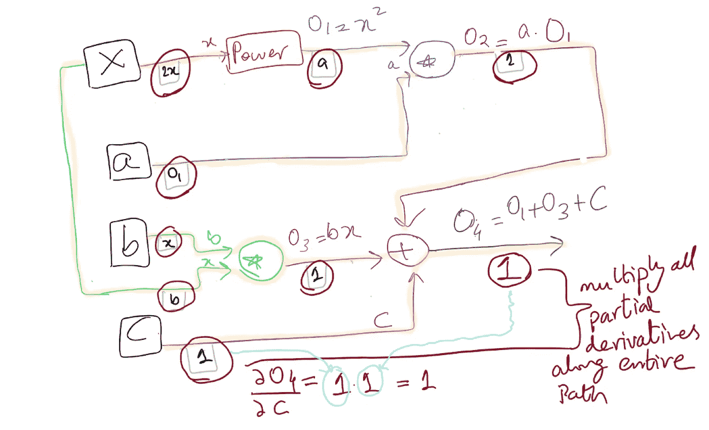
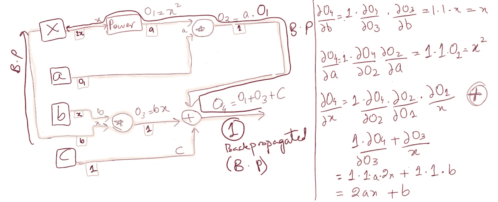
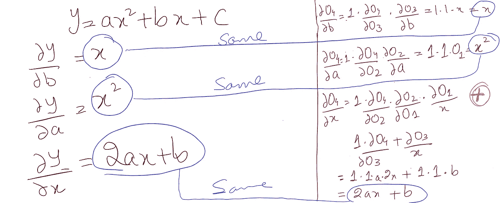
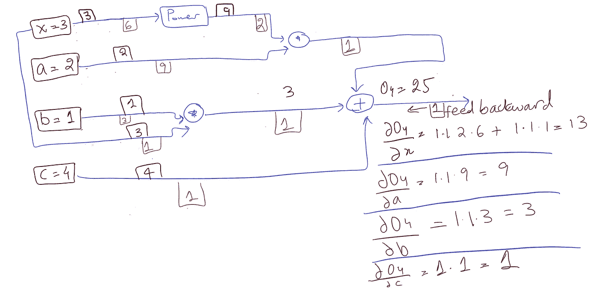
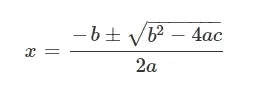

# 介绍作为深度神经网络基础的数据流图

> 原文：<https://medium.com/analytics-vidhya/introduction-to-dataflow-graphs-as-basis-of-deep-neural-networks-19b0b0346dc1?source=collection_archive---------14----------------------->

# 介绍作为深度神经网络基础的数据流图

“深度神经网络”——这个流行词已经存在了很长一段时间，其应用范围从文本分类到自动驾驶汽车，照片真实感图像生成，音乐创作，机器人以及更多尚未流行的应用。有趣的是，事实是，在所有这些超级智能应用的核心，实际上只是漂浮在这些看似复杂的系统下的一系列数学衍生品。

# 这篇博文的目的是...

从零开始解释作为神经网络 *基础的数据流图的 ***数学。****

# 目标受众是...

具备以下先决条件的任何人:

1.  你知道如何计算函数的偏导数。

# 现在是路线图…..🚵

## 里程碑#1 : [理解数据流图作为神经网络的基础](#306d)

## 里程碑#2 : [数据流图的正向传播](#1a02)

## 里程碑# 3: [数据流图的反向传播](#2223)

## 里程碑# 4 : [前向&在具有数值的数据流图中的反向传播](#2afa)

## 里程碑# 5 : [用几个其他的函数弄脏你的手](#3f47)

## 里程碑# 6: [最后是结论注释…..](#4bb6)

# 是时候投入进去了！

照片由[陈艾琳](https://unsplash.com/@irexwz?utm_source=unsplash&utm_medium=referral&utm_content=creditCopyText)在 [Unsplash](https://unsplash.com/s/photos/dive-in?utm_source=unsplash&utm_medium=referral&utm_content=creditCopyText) 上拍摄

# 里程碑# 1:理解数据流图作为神经网络的基础

我们将从什么是“数据流图”开始。这只是一个由节点和边组成的图形的时髦词汇。

1.  每个节点代表一个数学计算单位。
2.  另一方面，边代表数学单元/节点的输入/输出。

如果你还是不明白，继续读下去，几分钟后你就会明白了。

**设计一个简单的数据流图**

让我们建立一个二次方程的数据流图

1.  计算出你有多少个操作节点——将整个等式分解成如下单个操作:

原来有 4 个操作节点。

2.简单地放入 4 个操作节点，并插入它们的输入，如下所示:

二次方程流程图

# 里程碑# 2:数据流图的正向传播

正向传播是一个两步过程。
1。计算每个**操作节点**的**输出**2。计算**每个输出**相对于**每个输入**的偏导数

**下面是给定数据流图的正向传播情况:**

****

**数据流图—正向传播**

**边缘上方的**值代表计算模式的输入/输出。另一方面，每个边**下面的**标签表示每个**计算节点**相对于其每个输入计算的****偏导数**。类似地，在神经网络中，前向传播包括将真实世界的数据集输入到流图中，计算每个计算节点的输出，同时缓存偏导数，以便稍后在后向传播中使用。对于上面的数据流图，这是目前的正向传播。******

# **里程碑# 3:数据流图的反向传播**

**反向传播简单地包括遍历从输出节点到每个输入节点的所有可能路径。这样做的时候，我们只是简单地乘以我们在每条路径上遇到的偏导数。这确实是链式法则在起作用，如下所示:**

****

**输入节点 C 的反向传播**

**上图中红色圆圈区域代表我们之前计算的所有偏导数。所有可能的遍历路径都用黄色标出。假设我们对计算最终输出相对于节点 C 的导数感兴趣，这意味着我们将简单地乘以节点 C 和输出之间路径上的所有偏导数(链式法则)。**

> **您可能想知道为什么我们在最终输出的下面添加了一个额外的“1”？这不是必须的，但出于编码的目的，这只是一个惯例，最初将 1 作为反向传播的起点馈入网络，因为任何值乘以 1 都不会改变其值。所以没有火箭科学——只是为了编码！**

**现在，让我们更深入地看看关于其他输入节点的导数。**

****

**所有节点的反向传播—流程图**

> *****想知道为什么要知道反向传播时 XYZ 框架会自动为你计算吗？*****
> 
> **这是我给你带来的，由 Andrej Karpathy(**特斯拉**的人工智能**主任**、开放人工智能**的**研究科学家**和斯坦福**的**博士生**来读**

**请注意，对于输入节点 X 的导数，我们添加了两条反向传播路径的结果，以获得其最终导数。这也意味着，例如，如果一条路径存在于输入节点 X 之前，这个“增加的”导数的单个值将会沿着存在的任何路径进一步反向传播。**

**为了验证，我们可以使用数据流图交叉检查上面计算的导数公式，就像我们在微积分中直接推导它们一样。**

****

# **里程碑# 4:带有数值的数据流图中的前向和后向传播**

**我们现在将向数据流图输入数值，就像你将数据集输入神经网络一样(将在接下来的博客文章中详细介绍)。**

**假设输入节点 x、a、b 和 c 的值分别为 3、2、1 和 4。只需计算输出(边上的正方形)和偏导数(边下的正方形)的值，如下所示:**

****

**向前和向后传播—数据流图**

> **“+”运算的导数始终为 1，在上面的流程图中也很明显。**
> 
> **“X”运算的导数始终是其输入之间的切换——请参考上图中 2 个乘法节点的偏导数。**

# **里程碑# 5:尝试几个其他功能**

**这标志着数据流图的结束，这些是神经网络的基础。深度神经网络也是由层和神经元组成的数据流图，其中每个神经元本身都是一个数学函数的计算单元(将在后续的博客文章中详细介绍)。流程图的前向和后向传播使神经网络能够从您的数据集中学习模式，以做出超越人类的智能预测！**

## **练习挑战:设计数据流图，并对以下函数执行向前和向后传播:**

1.  **Sigmoid 函数— Sigmoid(x) = 1/(1+exp(-x))**
2.  **二次公式**

****

> **记住，为了验证你的数据流图的真实性，你可以用数学推导出的偏导数来交叉检查从图中的链式法则推导出的导数(正如我们在这里讨论的)**

# ****里程碑# 6:** 最后是结束语……**

****

**你现在知道在神经网络和那些花哨的深度学习框架下发生了什么。**

## **如果您有任何想法、意见或问题，欢迎在下面评论或联系📞跟我上[LinkedIn](https://www.linkedin.com/in/aisha-javed/)**