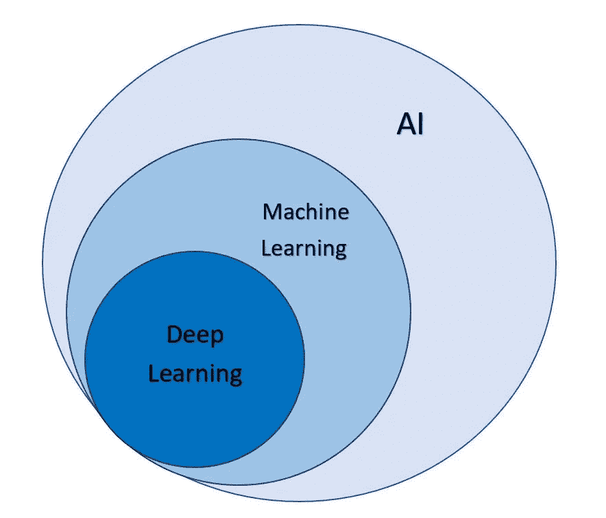
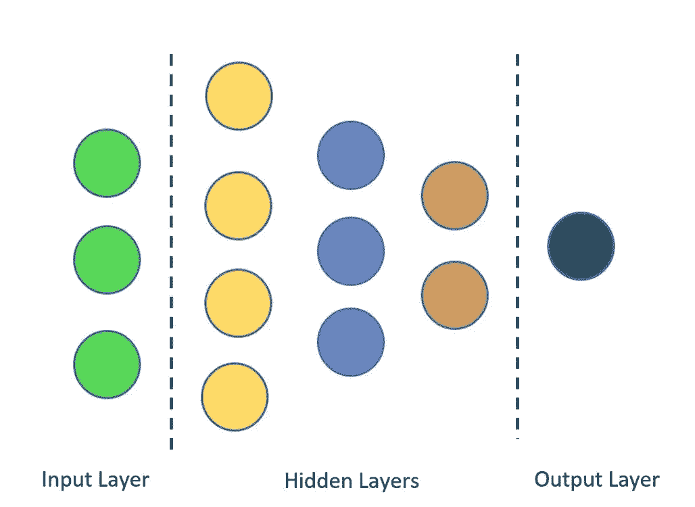
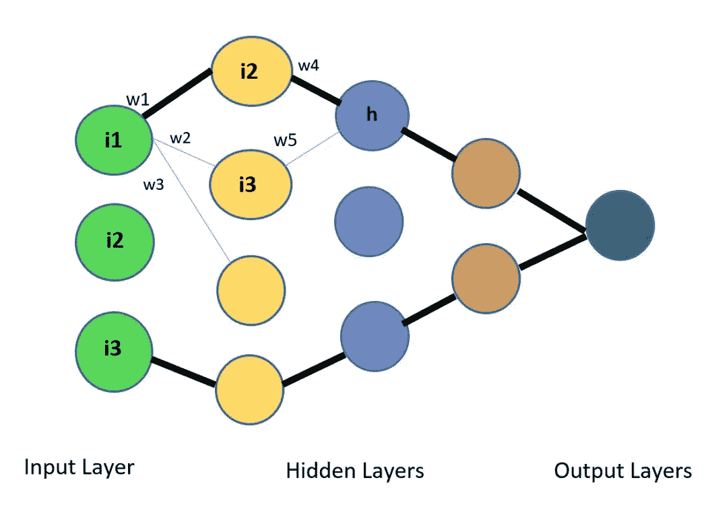

# 深度学习简介

> 原文：<https://medium.com/analytics-vidhya/introduction-to-deep-learning-37d40a4215f6?source=collection_archive---------23----------------------->

深度学习就是这么复杂！

深度学习是受人脑结构和功能启发的机器学习的子集，也称为人工神经网络(ANN)。

这不是一个新概念，但它可以追溯到 1943 年，当时沃伦·麦卡洛和沃尔特·皮茨根据人脑神经网络的工作原理开发了一个计算机模型。他们使用数学和算法的组合来模拟思维过程，他们称之为阈值逻辑。在那之后，深度学习缓慢而稳定地发展。在那段时间里，一种被称为反向传播的突破性技术被开发出来，后来又用著名的链式法则对其进行了修改。

深度学习仍然没有完全成熟，但它现在发展得非常快，我们每个月都能看到一些新的东西出现。

现在，我们已经对深度学习的历史有了一些了解，让我们理解当我们谈论人工智能(AI)这个母术语时，它处于什么位置。为了理解 AI、机器学习和深度学习之间的关系，可以参考下面的同心圆图。

AI vs ML vs DL

最外面的圆圈代表 AI，其定义如下:

直到不久前，我们还认为制造计算机的科学和工程行为需要人类的智慧

这是一个非常大的研究领域，研究机器如何通过经验和时间进行学习。人工智能内部的第二个圆圈显示了机器学习，这是人工智能的一个子集或一个主要部分，然后是深度学习领域，这也是机器学习的一个子集，它还包括人工神经网络(ANN)。

深度学习(Deep learning)是人工神经网络的一个广泛使用且更加平易近人的名字，深度学习中的“深度”是指网络中使用的神经元的深度。在 20 世纪 90 年代，由于各种原因，研究人员和科学家不能完全体验深度神经网络。一些原因陈述如下:

1.缺乏大数据的可用性。

2.低计算能力和资源。

3.与今天大量的可用工作相比，研究工作的可用性更低。

由于深度学习是一个巨大的领域，许多研究工作和研究仍在进行中，我们将尝试理解深度学习领域中最常用的神经网络模型，也称为多层感知器(MLP)。

多层感知器(MLP)用于解决许多行业中的各种复杂问题，包括股票分析、图像识别、垃圾邮件检测、异常检测、人脸识别等。

什么是**感知机**？根据 deepai 的说法，感知器是一种用于二进制分类器监督学习的算法。它基本上是一个携带一些数字信息的单层神经网络。

许多感知器聚集在一起形成一个复杂的感知器网络，也称为多层感知器。这就是我们如何理解数据中的线性甚至非线性模式和趋势。

**MLP 的工作**

当许多神经元相互连接以创建一个网络时，它们之间就有信息的传递，这种工作方式与由数十亿神经元组成的人脑的工作方式非常相似，这就是为什么它被称为有史以来最伟大的创造。在 MLP 有三种类型的层:

**输入图层**

这是网络的初始层，它将输入传送到输出。

**隐藏层**

隐藏层是大部分动作发生的所有层。每个神经元都被赋予一个权重，它们通过许多激活函数*,这些函数只不过是用来计算每个神经元输出的数学函数。*

***输出层***

*在输出层，神经网络做出最终决策并给出结果。*

**

*神经网络中的层*

*MLP 使用前馈神经网络，这意味着我们输入的数据在从输入层到输出层的前进方向上从左向右移动。*

*如上所述，两层之间的连接被赋予**权重**。这个元素携带了关于神经元的非常有用的信息，对于 MLP 的学习过程非常关键。*

**

*密集连接的网络*

*连接网络外部神经元的黑线描绘了网络是密集且紧密连接的，意味着网络中的所有神经元都是相互连接的。*

*例如，节点 **h** 的计算可以是:*

***h = i2.w4 + i3.w5***

*这是一个简单的线性方程，显示了节点的计算。*

***反向传播***

*这是另一种突破性的技术，用于使用输出作为输入来优化 MLP 的权重。*

*在正常的多层感知器中，随机权重被分配给连接，我们得到的输出往往与预期或实际输出不同。两个值之间的差异称为**误差。**误差是我们需要减少并达到最接近预期值的输出值。*

*这里反向传播开始发挥作用。这是一个从输出到输入在网络中逆向进行并自动重新调整权重的过程，最终我们得到一个最接近期望的结果，然后我们说网络中的权重是最优的，误差也是最小的。*

*为此，我们利用梯度或当前节点相对于前一节点的微分。重复这一过程，直到产生正确的输出。*

*你可以通过阅读一些媒体上的博客，或者通过学习一些谷歌搜索就能找到的课程，来深入了解反向传播的工作原理。非常感谢你在这个理解什么是深度学习的甜蜜旅程中坚持和我在一起，我们也能够对多层感知器的工作有一个非常基本的了解。*

*参考*

*[https://www . analyticsinsight . net/The-history-evolution-and-growth-of-deep-learning/#:~:text = The % 20 history % 20 of % 20 deep % 20 learning，to % 20 mimic % 20 The % 20 thought % 20 process](https://www.analyticsinsight.net/the-history-evolution-and-growth-of-deep-learning/#:~:text=The%20history%20of%20deep%20learning,to%20mimic%20the%20thought%20process)。*