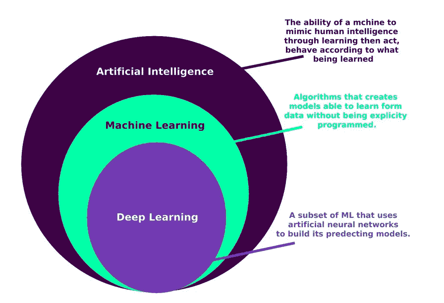
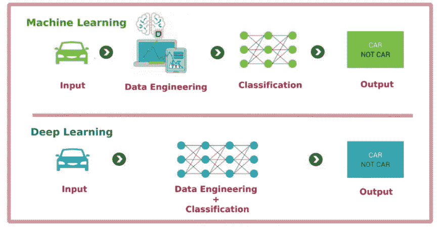
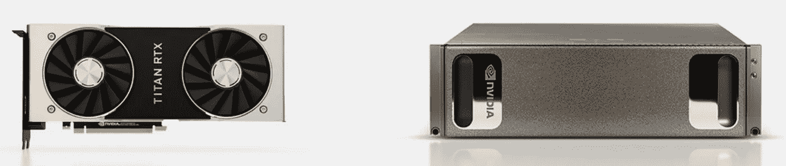
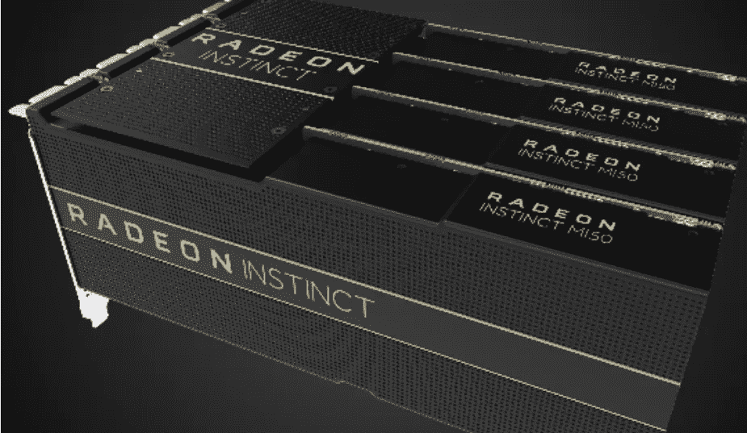

# 深度学习简介

> 原文：<https://medium.com/analytics-vidhya/introduction-to-deep-learning-e3a7899a04a3?source=collection_archive---------22----------------------->

# 深度学习是什么意思？

*深度学习*是*机器学习*的子集，而后者又是*人工智能*的子集，如图 1 所示。***【DL】***深度学习不同于机器学习***【ML】***——也称为浅层学习——它通过利用大量的神经网络、庞大的数据集，在许多问题上提供了更好的性能，并具有在 GPU 上加速计算的能力。如今的大多数人工智能进步，如检测电子邮件中的垃圾邮件、预测股票价格、识别图片中的图像、诊断疾病和自动驾驶汽车，都是由于深度学习的巨大进步和力量。

图 AI、ML 和 DL 之间的关系

# 还有别的区别吗？

是的， ***ML*** 和 ***DL*** 的另一个主要区别在于，在 *DL* 中，解决问题变得更加容易，因为它完全自动化了曾经是机器学习工作流程中最关键的步骤:特征工程。正如在使用 *DL* 对图像进行分类时所发生的那样，我们不会从图片中提取特征，然后将它们引入到一个算法中，就像我们在 *ML* 中所做的那样，而是 *DL* 会自己完成，如图 2 所示。

图 2ML 和 DL 的区别。

# 那么，什么时候使用呢？

机器学习算法具体来说，随机森林和梯度推进(或 XGBoost)用于结构化数据可用的问题，而深度学习用于图像分类等感知问题。

# 什么是神经网络？

人工神经网络是**神经网络是由被称为`preceptron`或`neuron`的小单元组成的。这些*前趋子*与所谓的一组突触(神经末梢)相互连接，或者简单地称为*连接链*(我们将在另一个教程中处理它以及它是如何工作的)。**

图 3 NN-(开源许可图片，来源:谷歌)

# 深度学习中的 GPU 规则

这个标题可以回答为什么深度学习现在变得更有名的问题吗？。

正因为如此，用于解决计算机视觉或语音识别问题的典型深度学习模型可能需要比传统 PC 的 CPU 所能提供的计算能力多几个数量级的计算能力。这种方法刺激了一些大公司，如 NVIDIA 和 AMD，将他们的研究用于 GPU 开发，不仅用于“更现实的游戏”，还用于建模深度神经网络。

VIDIA 推出了 [CUDA 计算平台](https://developer.nvidia.com/about-cuda)，这是其[GPU](https://www.nvidia.com/en-us/deep-learning-ai/developer/)系列的编程接口。

图 4 英伟达 GPU。

一位 MD 还开发了“[镭龙本能](https://www.amd.com/en/graphics/servers-radeon-instinct-deep-learning)GPU 驱动的机器学习解决方案”。

图 5 镭龙本能 GPU

G oogle 透露了它的张量处理单元(TPU)项目:一种全新开发的运行深度神经网络的芯片设计。Colaboratory，简称“Colab”，是谷歌研究院的产品。Colab 允许任何人通过浏览器编写和执行任意 python 代码，特别适合机器学习、数据分析和教育。从技术上来说，Colab 是一种托管的 Jupyter 笔记本服务，无需设置即可使用，同时提供对计算资源(包括 GPU)的免费访问(更多信息。[此处](https://research.google.com/colaboratory/faq.html))。