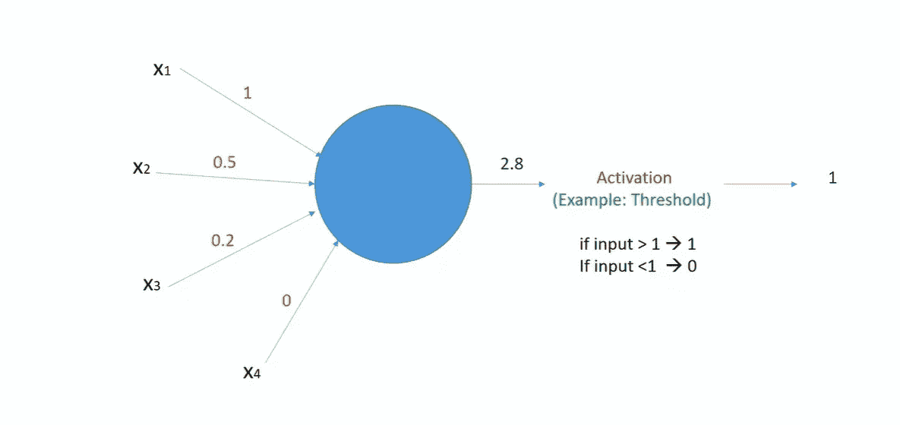

# 通过实时用例逐步介绍分层结构的深度神经网络

> 原文：<https://medium.com/analytics-vidhya/introduction-to-deep-neural-networks-with-layers-architecture-step-by-step-with-real-time-use-cases-ef544580687b?source=collection_archive---------30----------------------->

神经网络

在我们上一系列的深度学习中，我们已经学习了如何通过使用单词嵌入和标记化来为自然语言处理的神经网络准备输入。在这一系列中，我们将尝试理解深层神经网络的核心概念、神经网络的兴起以及神经网络能做什么，我的意思是通过在工业中应用神经网络概念我们能完成的所有任务。我们开始吧

我想说清楚的是，神经网络不是最近才发展起来的。神经网络的发展始于 20 世纪 90 年代，我的意思是 LSTM(长短期记忆)于 1997 年开发，CNN(卷积神经网络)于 1998 年开发。现在你的问题会是为什么这些东西在当时不流行。深度神经网络在 2010 年末流行主要有 3 个原因。我们会试着一个一个去了解。

**原因一:大量数据集的可用性-** 这是深度学习进化的原因之一。早些时候，当我们没有大量数据时，在 2003 年至 2004 年开始从纸质世界向数字世界转变后，数据量开始呈指数增长，并且每年都在增长。只是为了让你明白，我想给你一个信息。2019 年产生的数据超过了 2000 年至 2018 年间产生的完整数据以及 2020 年底将产生的总数据，将超过 2000 年至 2019 年产生的数据。想象一下我们进入大数据世界的速度有多快。主要是深度学习，我的意思是神经网络的概念在 2012 年后开始流行，当时脸书推出了 Alexnet，并能够从 **imagenet** 数据集上的 1000 个标签中正确分类。来到 **imagenet** ，这是一个巨大的图像库，包含 1000 多类 100 多万幅图像。我推荐你去 imagenet 网站，尝试探索那里的东西。

**原因 2:计算能力的发展-** 我可以说这是导致深度神经网络发展的最重要的原因，因为它需要每秒大量的计算来训练神经网络，为了实现这一点，我们需要大量的计算能力，GPU 和 TPU 的发展将我们的梦想变成了现实，还有很多事情要做。正如我们所知，很快我们将进入量子计算的世界。

**原因 3:在 GPU 上部署矩阵乘法的能力，s-** 这与我上面提到的第二个原因有关。NVIDIA CUDA 深度神经网络库(cuDNN)是一个 GPU 加速的深度神经网络原语库。它为神经网络操作提供了高度优化的实现，如反向传播、池化、规范化等等。我将在下一篇文章中解释与深度学习相关的每一个术语。正如我们所知，我们需要将矩阵作为输入传递给我们的神经网络，因此我们需要最大数量的矩阵计算，为了执行这一点，我们需要高计算或并行计算。

通过理解以上三个原因，我们已经看到并理解了为什么深度学习最近开始变得流行。现在，我们将尝试了解深度学习现在主要在哪里使用，我指的是深度学习的所有应用。

**目标检测:**对图像中的每个目标进行基本的定位和分类。这是目前深度学习的广泛应用，我们有许多关于对象检测的用例。我们可以在大都市的交通中应用对象检测。我们可以将这个应用程序用于虚拟考勤系统和医院中。

**图像生成:**这意味着通过神经网络生成相同类型的图像，这意味着如果我们将任何图像给神经网络，它基本上会模仿该图像，并且能够生成相同类型的图像。这也在许多 android 或 ios 设备中广泛用作照片编辑器。基本上用于这个用例的深度学习神经网络是 **GAN 的**。在后一篇文章中，我将带您了解甘的深层架构。此用例的高级模型是 **cycle GAN 的**，通常用于图像到图像的翻译。

**文本到图像合成:**这意味着我们将把输入作为文本提供给模型，它将基于该文本生成图像。这是深度神经网络的编码器-解码器架构的例子。**例如，如果我们给出句子“鹦鹉正坐在树上”,模型将输出一个鹦鹉正坐在树上的图像。关于这种编码器-解码器架构的更多信息，我们将在下一篇文章中讨论。**

**像素到图像:**这意味着从草图的绘制中生成图片。这可以从下图中得到解释。这也是我们将在后面讨论的最重要的用例之一。

像素图像

**图像字幕:**这是深度学习最重要的使用案例之一，我们曾经向网络提供图像，网络理解该图像，并将为其添加字幕。例如，假设我们将给出一个“使用笔记本电脑的男孩的图像”，该模型将解码图像输出为文本“使用笔记本电脑的男孩”。这也是编码器-解码器的架构，我们曾经将图像作为输入，由 CNN 进行编码，编码后的输出提供给 RNN，以将图像解码为文本。

**问题回答:**这也是 NLP 最重要的用例之一，在这个用例中，我们用问答序列来训练我们的模型，并允许我们的模型学习序列和可以使用的序列。**聊天机器人**是最重要的用例，目前在行业中广泛使用。在这个用例中，我们主要使用 RNN 作为编码器和解码器。对于这个用例，现在有许多现代架构，比如我们将在后面讨论的变压器。

我们已经看到了上面列出的关于神经网络的最重要的用例。还有很多，比如图像彩色化，图像修复，机器翻译等等。在我们以后的文章中，我们将试图详细理解每一个用例。

现在，我们将尝试理解神经网络的基本架构。在此之前，我们将尝试理解神经网络的功能，以及在高级神经网络中权重的基本概念。简单来说，假设明天是我的考试，我们必须预测我是否会通过考试，在这种情况下，我们期望的输出 y 是 0(考试失败)，1(考试没有失败)。在这种情况下我们能想到的所有输入是什么？输入可以是“我学了多少”、“我有多聪明”、“我以前的知识”、“我的名字”。现在，我们将把这些输入和输出提供给我们的网络，网络将根据这些输入的重要性自动分配权重。根据我的理解，“我学了多少”的**权重**会更大，因为这是我能否通过考试的重要因素，而“我的名字”这个输入**权重**会更小，因为名字并不能决定一个人能否通过考试。通过用许多这种类型的例子来训练神经网络，我的模型也将开发人类智能，并且将给予名字较少的重要性，而给予“我研究了多少”更多的重要性。这是理解神经网络中的**权重**概念的基本例子。

如果我们理解了上面的例子:现在我们将看到神经网络的基本架构。**我们可以认为神经网络的架构与人脑的架构相同，就像我们过去将术语视为输入一样，根据输入，我们根据不同的不同上下文判断什么输入是重要的，基本上什么要记住，什么要留下，在这个过程中，如果我们将它与神经网络进行比较，我们将借助激活函数来分配权重**。基本神经网络由**输入层、权重、偏置、激活函数、隐藏层和输出层组成。**第一层被称为输入层，这意味着我们从这一层将所有需要的输入传递给模型，在它通过隐藏层和隐藏层中的所有计算后，它被传递给输出层，用于预测和重新学习。在模型训练时，输入和输出都被馈送到网络。这是非常高水平的**。当我们在后面的文章中理解监督、非监督和半监督时，我们将试图理解深层架构。**

****

**非常基本的神经网络架构**

****输入层:**这是任何神经网络的起始层。从这一层，我们用来向模型提供准备好的输入和相应的级别。**

****隐层:**这是神经网络的中间层，这也被称为黑盒。输入层的所有节点都连接到隐藏层的节点。我们可以在网络中有多个隐藏层。每个隐藏层都与激活功能相关联。**

****输出层:**这是负责预测的神经网络的最后一层。隐藏层的每个节点与输出层连接，隐藏层生成的输出被传递到输出层用于评估目的。输出层也与给出等级概率的激活函数相关联。**

****激活功能:**这我们可以理解为一种负责任何神经元激活的阈值。我的意思是，根据价值，它将决定每个输入的重要性，如果需要使用任何输入，那么在非常高的级别上，重要性是什么。我们将在下一篇文章中详细讨论每一个激活函数以及它们的数学函数和图形。**

****重量:**这是模特在训练时学习的东西。当输入传递到基于重要性模型的神经网络时，用于为该输入分配值，并且该值没有任何意义，这是非常高水平的权重。**

**偏见:这也是模型在很高层次上学习的东西。例如，如果将提供摄氏温度作为输入，华氏温度作为输入，则模型将学习从摄氏温度到华氏温度的转换公式，即(x 度 calsius*9/5)+32。这是由神经网络学习的公式，其中 32 被称为偏差。这是模型学习的东西，也是我们用来提供输入时间的东西。在我的下一个教程中，我将使用这个用例，并向您解释如何使用 keras 和完全连接层(即 Keras 中的密集层)实现这种转换的每个步骤。**

**我们已经成功地看到了神经网络是何时进化的？神经网络在行业中有哪些应用？非常高层次的神经网络的基本架构？以及与神经网络相关的不同术语。在我们的下一个教程中，我将向你详细解释神经网络如何一步一步地工作，什么是反向传播，以及使用 python 和 keras 的神经网络的编程实现。另外，如果你想了解更多关于标记化和单词嵌入的知识，你可以通过下面的链接逐步了解更多。**

** [## 通过示例了解 NLP Keras 标记器类参数

### 众所周知，准备输入是完成图像和文本深度学习管道中非常重要的一步…

medium.com](/analytics-vidhya/understanding-nlp-keras-tokenizer-class-arguments-with-example-551c100f0cbd) 

此外，如果有人对云计算感兴趣，他们可以通过我下面的博客逐步了解云计算。

 [## 云计算简介和迈向亚马逊网络服务的第一步

### 在这篇文章中，我将主要关注云计算的基本介绍，我们将尝试了解步骤…

medium.com](/analytics-vidhya/cloud-computing-introduction-and-1st-step-towards-amazon-web-services-22344ac7178e) 

# 敬请关注**