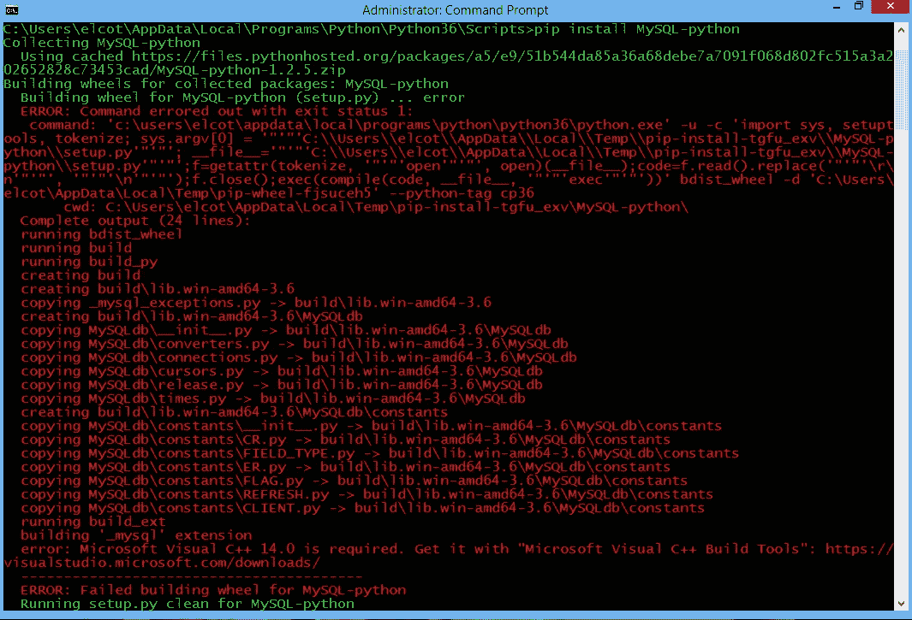

# 异常简介

> 原文：<https://medium.com/analytics-vidhya/introduction-to-exceptions-89fe00dc13c6?source=collection_archive---------22----------------------->

写程序的时候，很多事情都可能出错。我们的程序可能会遇到错误并终止，显示令人畏惧的红色文本。这些错误通常是由程序员的错误、用户的无效数据或资源不可用造成的。

作为程序员，防止应用程序崩溃是你的职责。相反，您希望向用户显示正确的错误消息。

# 异常层次结构

# 异常与错误

**异常:**发生在程序执行过程中，中断了程序的正常流程

**错误:**表示程序中存在严重问题

# 处理异常

假设我们给用户输入年龄的选项。如果用户输入的不是字符串，那么程序会抛出一个“值错误”信息

为了避免程序崩溃，我们可以使用语法“try”和“except”抛出一个异常

在 try 块中输入条件，在条件下可以使用“except NameOfError”抛出异常

在这个例子中，错误的用户输入会返回一个值 error。

下面除了，你写你的信息给用户。

下次我们运行这个程序时，它应该会返回写在 except 语句下面的消息。

这有助于我们的程序不崩溃，并帮助用户找到问题。

# 临时演员

您还可以添加类似于 if 语句的 else 语句。这与 if 语句的功能相同，如果代码的第一个块返回 false，那么它将运行到 else 块并执行 set 任务。

因此，如果用户输入一个整数，那么 else 语句将运行。

# 使用文件

有时我们需要使用外部资源，如文件、数据库、网络连接等。当访问这些资源时，我们必须释放它们。也就是说，在打开一个文件后，我们应该总是在完成后关闭它，否则当我们完成时，另一个进程或程序将无法访问该文件。

最后，下面的代码显示了一个新的子句。无论我们是否有异常，finally 子句总是被执行，并且是释放外部资源的最佳位置。

## With 语句

我们有一个更短、更简洁的方法来实现同样的事情，不需要 finally 子句。

我们可以使用 with 语句自动释放外部资源，而不需要在代码末尾指定它。

我们用 with 语句作为 open 方法的前缀。然后，我们使用“as”来访问函数的返回值