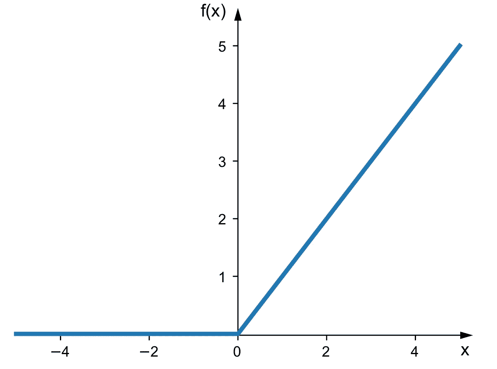
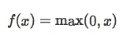
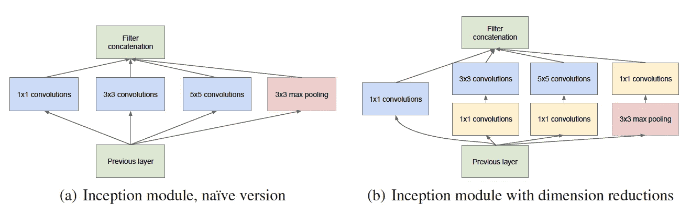

# FaceNet 简介:用于人脸识别和聚类的统一嵌入

> 原文：<https://medium.com/analytics-vidhya/introduction-to-facenet-a-unified-embedding-for-face-recognition-and-clustering-dbdac8e6f02?source=collection_archive---------0----------------------->

FaceNet 研究论文插图


图片来源:Fortinet

面部识别是深度学习最令人兴奋的应用之一。近年来，面部识别系统的采用率显著上升；然而，它最近受到了大量的审查。有各种各样的人工智能爱好者认为，任何类型的面部识别系统的使用都应该得到适当的监管，以防止邪恶的活动。

数据泄露、隐私侵犯等威胁。起源于不小心使用面部识别系统是相当真实的，因此应该采取适当的措施来避免它们，但即使在最近所有的批评之后，你不得不承认它仍然是一个非常有用的应用程序，可以广泛用于使人们的生活变得更好。

FaceNet 提供了一个独特的架构，用于执行人脸识别、验证和聚类等任务。它使用深度卷积网络以及三重损耗来实现最先进的精度。

在本文中，我将解释 FaceNet 研究论文中使用的概念。我把这篇文章分成了以下几个部分

*   介绍
*   三重态损失和选择
*   深度学习基础(SGD、AdaGrad 和 ReLU)
*   CNN 架构
*   估价

**先决条件** —对 CNN 的基本了解。

# 介绍

FaceNet 为人脸识别、验证和聚类任务提供了统一的嵌入。它将每个人脸图像映射到欧几里德空间，使得该空间中的距离对应于人脸相似性，即，与数据集中存在的任何其他人的图像相比，人 A 的图像将被放置得更靠近人 A 的所有其他图像。


图 1:三连败:形象学分——[MC . ai](https://mc.ai/face-recognition-using-one-shot-learning/)

FaceNet 与其他技术的主要区别在于，它从图像中学习映射并创建嵌入，而不是使用任何瓶颈层来执行识别或验证任务。一旦嵌入被创建，所有其他的任务，如验证，识别等。可以使用该特定领域的标准技术，使用这些新生成的嵌入作为特征向量来执行。例如，我们可以通过使用嵌入作为特征向量来使用 k-NN 进行人脸识别，类似地，我们可以使用任何聚类技术来将人脸聚类在一起，并且为了验证，我们只需要定义一个阈值。

> 因此，这里要注意的最重要的事情是，FaceNet 没有定义任何新的算法来执行上述任务，而是创建了嵌入，可以直接用于人脸识别、验证和聚类。

FaceNet 使用深度卷积神经网络(CNN)。训练网络，使得嵌入之间的平方 L2 距离对应于人脸相似性。用于训练的图像被缩放、变换并在脸部区域周围被紧密裁剪。

FaceNet 的另一个重要方面是它的损失函数。它使用三重损失函数(参见图 1)。为了计算三重损失，我们需要 3 个图像，即锚、正和负。我们将在下一节详细探讨三重态损失。

# 三重态损失和选择


图 2:三重态损失

三元组损失函数背后的直觉是，与负面图像(所有其他图像)相比，我们希望我们的锚图像(特定人 A 的图像)更接近正面图像(人 A 的所有图像)。

换句话说，我们可以说，我们希望我们的锚图像的嵌入和我们的正图像的嵌入之间的距离小于我们的锚图像的嵌入和我们的负图像的嵌入之间的距离。

三重态损失函数可以正式定义为—


图 3:三重态损耗公式

如果你不明白这个公式，不要太担心，我会解释每一个术语。只要记住公式背后的直觉，那么记住它就会变得非常容易。


图 4:三重损耗项

这里，上标 a、p 和 n 分别对应于锚定图像、正图像和负图像。

α在这里被定义为正对和负对之间的余量。它本质上是一个阈值，决定了我们的图像对之间的差异。如果我们假设 alpha 设置为 0.5，那么我们希望锚正和锚负图像对之间的差异至少为 0.5。

## 三联体选择

选择正确的图像对是非常重要的，因为会有很多图像对满足这个条件，因此我们的模型不会从它们那里学到很多东西，并且会因此而收敛缓慢。

为了确保快速收敛，选择违反三元组约束的三元组是至关重要的。

我们本质上想要选择以下的——


图 5:硬阳性和硬阴性

如果上面的等式不清楚，那我来澄清一下。

等式(1)意味着给定人 A 的锚图像，我们想要找到 A 的正图像，使得这两个图像之间的距离最大。

等式(2)意味着给定人 A 的锚图像，我们想要找到负图像，使得这两个图像之间的距离最小。

因此，我们在这里只选择了**硬阳性**和**硬阴性**。当我们的模型学习有用的表示时，这种方法帮助我们加速收敛。但是这种方法有一个问题，在整个数据集上计算硬阳性和硬阴性在计算上是不可行的。

这里一个聪明的变通方法是计算小批量的硬阳性和阴性。这里，我们将选择大约 1000–2000 个样本(在大多数实验中，批量大约为 1800)。

> 为了有一个锚正距离的有意义的表示，我们必须确保在每个小批量中有任何一个身份的最小数量的样本。我们将选择每个身份每小批约 40 张脸。此外，随机取样的反面被添加到每个小批量中。

# 深度学习基础

FaceNet 使用带有标准反向投影的**随机梯度下降** (SGD)和 **AdaGrad** 来训练 CNN。初始学习率为 0.05，α设置为 0.2，选择 **ReLU** 为作为激活函数。

我知道我在这里抛出了很多术语，这可能会让这个领域的新手却步，所以，我将尝试简要解释所有上述概念。

## 随机梯度下降—

这是一种优化技术，用于优化我们的损失函数。


图 6:新加坡元:图像信用-数据科学. stackexchange

两个轴(x 和 y)代表重量，第三个轴(z)代表相对于这两个重量的损失。

让我们把这个红点称为点 a，我们将从这个点 a 开始我们的旅程，SGD 背后的直觉是，我们希望以这样一种方式穿越这个类似小山的结构，以达到全局最小值(这个小山的最低点)。现在你可能已经理解了 SGD 的**下降**部分。所以现在我们把重点放在**渐变**部分。

Gradient 只是给了我们 n 维平面上**最陡上升**的方向(类似于导数，决定了一条线的斜率)。

> 这里要注意的关键是，它给出了最陡上升的方向，而不是下降的方向，所以，我们取这个梯度给定值的负值，以便向山下移动。

## 阿达格拉德

AdaGrad 用于生成可变学习率。固定的学习速率在深度学习中效果不佳。在每层用于检测不同特征(边缘、图案等)的 CNN 的情况下。)，固定的学习是行不通的，因为我们网络中的不同层需要不同的学习速率来优化工作。为了更好地理解 AdaGrad，让我们看几个方程。


图 7:阿达格拉德

如果你在看了这么多数学之后还在读这篇文章，那么我想你一定很好奇。所以让我通过分解和解释来帮助你们更好地理解这些方程。

等式(1) —它只是 SGD 的常规权重更新等式。这里我们使用一个固定的学习率(η)。

等式(2) —它是 AdaGrad 的权重更新等式。在这种情况下，我们使用可变学习率(η't)。

等式(3) —它决定了计算可变学习率的公式。

等式(4) —它决定了计算 t-1 的公式。

t-1 只是直到 t-1 的梯度的平方和。“t”是迭代次数。因此，我们只需计算每一步的梯度，并将它们的平方相加，生成 t-1，由于 t-1 会随着每次迭代而变化，因此我们的学习速率也会变化。

## 热卢

ReLU 是我们正在使用的非线性激活函数。在深入研究 ReLU 的细节之前，让我们了解一下为什么我们需要非线性激活函数？我们需要它们，就好像我们只使用线性激活函数，那么本质上我们的输出将只是我们输入的线性组合，而不管我们网络的层数。

另一个要考虑的点是，没有非线性激活函数，我们不能创建可以解决复杂问题的神经网络，即如果我们使用线性激活函数，我们的决策边界将总是线性的。

所以，希望你现在相信我们确实需要非线性激活函数。那么现在让我们了解一下 ReLU 的基础知识。

ReLU 是 sigmoid 和 tanh 激活函数的继承者。我不会在这里详细介绍这些函数，但我会简要解释 sigmoid 和 tanh 中导致 ReLU 发现的问题。因此，sigmoid 和 tanh 的大问题是**消失梯度**，即它们都输出 0 和 1 之间的值，并且在使用反向传播计算梯度时(参考等式(1))，我们必须乘以 0 和 1 之间的各种值。在几次迭代之后，这个值可能变得如此之小和不重要，以至于我们的权重将停止更新。这两种方法的另一个问题是它们的计算成本都很高，也就是说，我们必须计算指数和 tan 等函数，这些函数的计算成本很高。



图 8: ReLU 激活功能:图像信用— [塞巴斯蒂安·拉什卡](https://sebastianraschka.com/faq/docs/relu-derivative.html)



图 9 : ReLU 公式:图像学分— [塞巴斯蒂安·拉什卡](https://sebastianraschka.com/faq/docs/relu-derivative.html)

这里我们可以看到，我们的值既不在 0 和 1 之间，也不需要计算任何昂贵的函数。所以 ReLU 解决了这两个问题。

# CNN 架构

FaceNet 使用两种类型的 CNN，即泽勒&弗格斯架构和谷歌网络风格的初始模型。

我将在这里简单解释一下。

## 1.泽勒&弗格斯建筑公司

泽勒&弗格斯建筑被用来形象化 CNN 的训练过程。我们试图借助这种架构来理解 CNN 的内部运作。这种架构引入了一种新颖的可视化技术，可以洞察中间层的功能和分类器的操作。

这里就不多赘述了。我建议你阅读泽勒的弗格斯建筑研究论文。

FaceNet 研究论文中使用的泽勒&弗格斯架构如下所示。


图 10:泽勒&弗格斯建筑

这个模型有 1.4 亿个参数，每个图像有 16 亿次 FLOPS(每秒浮点运算)。

## 2.初始模型

初始网络架构背后的主要思想是同时使用多个不同大小的过滤器。在任何其他传统网络架构中，我们通常选择大小为 3*3、5*5 等的过滤器，但在 Inception 架构中，我们同时使用多个过滤器并将它们的结果连接起来。



图 11:初始网络

在图 11 (a)中，我们使用了大小为 1*1、3*3 和 5*5 的多个过滤器以及一个最大池层，然后我们将结果连接起来。这是盗梦空间网络架构背后的主要直觉。这种方法的问题是计算量非常大。因此，为了避免这个问题，我们使用 1*1 卷积进行降维。

在图 11 (b)中，我们将每隔一个卷积使用一个 1*1 滤波器，以降低维数并使该架构在计算上可行。

如果你想更详细地理解这个架构，那么我强烈建议你阅读[的《盗梦空间》研究论文](https://arxiv.org/abs/1409.4842)。

FaceNet 研究论文中使用的这种初始模型架构具有 6.6M-7.5M 的参数和大约 500m-1.6 B 的 FLOPS。在 FaceNet 中使用了各种不同的初始模型，其中一些被优化为在手机上运行，因此具有相对较少的参数和过滤器。

# 估价

我们计算真实接受值(TA)如下—


false 接受

真接受是在阈值‘d’处被正确地**分类为*相同*的人脸对。**

我们将错误接受(FA)定义如下—


错误接受

错误接受是被**错误地**分类为*相同的*的人脸对

```
P same - It represents the pair of same identities  
P diff - It represents the pair of different identities
D(xi,xj) -  It is the square L2 distance between the pair of images
d - It is the distance threshold
```

给定人脸距离“d”的验证率(VAL)和错误接受率(FAR)定义为


验证率和错误接受率

# 参考

*   盗梦空间模型—[https://arxiv.org/abs/1409.4842](https://arxiv.org/abs/1409.4842)
*   https://arxiv.org/abs/1311.2901 泽勒&弗格斯建筑公司
*   FaceNet—[https://arxiv.org/abs/1503.03832](https://arxiv.org/abs/1503.03832)

这就把我们带到了本文的结尾。如果你愿意，你可以鼓掌。它是免费的。

我的 [LinkedIn](https://www.linkedin.com/in/dhairya-kumar/) 、 [Twitter](https://twitter.com/DhairyaKumar16) 和 [Github](https://github.com/Dhairya10) 。
你可以查看我的[网站](https://alpha-dev.in/)来了解更多关于我和我的工作。