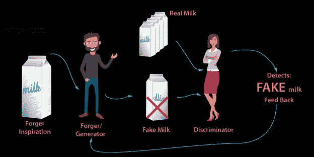

# 甘简介

> 原文：<https://medium.com/analytics-vidhya/introduction-to-gan-ee8217c7dced?source=collection_archive---------20----------------------->

GAN 是
1 后面的一个算法(深度学习方法)。DeepFake
2。FaceApp
3。MRI 转换为 CT 扫描
4。显著提高图像的分辨率
5。去噪图像
6。上色素描潇洒
7。医学影像分割
8。黑白电影转换成彩色电影
9。将 2D 图像转换为三维场景

欢迎光临！！！从图片中获取故事总是一个好主意。这是一个伪造者非常聪明的故事。他卖假牛奶，牛奶店老板能看出来这是假的。伪造者很聪明，因为他开始从店主的反馈中学习。下一次，他生产的假牛奶会少一点，并从反馈中学习。最终，伪造者会比店主更聪明。伪造者最终生产出了接近真奶的牛奶。

恭喜你！！！你已经了解甘了。在这里，伪造者是生产者，而节目所有者是鉴别者。GAN 由两个深度学习模型组成，一个生成器模型和一个鉴别器模型。简而言之，我们可以把甘概括为

1.生产者(伪造者)生产/创造/制造牛奶和

2.鉴别者(牛奶店老板/知道真牛奶和假牛奶的专家)

3.首先，生产者(伪造者)生产牛奶，鉴别者(牛奶店老板)可以分辨出这是假的。从反馈/损失函数中学习，伪造者(生成器)下一次改进，再次鉴别器告诉这是假的，但是这个假的将比第一个假的少。这样，反馈帮助造假者提高牛奶质量，直到时间鉴别器说牛奶是真的。

a.让我们来正式看看

# **1.8 GAN 架构及解释**

图 1.14

**GANs** 或**生成对抗网络**是一个评估生成模型的框架。通过对抗过程同时训练两个模型:生成器，负责生成数据，以及鉴别器，负责估计图像是从训练数据中提取的(图像是真实的)，还是由生成器产生的(图像是假的)。在训练期间，生成器在生成图像方面变得越来越好，直到鉴别器不再能够区分真实图像和伪造图像。

甘受到零和非合作博弈的启发。这意味着如果一方赢了，另一方就输了。零和游戏也被称为**极小极大**。玩家 A 想最大化它的行动，但是玩家 B 想最小化它们。在博弈理论中，当鉴别者(玩家 A)和生成者(玩家 B)达到纳什均衡时，GAN 模型收敛。这是极小极大方程的最优点。

以上文章摘自本书: [**甘用工业用例**](https://www.amazon.in/Generative-Adversarial-Networks-Industrial-Cases/dp/9389423856/ref=sr_1_2?keywords=navin+manaswi&qid=1583916025&sr=8-2)

[**GAN 用工业用例(美国市场)**](https://www.amazon.com/Generative-Adversarial-Networks-Industrial-Cases/dp/9389423856/ref=sr_1_2?keywords=navin+manaswi&qid=1583916025&sr=8-2)

