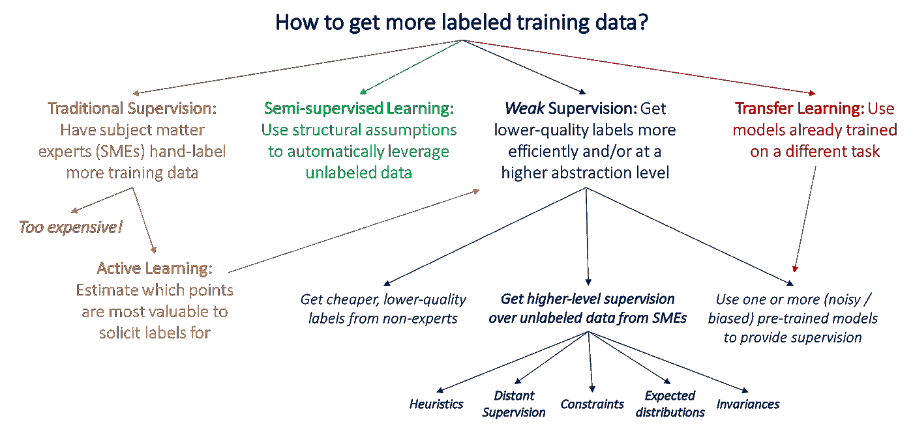
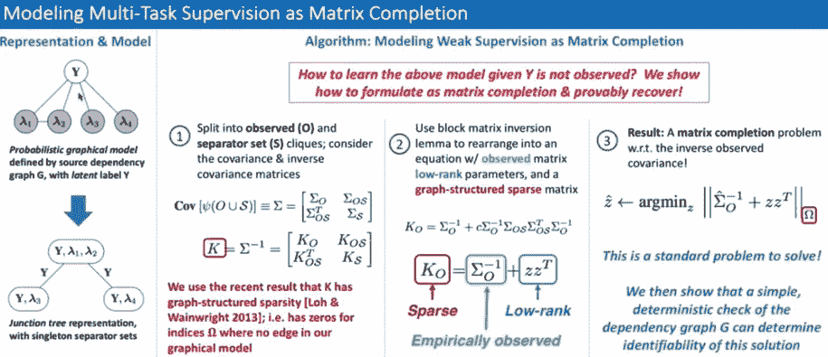
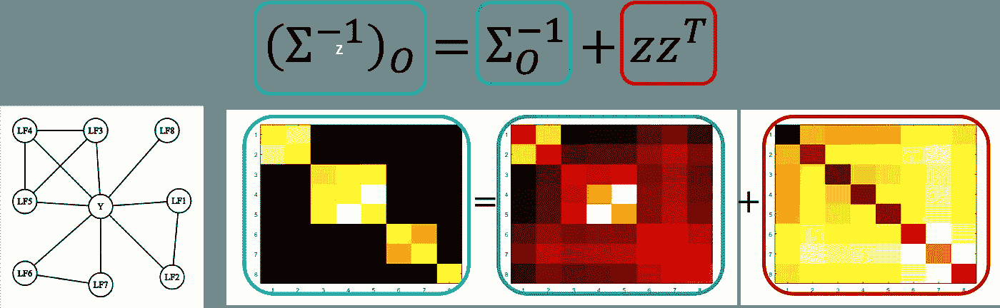

# 使用通气管以编程方式生成标签的介绍

> 原文：<https://medium.com/analytics-vidhya/introduction-to-generating-labels-programmatically-using-snorkel-297976312497?source=collection_archive---------8----------------------->

# 为什么我们需要关心标签的生成？

近年来，数据科学算法有了重大发展。越来越多的企业在决策中使用机器学习和深度学习算法。在过去十年中，计算能力也增加了几倍。因此，也有技术和工具来满足需求。但是有一个问题，数据本身。公司有数十亿条记录，但他们没有标签。许多先进的算法需要标记数据。

传统上，组织会雇人手动标记数据。但这受到人员可用性、贴标签时间和预算的限制。特别是当我们谈论电子商务、社交网络或银行等在线业务中每天数 TB 的数据生成时。对于这些情况，手动标记数据几乎是不可能的，需要以编程方式生成标记数据。

# 如何以编程方式生成标签数据？

有几种方法可以处理未标记的数据:

1.  *主动学习*:在小数据集上训练模型。预测无标签数据的标签。预测标签中具有低置信度的数据点被发送给人类专家进行标记。
2.  *半监督学习*:类似于主动学习，但不是将数据发送给人类专家，而是使用领域和任务不可知的假设来改进标签。
3.  *迁移学习*:针对新数据调整的大数据集预训练模型。
4.  *弱监督*:使用容易获得、高水平且可能不是很精确的规则来标记未标记的数据。示例通气管将在以下章节中解释。

下图很好地解释了这些方法的总结:

参考:https://www.snorkel.org/blog/weak-supervision

# **现在，让我们去潜水吧**

# 浮潜——监管不力

通气管作为 python 包运输。浮潜要求用户编写可以标记部分数据的规则。这些规则是在领域专家的帮助下编写的高级规则。在通气管术语中，这些规则被称为 ***标记函数。*** 这些标注功能适用于所有未标注的数据。转换后的数据被发送到被称为**标签模型**的呼吸管的核心功能，该核心功能估计各个标签功能的准确度以及它们之间的相关性，以将标签分配给未标记的数据。通气管还提供**切片功能**，用于观察数据切片上的标签模型性能(例如，城市 A 与城市 B)。正如你可能想知道如何估计通气管的性能，一个小的黄金集又名**开发集**是必要的。开发集也可以用来处理标签中的不平衡。通气管还提供了**转换函数**，可用于数据扩充，以研究数据的不变性。

# 如何估计单个标签功能的精确度？

鉴于浮潜不使用任何黄金设置的标签生成，问题是如何估计精度。参考文件是此处的。通气管标签模型算法如下所示。

参赛:https://www.youtube.com/watch?v=RUPbYvzSrg0

来自标记函数的噪声标记预测可以被视为与实际标记(未知)具有某种相关性的因子图。创建观察值(来自标记函数)和分隔符集(实际标记)之间的协方差矩阵。作者用矩阵求逆的方法形成方程，用矩阵补全法求解该方程，以估计标记函数的精度。在通气管中使用 pytorch 神经网络解决了这个问题。下图说明了如何将标注函数(LFs)矩阵中的 y 预测转换为矩阵补全方法，以及如何估计相关性~zz^T。

上述方法利用了标记函数输出的逆广义协方差矩阵的图结构稀疏性，以将学习它们的精度和相关强度减少到矩阵完成类型的问题。作者声称这个公式更具可扩展性，实现起来更干净，并且有更清晰的理论保证。

# 通气管示例

酷，让我们现在进入浮潜。在[通气管页面](https://www.snorkel.org/get-started/)上的例子很好，我将在下面解释。

步骤 1:获取大量未标记的数据。我假设我们有:)

步骤 2:编写标签函数

标签函数可以返回多个标签。这里我们来看一个更简单的二元分类器。除了输出 True 和 False 之外，还可以有第三个输出 absent。

要编写标注函数，需要使用 decorator `@labeling_function()`

步骤 3:对所有未标记的数据应用标记函数

虽然下面的例子使用熊猫数据框架，通气管中的应用程序也可用于 pyspark。

步骤 4:获取预测标签

步骤 5:(可选)定义转换函数

这个函数可以用 decorator @ `@transformation_function()`来声明

步骤 6:(可选)应用步骤 5 中定义的转换函数

步骤 7:(可选)定义切片函数

步骤 8:训练分类器

最后一步是训练一个 ed-end 分类器模型，作者声称该模型显示了预测标签准确性的提高。在下面的例子中，使用了逻辑回归模型。也可以使用任何其他模型。该分类器可用于估计标签。

*希望你们喜欢。如果有，请鼓掌！*