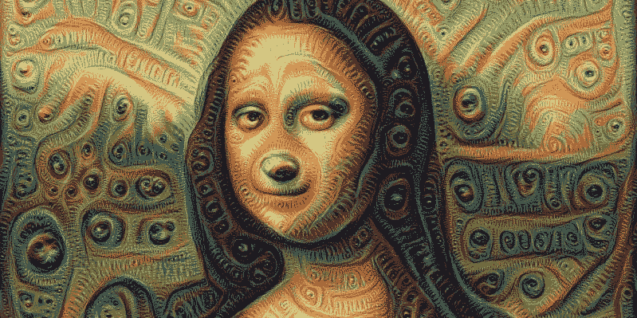

# 生成对抗网络(GANs)简介

> 原文：<https://medium.com/analytics-vidhya/introduction-to-generative-adversarial-networks-gans-7d05b01e66fa?source=collection_archive---------22----------------------->

# **简介**

2014 年，蒙特利尔大学的 Goodfellow 和其他研究人员在一篇论文中首次引入了生成敌对网络(GANs)。从那时起，我们看到了 GANs 及其各种类型的显著发展。GANs 可以被认为是一个机器人艺术家，可以学习和模仿任何分布。这包括图像、语音、音乐、文本…